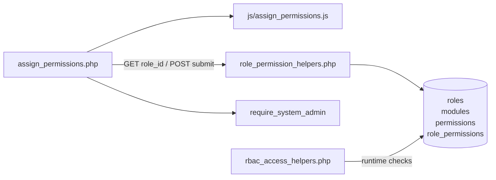
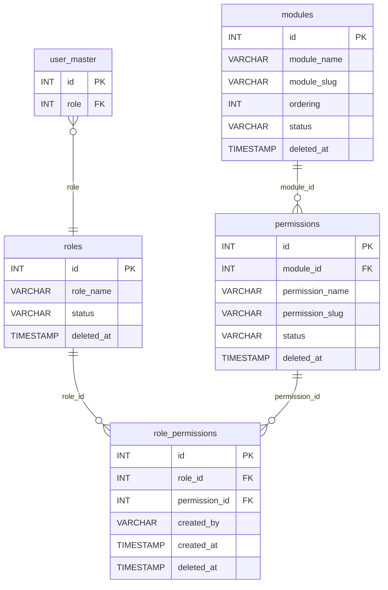
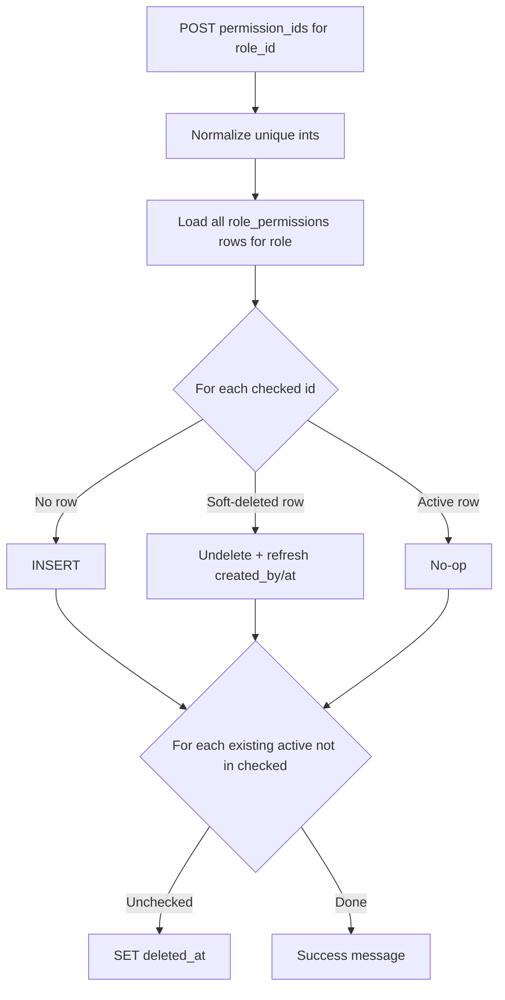
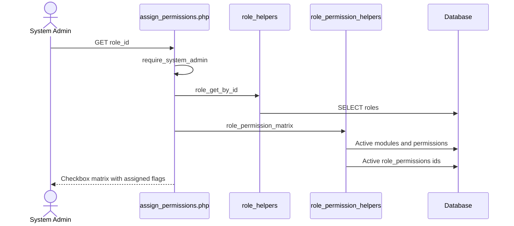
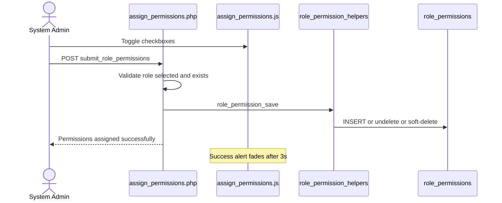
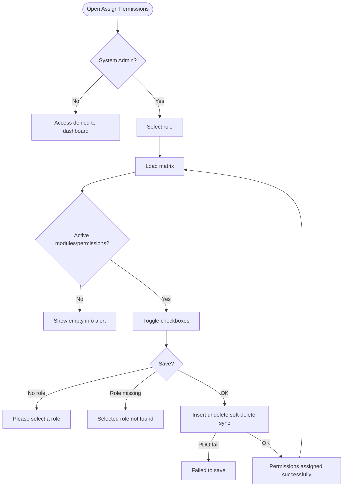
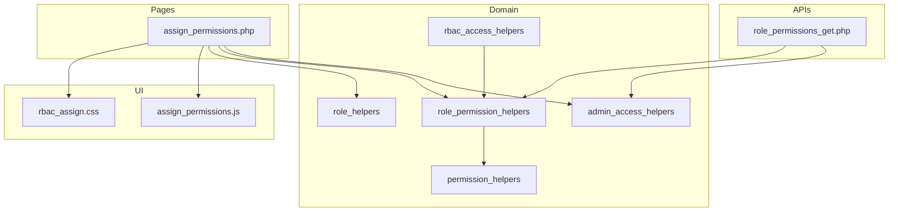

# Low-Level Design (LLD) — Assign Permissions Module

| Attribute | Value |
|-----------|--------|
| Module | Assign Permissions (Role → Permission Matrix) |
| Menu path | ADMINISTRATION → Assign Permissions |
| Landing page | `assign_permissions.php` |
| Application | Complaint / Dealer Portal |
| Stack (target) | Core PHP + MySQL (PDO) |
| Stack (current repo) | Core PHP + **PostgreSQL** via PDO |
| Document version | 1.0 |
| Access | **System Admin only** (role id `6`) — no RBAC module slug |

---

## **1. Module Overview**

### 1.1 Purpose

System Administrators assign module permissions to application roles via a checkbox matrix. Grants are stored in `role_permissions` (soft-deleteable). At runtime, page/API/menu access resolves `user_master.role` → `roles` → `role_permissions` → active `permissions` / `modules` through `rbac_*` helpers.

### 1.2 Scope

| In scope | Out of scope |
|----------|--------------|
| Select role and load permission matrix | Modules master CRUD (`modules.php`) |
| Assign / unassign permissions for a role | Permissions master CRUD (`permissions.php`) |
| Soft-delete sync on save (insert / undelete / soft-delete) | Roles master CRUD (`roles.php`) |
| Select All / Clear All / per-module check-all UI | Per-user permission grants (not implemented) |
| Optional JSON matrix API | CSRF tokens (not implemented app-wide) |

### 1.3 High-level architecture



---

## **2. Functional Requirements**

| ID | Requirement | Priority |
|----|-------------|----------|
| FR-01 | System Admin can open Assign Permissions | Must |
| FR-02 | Load active roles into Role dropdown | Must |
| FR-03 | Load permission matrix for selected role (active modules/permissions) | Must |
| FR-04 | Show assigned count vs total permissions | Must |
| FR-05 | Save checked permission set for the role | Must |
| FR-06 | Soft-delete unchecked previously assigned permissions | Must |
| FR-07 | Undelete rows when a previously soft-deleted grant is re-checked | Must |
| FR-08 | Select All / Clear All / per-module select-all | Should |
| FR-09 | Auto-submit role select on change | Should |
| FR-10 | JSON API to fetch matrix by `role_id` | Could |

---

## **3. User Roles & Permissions**

### 3.1 RBAC module slug

**None.** Assign Permissions is gated by **System Admin** (`SYSTEM_ADMIN_ROLE = 6`), not a permission slug.

### 3.2 Permission matrix (this module’s own access)

| Capability | Gate |
|------------|------|
| `assign_permissions.php` | `require_system_admin($obconn)` |
| `api/role_permissions_get.php` | `admin_api_require_system_admin` |
| Denied | `Access denied. System Admin privileges required.` → `dashboard.php` |

`assign_permissions.php` is listed in `rbac_admin_pages()` and skips module-slug RBAC; System Admin check is authoritative.

### 3.3 Runtime effect of assignments

| Consumer | Behavior |
|----------|----------|
| Pages | `rbac_require_page_access` via `session_check.php` |
| APIs | `rbac_require_api_access` |
| Sidebar | `rbac_can_access_menu` / `rbac_sidebar_modules` |
| Check | `rbac_has_permission($conn, $moduleSlug, $permissionSlug)` |

There is **no** per-user permission table. Grants are role-based only.

### 3.4 Page / API mapping

| Resource | Gate |
|----------|------|
| `assign_permissions.php` | System Admin |
| `api/role_permissions_get.php` | System Admin API |

---

## **4. Business Rules**

| ID | Rule |
|----|------|
| BR-01 | Only active roles (`role_get_all_active`) appear in the Role dropdown. |
| BR-02 | Matrix shows only active modules (`status = 'active'`, `deleted_at IS NULL`) and active permissions. |
| BR-03 | Role is required before save; role must exist (not soft-deleted). |
| BR-04 | Posted `permission_ids[]` are cast to unique positive integers. |
| BR-05 | Checked + no row → **INSERT** into `role_permissions`. |
| BR-06 | Checked + soft-deleted row → **undelete** (`deleted_at = NULL`; refresh `created_by` / `created_at`). |
| BR-07 | Unchecked + active row → **soft-delete** (`deleted_at = CURRENT_TIMESTAMP`). |
| BR-08 | Already-active checked rows are left unchanged. |
| BR-09 | Save does **not** validate that permission IDs exist or are active before insert. |
| BR-10 | Empty matrix when no active modules/permissions → informational alert; no Save button. |
| BR-11 | POST stays on the same page (no PRG redirect). |
| BR-12 | Runtime checks join live `role_permissions` with active `permissions` and `modules`. |
| BR-13 | Soft-delete of a role / module / permission cascades soft-delete of related `role_permissions` (via Roles / Modules / Permissions masters). |
| BR-14 | `created_by` on assign save = `current_username()`. |
| BR-15 | No dedicated audit/activity log for assignment changes. |

---

## **5. Database Design**

### 5.1 ER diagram



### 5.2 Table: `role_permissions`

| Column | MySQL type | Notes |
|--------|------------|-------|
| `id` | `INT UNSIGNED AUTO_INCREMENT` | PK |
| `role_id` | `INT` | → `roles.id` |
| `permission_id` | `INT` | → `permissions.id` |
| `created_by` | `VARCHAR(100)` | Assigner username; refreshed on undelete |
| `created_at` | `TIMESTAMP` | Set on insert / undelete |
| `deleted_at` | `TIMESTAMP NULL` | Soft-delete |

### 5.3 Related tables

| Table | Role |
|-------|------|
| `roles` | Role dropdown + existence check |
| `modules` | Matrix grouping (active only) |
| `permissions` | Checkbox rows (active only) |
| `user_master` | Runtime: user’s `role` drives access |

### 5.4 Reference / lookup sources

| Source | Usage |
|--------|--------|
| `role_get_all_active()` | Role `<select>` |
| `permission_get_by_module_grouped()` | Active module → permissions tree |
| `role_permission_get_assigned_ids()` | Checked state for selected role |

---

## **6. API / Backend Design**

### 6.1 Page endpoints

| Endpoint | Method | Auth | Description |
|----------|--------|------|-------------|
| `assign_permissions.php` | GET | System Admin | Role select; optional `?role_id=` loads matrix |
| `assign_permissions.php` | POST `submit_role_permissions` | System Admin | Save assignment |

### 6.2 JSON APIs

#### `GET api/role_permissions_get.php?role_id=`

System Admin only. Returns matrix for a role. **Not used** by the Assign Permissions page UI (page loads matrix server-side).

```json
{
  "role_id": 2,
  "modules": [
    {
      "module_id": 1,
      "module_name": "...",
      "module_slug": "...",
      "permissions": [
        {
          "id": 10,
          "permission_name": "View",
          "permission_slug": "view",
          "assigned": true
        }
      ]
    }
  ]
}
```

| Condition | Response |
|-----------|----------|
| Missing / invalid `role_id` | `{ "modules": [] }` |
| Role not found | HTTP 404 `{ "error": "Role not found." }` |

### 6.3 Supporting lookup APIs

N/A for the page (roles and matrix rendered in PHP). Catalog CRUD uses separate `api/roles_*`, `api/modules_*`, `api/permissions_*` endpoints outside this module’s UI.

### 6.4 Core PHP responsibilities

| File | Role |
|------|------|
| `includes/role_permission_helpers.php` | Matrix load; save sync (insert / undelete / soft-delete) |
| `includes/permission_helpers.php` | `permission_get_by_module_grouped` |
| `includes/role_helpers.php` | Active roles; get by id |
| `includes/admin_access_helpers.php` | System Admin gate |
| `includes/admin_api_guard.php` | System Admin API gate |
| `includes/rbac_access_helpers.php` | Runtime page/API/menu permission checks |
| `includes/rbac_page_guard.php` | Thin page-guard wrapper |
| `includes/rbac_helpers.php` | Shared slug/status/display helpers |

---

## **7. Validation Rules**

### 7.1 Server-side (assign page POST)

| Field / rule | Message |
|--------------|---------|
| `role_id` ≤ 0 / missing | `Please select a role.` |
| Role not found / soft-deleted | `Selected role not found.` |
| PDO failure on save | `Failed to save permission assignment.` |
| `permission_ids[]` | Cast to unique ints only — no existence / active check |

### 7.2 Client-side (`js/assign_permissions.js`)

- Role `<select>` change auto-submits GET form when value non-empty
- Select All / Clear All / module check-all keep master + per-module indeterminate states
- Assigned count refreshed on checkbox change
- Success alert fades after 3 seconds
- No validate.js form constraints (checkbox matrix only)

---

## **8. UI Screen Specifications**

### 8.1 Landing — `assign_permissions.php`

| Element | Spec |
|---------|------|
| Subtitle | Assign module permissions to roles. |
| Card 1 | Select Role — native `<select id="roleSelect">` + Load Permissions |
| Empty state | Select a role above to load permissions. |
| Card 2 | Permissions for {role_name}; Assigned: n / total |
| Empty matrix | No active modules or permissions found. Please create modules and permissions first. |
| Toolbar | Select All checkbox + Clear All button |
| Body | Module blocks; each with module check-all + permission checkboxes |
| CTA | Save Permission Assignment |
| Styles | `css/rbac_assign.css` (+ shared booking/complaint CSS) |

### 8.2 Form fields

| Control | Name | Notes |
|---------|------|-------|
| Role (GET) | `role_id` | Auto-submit on change |
| Role (POST hidden) | `role_id` | Selected role id |
| Submit flag | `submit_role_permissions` | Hidden `1` |
| Permissions | `permission_ids[]` | Checkbox values = permission ids |

### 8.3 Modals

None. Confirmation dialogs are not used on save.

### 8.4 Select2

**N/A.** Role select is a native HTML `<select>`.

---

## **9. Database Flow**

### 9.1 Save assignment (`role_permission_save`)



### 9.2 Soft-delete grant

```sql
UPDATE role_permissions
SET deleted_at = CURRENT_TIMESTAMP
WHERE id = :id;
```

### 9.3 Undelete grant

```sql
UPDATE role_permissions
SET deleted_at = NULL,
    created_by = :created_by,
    created_at = CURRENT_TIMESTAMP
WHERE id = :id;
```

### 9.4 Assigned ids query

```sql
SELECT permission_id
FROM role_permissions
WHERE role_id = :role_id
  AND deleted_at IS NULL;
```

### 9.5 Matrix source query pattern

```sql
SELECT m.id AS module_id, m.module_name, m.module_slug, m.ordering,
       p.id AS permission_id, p.permission_name, p.permission_slug, p.status
FROM modules m
LEFT JOIN permissions p
  ON p.module_id = m.id
 AND p.deleted_at IS NULL
 AND p.status = 'active'
WHERE m.deleted_at IS NULL
  AND m.status = 'active'
ORDER BY m.ordering ASC, m.module_name ASC, p.permission_name ASC;
```

---

## **10. Sequence Diagram**

### 10.1 Load matrix



### 10.2 Save assignment



---

## **11. Activity Diagram**



---

## **12. Class / Module Diagram**



### 12.1 Key functions

| Function | Role |
|----------|------|
| `role_permission_matrix` | Grouped modules + assigned flags |
| `role_permission_save` | Sync grants (insert / undelete / soft-delete) |
| `role_permission_get_assigned_ids` | Active permission ids for role |
| `permission_get_by_module_grouped` | Active catalog tree |
| `role_get_all_active` / `role_get_by_id` | Role options / existence |
| `require_system_admin` | Page gate |
| `admin_api_require_system_admin` | API gate |
| `rbac_has_permission` / `rbac_role_has_permission` | Runtime AuthZ |
| `rbac_resolve_role_id` | Map session role → `roles.id` |
| `rbac_admin_pages` | Skip module RBAC for admin screens |
| `bootAssignPermissionsPage` | Client UI boot |

---

## **13. Folder Structure**

```text
ComplaintManagement/
├── assign_permissions.php
├── access_denied.php
├── api/
│   └── role_permissions_get.php
├── includes/
│   ├── role_permission_helpers.php
│   ├── permission_helpers.php
│   ├── role_helpers.php
│   ├── module_helpers.php
│   ├── admin_access_helpers.php
│   ├── admin_api_guard.php
│   ├── rbac_access_helpers.php
│   ├── rbac_page_guard.php
│   └── rbac_helpers.php
├── js/
│   └── assign_permissions.js
├── css/
│   └── rbac_assign.css
└── docs/
    └── LLD_Assign_Permissions_Module.md
```

Related catalog pages (out of scope for this UI, but feed the matrix): `modules.php`, `permissions.php`, `roles.php`.

---

## **14. Error Handling**

| Layer | Pattern |
|-------|---------|
| Page POST | Local `$error_message` / `$success_message` alerts |
| Non-admin | Session flash → `dashboard.php` |
| API | JSON + HTTP 403 / 404 |
| Client | Success alert auto-fade; no AJAX save |

### 14.1 Common messages

| Message | When |
|---------|------|
| `Permissions assigned successfully.` | Save OK |
| `Please select a role.` | Missing role on POST |
| `Selected role not found.` | Invalid / deleted role |
| `Failed to save permission assignment.` | PDO exception |
| `No active modules or permissions found. Please create modules and permissions first.` | Empty catalog |
| `Select a role above to load permissions.` | No role selected |
| `Access denied. System Admin privileges required.` | Non-admin |

---

## **15. Security Considerations**

| Area | Control |
|------|---------|
| Authorization | System Admin hard-gate on page + matrix API |
| Soft-delete | Active grants require `deleted_at IS NULL` |
| XSS | Matrix names escaped into `$safePermissionMatrix` before HTML |
| Runtime AuthZ | Live SQL via `rbac_has_permission` (not session-cached grants) |
| CSRF | **Not implemented** on assign form |
| Permission id trust | Posted ids not verified as active/existing before insert |
| Per-user grants | **Not supported** — role matrix only |
| Gaps | No PRG after POST; no audit trail of who changed which grant beyond `created_by` on insert/undelete |

---

## **16. Audit Logs**

### 16.1 Built-in field-level audit

| Field | Behavior |
|-------|----------|
| `role_permissions.created_by` | Set on insert; refreshed on undelete |
| `role_permissions.created_at` | Set on insert; refreshed on undelete |
| `role_permissions.deleted_at` | Soft-delete / clear on undelete |
| Dedicated assignment history table | **Not implemented** |
| `rbac_clear_permissions_cache` | Exists but unused for live checks; assign save does not call it |

---

## **17. Test Cases**

### 17.1 Functional

| ID | Scenario | Expected |
|----|----------|----------|
| TC-01 | Non-admin opens Assign Permissions | Denied to dashboard |
| TC-02 | Open page with no role | Empty “select a role” card |
| TC-03 | Select role with active catalog | Matrix loads; assigned count correct |
| TC-04 | Select All then Save | All permissions assigned for role |
| TC-05 | Clear All then Save | All prior grants soft-deleted |
| TC-06 | Uncheck one previously assigned | That `role_permissions` row soft-deleted |
| TC-07 | Re-check previously soft-deleted grant | Row undeleted; `created_by` / `created_at` refreshed |
| TC-08 | POST without role | `Please select a role.` |
| TC-09 | POST invalid role id | `Selected role not found.` |
| TC-10 | No active modules/permissions | Info alert; no Save button |
| TC-11 | Module check-all | Toggles only that module’s checkboxes |
| TC-12 | User with role lacking page permission | `access_denied.php` / API 403 at runtime |
| TC-13 | `GET api/role_permissions_get.php` as admin | JSON matrix |
| TC-14 | Soft-delete permission in Permissions master | Related role grants soft-deleted (cascade) |

---

## **18. Assumptions & Dependencies**

### 18.1 Assumptions

1. Role id `6` is System Admin and may open this page.
2. Modules and permissions catalogs are maintained separately and marked `active`.
3. `user_master.role` stores `roles.id` (or resolvable role name) used by `rbac_resolve_role_id`.
4. Soft-delete is the only revoke mechanism; hard deletes of `role_permissions` are not used by this UI.
5. Document target stack Core PHP + MySQL; repo runs PostgreSQL.
6. System Admin bypass inside `rbac_has_permission` is not relied upon for module pages (checks go through grants).

### 18.2 Dependencies

| Dependency | Purpose |
|------------|---------|
| Roles master | Role dropdown / existence |
| Modules + Permissions masters | Matrix catalog |
| `admin_access_helpers` | System Admin gate |
| `rbac_access_helpers` | Runtime enforcement of saved grants |
| jQuery + Bootstrap 5 | Alerts / fade-out |
| `css/rbac_assign.css` | Matrix layout |

---

## Appendix A — Success / error flashes

| Event | Message |
|-------|---------|
| Save OK | Permissions assigned successfully. |
| Missing role | Please select a role. |
| Bad role | Selected role not found. |
| Save fail | Failed to save permission assignment. |

---

## Appendix B — Select2 control map

**N/A.** Role (`#roleSelect`) is a native HTML select (auto-submit on change).

---

## Appendix C — Save sync matrix

| Prior state | Checked on save | Action |
|-------------|-----------------|--------|
| No row | Yes | INSERT |
| Soft-deleted row | Yes | Undelete + refresh `created_by` / `created_at` |
| Active row | Yes | No-op |
| Active row | No | Soft-delete |
| Soft-deleted row | No | No-op |

---

## Appendix D — Runtime resolution path

```text
Login → $_SESSION['role'] = user_master.role
     → rbac_resolve_role_id()
     → rbac_role_has_permission(module_slug, permission_slug)
     → JOIN role_permissions + permissions + modules
     → Allow page / API / menu  OR  access_denied / HTTP 403
```

---

*End of LLD — Assign Permissions Module*
