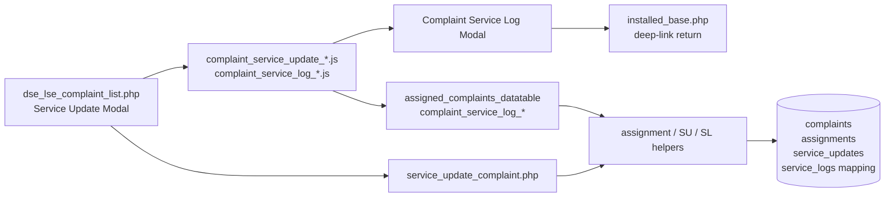
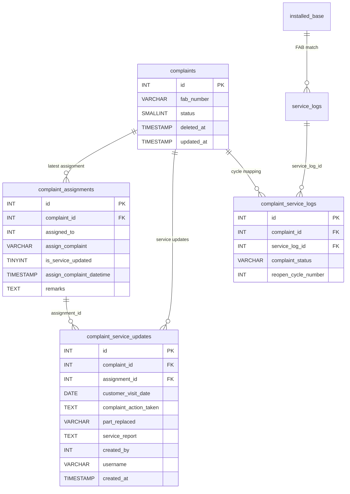
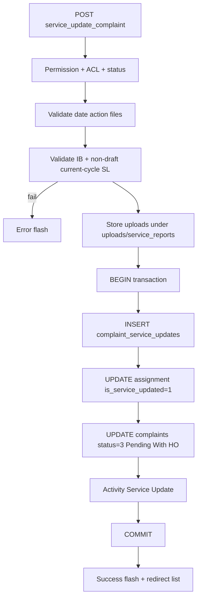
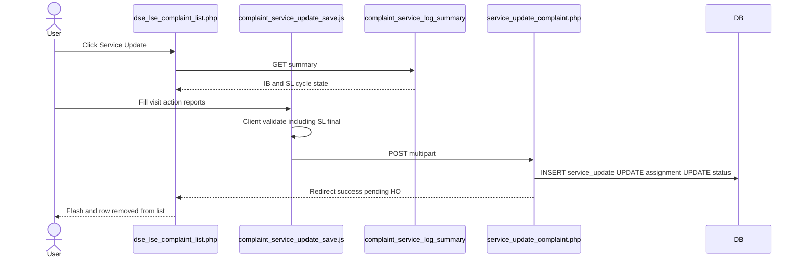
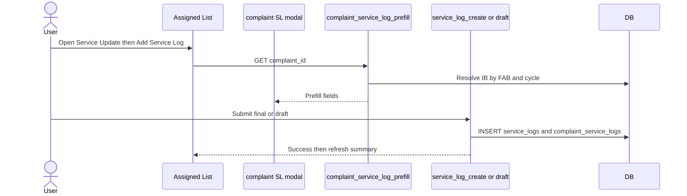
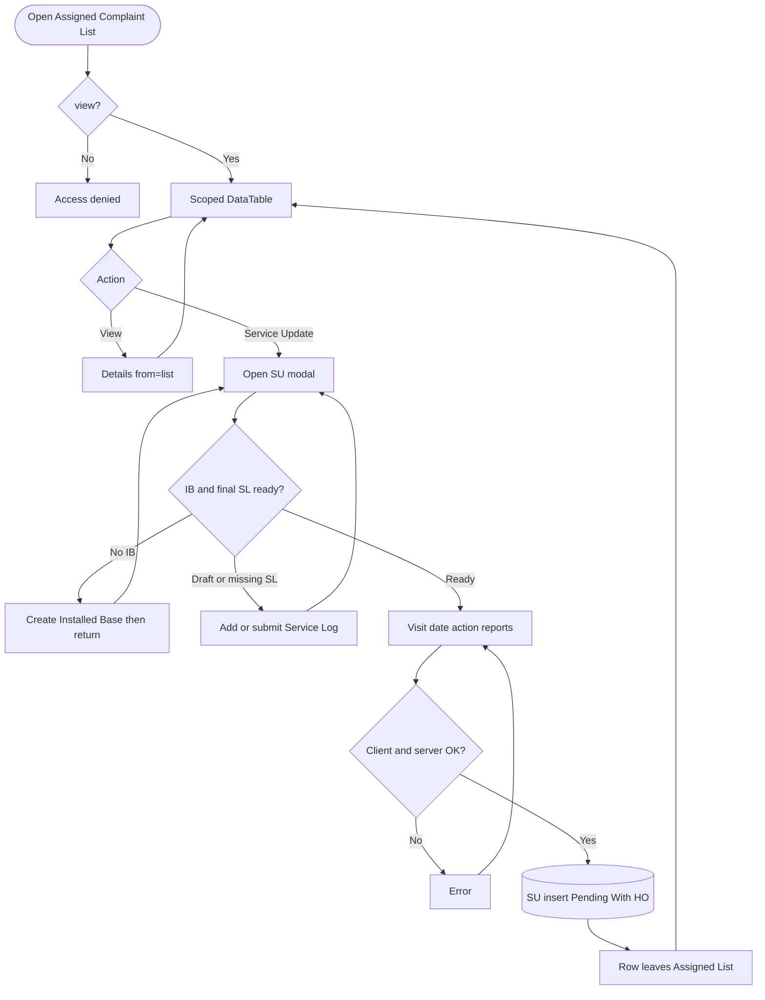
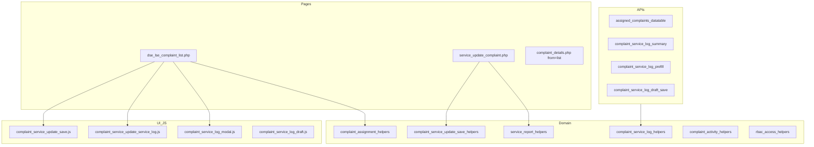

# Low-Level Design (LLD) — Assigned Complaint List Module

| Attribute | Value |
|-----------|--------|
| Module | Assigned Complaint List (+ Service Update) |
| Menu path | SUPPORT → Assigned Complaint List |
| Application | Complaint / Dealer Portal |
| Stack (target) | Core PHP + MySQL (PDO) |
| Stack (current repo) | Core PHP + **PostgreSQL** via PDO (`pdo_obconn.php`) — schema maps 1:1 to MySQL |
| Document version | 1.0 |
| Related modules | Complaint Entry, Service Log Capture, Installed Base Capture, RBAC |

> **Boundary:** Module slug `assigned-complaint-list` covers the assigned work queue (`dse_lse_complaint_list.php`) and **Service Update** (`service_update_complaint.php`). It does **not** create/assign/close/delete complaints — those remain on Complaint Entry. Service Update is a **prerequisite** for Entry closure (Pending With HO).

---

## 1. Module Overview

### 1.1 Purpose

Assigned Complaint List shows complaints currently assigned to the user (or in scope) that still need a **Service Update**: status **In Progress** or **Re-Open**, and latest assignment `is_service_updated = 0`. Engineers record visit details, ensure Installed Base + non-draft Service Log for the current cycle, upload service reports, and submit for **Head Office (HO)** approval — which moves the complaint to **Pending With HO**.

### 1.2 Scope

| In scope | Out of scope |
|----------|--------------|
| Assigned list DataTable (scoped) | Complaint create / assign / closure / delete |
| Service Update modal + POST save | Editing prior service-update rows in place |
| Bridge to Installed Base create (by FAB) | Spare Parts Consumption |
| Bridge to Service Log create/edit/draft (complaint cycle) | Complaint Entry history for all statuses |
| Details view `from=list` | Status filter cards (CSS linked; cards not rendered on this page) |

### 1.3 High-level architecture



---

## 2. Functional Requirements

| ID | Requirement | Priority |
|----|-------------|----------|
| FR-01 | Users with `view` can open Assigned List and details `from=list` | Must |
| FR-02 | List shows only In Progress / Re-Open with `is_service_updated = 0` | Must |
| FR-03 | List visibility by role (admin / sales coordinator / assignee self) | Must |
| FR-04 | Users with `service-update` can open Service Update when eligible | Must |
| FR-05 | Service Update requires visit date, action taken, ≥1 service report | Must |
| FR-06 | Matching Installed Base (by FAB) required before SL / before SU | Must |
| FR-07 | Current-cycle Service Log required and must not be draft before SU | Must |
| FR-08 | Save Update inserts `complaint_service_updates`, sets assignment flag, status → Pending With HO | Must |
| FR-09 | Deep-link `?complaint_id=&open_service_update=1` reopens SU modal | Should |
| FR-10 | Add/edit/draft Service Log from complaint modal when SL add/edit permitted | Must |
| FR-11 | Multi-file reports: PDF/JPG/PNG/DOC/DOCX, ≤ 2 MB each | Must |
| FR-12 | After SU, row leaves Assigned List until Closure No → Re-Open cycle | Must |

---

## 3. User Roles & Permissions

### 3.1 RBAC module slug

`assigned-complaint-list`  
Included in modules that enforce role_permissions (System Admin uses role grants, not full bypass).

### 3.2 Permission matrix

| Permission slug | Capability |
|-----------------|------------|
| `view` | List, datatable, details `from=list` |
| `service-update` | Service Update page/modal, SL summary/prefill/draft APIs |

Cross-module for SL modal: `service-log-capture` `add` and/or `edit` (modal shown only if `service-update` **and** SL add/edit).

### 3.3 Page / API mapping

| Resource | Module | Permission |
|----------|--------|------------|
| `dse_lse_complaint_list.php` | `assigned-complaint-list` | `view` |
| `service_update_complaint.php` | `assigned-complaint-list` | `service-update` |
| `complaint_details.php` (`from=list`) | `assigned-complaint-list` | `view` |
| `api/assigned_complaints_datatable.php` | `assigned-complaint-list` | `view` |
| `api/complaint_service_log_summary.php` | `assigned-complaint-list` | `service-update` |
| `api/complaint_service_log_prefill.php` | `assigned-complaint-list` | `service-update` |
| `api/complaint_service_log_draft_save.php` | `assigned-complaint-list` | `service-update` |

Helpers: `complaint_assigned_action_permissions()`, `complaint_assigned_require_page_access()`, `complaint_assigned_require_permission()`.

### 3.4 After-market / list scope (assigned)

Base filter (`complaint_assigned_list_scope`):

```text
c.deleted_at IS NULL
AND ca.is_service_updated = 0
AND c.status IN (2 In Progress, 4 Re-Open)
```

Latest assignment via LATERAL join to `complaint_assignments`.

| Role class | Extra filter |
|------------|--------------|
| System Administrator | All matching rows |
| Sales Coordinator | Assignees in coordinator scope |
| Other users | `ca.assigned_to = current_user_id` **OR** assign display name = current assignee name |
| Unresolved identity | No rows (`1 = 0`) |

Optional: `complaint_id` deep-link narrows to one complaint.

---

## 4. Business Rules

| ID | Rule |
|----|------|
| BR-01 | List only non-deleted, latest assignment not yet service-updated, status In Progress or Re-Open. |
| BR-02 | Service Update button only when `service-update` + eligible status + `!is_service_updated`. |
| BR-03 | Matching Installed Base required for complaint FAB before SL/SU. |
| BR-04 | Current-cycle Service Log required; must be **final** (not draft) before SU. |
| BR-05 | One SL per cycle (In Progress once; each Re-Open cycle numbered via `complaint_service_logs`). |
| BR-06 | SU always **INSERT**s a new `complaint_service_updates` row (not update-in-place). |
| BR-07 | On SU: set latest assignment `is_service_updated = 1`; complaint `status = 3` (Pending With HO). |
| BR-08 | Part Replaced optional; Service Report required (multi-file). |
| BR-09 | Visit date: client not-future; server required `Y-m-d` (no future check on server). |
| BR-10 | After SU, complaint leaves Assigned List; Entry Closure needs Pending With HO + ≥1 SU. |
| BR-11 | Closure No (Entry) → new assignment (`is_service_updated` default 0) + Re-Open → returns to list. |
| BR-12 | No create/assign/closure/delete on this module. |

**Status constants:** Open=1, In Progress=2, Pending With HO=3, Re-Open=4, Resolved=5.

---

## 5. Database Design

> **Note:** Current production uses **PostgreSQL**. Types below are MySQL-equivalent. List join uses `INNER JOIN LATERAL` (PG); MySQL 8+ can use equivalent lateral/derived join patterns.

### 5.1 ER diagram



### 5.2 Table: `complaint_service_updates`

| Column | MySQL type | Null | Description |
|--------|------------|------|-------------|
| `id` | `INT UNSIGNED AUTO_INCREMENT` | NO | PK |
| `complaint_id` | `INT UNSIGNED` | NO | Complaint |
| `assignment_id` | `INT UNSIGNED` | NO | Latest assignment at SU time |
| `customer_visit_date` | `DATE` | NO | Visit date |
| `complaint_action_taken` | `TEXT` | NO | Action text |
| `part_replaced` | `VARCHAR(255)` | YES | Optional |
| `service_report` | `TEXT` | NO | JSON array of stored filenames |
| `created_by` | `INT UNSIGNED` | NO | Actor user id |
| `username` | `VARCHAR(100)` | YES | Actor username |
| `created_at` | `TIMESTAMP` | YES | Default now |

### 5.3 Related tables

| Table | Role |
|-------|------|
| `complaints` | Status / FAB / soft-delete |
| `complaint_assignments` | Assignee + `is_service_updated` gate |
| `complaint_activity_logs` | Activity type `Service Update` |
| `complaint_service_logs` | Maps complaint cycle ↔ `service_logs` |
| `service_logs` | Current-cycle visit log (must be non-draft) |
| `installed_base` | Matched by FAB for SL bridge |
| Files under `uploads/service_reports/` | Stored report binaries |

### 5.4 Reference / lookup sources

| Source | Usage |
|--------|--------|
| `api/assigned_complaints_datatable.php` | List data |
| `api/complaint_service_log_summary.php` | Cycle / IB / SL summary for modal |
| `api/complaint_service_log_prefill.php` | Prefill Add SL |
| `api/machine_model_search.php` | SL modal part rows |
| SCM warranty / part replaced | SL modal static Select2 |

---

## 6. API / Backend Design

### 6.1 Page endpoints (HTML / form POST)

| Endpoint | Method | Auth | Description |
|----------|--------|------|-------------|
| `dse_lse_complaint_list.php` | GET | `view` | Assigned list + SU modal |
| `service_update_complaint.php` | POST | `service-update` | Save Service Update |
| `complaint_details.php?id=&from=list` | GET | `view` + assigned ACL | Details |
| `installed_base.php?...&open_service_update=1` | GET | IB module | Return after IB create |

Non-POST to `service_update_complaint.php` → `access_denied.php`.

#### Service Update POST fields

| Field | Notes |
|-------|-------|
| `complaint_id` | Required |
| `customer_visit_date` | Required `Y-m-d` |
| `complaint_action_taken` | Required |
| `part_replaced` | Optional |
| `service_report[]` | Multi-file required |

### 6.2 JSON APIs

#### `POST api/assigned_complaints_datatable.php`

Scoped assigned list.

#### `GET api/complaint_service_log_summary.php?complaint_id=`

Cycle label, IB presence, current-cycle SL summary, permissions, optional `installed_base_add_url`.

#### `GET api/complaint_service_log_prefill.php?complaint_id=`

Prefill for Add SL (IB, fab, machine, serial peek, description, cycle).

#### `POST api/complaint_service_log_draft_save.php`

Draft SL with `from_complaint_modal=1` + mapping row.

### 6.3 Supporting lookup APIs

| API | Purpose |
|-----|---------|
| `api/service_log_get.php` | Edit existing cycle SL (extra complaint ACL) |
| `api/service_log_create.php` / `update.php` | Final SL from complaint modal |
| `api/machine_model_search.php` | Part replacement Select2 |

### 6.4 Core PHP module responsibilities

| Module / file | Responsibility |
|---------------|----------------|
| `includes/complaint_assignment_helpers.php` | Assigned list scope / access |
| `includes/complaint_datatable_helpers.php` | Assigned actions HTML / perms |
| `includes/complaint_service_update_save_helpers.php` | SL prerequisite validation |
| `includes/service_report_helpers.php` | Upload validate/store |
| `includes/complaint_service_log_helpers.php` | Cycles, summary, prefill, access |
| `includes/complaint_service_log_draft_helpers.php` | Draft save |
| `includes/complaint_activity_helpers.php` | Activity log |
| `service_update_complaint.php` | Transactional SU save |

---

## 7. Validation Rules

### 7.1 Server-side (Service Update)

| Rule | Error message |
|------|---------------|
| Missing date/action | `Customer visit date and complaint action taken are required.` |
| Bad date | `Invalid customer visit date.` |
| Wrong status / cycle | `Service update is only allowed for complaints in progress or re-open.` |
| No IB | `A matching installed base is required before a service log can be added.` |
| No SL | `Please add a Service Log to proceed further.` |
| Draft SL | `Service Log is in Draft. It will not be sent for HO Approval. Please submit the Service Log before updating the complaint.` |
| No file | `At least one service report file is required` |
| Bad type | `Invalid file type for "{name}". Allowed: PDF, JPG, PNG, DOC, DOCX.` |
| Size | `File "{name}" must be 2 MB or smaller.` |
| Not found | `Complaint not found.` |
| Outside scope | `Access denied. You do not have permission to update this complaint.` |
| No assignment | `No assignment found for this complaint.` |
| Upload dir / store | `Unable to create upload directory.` / `Unable to store service report upload.` |
| Persist | `Failed to save service update.` |

### 7.2 Client-side (active: `js/complaint_service_update_save.js`)

| Rule | Message |
|------|---------|
| Visit date empty | `Customer visit date is required` |
| Visit date future | `Customer visit date cannot be in the future` |
| Action empty | `Complaint action taken is required` |
| No files / type / size | Same as server (without trailing period on type in some paths) |
| SL loading | `Service log details are still loading. Please wait.` |
| No IB / no SL / draft | Same wording as server helper messages |

Note: `js/service_update_validation.js` exists but is **not loaded** (orphan).

---

## 8. UI Screen Specifications

### 8.1 Listing — `dse_lse_complaint_list.php`

| Element | Spec |
|---------|------|
| Title | Assigned Complaint List |
| Grid | ID, Fab, Customer, Category, Assigned To, Assigned Date, Remarks, optional Added By, Status, Action |
| Empty | `No assigned complaints found.` / `No matching assigned complaints found.` |
| Order | Assigned Date desc (default) |
| Status cards | CSS present; cards **not** included on this page |

### 8.2 Form panel

N/A for list. Service Update is a **modal**, not a slide-in create form.

### 8.3 Details — `complaint_details.php?from=list`

Read-only complaint details under assigned ACL. Back to Assigned List.

### 8.4 Modals (from listing)

| Modal | Purpose |
|-------|---------|
| `#serviceUpdateModal` | Visit date, optional part replaced, action taken, SL section, service reports, Save Update |
| `#installedBaseServiceLogModal` (`data-context="complaint"`) | Add/edit/draft Service Log for current cycle |

Service Update subtitle: *Record visit details and submit for Head Office approval.*  
Notice: HO Approval Required.

---

## 9. Database Flow

### 9.1 Create (Service Update)



### 9.2 Soft-delete

Not performed by this module. Soft-delete remains Complaint Entry (`delete_complaint.php`).

### 9.3 List query pattern

```sql
SELECT c.*, ca.*
FROM complaints c
INNER JOIN LATERAL (
  SELECT * FROM complaint_assignments
  WHERE complaint_id = c.id
  ORDER BY id DESC
  LIMIT 1
) ca ON TRUE
WHERE c.deleted_at IS NULL
  AND ca.is_service_updated = 0
  AND c.status IN (2, 4)
  AND /* role assignee scope */
ORDER BY ca.assign_complaint_datetime DESC
LIMIT :limit OFFSET :offset;
```

---

## 10. Sequence Diagram

### 10.1 Service Update submit



### 10.2 Add Service Log from Service Update (current cycle)



---

## 11. Activity Diagram



---

## 12. Class / Module Diagram



### 12.1 Key functions

| Function / area | Role |
|-----------------|------|
| `complaint_assigned_list_scope()` | Who sees which rows |
| `complaint_user_can_access_assigned_complaint()` | Per-complaint ACL |
| `complaint_assigned_action_permissions()` | View / Service Update flags |
| `complaint_service_update_validate_service_log()` | IB + final SL gate |
| Service report helpers | Validate/store multi uploads |
| Complaint SL summary / prefill / draft | Cycle bridge to Service Log |
| Activity `Service Update` | Audit description |

---

## 13. Folder Structure

```text
ComplaintManagement/
├── dse_lse_complaint_list.php
├── service_update_complaint.php
├── complaint_details.php
├── api/
│   ├── assigned_complaints_datatable.php
│   ├── complaint_service_log_summary.php
│   ├── complaint_service_log_prefill.php
│   └── complaint_service_log_draft_save.php
├── includes/
│   ├── complaint_assignment_helpers.php
│   ├── complaint_datatable_helpers.php
│   ├── complaint_service_update_save_helpers.php
│   ├── complaint_service_update_save_actions.php
│   ├── complaint_service_log_helpers.php
│   ├── complaint_service_log_modal.php
│   ├── complaint_service_log_draft_helpers.php
│   ├── complaint_service_log_draft_actions.php
│   ├── service_report_helpers.php
│   └── rbac_*.php
├── js/
│   ├── complaint_service_update_service_log.js
│   ├── complaint_service_update_save.js
│   ├── complaint_service_log_modal.js
│   └── complaint_service_log_draft.js
├── css/
│   └── dse_lse_complaint.css
├── uploads/service_reports/
└── docs/
    └── LLD_Assigned_Complaint_List_Module.md
```

---

## 14. Error Handling

| Layer | Pattern |
|-------|---------|
| SU POST | Session `error_message` + redirect list |
| SU success | Session `success_message` |
| JSON APIs | `401` / `403` / `404` / `422` + `{"error":"..."}` |
| Client | Inline field / alert messages before POST |

### 14.1 Common messages

| Message | When |
|---------|------|
| `Access denied. You do not have permission to update this complaint.` | Outside assigned scope |
| `Access denied. You do not have permission to view this complaint.` | Details deny |
| `Service update is only allowed for complaints in progress or re-open.` | Wrong status |
| `A matching installed base is required before a service log can be added.` | No IB |
| `Please add a Service Log to proceed further.` | No SL |
| `Service Log is in Draft. It will not be sent for HO Approval...` | Draft SL |
| `Failed to save service update.` | Transaction failure |
| `Unable to resolve logged-in user.` | Missing actor |

---

## 15. Security Considerations

| Area | Control |
|------|---------|
| SQL Injection | PDO prepared statements |
| XSS | Escaped listing/details output |
| CSRF | Session POST; **recommend** CSRF tokens |
| Authentication | Portal session |
| Authorization | RBAC + assigned list scope + status gates |
| Uploads | Extension allow-list, 2 MB cap, stored outside public guessable names where helpers apply |
| IDOR | Assigned ACL on SU / details / SL APIs |
| Soft-delete | Complaints with `deleted_at` excluded |

---

## 16. Audit Logs

### 16.1 Built-in field-level audit

| Entity | Fields |
|--------|--------|
| `complaint_service_updates` | `created_by`, `username`, `created_at` |
| `complaint_activity_logs` | `activity_type = Service Update`, description, `user_id`, `username` |
| `complaints` | `updated_at` on status change |
| `complaint_assignments` | `is_service_updated` flag |

No separate dedicated audit table beyond activity logs.

---

## 17. Test Cases

### 17.1 Functional

| ID | Scenario | Expected |
|----|----------|----------|
| TC-01 | Assignee opens list | Sees own In Progress / Re-Open not yet SU |
| TC-02 | Admin opens list | Sees all matching assigned rows |
| TC-03 | After SU | Row gone; status Pending With HO |
| TC-04 | SU without visit/action/files | Validation errors |
| TC-05 | Future visit date (client) | Blocked |
| TC-06 | SU without IB | IB required message |
| TC-07 | SU with draft SL only | Draft HO message |
| TC-08 | SU with final SL + files | Success pending HO flash |
| TC-09 | Invalid/oversized report | File validation errors |
| TC-10 | Deep-link open_service_update | Modal opens for complaint |
| TC-11 | Add IB then return | Success + SU modal reopen |
| TC-12 | Add SL from modal | Summary shows final SL |
| TC-13 | Duplicate cycle SL | Prefill blocks second create |
| TC-14 | Closure No then reopen | Complaint returns to Assigned List |
| TC-15 | User without service-update | No SU button |
| TC-16 | Details from=list outside scope | Access denied |

---

## 18. Assumptions & Dependencies

### 18.1 Assumptions

1. Users authenticate via portal session.
2. RBAC for `assigned-complaint-list` (`view`, `service-update`) is seeded.
3. Complaints reach this list only after Entry assignment (In Progress) or Closure No (Re-Open).
4. Installed Base and Service Log modules are available for the FAB/cycle bridge.
5. `uploads/service_reports/` is writable by the app.
6. Document target stack is Core PHP + MySQL; **repo currently runs PostgreSQL**.

### 18.2 Dependencies

| Dependency | Purpose |
|------------|---------|
| Complaint Entry | Create / assign / closure lifecycle |
| Installed Base Capture | FAB machine master for SL |
| Service Log Capture | Current-cycle visit log |
| Session + RBAC | AuthZ |
| jQuery + DataTables + Bootstrap + Select2 (SL modal) | UI |
| File upload helpers | Service reports |

---

## Appendix A — Success flash query flags

| Event | Message |
|-------|---------|
| Service Update saved | Service update is currently pending with HO (Head Office) for approval. |
| IB saved then return | Installed base record saved successfully. (then reopen SU) |
| SL draft from complaint | Service log saved as draft successfully. / Service log draft updated successfully. |

(No dedicated `?su_saved=1` query flag; session flash + redirect to list.)

---

## Appendix B — Select2 control map

| Control | Where | API / mode |
|---------|-------|------------|
| — | Assigned list / SU visit fields | **No Select2** |
| Warranty / Chargeable | Complaint SL modal | Static SCM |
| Part Replaced | Complaint SL modal | Static SCM |
| Machine Model / Part rows | Complaint SL modal | `api/machine_model_search.php` |

---

## Appendix C — Distinction vs Complaint Entry

| | Complaint Entry | Assigned Complaint List |
|--|-----------------|-------------------------|
| Module | `complaint-entry` | `assigned-complaint-list` |
| Page | `new_complaint.php` | `dse_lse_complaint_list.php` |
| Datatable | `api/complaints_datatable.php` | `api/assigned_complaints_datatable.php` |
| Details | `from=entry` | `from=list` |
| Key writes | Create / assign / close / delete | Service Update (+ SL/IB bridge) |

---

*End of LLD — Assigned Complaint List Module*
