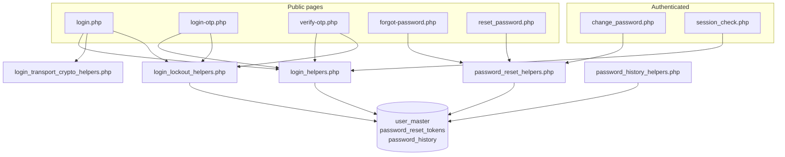
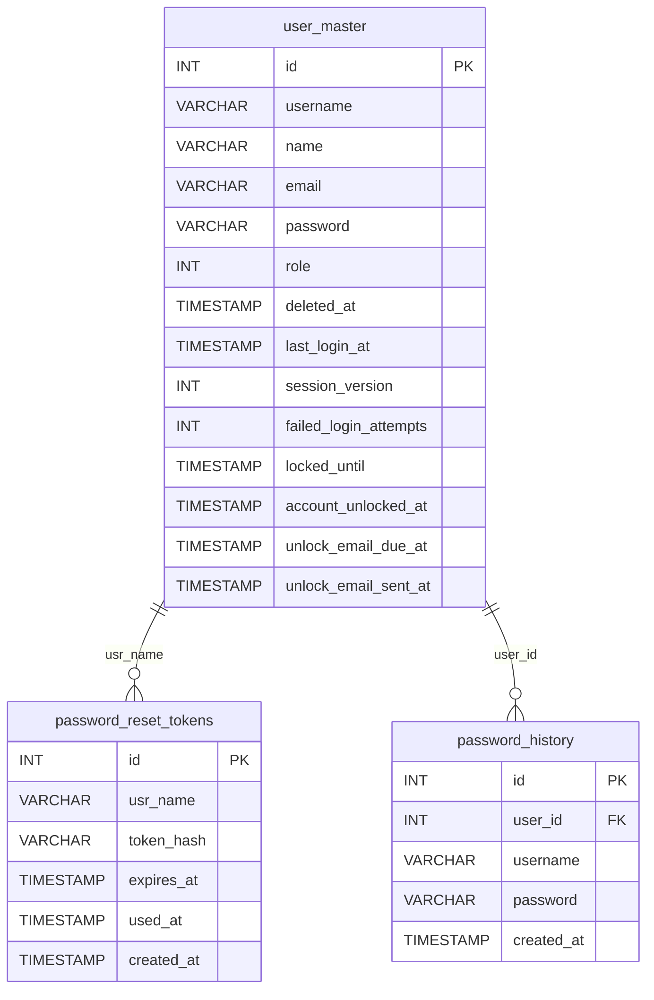
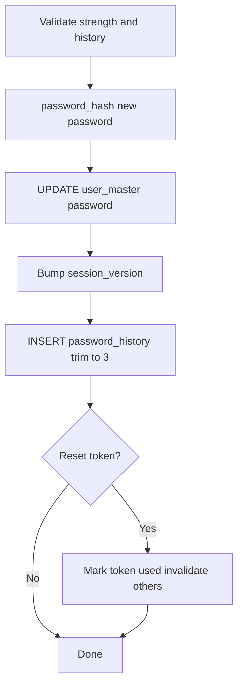
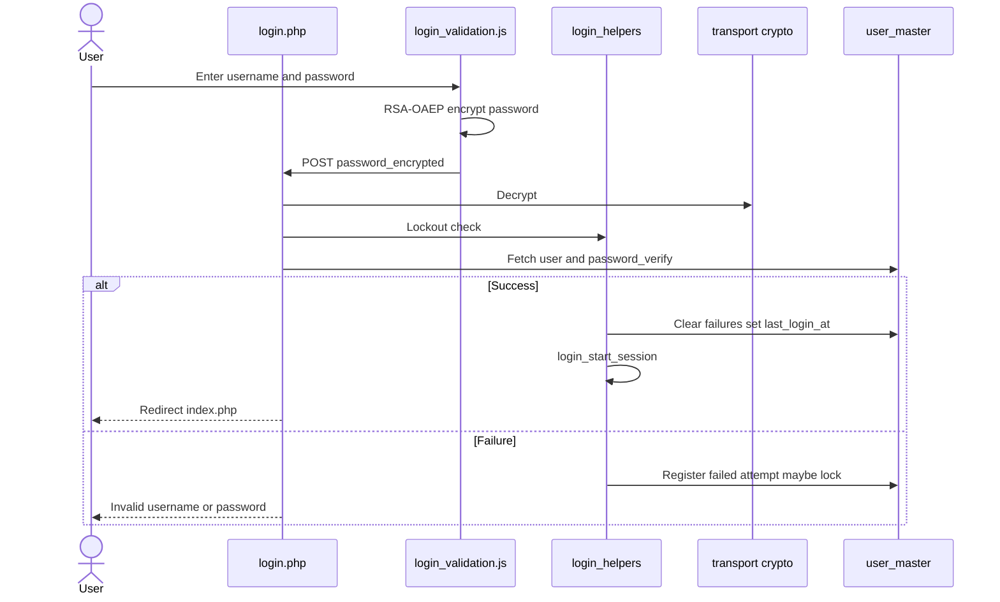
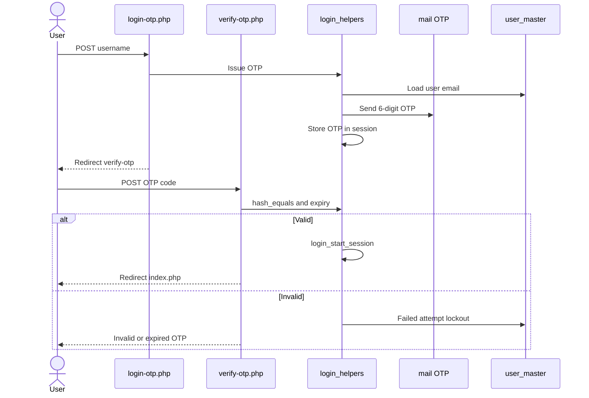
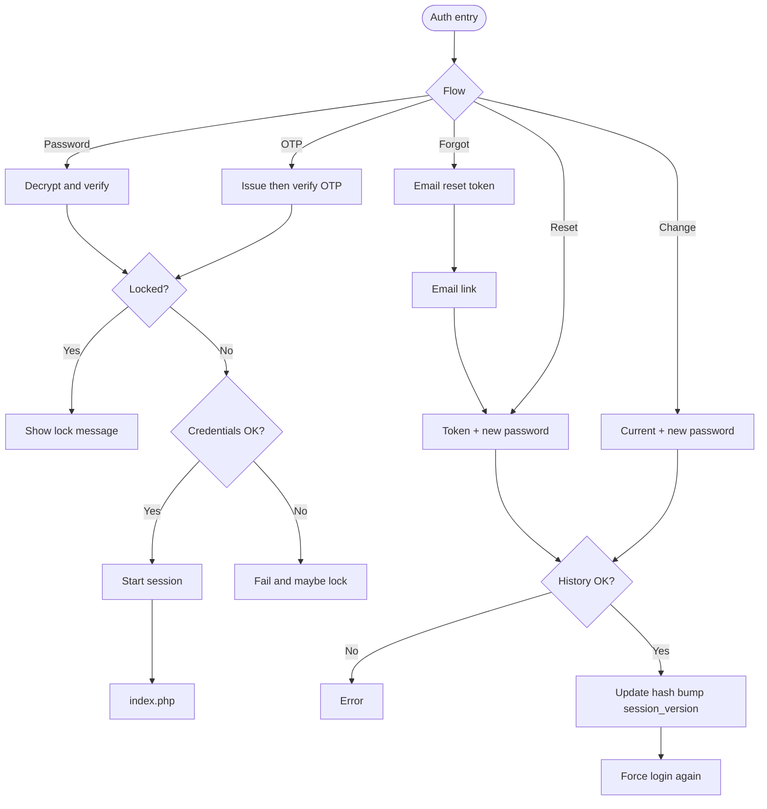
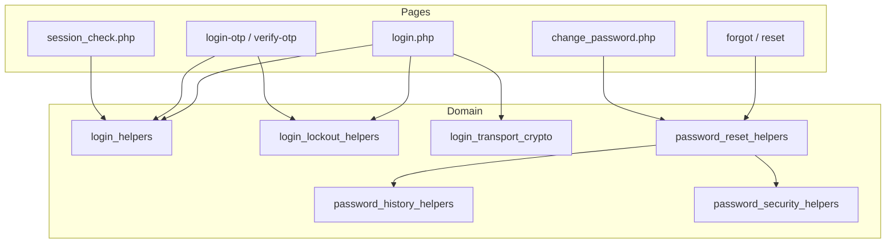

# Low-Level Design (LLD) — Auth Module

| Attribute | Value |
|-----------|--------|
| Module | Authentication & Password Management |
| Flows | Password login · OTP login · Forgot password · Reset password · Change password |
| Application | Complaint / Dealer Portal |
| Stack (target) | Core PHP + MySQL (PDO) |
| Stack (current repo) | Core PHP + **PostgreSQL** via PDO (`pdo_obconn.php`) |
| Document version | 1.0 |
| Out of scope | SSO IdP integration (shares session helpers; separate entry points) |

---

## 1. Module Overview

### 1.1 Purpose

Provide secure authentication for portal users: **username/password** login (RSA-OAEP transport), **email OTP** login, **forgot/reset password** via one-time email link, and **change password** after login. Shared controls cover session lifecycle, remember-me, idle timeout, account lockout, password strength/history, and `session_version` revocation.

### 1.2 Scope

| In scope | Out of scope |
|----------|--------------|
| `login.php` password login | SSO (`sso_login.php` / callback) — brief note only |
| `login-otp.php` + `verify-otp.php` | RBAC permission admin UI |
| `forgot-password.php` + `reset_password.php` | User master CRUD |
| `change_password.php` + topbar modal | Mobile OTP |
| Lockout, remember-me, idle logout, session_version | |

### 1.3 High-level architecture



---

## 2. Functional Requirements

| ID | Requirement | Priority |
|----|-------------|----------|
| FR-01 | Password login with RSA-OAEP encrypted password POST | Must |
| FR-02 | Optional remember-me (30 days) with HMAC cookie + session_version | Must |
| FR-03 | OTP request by username → email 6-digit OTP (10 min TTL) | Must |
| FR-04 | OTP verify with lockout on failures; 60s resend cooldown | Must |
| FR-05 | Forgot password by email → one-time reset link (60 min) | Must |
| FR-06 | Reset password with strength + last-3 history rules | Must |
| FR-07 | Change password after login (current + new + confirm) | Must |
| FR-08 | 5 failed attempts → lock 15 minutes; unlock email after 30 min | Must |
| FR-09 | Idle timeout 20 minutes (server + client) | Must |
| FR-10 | Password change/reset bumps `session_version` (revokes other sessions) | Must |
| FR-11 | Soft-deleted users cannot authenticate | Must |
| FR-12 | Logged-in users visiting auth pages redirect to `index.php` | Should |
| FR-13 | Change password success forces re-login on current browser | Must |

---

## 3. User Roles & Permissions

### 3.1 RBAC module slug

None for public auth pages. Authenticated app pages use normal RBAC after `session_check.php`.

### 3.2 Permission matrix

| Resource | Access |
|----------|--------|
| login / OTP / forgot / reset | Public (guest) |
| `logout.php` | Any session |
| `change_password.php` | Authenticated (`$_SESSION['usr_name']`); POST only |
| `api/password_history_check.php` | Session **or** valid reset token |
| `api/session_idle_touch.php` | Authenticated |
| App pages with `session_check.php` | Authenticated + idle + session_version + page RBAC |

### 3.3 Page / API mapping

| Resource | Gate |
|----------|------|
| `login.php`, `login-otp.php`, `verify-otp.php`, `forgot-password.php`, `reset_password.php` | Guest |
| `change_password.php` | Session required |
| `api/password_history_check.php` | Session or reset token |
| `api/session_idle_touch.php` / `api/session_tab_logout.php` | Session |
| `cron/login_lockout_notify.php` | CLI or HTTP cron key |

### 3.4 After-market list scope

N/A (auth is user-account based, not after-market record scope).

---

## 4. Business Rules

| ID | Rule |
|----|------|
| BR-01 | Only `user_master` rows with `deleted_at IS NULL` authenticate. |
| BR-02 | Password login POST must use `password_encrypted` (RSA-OAEP); plaintext password not accepted. |
| BR-03 | 5 failures → lock 15 minutes; unknown username does not increment counters. |
| BR-04 | OTP stored in **session** (not DB); 6 digits; 10 min expiry; 60s resend. |
| BR-05 | Failed OTP verify counts toward same lockout counters. |
| BR-06 | Reset token: 32-byte hex; SHA-256 stored; 60 min; single-use; prior unused tokens invalidated. |
| BR-07 | New password: ≥8 chars, digit, upper, lower, special; not in last 3 history (+ not current). |
| BR-08 | Password update bumps `session_version` and records history. |
| BR-09 | Remember-me cookie embeds `session_version`; mismatch clears cookie. |
| BR-10 | Idle 20 min; session cookie lifetime 8 hours. |
| BR-11 | Change password destroys current session and redirects to login with success flash. |
| BR-12 | Forgot password currently discloses if email exists in system. |

---

## 5. Database Design

### 5.1 ER diagram



### 5.2 Table: `user_master` (auth columns)

| Column | MySQL type | Notes |
|--------|------------|-------|
| `id` | `INT UNSIGNED` | PK |
| `username` | `VARCHAR(100)` | Login id |
| `name` | `VARCHAR(150)` | Display |
| `email` | `VARCHAR(150)` | OTP / forgot |
| `password` | `VARCHAR(255)` | `password_hash` |
| `role` | `INT` | Session role |
| `deleted_at` | `TIMESTAMP NULL` | Soft-delete |
| `last_login_at` | `TIMESTAMP NULL` | On success |
| `session_version` | `INT NOT NULL DEFAULT 1` | Revocation |
| `failed_login_attempts` | `INT NOT NULL DEFAULT 0` | Lockout |
| `locked_until` | `TIMESTAMP NULL` | Lock end |
| `account_unlocked_at` | `TIMESTAMP NULL` | Auto-unlock |
| `unlock_email_due_at` | `TIMESTAMP NULL` | Cron due |
| `unlock_email_sent_at` | `TIMESTAMP NULL` | Cron sent |

### 5.3 Related tables

| Table | Role |
|-------|------|
| `password_reset_tokens` | Forgot/reset one-time links |
| `password_history` | Last 3 password hashes |

### 5.4 Reference / lookup sources

| Source | Usage |
|--------|--------|
| `includes/keys/*.pem` | RSA transport |
| PHP `mail()` | OTP / reset / unlock emails |
| Cron secret | Lockout notify HTTP |

---

## 6. API / Backend Design

### 6.1 Page endpoints

| Endpoint | Method | Auth | Description |
|----------|--------|------|-------------|
| `login.php` | GET/POST | Guest | Password login |
| `login-otp.php` | GET/POST | Guest | Request OTP |
| `verify-otp.php` | GET/POST | Guest + OTP session | Verify / resend OTP |
| `forgot-password.php` | GET/POST | Guest | Request reset link |
| `reset_password.php` | GET/POST | Guest + token | Set new password |
| `reset-password.php` | GET | — | Alias → forgot |
| `change_password.php` | POST | Logged in | Change password |
| `logout.php` | GET | Any | Destroy session (+ SSO if active) |

### 6.2 JSON APIs

| Endpoint | Purpose |
|----------|---------|
| `POST api/password_history_check.php` | Pre-check new password vs history |
| `POST api/session_idle_touch.php` | Touch / enforce idle |
| `api/session_tab_logout.php` | Destroy session (204) |

### 6.3 Supporting lookup APIs

N/A beyond password history check.

### 6.4 Core PHP module responsibilities

| File | Role |
|------|------|
| `includes/login_helpers.php` | Session start/destroy, OTP, remember-me, session_version, idle |
| `includes/login_lockout_helpers.php` | Failures, lock, unlock, email schedule |
| `includes/login_transport_crypto_helpers.php` | RSA decrypt / key load |
| `includes/password_reset_helpers.php` | Forgot/reset/change process |
| `includes/password_security_helpers.php` | Hash / verify |
| `includes/password_history_helpers.php` | History check / record |
| `includes/security_headers_helpers.php` | CSP / headers on auth pages |
| `cron/login_lockout_notify.php` | Unlock + unlock emails |

---

## 7. Validation Rules

### 7.1 Server-side

| Flow | Messages (selected) |
|------|---------------------|
| Login | `Invalid username or password` · lockout messages |
| OTP request | `Username is required.` · `Invalid username` · `No registered email found for this user.` · `Failed to send OTP. Please try again.` |
| OTP verify | `Invalid or expired OTP. Please try again.` · resend cooldown |
| Forgot | `Email address is required.` · `Please enter a valid email address.` · `Email address does not exist in the system.` |
| Reset / Change | Strength messages · `Confirm Password must match New Password.` · `New password cannot be same as your last 3 passwords` · `Current password is incorrect.` (change) |

### 7.2 Client-side

| Script | Page |
|--------|------|
| `js/login_validation.js` | Login (+ RSA encrypt) |
| `js/login_otp_validation.js` | OTP request |
| `js/verify_otp_validation.js` | OTP verify |
| `js/forgot_password_validation.js` | Forgot |
| `js/reset_password_validation.js` | Reset (+ history API) |
| `js/change_password_validation.js` | Change modal |
| `js/session_idle_logout.js` | Authenticated idle |

---

## 8. UI Screen Specifications

### 8.1 Listing

N/A.

### 8.2 Form panels / pages

| Page | Fields |
|------|--------|
| Login | Username*, Password* (encrypted), Remember me |
| Login OTP | Username* |
| Verify OTP | 6-digit OTP*, Resend |
| Forgot | Email* |
| Reset | New Password*, Confirm* |
| Change modal | Current*, New*, Confirm* |

### 8.3 Details

N/A.

### 8.4 Modals

| Modal | Host |
|-------|------|
| Change Password | `includes/change_password_modal.php` via `topbar.php` |

---

## 9. Database Flow

### 9.1 Create / update (password change or reset)



### 9.2 Soft-delete

Users soft-deleted via User Admin; auth queries require `deleted_at IS NULL`.

### 9.3 List query pattern

N/A. Auth lookups are by username/email:

```sql
SELECT ... FROM user_master
WHERE TRIM(username) = :usr
  AND deleted_at IS NULL;
```

---

## 10. Sequence Diagram

### 10.1 Password login



### 10.2 OTP login



---

## 11. Activity Diagram



---

## 12. Class / Module Diagram



### 12.1 Key functions

| Function | Role |
|----------|------|
| `login_start_php_session()` | Cookie + security headers |
| `login_start_session()` | Stamp session keys + regenerate id |
| `login_destroy_session()` | Clear session + remember cookie |
| `login_decrypt_transport_password()` | RSA-OAEP decrypt |
| `login_issue_otp()` / verify helpers | OTP lifecycle |
| `login_remember_*` | Remember-me cookie |
| `login_enforce_session_version()` | Revocation |
| Lockout helpers | Fail / lock / unlock / email due |
| `password_reset_process_forgot/reset/change` | Password flows |
| `password_history_*` | Last-3 reuse check |

---

## 13. Folder Structure

```text
ComplaintManagement/
├── login.php
├── login-otp.php
├── verify-otp.php
├── logout.php
├── forgot-password.php
├── reset_password.php
├── reset-password.php
├── change_password.php
├── session_check.php
├── api/
│   ├── password_history_check.php
│   ├── session_idle_touch.php
│   └── session_tab_logout.php
├── includes/
│   ├── login_helpers.php
│   ├── login_lockout_helpers.php
│   ├── login_transport_crypto_helpers.php
│   ├── password_reset_helpers.php
│   ├── password_security_helpers.php
│   ├── password_history_helpers.php
│   ├── change_password_modal.php
│   ├── security_headers_helpers.php
│   └── keys/
│       ├── login_transport_public.pem
│       └── login_transport_private.pem
├── js/
│   ├── login_validation.js
│   ├── login_otp_validation.js
│   ├── verify_otp_validation.js
│   ├── forgot_password_validation.js
│   ├── reset_password_validation.js
│   ├── change_password_validation.js
│   ├── password_history_check.js
│   └── session_idle_logout.js
├── cron/
│   └── login_lockout_notify.php
├── sql/
│   ├── add_user_master_login_lockout.sql
│   └── add_user_master_session_version.sql
└── docs/
    └── LLD_Auth_Module.md
```

---

## 14. Error Handling

| Layer | Pattern |
|-------|---------|
| Auth pages | In-page / session flash messages |
| APIs | JSON `{error}` / `{valid:false}` |
| Lockout | Specific locked messages with remaining minutes |
| PDO failures on login | Generic `Invalid username or password` |

### 14.1 Common messages

| Message | When |
|---------|------|
| `Invalid username or password` | Bad password login |
| `Your account is locked...` | Lockout active |
| `Invalid username` | OTP unknown user |
| `No registered email found for this user.` | OTP no email |
| `Invalid or expired OTP. Please try again.` | Bad OTP |
| `Email address does not exist in the system.` | Forgot unknown email |
| `Invalid or expired reset link...` | Bad reset token |
| `New password cannot be same as your last 3 passwords` | History |
| `Current password is incorrect.` | Change password |
| `Password changed successfully. Please sign in again.` | Change success |
| `Password reset successfully. Please login with your new password.` | Reset success |
| `Your account details were updated. Please sign in again.` | session_version revoke |

---

## 15. Security Considerations

| Area | Control |
|------|---------|
| Transport | RSA-OAEP for login password; HTTPS assumed for all |
| Password storage | `password_hash` / `password_verify` |
| Lockout | 5 / 15 min; unlock notify cron |
| Session | HttpOnly, SameSite=Lax, Secure, strict mode, regenerate on login |
| Idle | 20 min server + client |
| Revocation | `session_version` on password/critical user changes |
| Remember-me | HMAC-signed; version-bound |
| Reset tokens | Hashed at rest; single-use; expiry |
| Keys | PEM under `includes/keys/` blocked by `.htaccess` |
| Enumeration | Login avoids user existence; **forgot email currently enumerates** |
| Open redirect | Change password `redirect_to` allowlisted |
| Headers | CSP / Permissions-Policy / X-Frame-Options on session start |

---

## 16. Audit Logs

### 16.1 Built-in field-level audit

| Field / store | Behavior |
|---------------|----------|
| `last_login_at` | Set on successful login |
| `failed_login_attempts` / `locked_until` | Lockout trail |
| `account_unlocked_at` / unlock email timestamps | Cron unlock |
| `session_version` | Implicit revocation counter |
| `password_history` | Prior password hashes |
| `password_reset_tokens.used_at` | Token consumption |
| Dedicated auth audit table | **Not implemented** |

---

## 17. Test Cases

### 17.1 Functional

| ID | Scenario | Expected |
|----|----------|----------|
| TC-01 | Valid password login | Session + redirect index |
| TC-02 | Wrong password | Generic error; attempts increment |
| TC-03 | 5 failures | Locked 15 minutes |
| TC-04 | Remember-me login | Cookie set; restores session |
| TC-05 | OTP to user with email | Redirect verify; email sent |
| TC-06 | OTP wrong code | Error; attempts increment |
| TC-07 | OTP expiry / resend cooldown | Rejected / wait message |
| TC-08 | Forgot known email | Reset link issued |
| TC-09 | Forgot unknown email | Existence error |
| TC-10 | Reset with weak / reused password | Validation error |
| TC-11 | Reset success | Login flash; old sessions revoked |
| TC-12 | Change with wrong current | Error |
| TC-13 | Change success | Forced re-login; other sessions revoked |
| TC-14 | Idle 20 min | Session expired → login |
| TC-15 | Soft-deleted user | Cannot login |
| TC-16 | Decrypt failure | Treated as invalid credentials |

---

## 18. Assumptions & Dependencies

### 18.1 Assumptions

1. PHP OpenSSL available for RSA key ops.
2. `mail()` (or equivalent) delivers OTP / reset / unlock emails.
3. HTTPS in production so cookies Secure and password forms are protected.
4. Lockout cron scheduled after unlock events.
5. SSO is optional and out of scope for this document.

### 18.2 Dependencies

| Dependency | Purpose |
|------------|---------|
| `user_master` | Accounts |
| OpenSSL / Web Crypto | Login transport |
| Password history table | Reuse prevention |
| Cron runner | Unlock emails |
| jQuery / validate.js | Client validation |

---

## Appendix A — Success / flash messages

| Event | Message |
|-------|---------|
| OTP resent | OTP has been sent to your registered email address. |
| Reset success | Password reset successfully. Please login with your new password. |
| Change success | Password changed successfully. Please sign in again. |
| Session revoked | Your account details were updated. Please sign in again. |

---

## Appendix B — Select2 control map

N/A for Auth forms (standard inputs / OTP digits).

---

## Appendix C — Timing constants

| Constant | Value |
|----------|-------|
| Session cookie / login stamp lifetime | 8 hours |
| Idle timeout | 20 minutes |
| Remember-me | 30 days |
| OTP TTL | 10 minutes |
| OTP resend cooldown | 60 seconds |
| Lockout threshold | 5 failures |
| Lock duration | 15 minutes |
| Unlock email delay | 30 minutes after unlock |
| Reset token TTL | 60 minutes |
| Password history depth | 3 |

---

## Appendix D — Flow summary

```text
Password login  --> session --> app
OTP login       --> email OTP --> session --> app
Forgot          --> email link --> reset_password --> login
Change password --> update hash + session_version --> destroy session --> login
```

---

*End of LLD — Auth Module*
