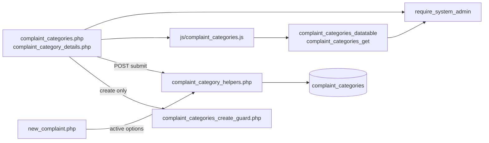
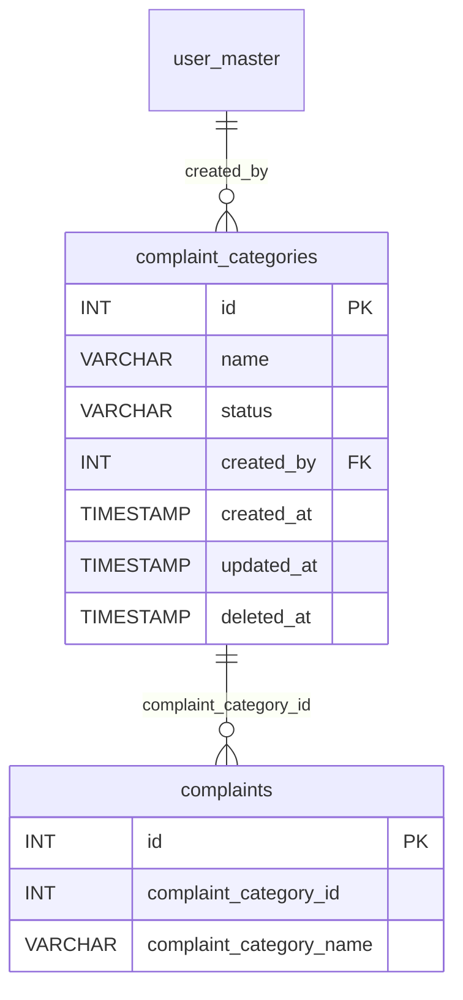
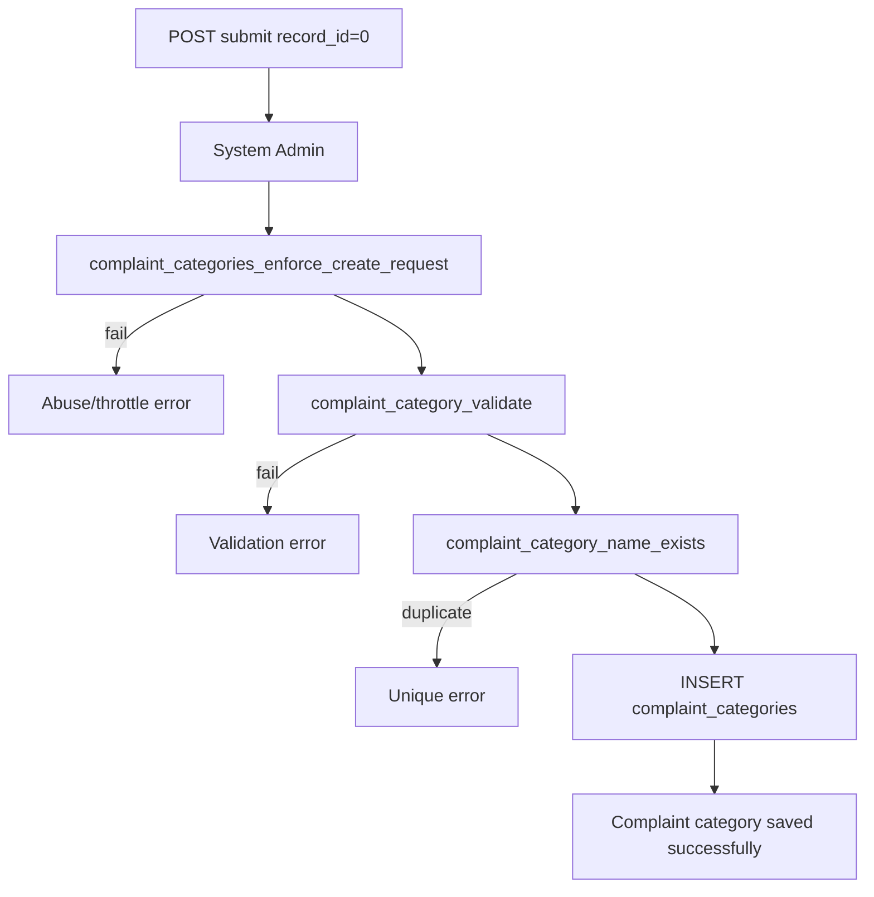
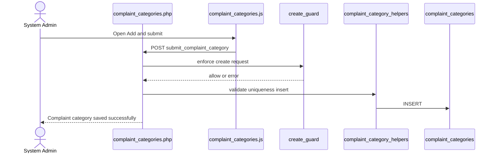
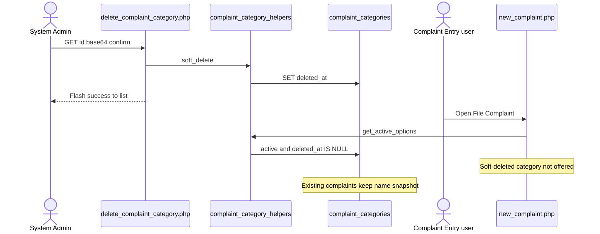
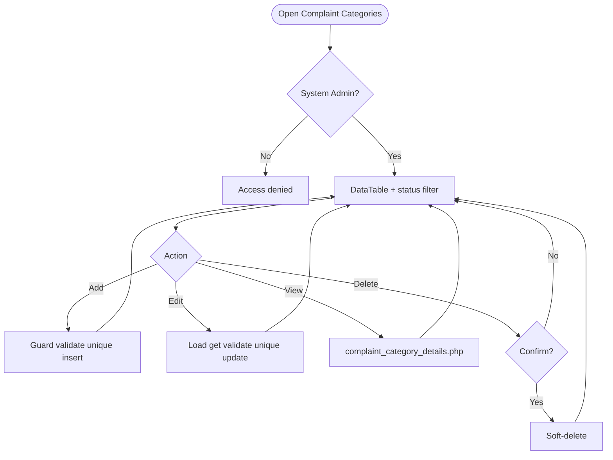
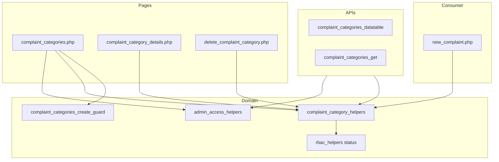

# Low-Level Design (LLD) — Complaint Category Module

| Attribute | Value |
|-----------|--------|
| Module | Complaint Category (Complaint Categories Master) |
| Menu path | SYSTEM CONFIGURATION → Complaint Categories |
| Landing page | `complaint_categories.php` |
| Application | Complaint / Dealer Portal |
| Stack (target) | Core PHP + MySQL (PDO) |
| Stack (current repo) | Core PHP + **PostgreSQL** via PDO |
| Document version | 1.0 |
| Access | **System Admin only** (role id `6`) — no RBAC module slug |

---

## **1. Module Overview**

### 1.1 Purpose

System Administrators maintain the complaint category catalog in `complaint_categories`: create/edit categories (name + status), list/filter via DataTables, view details, and soft-delete. Complaint Entry consumes **active, non-deleted** options and stores both `complaint_category_id` and a denormalized `complaint_category_name` snapshot on `complaints`.

### 1.2 Scope

| In scope | Out of scope |
|----------|--------------|
| List / Add / Edit / Details / Soft-delete | Complaint Entry form UX (consumer only) |
| Active / Inactive status | Hard delete |
| Case-insensitive name uniqueness | Select2 on admin form (native select) |
| Create abuse / rate-limit guard | Cascading updates to existing complaints |
| Status list filter | Per-role RBAC module slug |

### 1.3 High-level architecture



---

## **2. Functional Requirements**

| ID | Requirement | Priority |
|----|-------------|----------|
| FR-01 | System Admin can open Complaint Categories list (DataTables) | Must |
| FR-02 | Create category with name and status | Must |
| FR-03 | Edit category via inline slide-down form | Must |
| FR-04 | Soft-delete category; hide from list | Must |
| FR-05 | Unique category name among non-deleted (case/trim-insensitive) | Must |
| FR-06 | Filter list by status (active / inactive) | Should |
| FR-07 | View read-only details | Should |
| FR-08 | Throttle / rate-limit create requests | Should |
| FR-09 | Client validate.js for name + status | Should |
| FR-10 | Expose active options to Complaint Entry | Must |

---

## **3. User Roles & Permissions**

### 3.1 RBAC module slug

**None.** Complaint Categories administration is gated by **System Admin** (`SYSTEM_ADMIN_ROLE = 6`), not a permission slug.

### 3.2 Permission matrix

| Capability | Gate |
|------------|------|
| All category admin pages | `require_system_admin($obconn)` |
| Category APIs | `admin_api_require_system_admin` |
| Denied | `Access denied. System Admin privileges required.` |

Pages (`complaint_categories.php`, `complaint_category_details.php`, `delete_complaint_category.php`) are in `rbac_admin_pages()` and skip module RBAC; System Admin check is authoritative.

### 3.3 Page / API mapping

| Resource | Gate |
|----------|------|
| `complaint_categories.php` | System Admin |
| `complaint_category_details.php` | System Admin |
| `delete_complaint_category.php` | System Admin |
| `api/complaint_categories_datatable.php` | System Admin API |
| `api/complaint_categories_get.php` | System Admin API |

### 3.4 Consumer access

Complaint Entry users need `complaint-entry` permissions (separate module). They only see **active** categories via `complaint_category_get_active_options()`.

---

## **4. Business Rules**

| ID | Rule |
|----|------|
| BR-01 | Soft-deleted rows (`deleted_at IS NOT NULL`) excluded from list, get, uniqueness, and Entry options. |
| BR-02 | Name unique among non-deleted: `LOWER(TRIM(name))`; edit excludes self. |
| BR-03 | Soft-deleted names may be reused on create. |
| BR-04 | Status must be `active` or `inactive` (`rbac_validate_status`). |
| BR-05 | Inactive categories remain in admin list but are **not** offered in Complaint Entry. |
| BR-06 | Soft-delete does **not** update existing `complaints` rows (snapshot name retained). |
| BR-07 | No “in use” check before soft-delete. |
| BR-08 | Create-only abuse guard: max 1 record/request; min 3s interval; max 20 creates / 15 min. |
| BR-09 | Edit requires existing non-deleted row. |
| BR-10 | `created_by` = current user id on insert; `created_at` / `updated_at` timestamps. |
| BR-11 | Details/delete URL ids are `base64_encode((string) id)`. |
| BR-12 | Create/update stay on page (no PRG). Delete redirects to list with session flash. |
| BR-13 | Complaint Entry resolves category via `complaint_category_resolve_for_complaint` (active + non-deleted). |
| BR-14 | Complaint stores `complaint_category_id` + denormalized `complaint_category_name`. |

---

## **5. Database Design**

### 5.1 ER diagram



### 5.2 Table: `complaint_categories`

| Column | MySQL type | Notes |
|--------|------------|-------|
| `id` | `INT UNSIGNED AUTO_INCREMENT` | PK |
| `name` | `VARCHAR(100)` | Required; unique among active |
| `status` | `VARCHAR(20)` | `active` / `inactive` |
| `created_by` | `INT NULL` | → `user_master.id` |
| `created_at` | `TIMESTAMP` | Insert |
| `updated_at` | `TIMESTAMP NULL` | Update / soft-delete |
| `deleted_at` | `TIMESTAMP NULL` | Soft-delete |

### 5.3 Related tables

| Table | Role |
|-------|------|
| `user_master` | Created-by join on details |
| `complaints` | Consumer; id + name snapshot |

### 5.4 Reference / lookup sources

| Source | Usage |
|--------|--------|
| `rbac_status_options()` | Status `<select>` |
| `complaint_category_get_active_options()` | Complaint Entry dropdown |
| Status filter | DataTable ajax reload |

---

## **6. API / Backend Design**

### 6.1 Page endpoints

| Endpoint | Method | Auth | Description |
|----------|--------|------|-------------|
| `complaint_categories.php` | GET | System Admin | List + Add/Edit panel |
| `complaint_categories.php` | POST `submit_complaint_category` | System Admin | Create or update |
| `complaint_category_details.php?id=` | GET | System Admin | Read-only details |
| `delete_complaint_category.php?id=` | GET | System Admin | Soft-delete |

### 6.2 JSON APIs

#### `POST api/complaint_categories_datatable.php`

DataTables server-side. Optional `status_filter`. Search on name (+ status label via `rbac_search_filter`). Only `deleted_at IS NULL`.

```json
{
  "draw": 1,
  "recordsTotal": 10,
  "recordsFiltered": 2,
  "data": [{ "id": "#1", "name": "...", "status": "...", "actions": "<html>" }]
}
```

#### `GET api/complaint_categories_get.php?id=`

Returns category fields for edit form. System Admin API gated.

### 6.3 Supporting lookup APIs

N/A for admin UI (status options server-rendered). Entry uses helper options, not this admin API.

### 6.4 Core PHP responsibilities

| File | Role |
|------|------|
| `includes/complaint_category_helpers.php` | from_post, validate, CRUD, options, display |
| `includes/module_create_guards/complaint_categories_create_guard.php` | Create throttle / rate limit |
| `includes/admin_access_helpers.php` | System Admin gate |
| `includes/admin_api_guard.php` | System Admin API gate |
| `includes/rbac_helpers.php` | Status options / validation / badges |

---

## **7. Validation Rules**

### 7.1 Server-side

| Field / rule | Message |
|--------------|---------|
| Name empty | `Category name is required.` |
| Name > 100 | `Category name cannot exceed 100 characters.` |
| Status missing/invalid | `Status is required.` |
| Duplicate name | `Category name already exists. Please choose a different name.` |
| Missing edit target | `Complaint category not found or already deleted.` |
| Create throttle | `Please wait a few seconds...` / rate-limit messages |

### 7.2 Client-side (`js/complaint_categories.js`)

- validate.js: `name` presence + max 100; `status` presence
- Submit blocked until valid; then native `form.submit()`
- Status filter reloads DataTable
- Success alert fades after 3s

---

## **8. UI Screen Specifications**

### 8.1 Listing — `complaint_categories.php`

| Element | Spec |
|---------|------|
| CTA | Add Complaint Category / Cancel |
| Filter | Status (All / Active / Inactive) |
| Grid | ID, Name, Status, Created At, Action |
| Actions | View / Edit / Delete (confirm) |
| Form card | `#complaintCategoryFormCard` slide-down |

### 8.2 Form panel

Fields: Category Name*, Status* (`active` / `inactive`).  
Hidden: `record_id`, `submit_complaint_category`.

### 8.3 Details — `complaint_category_details.php`

Read-only name, status badge, created by, timestamps.

### 8.4 Modals / Select2

- No CRUD modals; delete uses browser `confirm(...)`.
- **Admin form:** native `<select>` for status — **no Select2**.
- **Complaint Entry:** Select2 on `#complaintCategorySelect` (consumer).

---

## **9. Database Flow**

### 9.1 Create



### 9.2 Soft-delete

```sql
UPDATE complaint_categories
SET deleted_at = CURRENT_TIMESTAMP,
    updated_at = CURRENT_TIMESTAMP
WHERE id = :id
  AND deleted_at IS NULL;
```

### 9.3 List query pattern

```sql
SELECT *
FROM complaint_categories
WHERE deleted_at IS NULL
  AND /* optional status = :status_filter */
  AND /* optional name/status search */
ORDER BY id DESC
LIMIT :limit OFFSET :offset;
```

---

## **10. Sequence Diagram**

### 10.1 Create category



### 10.2 Soft-delete and Entry impact



---

## **11. Activity Diagram**



---

## **12. Class / Module Diagram**



### 12.1 Key functions

| Function | Role |
|----------|------|
| `complaint_category_from_post` / `complaint_category_validate` | Parse + validate |
| `complaint_category_name_exists` | Uniqueness |
| `complaint_category_insert` / `_update` / `_soft_delete` | Persist |
| `complaint_category_get_by_id` | Load non-deleted row |
| `complaint_category_entry_actions` | View / Edit / Delete HTML |
| `complaint_category_get_active_options` | Entry dropdown source |
| `complaint_category_resolve_for_complaint` | Validate id for Entry submit |
| `complaint_category_render_options` | `<option>` + `data-name` |
| `complaint_category_display_name` | Snapshot display on complaints |
| `complaint_categories_enforce_create_request` | Create abuse guard |

---

## **13. Folder Structure**

```text
ComplaintManagement/
├── complaint_categories.php
├── complaint_category_details.php
├── delete_complaint_category.php
├── api/
│   ├── complaint_categories_datatable.php
│   └── complaint_categories_get.php
├── includes/
│   ├── complaint_category_helpers.php
│   ├── admin_access_helpers.php
│   ├── admin_api_guard.php
│   ├── rbac_helpers.php
│   └── module_create_guards/
│       └── complaint_categories_create_guard.php
├── js/
│   └── complaint_categories.js
├── storage/
│   └── request_abuse/complaint_categories/
└── docs/
    └── LLD_Complaint_Category_Module.md
```

---

## **14. Error Handling**

| Layer | Pattern |
|-------|---------|
| Page POST | Local `$error_message` / `$success_message` |
| Delete | Session flash → `complaint_categories.php` |
| Details invalid | `die('Invalid record.')` / `die('Complaint category not found.')` |
| APIs | JSON + HTTP 403/404 as applicable |
| Create guard | Inline error + abuse log under storage |

### 14.1 Common messages

| Message | When |
|---------|------|
| `Complaint category saved successfully.` | Create |
| `Complaint category updated successfully.` | Update |
| `Complaint category deleted successfully.` | Soft-delete (session flash) |
| `Failed to save complaint category.` / `Failed to update...` | Persist fail |
| `Complaint category not found or already deleted.` | Missing edit target |
| `Category name already exists...` | Unique violation |
| `Please wait a few seconds before creating another record.` | Min interval |
| `Create rate limit exceeded...` | 20 / 15 min |
| `Access denied. System Admin privileges required.` | Non-admin |

---

## **15. Security Considerations**

| Area | Control |
|------|---------|
| Authorization | System Admin hard-gate on pages + APIs |
| Soft-delete | Excluded from active queries and Entry options |
| Create abuse | Throttle, rate limit, payload size, monitor log |
| XSS | Escaped alerts / table actions / details |
| CSRF | **Not implemented** on POST or GET delete |
| Delete method | **GET** soft-delete — CSRF-friendly; confirm only |
| PRG | **Not used** on create/update |
| Uniqueness | App-level only; race without DB UNIQUE |
| In-use check | **None** before soft-delete |
| Id encoding | Base64 obfuscation only; authz is admin gate |
| Snapshot integrity | Existing complaints keep name even if master changes/deletes |

---

## **16. Audit Logs**

### 16.1 Built-in field-level audit

| Field | Behavior |
|-------|----------|
| `created_by` / `created_at` | On create |
| `updated_at` | On update / soft-delete |
| `deleted_at` | Soft-delete |
| Dedicated audit table | **Not implemented** |
| Create abuse log | `storage/request_abuse/complaint_categories/abuse_monitor.log` |

---

## **17. Test Cases**

### 17.1 Functional

| ID | Scenario | Expected |
|----|----------|----------|
| TC-01 | Non-admin opens Complaint Categories | Denied |
| TC-02 | Create with empty name | Validation error |
| TC-03 | Create duplicate name (different case) | Rejected |
| TC-04 | Soft-delete then recreate same name | Allowed |
| TC-05 | Set status inactive | Still in admin list; not in Entry options |
| TC-06 | Soft-delete category used by complaints | Complaints keep snapshot name; Entry omits it |
| TC-07 | Status filter = inactive | Only inactive rows |
| TC-08 | Edit via pencil | Form filled from `complaint_categories_get` |
| TC-09 | Delete confirmed | Soft-deleted; flash success |
| TC-10 | Create twice within 3 seconds | Throttle error |
| TC-11 | Create >20 in 15 minutes | Rate-limit error |
| TC-12 | Entry submit with deleted category id | Rejected (`Complaint Category is required.` path) |
| TC-13 | Details with bad base64 id | Invalid record |

---

## **18. Assumptions & Dependencies**

### 18.1 Assumptions

1. Role id `6` is System Admin.
2. Soft-delete is the only remove mechanism; hard deletes are not used.
3. Complaint lists/details/mail prefer denormalized `complaint_category_name`.
4. App-level uniqueness is sufficient unless a DB UNIQUE constraint is added later.
5. Document target stack Core PHP + MySQL; repo runs PostgreSQL.
6. Create guard storage directory is writable under `storage/request_abuse/complaint_categories/`.

### 18.2 Dependencies

| Dependency | Purpose |
|------------|---------|
| `admin_access_helpers` / `admin_api_guard` | System Admin gate |
| `rbac_helpers` | Status options / validation / badges |
| Create-guard storage | Throttle state + abuse log |
| jQuery + DataTables + validate.js | List / form UX |
| Complaint Entry module | Consumer of active options |

---

## Appendix A — Success flashes

| Event | Message |
|-------|---------|
| Create | Complaint category saved successfully. |
| Update | Complaint category updated successfully. |
| Delete | Complaint category deleted successfully. |

---

## Appendix B — Select2 control map

| Screen | Control | Select2? |
|--------|---------|----------|
| Admin form `#complaintCategoryStatus` | Native `<select>` | No |
| Entry `#complaintCategorySelect` | Static Select2 | Yes (consumer) |

---

## Appendix C — Status values

| Value | Admin list | Complaint Entry options |
|-------|------------|-------------------------|
| `active` | Yes | Yes |
| `inactive` | Yes | No |
| Soft-deleted | No | No |

---

## Appendix D — Create guard limits

| Limit | Value |
|-------|-------|
| Max records per request | 1 |
| Min interval between creates | 3 seconds |
| Max creates per window | 20 |
| Window | 15 minutes |

---

## Appendix E — Complaint snapshot fields

| Column | Source |
|--------|--------|
| `complaints.complaint_category_id` | Selected category id |
| `complaints.complaint_category_name` | Name snapshot from option `data-name` / resolve helper |

---

*End of LLD — Complaint Category Module*
