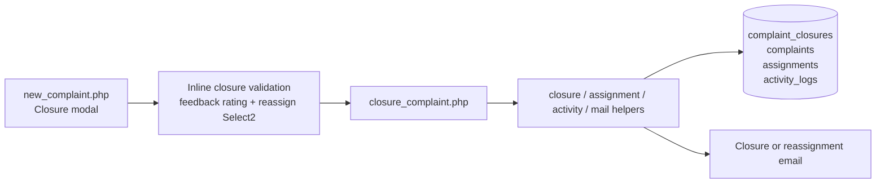
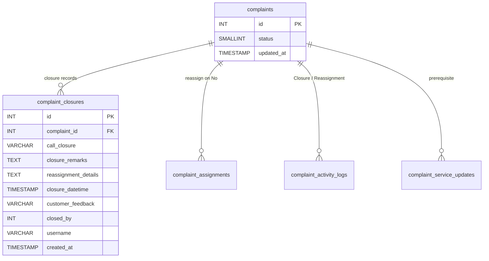
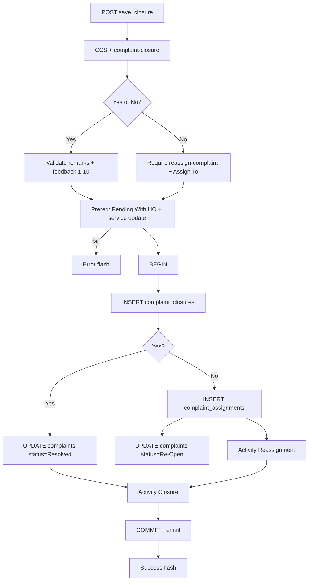
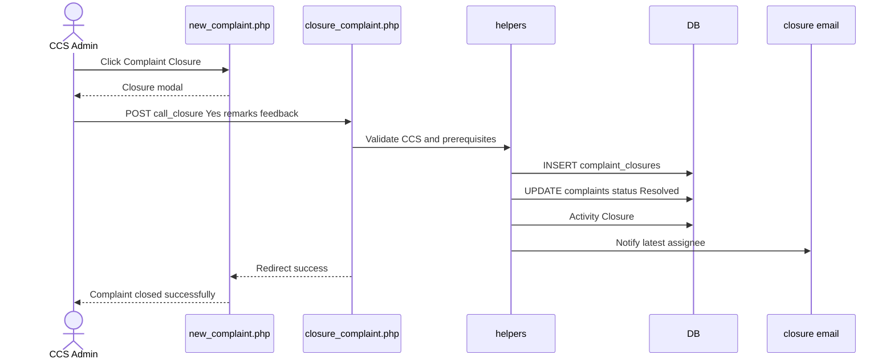
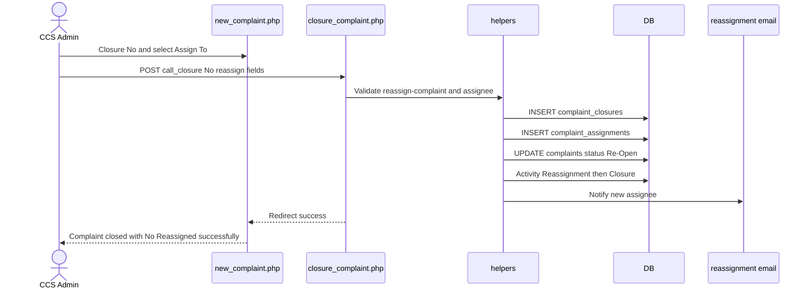
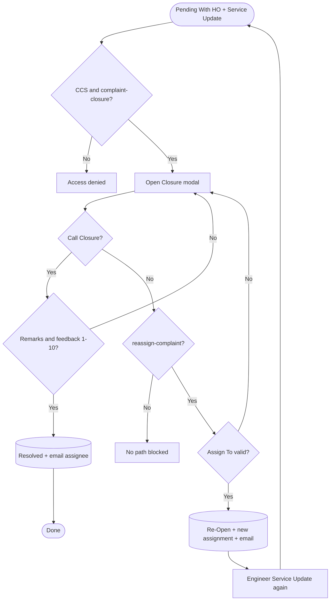
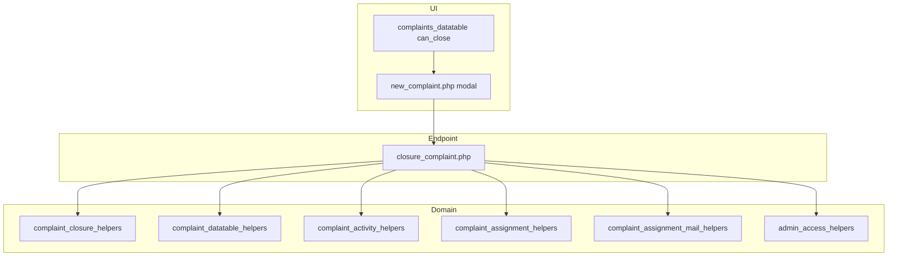

# Low-Level Design (LLD) — Complaint Closure Flow

| Attribute | Value |
|-----------|--------|
| Document focus | **Complaint Closure only** (Yes → Resolved / No → Reassign + Re-Open) |
| Module | Complaint Entry (`complaint-entry`) |
| Host UI | `new_complaint.php` → Closure modal |
| Save endpoint | `closure_complaint.php` (POST) |
| Stack (target) | Core PHP + MySQL (PDO) |
| Stack (current repo) | Core PHP + **PostgreSQL** via PDO |
| Document version | 1.0 |

> **Out of scope:** Complaint create, initial assign, Assigned Complaint List UI, Service Update save (covered elsewhere). Service Update is a **prerequisite** only.

---

## 1. Module Overview

### 1.1 Purpose

After a Service Update moves a complaint to **Pending With HO**, a **CCS Admin** with `complaint-closure` permission marks **Call Closure**:

- **Yes** → record closure remarks + customer feedback (1–10) → status **Resolved**
- **No** → reassign to an engineer (requires `reassign-complaint`) → status **Re-Open** (returns to Assigned List after new Service Update cycle)

### 1.2 Scope

| In scope | Out of scope |
|----------|--------------|
| Closure modal on Complaint Entry history | Creating / editing complaint master fields |
| `closure_complaint.php` POST save | Service Update form itself |
| Closure = Yes / No business rules | Soft-delete |
| Reassignment on Closure = No | Installed Base / Service Log CRUD |
| Closure / reassignment emails | |
| CCS Pending HO nudge cron (related) | |

### 1.3 High-level architecture



---

## 2. Functional Requirements

| ID | Requirement | Priority |
|----|-------------|----------|
| FR-01 | Closure only for CCS Admin + `complaint-closure` | Must |
| FR-02 | Closure button only when Pending With HO + service update exists + not already closed Yes | Must |
| FR-03 | Call Closure Yes requires remarks + feedback 1–10 | Must |
| FR-04 | Call Closure Yes → status Resolved + closure email to latest assignee | Must |
| FR-05 | Call Closure No requires Assign To + `reassign-complaint` | Must |
| FR-06 | Call Closure No → new assignment + status Re-Open + reassignment email | Must |
| FR-07 | After Closure No + new Service Update + back to Pending With HO, Closure can be used again | Must |
| FR-08 | After Closure Yes, Closure button never shown again | Must |
| FR-09 | Activity logs for Closure and Reassignment | Must |
| FR-10 | Optional CCS Pending HO nudge reminders (cron) | Should |

---

## 3. User Roles & Permissions

### 3.1 RBAC module slug

`complaint-entry`

### 3.2 Permission matrix (closure)

| Permission / gate | Capability |
|-------------------|------------|
| Role **CCS Admin** (`CCS_ADMIN_ROLE = 7`) | Hard role gate |
| `complaint-closure` | Allowed to open/save Closure |
| `reassign-complaint` | Closure = No path (radio + Assign To) |

Combined: `complaint_user_can_closure()` = CCS Admin **AND** `complaint-closure`.

Denial: `Access denied. Complaint closure is available to CCS Admin users with the required permission only.`

### 3.3 Page / API mapping

| Resource | Gate |
|----------|------|
| Closure modal on `new_complaint.php` | `complaint_user_can_closure()` |
| `closure_complaint.php` | `complaint_entry_require_closure_permission()` |
| Closure = No branch | Extra `complaint_entry_require_permission(..., 'reassign-complaint')` |
| `api/complaint_assign_options.php` | assign **or** reassign **or** closure |
| `api/complaints_datatable.php` | Renders Closure button via `can_close` |

### 3.4 List scope

Closure actions appear on **Complaint Entry** history (`api/complaints_datatable.php`) under entry list scope. Actor must still pass CCS + closure permission for the button/modal.

---

## 4. Business Rules

| ID | Rule |
|----|------|
| BR-01 | Status must be **Pending With HO (3)**. |
| BR-02 | ≥1 `complaint_service_updates` row required. |
| BR-03 | Closure button hidden if latest closure is **Yes**. |
| BR-04 | After Closure **No**, button can return only when status is again Pending With HO **and** a service update exists after that No (re-close eligibility). |
| BR-05 | Yes: remarks required; feedback integer 1–10; `closure_datetime` set; status → **Resolved (5)**. |
| BR-06 | No: Assign To required; optional remarks ≤ 500; new `complaint_assignments` with `is_service_updated` default **0**; status → **Re-Open (4)**. |
| BR-07 | No path validates assignee (dealer self-only / ELGi Engineer rules). |
| BR-08 | Activity order on No: **Reassignment** then **Closure**. |
| BR-09 | Yes path activity: **Closure** only. |
| BR-10 | Does not modify `complaint_service_updates` rows. |

---

## 5. Database Design

### 5.1 ER diagram



### 5.2 Table: `complaint_closures`

| Column | MySQL type | Yes | No |
|--------|------------|-----|----|
| `id` | `INT UNSIGNED AUTO_INCREMENT` | auto | auto |
| `complaint_id` | `INT UNSIGNED` | set | set |
| `call_closure` | `VARCHAR(10)` | `Yes` | `No` |
| `closure_remarks` | `TEXT` | required | `NULL` |
| `reassignment_details` | `TEXT` | `NULL` | reassign remarks (nullable) |
| `closure_datetime` | `TIMESTAMP` | set | `NULL` |
| `customer_feedback` | `VARCHAR(100)` | `"1"`–`"10"` | `NULL` |
| `closed_by` | `INT UNSIGNED` | actor | actor |
| `username` | `VARCHAR(100)` | actor | actor |
| `created_at` | `TIMESTAMP` | default | default |

### 5.3 Related tables

| Table | Change on closure |
|-------|-------------------|
| `complaints` | `status` = 5 or 4; `updated_at` now |
| `complaint_assignments` | New row on **No** only |
| `complaint_activity_logs` | `Closure` / `Reassignment` |
| `complaint_service_updates` | Read-only prerequisite |

### 5.4 Reference / lookup sources

| Source | Usage |
|--------|--------|
| `api/complaint_assign_options.php` | Reassign Select2 |
| Status constants | Pending With HO / Re-Open / Resolved |
| Feedback 1–10 | `complaint_closure_helpers.php` |

---

## 6. API / Backend Design

### 6.1 Page endpoints

| Endpoint | Method | Auth | Description |
|----------|--------|------|-------------|
| `new_complaint.php` | GET | `view` + closure UI if allowed | Hosts `#closureModal` |
| `closure_complaint.php` | POST `save_closure` | CCS + `complaint-closure` | Persist Yes/No |
| Non-POST to closure | — | — | Redirect `new_complaint.php` |

#### POST fields

| Field | Yes | No |
|-------|-----|----|
| `complaint_id` | required | required |
| `call_closure` | `Yes` | `No` |
| `closure_remarks` | required | ignored |
| `customer_feedback` | required 1–10 | ignored |
| `reassign_complaint` | — | required |
| `reassign_remarks` | — | optional ≤ 500 |

### 6.2 JSON APIs

| API | Role |
|-----|------|
| `api/complaints_datatable.php` | `can_close` flags + Closure button |
| `api/complaint_assign_options.php` | Reassign assignees |

### 6.3 Supporting lookup APIs

Assignee options for Closure = No Select2 (same assign-options API).

### 6.4 Core PHP responsibilities

| File | Role |
|------|------|
| `closure_complaint.php` | Orchestration + transaction |
| `complaint_closure_helpers.php` | Feedback validate/display |
| `complaint_datatable_helpers.php` | Closure permission + `can_close` |
| `complaint_activity_helpers.php` | Activity insert |
| `complaint_assignment_helpers.php` | Reassign validate/resolve |
| `complaint_assignment_mail_helpers.php` | Closure / reassignment emails |
| `admin_access_helpers.php` | CCS Admin check |

---

## 7. Validation Rules

### 7.1 Server-side

| Condition | Message |
|-----------|---------|
| Invalid Yes/No | `Please select call closure Yes or No.` |
| Yes, empty remarks | `Closure remarks are required when call closure is Yes.` |
| Yes, empty/invalid feedback | `Customer feedback is required when call closure is Yes.` / `Please select a customer feedback rating between 1 and 10.` |
| No, empty assignee | `Reassign Assign To is required when call closure is No.` |
| No, remarks > 500 | `Remarks cannot exceed 500 characters.` |
| Wrong status | `Closure is only allowed for complaints pending with HO.` |
| No service update | `Service update is required before complaint closure.` |
| Not found | `Complaint not found.` |
| No user | `Unable to resolve logged-in user.` |
| Persist fail | `Failed to save complaint closure.` |
| No CCS/closure | `Access denied. Complaint closure is available to CCS Admin users with the required permission only.` |
| No reassign perm | `Access denied. You do not have permission for this action.` |

### 7.2 Client-side (inline on `new_complaint.php`)

| Field | Message |
|-------|---------|
| `call_closure` | `Please select Call Closure Yes or No` |
| `closure_remarks` | `Closure remarks are required` |
| `customer_feedback` | `Please select a customer feedback rating between 1 and 10` |
| `reassign_complaint` | `Reassign to is required` |
| `reassign_remarks` | `Remarks cannot exceed 500 characters` |

Note: `js/closure_validation.js` mirrors this but is **not** loaded by the page.

---

## 8. UI Screen Specifications

### 8.1 Listing

On Complaint Entry history, **Complaint Closure** action (`.closure-btn`) when `can_close && permissions.closure`.

### 8.2 Form panel

N/A — closure is modal-only.

### 8.3 Details

`complaint_details.php` shows closure history (read-only), including feedback stars for 1–10.

### 8.4 Modals

**`#closureModal`** — title *Complaint Closure*; subtitle *Mark call closure and resolve or reassign the complaint.*

| Section | Fields |
|---------|--------|
| Closure Decision | Radios Yes / No (No disabled without reassign) |
| Closure Remarks (Yes) | Remarks textarea + 1–10 star feedback |
| Reassignment (No) | Assign To Select2 + optional remarks |

Submit: **Save Closure** → `closure_complaint.php`.

---

## 9. Database Flow

### 9.1 Create (persist closure)



### 9.2 Soft-delete

Not part of closure flow.

### 9.3 List query pattern (button eligibility)

```text
status = Pending With HO (3)
AND has_service_update
AND latest_closure <> 'Yes'
AND (
  latest_closure IS NULL
  OR (latest_closure = 'No' AND has_service_after_closure_no)
)
AND user can_closure
```

---

## 10. Sequence Diagram

### 10.1 Closure = Yes → Resolved



### 10.2 Closure = No → Reassign + Re-Open



---

## 11. Activity Diagram



---

## 12. Class / Module Diagram



### 12.1 Key functions

| Function | Role |
|----------|------|
| `complaint_user_can_closure()` | CCS + `complaint-closure` |
| `complaint_entry_require_closure_permission()` | Server enforce |
| `dt_parse_closure_row_flags()` / `can_close` | Button eligibility |
| `complaint_closure_validate_customer_feedback()` | 1–10 |
| `complaint_validate_assignee_for_complaint()` | Reassign rules |
| `complaint_log_activity()` | Closure / Reassignment |
| `complaint_closure_notify_email()` | Yes path mail |
| `complaint_assignment_notify_email(..., true)` | No path reassignment mail |

---

## 13. Folder Structure

```text
ComplaintManagement/
├── closure_complaint.php
├── new_complaint.php
├── complaint_details.php
├── api/
│   ├── complaints_datatable.php
│   └── complaint_assign_options.php
├── includes/
│   ├── complaint_closure_helpers.php
│   ├── complaint_datatable_helpers.php
│   ├── complaint_activity_helpers.php
│   ├── complaint_assignment_helpers.php
│   ├── complaint_assignment_mail_helpers.php
│   ├── complaint_status.php
│   └── admin_access_helpers.php
├── js/
│   ├── closure_customer_feedback_rating.js
│   └── assign_to_select2.js
├── cron/
│   ├── complaint_ccs_closure_nudge.php
│   └── complaint_ccs_closure_nudge_helpers.php
└── docs/
    └── LLD_Complaint_Closure_Flow.md
```

---

## 14. Error Handling

| Layer | Pattern |
|-------|---------|
| POST | Session `error_message` / `success_message` → redirect `new_complaint.php` |
| Client | Inline validate.js before submit |
| Non-POST | Redirect list |

### 14.1 Common messages

| Message | When |
|---------|------|
| `Complaint closed successfully.` | Yes success |
| `Complaint closed with No. Reassigned successfully.` | No success |
| `Closure is only allowed for complaints pending with HO.` | Wrong status |
| `Service update is required before complaint closure.` | Missing SU |
| `Failed to save complaint closure.` | Exception |

---

## 15. Security Considerations

| Area | Control |
|------|---------|
| AuthZ | CCS Admin role + `complaint-closure`; No path needs `reassign-complaint` |
| Status gate | Pending With HO only |
| Prerequisite | Service update must exist |
| SQL Injection | PDO binds |
| XSS | Escaped flashes / details |
| CSRF | Session POST; recommend CSRF tokens |
| Assignee integrity | Same dealer/engineer validation as assign |

---

## 16. Audit Logs

### 16.1 Built-in field-level audit

| Store | Content |
|-------|---------|
| `complaint_closures` | `closed_by`, `username`, `created_at`, `closure_datetime` (Yes) |
| `complaint_activity_logs` | `Closure` / `Reassignment` + description |
| `complaints` | `updated_at` |
| `complaint_assignments` | `assigned_by`, `username` (No path) |

**Activity text (examples):**
- Yes: `Call closure marked Yes. Complaint resolved.` + remarks + `Customer feedback: {n}/10.` + `Status changed to Resolved.`
- No reassignment: `Complaint reassigned to {name} on {date} after closure No.`
- No closure: `Call closure marked No. Complaint reassigned to {name}. Status changed to Re-Open.`

---

## 17. Test Cases

### 17.1 Functional

| ID | Scenario | Expected |
|----|----------|----------|
| TC-01 | Non-CCS tries closure | Denied |
| TC-02 | CCS without `complaint-closure` | Denied |
| TC-03 | Close In Progress (no Pending HO) | Rejected |
| TC-04 | Pending HO without service update | Rejected |
| TC-05 | Yes without remarks/feedback | Validation error |
| TC-06 | Yes valid | Resolved; email; success flash; button gone |
| TC-07 | No without reassign permission | Radio/section blocked / server deny |
| TC-08 | No without Assign To | Validation error |
| TC-09 | No valid | Re-Open; new assignment; emails; success flash |
| TC-10 | After No + new SU + Pending HO | Closure button returns |
| TC-11 | After Yes | Closure button never returns |
| TC-12 | Details shows closure history / feedback stars | Correct display |

---

## 18. Assumptions & Dependencies

### 18.1 Assumptions

1. Service Update has already set status to Pending With HO and written `complaint_service_updates`.
2. CCS Admin role id = 7 and `complaint-closure` / `reassign-complaint` are seeded.
3. Mail transport is configured for closure/reassignment notifications.
4. Document target stack Core PHP + MySQL; repo runs PostgreSQL.

### 18.2 Dependencies

| Dependency | Purpose |
|------------|---------|
| Assigned List / Service Update | Prerequisite SU + Pending With HO |
| Complaint Entry history UI | Modal host + button |
| Assignment helpers / mail | Reassign + notify |
| Feedback rating JS | 1–10 UI |
| Optional cron nudge | Pending HO reminders |

---

## Appendix A — Success messages

| Event | Message |
|-------|---------|
| Closure Yes | Complaint closed successfully. |
| Closure No | Complaint closed with No. Reassigned successfully. |

---

## Appendix B — Select2 control map

| Control | Where | API |
|---------|-------|-----|
| Reassign Assign To | Closure modal (No) | `api/complaint_assign_options.php` via `assign_to_select2.js` |

---

## Appendix C — Status sequence

```text
Service Update --> Pending With HO (3)
                      |
         +------------+------------+
         | Call Closure Yes        | Call Closure No
         v                         v
    Resolved (5)            Re-Open (4) + new assignment
                                   |
                                   +--> Service Update --> Pending With HO (3) --> close again
```

---

## Appendix D — Related cron (optional)

`cron/complaint_ccs_closure_nudge.php` — reminders at 24/48/72 hours while Pending With HO without CCS closure action.  
Subject: `Reminder: Call Closure Pending`. Deep-link module key `complaint-closure` → `new_complaint.php?complaint_id={id}`.

---

*End of LLD — Complaint Closure Flow*
