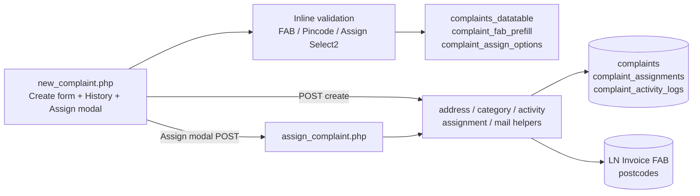
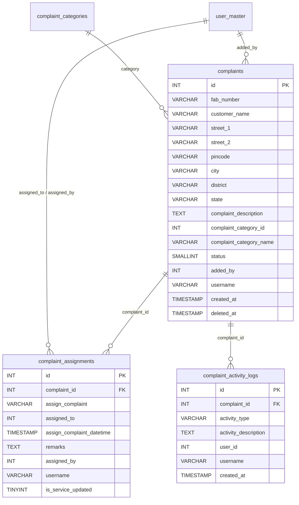
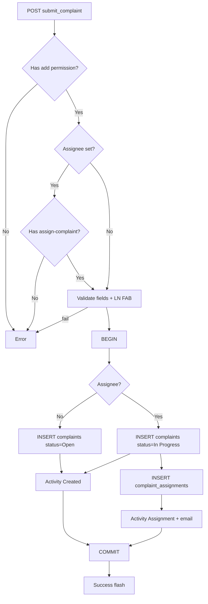
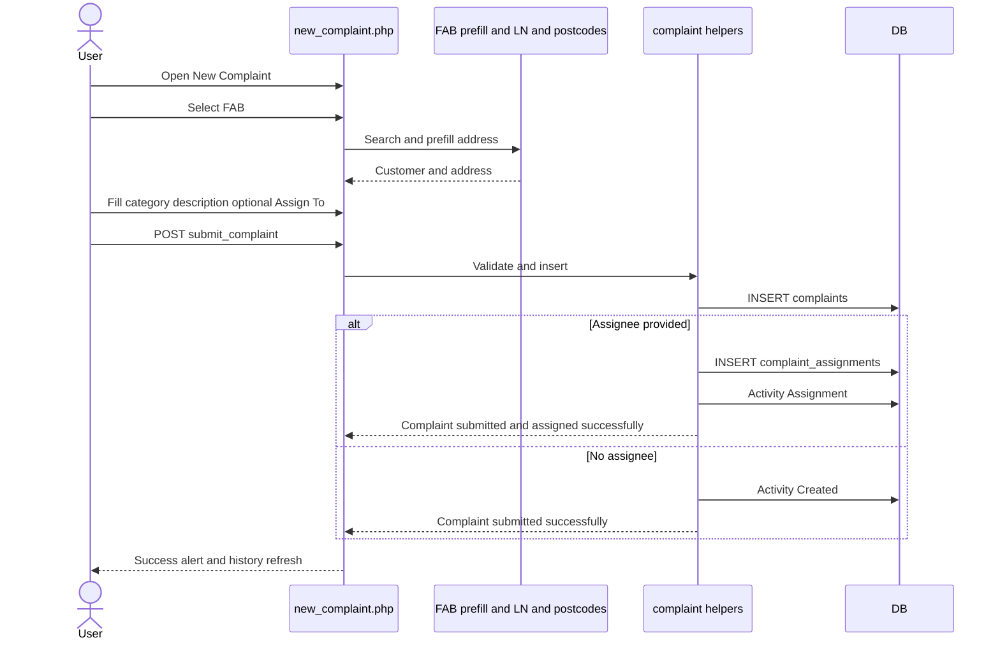
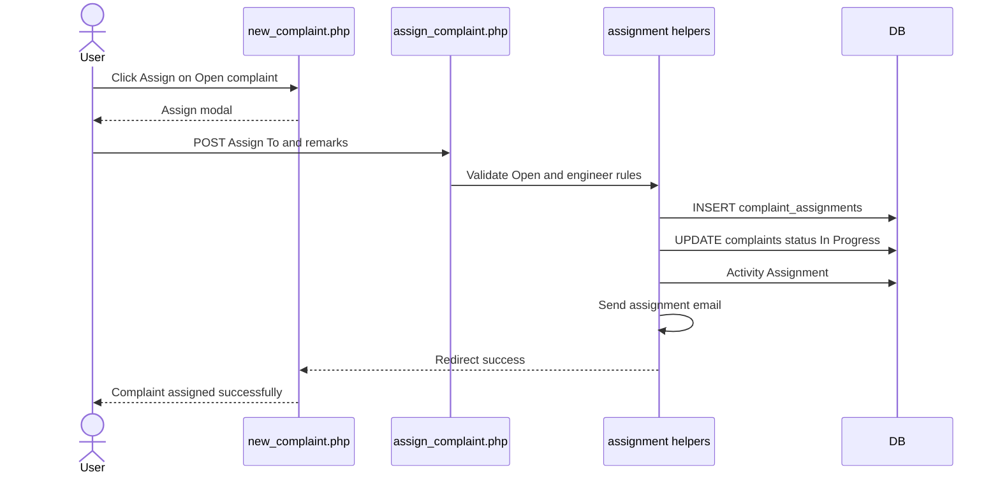
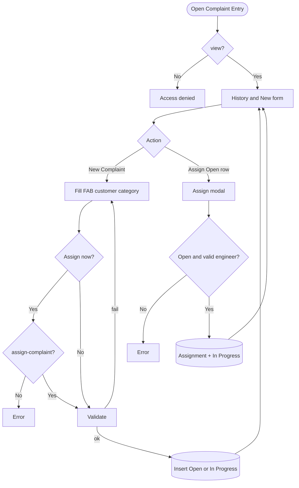
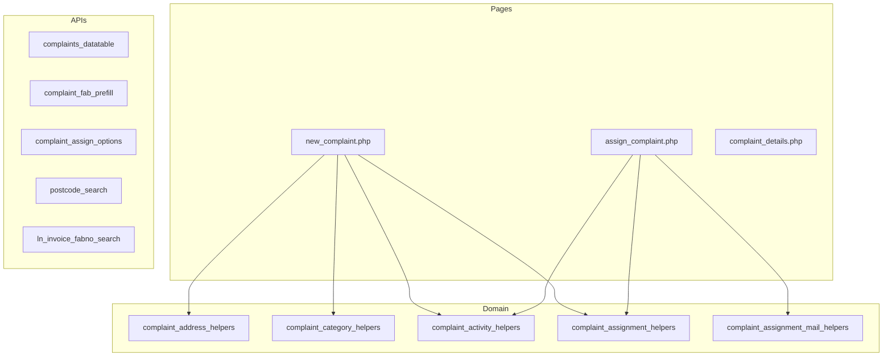

# Low-Level Design (LLD) — Complaint Entry & Assign Process

| Attribute | Value |
|-----------|--------|
| Document focus | **Complaint Entry (create)** + **Assign process only** |
| Module | Complaint Entry |
| Menu path | SUPPORT → Complaint Entry |
| Landing page | `new_complaint.php` |
| Assign page | `assign_complaint.php` |
| Stack (target) | Core PHP + MySQL (PDO) |
| Stack (current repo) | Core PHP + **PostgreSQL** via PDO |
| Document version | 1.0 |

> **Out of scope for this document:** Closure, Re-Open, Soft-delete, Assigned Complaint List, Service Update, Service Log / Installed Base.

---

## 1. Module Overview

### 1.1 Purpose

Authorized users **register a complaint** against a Fab Number (must exist in LN invoice data), capture customer and address details, select a complaint category and description, and optionally **assign an ELGi Engineer** at create time. Open complaints can later be assigned from Complaint History via the Assign modal.

### 1.2 Scope

| In scope | Out of scope |
|----------|--------------|
| Create complaint (`POST submit_complaint`) | Closure / Re-Open / Resolve |
| Optional assign at create | Soft-delete |
| Manual assign for **Open** complaints | Service Update / HO approval |
| Complaint History listing (view context) | Editing core complaint fields after create |
| FAB + pincode prefill | Order / dealer fields |

### 1.3 High-level architecture



---

## 2. Functional Requirements

| ID | Requirement | Priority |
|----|-------------|----------|
| FR-01 | Users with `view` can open Complaint Entry and history | Must |
| FR-02 | Users with `add` can create a complaint | Must |
| FR-03 | FAB must exist in LN invoice data | Must |
| FR-04 | Address required; city/district/state from pincode | Must |
| FR-05 | Complaint category and description required | Must |
| FR-06 | Optional Assign To at create if user has `assign-complaint` | Must |
| FR-07 | Create without assignee → status **Open (1)** | Must |
| FR-08 | Create with assignee → status **In Progress (2)** + assignment row | Must |
| FR-09 | Manual assign from history only when status is **Open** | Must |
| FR-10 | Assignee must be an active ELGi Engineer (role filter) | Must |
| FR-11 | Dealer creator may assign only to self | Must |
| FR-12 | Assignment creates activity log + notification email | Should |
| FR-13 | FAB prefill from prior complaint under list scope | Should |

---

## 3. User Roles & Permissions

### 3.1 RBAC module slug

`complaint-entry`

### 3.2 Permission matrix (Entry + Assign only)

| Permission slug | Capability |
|-----------------|------------|
| `view` | Entry page, history, details (`from=entry`) |
| `add` | Create complaint; FAB prefill API |
| `assign-complaint` | Assign at create **and** Assign modal |

### 3.3 Page / API mapping

| Resource | Permission / gate |
|----------|-------------------|
| `new_complaint.php` | `view` |
| `complaint_details.php` (`from=entry`) | `view` |
| `api/complaints_datatable.php` | `view` |
| `api/complaint_fab_prefill.php` | `add` |
| `assign_complaint.php` | `assign-complaint` |
| `api/complaint_assign_options.php` | assign / related permissions |
| `api/postcode_search.php` | Session |
| `api/ln_invoice_fabno_search.php` | Session |

### 3.4 List scope (history)

| Role class | Sees |
|------------|------|
| System Admin / Management / CCS Admin | All non-deleted |
| Sales Coordinator | Scoped creators / assignees |
| Other | Own created (`username`) **or** assigned to self |

---

## 4. Business Rules

| ID | Rule |
|----|------|
| BR-01 | Soft-deleted rows excluded from history (`deleted_at IS NULL`). |
| BR-02 | Create without assignee → `status = 1` (Open). |
| BR-03 | Create with assignee → `status = 2` (In Progress) + `complaint_assignments` insert. |
| BR-04 | Manual assign only when current status is **Open**. |
| BR-05 | Manual assign sets status to **In Progress**. |
| BR-06 | FAB must exist in LN invoice (`ln_invoice_fabno_exists`). |
| BR-07 | Category must be an active `complaint_categories` row. |
| BR-08 | Customer name: alphabetic characters and spaces only. |
| BR-09 | Assignment remarks max 500 characters. |
| BR-10 | Assignee Select2 value = `user_master.name`; resolved to `assigned_to` user id. |
| BR-11 | Dealer user creating a complaint may only assign to self. |
| BR-12 | Assignee must pass `complaint_validate_elgi_engineer_assignee` (active engineer role). |
| BR-13 | Activity types for this process: `Created`, `Assignment`. |
| BR-14 | No post-create edit of core complaint master fields. |

---

## 5. Database Design

### 5.1 ER diagram (Entry + Assign)



### 5.2 Table: `complaints` (create columns)

| Column | MySQL type | Notes |
|--------|------------|-------|
| `id` | `INT UNSIGNED AUTO_INCREMENT` | PK |
| `fab_number` | `VARCHAR(100)` | LN FAB |
| `customer_name` | `VARCHAR(255)` | |
| `street_1` / `street_2` | `VARCHAR(255)` | |
| `pincode` | `VARCHAR(10)` | 6-digit |
| `city` / `district` / `state` | `VARCHAR(100)` | From postcodes |
| `complaint_description` | `TEXT` | |
| `complaint_category_id` | `INT UNSIGNED` | |
| `complaint_category_name` | `VARCHAR(100)` | Snapshot |
| `status` | `SMALLINT` | 1 Open / 2 In Progress on this flow |
| `added_by` | `INT UNSIGNED` | Creator |
| `username` | `VARCHAR(100)` | Creator username |
| `created_at` | `TIMESTAMP` | Default now |
| `deleted_at` | `TIMESTAMP NULL` | Soft-delete (not used in this process write path) |

### 5.3 Related tables

| Table | Role in Entry + Assign |
|-------|------------------------|
| `complaint_assignments` | One row per assign (create-time or manual) |
| `complaint_activity_logs` | `Created` / `Assignment` |
| `complaint_categories` | Category Select2 |
| `postcodes` | Pincode autofill |
| LN invoice (`$dpconn`) | FAB existence |

### 5.4 Reference / lookup sources

| Source | Usage |
|--------|--------|
| `api/ln_invoice_fabno_search.php` | FAB Select2 |
| `api/complaint_fab_prefill.php` | Prior complaint address by FAB |
| `api/postcode_search.php` | Pincode → city/district/state |
| `complaint_categories` | Category options |
| `api/complaint_assign_options.php` | Assignee options |

---

## 6. API / Backend Design

### 6.1 Page endpoints

| Endpoint | Method | Auth | Description |
|----------|--------|------|-------------|
| `new_complaint.php` | GET | `view` | Form + history |
| `new_complaint.php` | POST `submit_complaint` | `add` (+ `assign-complaint` if assignee set) | Create (± assign) |
| `assign_complaint.php` | POST | `assign-complaint` | Manual assign Open → In Progress |
| `complaint_details.php?from=entry` | GET | `view` | Read-only details |

### 6.2 JSON APIs

| API | Purpose |
|-----|---------|
| `POST api/complaints_datatable.php` | Complaint History |
| `GET api/complaint_fab_prefill.php?fab_number=` | Prefill customer/address |
| `api/complaint_assign_options.php` | Dynamic assignees for modal |

### 6.3 Supporting lookup APIs

| API | Purpose |
|-----|---------|
| `api/postcode_search.php` | Pincode Select2 |
| `api/ln_invoice_fabno_search.php` | FAB Select2 |

### 6.4 Core PHP responsibilities

| File / area | Role |
|-------------|------|
| `new_complaint.php` | Create orchestration |
| `assign_complaint.php` | Manual assign orchestration |
| `complaint_address_helpers.php` | Address validate |
| `complaint_category_helpers.php` | Category resolve |
| `complaint_activity_helpers.php` | Activity insert |
| `complaint_assignment_helpers.php` | Assignee validate / resolve / options |
| `complaint_assignment_mail_helpers.php` | Assignment email |
| `ln_invoice_helpers.php` | FAB exists |

---

## 7. Validation Rules

### 7.1 Server-side — Create

| Rule | Message |
|------|---------|
| No `add` | `Access denied. You do not have permission to add complaints.` |
| Assignee set without `assign-complaint` | `Access denied. You do not have permission to assign complaints.` |
| Address | Street/Pincode/City/District/State required + length/format rules |
| FAB empty | `Fab Number is required.` |
| FAB not in LN | `Selected Fab Number was not found in invoice details.` |
| Customer | Required; alphabetic + spaces only |
| Category | `Complaint Category is required.` |
| Remarks | `Remarks cannot exceed 500 characters.` |
| Dealer self-only | `Selected Dealer User is not allowed for this complaint.` |
| Engineer check | `Selected assignee must be an active ELGi Engineer.` |
| Persist | `Failed to submit complaint.` |

### 7.1b Server-side — Manual Assign

| Rule | Message |
|------|---------|
| Missing id / assignee | Redirect / assign required |
| Not Open | `Manual assign is only allowed for open complaints.` |
| Outside access | `Access denied. You do not have permission to assign this complaint.` |
| Invalid engineer | `Selected assignee must be an active ELGi Engineer.` |
| Persist | `Failed to assign complaint.` |
| Missing user | `Unable to resolve logged-in user.` |

### 7.2 Client-side

| Form | Rules |
|------|-------|
| Create (inline on `new_complaint.php`) | FAB, customer, street, pincode, city/district/state, description, category, remarks ≤ 500 |
| Assign modal | Engineer required; remarks ≤ 500 |

---

## 8. UI Screen Specifications

### 8.1 Listing — Complaint History

Status cards + DataTable: ID, Fab, Customer, Category, Address, optional Added By, Status, Created At, Action.  
**Assign** action shown for Open complaints when user has `assign-complaint`.

### 8.2 Form panel — New Complaint

1. **Customer Information** — Fab*, Customer*, Street 1*, Street 2, Pincode*, City/District/State*  
2. **Complaint Details** — Category*, Description*  
3. **Assignment** (if `assign-complaint`) — Assign To, Remarks  

Submit: **Submit Complaint**

### 8.3 Details

`complaint_details.php?from=entry` — read-only (view after create/assign).

### 8.4 Modals

| Modal | When | Fields |
|-------|------|--------|
| Assign | Open row + `assign-complaint` | Assign To*, Remarks |

---

## 9. Database Flow

### 9.1 Create (± assign at create)



### 9.2 Soft-delete

Not part of this document.

### 9.3 List query pattern

```sql
SELECT ... FROM complaints
WHERE deleted_at IS NULL
  AND /* complaint_entry_list_scope */
  AND /* optional status_filter / search */
ORDER BY created_at DESC
LIMIT :limit OFFSET :offset;
```

---

## 10. Sequence Diagram

### 10.1 Create complaint (optional assign)



### 10.2 Manual assign from history



---

## 11. Activity Diagram



---

## 12. Class / Module Diagram



### 12.1 Key functions

| Function / area | Role |
|-----------------|------|
| Address helpers | Validate street/pincode/city |
| Category helpers | Active category + name snapshot |
| `complaint_activity_insert` (helpers) | `Created` / `Assignment` |
| `complaint_resolve_assignee_user_id` | Name → user id |
| `complaint_validate_elgi_engineer_assignee` | Engineer role check |
| `complaint_validate_assignee_for_complaint` | Dealer/self and access rules |
| `complaint_assign_options_for_current_creator` | Create-form assignee list |
| `complaint_assignment_notify_email` | Email on assign |

---

## 13. Folder Structure

```text
ComplaintManagement/
├── new_complaint.php
├── assign_complaint.php
├── complaint_details.php
├── api/
│   ├── complaints_datatable.php
│   ├── complaint_fab_prefill.php
│   ├── complaint_assign_options.php
│   ├── postcode_search.php
│   └── ln_invoice_fabno_search.php
├── includes/
│   ├── complaint_address_helpers.php
│   ├── complaint_category_helpers.php
│   ├── complaint_activity_helpers.php
│   ├── complaint_assignment_helpers.php
│   ├── complaint_assignment_mail_helpers.php
│   └── ln_invoice_helpers.php
└── js/
    ├── complaint_fab_prefill.js
    ├── fabno_select2.js
    ├── pincode_select2.js
    ├── assign_to_select2.js
    └── static_select2.js
```

---

## 14. Error Handling

| Layer | Pattern |
|-------|---------|
| Create POST | In-page `$error_message` / `$success_message` |
| Assign POST | Session flash + redirect `new_complaint.php` |
| APIs | JSON `{ "error": "..." }` |

### 14.1 Common messages

| Message | When |
|---------|------|
| `Complaint submitted successfully.` | Create unassigned |
| `Complaint submitted and assigned successfully.` | Create + assign |
| `Complaint assigned successfully.` | Manual assign |
| `Access denied. You do not have permission to add complaints.` | No add |
| `Access denied. You do not have permission to assign complaints.` | No assign on create |
| `Selected Fab Number was not found in invoice details.` | LN miss |
| `Manual assign is only allowed for open complaints.` | Wrong status |
| `Failed to submit complaint.` / `Failed to assign complaint.` | Persist fail |

---

## 15. Security Considerations

| Area | Control |
|------|---------|
| SQL Injection | PDO prepared statements |
| XSS | Escaped output |
| CSRF | Session POST; recommend CSRF tokens |
| AuthN / AuthZ | Session + RBAC (`view` / `add` / `assign-complaint`) |
| FAB integrity | Must exist in LN invoice |
| Assignee integrity | Engineer role + dealer self-assign rules |
| IDOR | Assign checks complaint access + Open status |

---

## 16. Audit Logs

### 16.1 Built-in field-level audit

| Entity | Fields |
|--------|--------|
| `complaints` | `added_by`, `username`, `created_at` |
| `complaint_assignments` | `assigned_by`, `username`, `created_at`, `assign_complaint_datetime` |
| `complaint_activity_logs` | `Created` / `Assignment` with `user_id`, `username`, `created_at` |

---

## 17. Test Cases

### 17.1 Functional

| ID | Scenario | Expected |
|----|----------|----------|
| TC-01 | Create without Assign To | Open; success “submitted” |
| TC-02 | Create with Assign To | In Progress; assignment row; email; “submitted and assigned” |
| TC-03 | Create with Assign To but no assign permission | Denied |
| TC-04 | FAB not in LN | Invoice error |
| TC-05 | Invalid customer / pincode / category | Validation errors |
| TC-06 | FAB prefill | Address populated |
| TC-07 | Assign Open complaint | In Progress; success |
| TC-08 | Assign In Progress / other status | Rejected Open-only |
| TC-09 | Dealer assigns someone else | Rejected |
| TC-10 | Non-engineer assignee | Rejected |
| TC-11 | History scope for normal user | Own / assigned only |

---

## 18. Assumptions & Dependencies

### 18.1 Assumptions

1. Portal session and `user_master` are available.
2. RBAC `complaint-entry` permissions (`view`, `add`, `assign-complaint`) are seeded.
3. LN FAB master and `postcodes` / `complaint_categories` are maintained.
4. Assignment email transport is configured.

### 18.2 Dependencies

| Dependency | Purpose |
|------------|---------|
| LN invoice helpers | FAB validation |
| `postcodes` | Address autofill |
| Complaint categories | Category Select2 |
| Assignment mail helpers | Notify assignee |
| jQuery + Select2 + DataTables + validate.js | UI |

---

## Appendix A — Success messages

| Event | Message |
|-------|---------|
| Create unassigned | Complaint submitted successfully. |
| Create + assign | Complaint submitted and assigned successfully. |
| Manual assign | Complaint assigned successfully. |

---

## Appendix B — Select2 control map

| Control | API / mode |
|---------|------------|
| Fab Number | `api/ln_invoice_fabno_search.php` (+ prefill JS) |
| Pincode | `api/postcode_search.php` |
| Complaint Category | Static active categories |
| Assign To | Static / `api/complaint_assign_options.php` |

---

## Appendix C — Status transitions (this process only)

```text
[Create no assignee] ---> Open (1)
[Create with assignee] -> In Progress (2)
[Manual assign Open] ---> In Progress (2)
```

Further transitions (Pending With HO / Re-Open / Resolved) are covered in Assigned Complaint List and Closure documents, not here.

---

*End of LLD — Complaint Entry & Assign Process*
