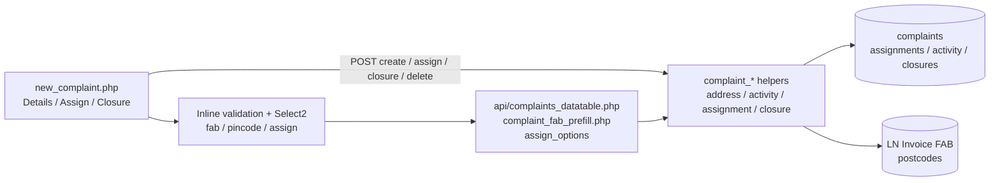
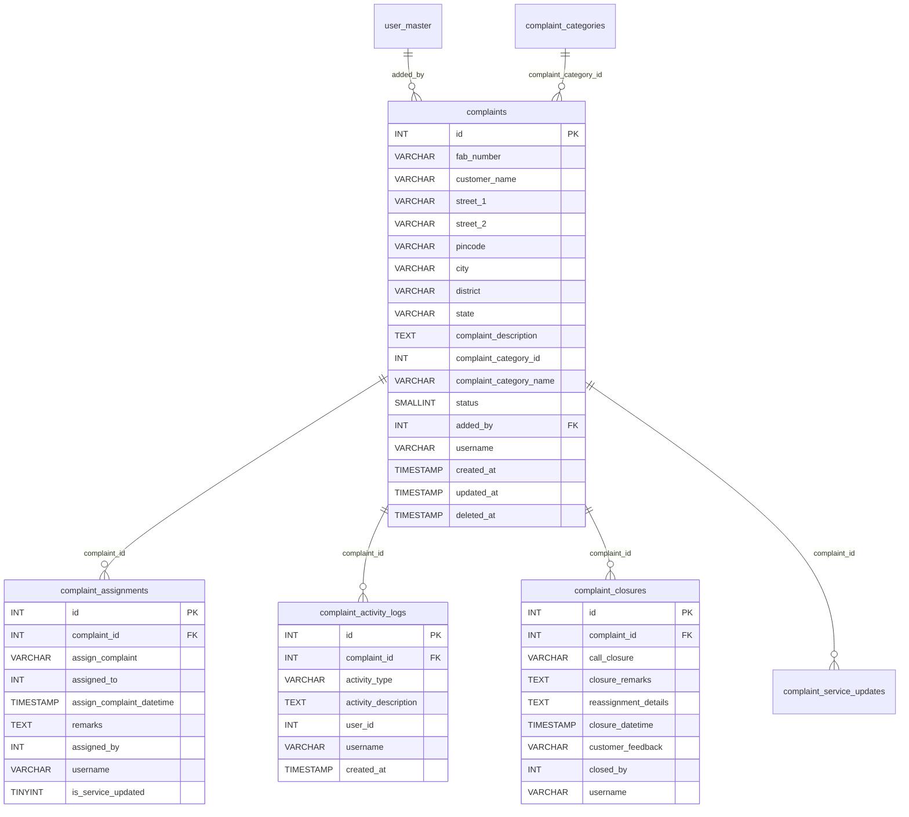
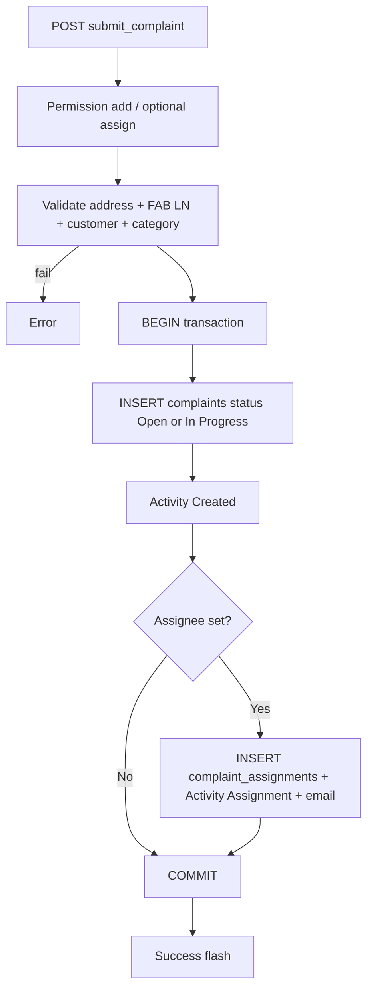
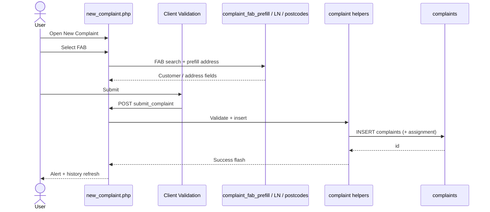
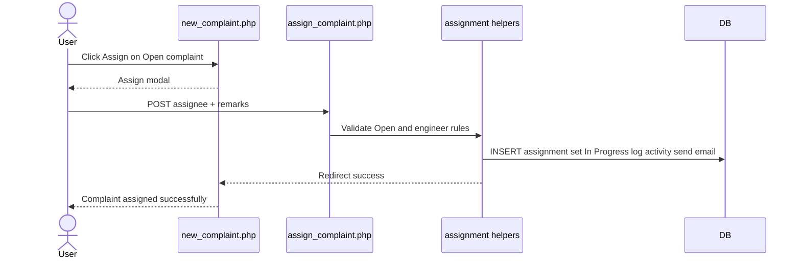
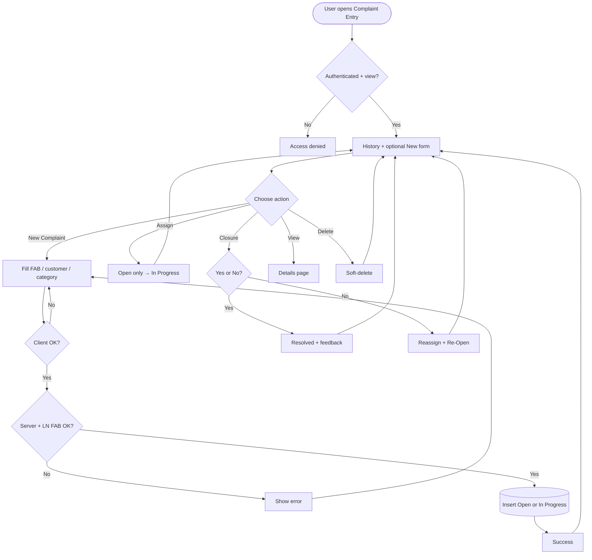
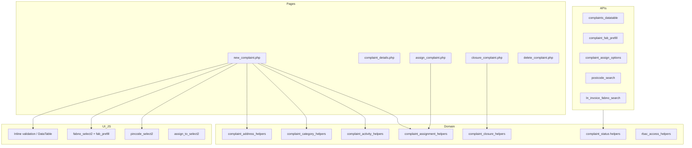

# Low-Level Design (LLD) — Complaint Entry Module

| Attribute | Value |
|-----------|--------|
| Module | Complaint Entry |
| Menu path | SUPPORT → Complaint Entry |
| Application | Complaint / Dealer Portal |
| Stack (target) | Core PHP + MySQL (PDO) |
| Stack (current repo) | Core PHP + **PostgreSQL** via PDO (`pdo_obconn.php`) — schema maps 1:1 to MySQL |
| Document version | 1.0 |
| Related modules | Assigned Complaint List, Service Update, Complaint Categories, RBAC |

> **Boundary:** Complaint Entry (`complaint-entry` / `new_complaint.php`) is **separate** from Assigned Complaint List (`assigned-complaint-list` / `dse_lse_complaint_list.php`) and Service Update. This LLD covers entry create, history listing, assign, closure, and soft-delete on the entry page.

---

## 1. Module Overview

### 1.1 Purpose

Complaint Entry lets authorized users **register a customer complaint** against a Fab Number (must exist in LN invoice data), capture customer/address details, categorize the issue, optionally assign an engineer at create time, and manage the complaint lifecycle from the entry history grid (assign, closure, view, delete).

### 1.2 Scope

| In scope | Out of scope |
|----------|--------------|
| Create complaint (POST on `new_complaint.php`) | Editing core complaint master fields after create |
| Complaint History DataTable + status cards | Assigned Complaint List / Service Update flows (separate module) |
| Manual assign (Open → In Progress) | Complaint attachments |
| Closure (Pending With HO → Resolved / Re-Open) | Installed Base / Service Log CRUD |
| Soft-delete | Hard delete |
| FAB + pincode prefill | Order / dealer fields on create form |

### 1.3 High-level architecture



---

## 2. Functional Requirements

| ID | Requirement | Priority |
|----|-------------|----------|
| FR-01 | Users with `view` can open entry page, history, and details (`from=entry`) | Must |
| FR-02 | Users with `add` can create a complaint | Must |
| FR-03 | FAB must exist in LN invoice data | Must |
| FR-04 | Address required; city/district/state from pincode Select2 | Must |
| FR-05 | Complaint category required from active categories | Must |
| FR-06 | Optional assign at create if user has `assign-complaint` | Must |
| FR-07 | Manual assign from Open complaints | Must |
| FR-08 | Soft-delete with `delete` permission (UI hidden for Resolved) | Must |
| FR-09 | Closure for CCS Admin + `complaint-closure` when Pending With HO and service update exists | Must |
| FR-10 | Closure Yes → Resolved; No → reassign + Re-Open (needs `reassign-complaint`) | Must |
| FR-11 | Listing scoped by role; status cards filter history | Must |
| FR-12 | FAB prefill from prior complaint under scope | Should |
| FR-13 | Activity log for Created / Assignment / Reassignment / Closure / Deleted | Must |
| FR-14 | Assignment / closure emails via helpers | Should |

---

## 3. User Roles & Permissions

### 3.1 RBAC module slug

`complaint-entry`  
Display name: **Complaint Entry**  
Enforced via role permissions (included in modules that enforce role_permissions for System Admin).

### 3.2 Permission matrix

| Permission slug | Capability |
|-----------------|------------|
| `view` | Entry page, history, details |
| `add` | Create complaint; FAB prefill API |
| `delete` | Soft-delete |
| `assign-complaint` | Assign at create / Assign modal |
| `reassign-complaint` | Reassign on Closure = No |
| `complaint-closure` | Closure actions (also requires CCS Admin helper) |

### 3.3 Page / API mapping

| Resource | Module | Permission / gate |
|----------|--------|-------------------|
| `new_complaint.php` | `complaint-entry` | `view` |
| `complaint_details.php` (`from` ≠ `list`) | `complaint-entry` | `view` |
| `delete_complaint.php` | `complaint-entry` | `delete` |
| `api/complaints_datatable.php` | `complaint-entry` | `view` |
| `api/complaint_fab_prefill.php` | `complaint-entry` | `add` |
| `assign_complaint.php` | In-script | `assign-complaint` |
| `closure_complaint.php` | In-script | CCS Admin **and** `complaint-closure` |
| `api/complaint_assign_options.php` | Custom | assign / reassign / closure permission |
| `api/postcode_search.php` | Session | (no module map) |
| `api/ln_invoice_fabno_search.php` | Session | (no module map) |

`complaint_entry_action_permissions()` exposes: `view`, `add`, `delete`, `assign`, `reassign`, `closure`.

### 3.4 After-market / list scope (complaint entry)

| Role class | List / FAB-prefill scope |
|------------|--------------------------|
| System Admin / Management / CCS Admin | All non-deleted complaints |
| Sales Coordinator | Scoped creators / assignees (sales-coordinator helpers) |
| Other | Creator `username` **or** currently assigned to user |

“Added By” column shown for System Admin / Management / CCS Admin only.

---

## 4. Business Rules

| ID | Rule |
|----|------|
| BR-01 | Soft-deleted rows excluded (`deleted_at IS NULL`). |
| BR-02 | Status codes: 1 Open, 2 In Progress, 3 Pending With HO, 4 Re-Open, 5 Resolved. |
| BR-03 | Create without assignee → Open; with assignee → In Progress + `complaint_assignments` row. |
| BR-04 | FAB must exist in LN invoice (`ln_invoice_fabno_exists`). |
| BR-05 | Category must be active in `complaint_categories`. |
| BR-06 | Customer name: alphabetic characters and spaces only. |
| BR-07 | Remarks (assignment) max 500 characters. |
| BR-08 | Dealer creator may assign only to self. |
| BR-09 | Assignee must be an active user in the configured “ELGi Engineer” role filter (role id from helper). |
| BR-10 | Manual assign only when status = Open. |
| BR-11 | Closure only when Pending With HO **and** ≥1 `complaint_service_updates` row. |
| BR-12 | Closure Yes → Resolved + feedback 1–10; Closure No → reassignment + Re-Open. |
| BR-13 | Delete UI hidden for Resolved; soft-delete only. |
| BR-14 | No post-create edit of core complaint fields on entry module. |
| BR-15 | No order_id / dealer_name on create form. |

---

## 5. Database Design

> **Note:** Current production uses **PostgreSQL**. Types below are MySQL-equivalent.

### 5.1 ER diagram



### 5.2 Table: `complaints`

| Column | MySQL type | Null | Default | Description |
|--------|------------|------|---------|-------------|
| `id` | `INT UNSIGNED AUTO_INCREMENT` | NO | — | PK |
| `fab_number` | `VARCHAR(100)` | NO | — | LN FAB |
| `customer_name` | `VARCHAR(255)` | NO | — | |
| `customer_address` | `TEXT` | YES | NULL | Legacy |
| `street_1` | `VARCHAR(255)` | NO | — | |
| `street_2` | `VARCHAR(255)` | YES | NULL | |
| `pincode` | `CHAR(6)` / `VARCHAR(10)` | NO | — | |
| `city` | `VARCHAR(100)` | NO | — | |
| `district` | `VARCHAR(100)` | NO | — | |
| `state` | `VARCHAR(100)` | NO | — | |
| `complaint_description` | `TEXT` | YES | NULL | Client required |
| `complaint_category_id` | `INT UNSIGNED` | YES | NULL | Category FK-ish |
| `complaint_category_name` | `VARCHAR(100)` | YES | NULL | Snapshot |
| `status` | `SMALLINT` | NO | `1` | Lifecycle |
| `added_by` | `INT UNSIGNED` | NO | — | Creator user id |
| `username` | `VARCHAR(100)` | YES | NULL | Creator username |
| `created_at` | `TIMESTAMP` | NO | `CURRENT_TIMESTAMP` | |
| `updated_at` | `TIMESTAMP` | YES | NULL | Closure / updates |
| `deleted_at` | `TIMESTAMP` | YES | NULL | Soft-delete |

**Create INSERT columns:**  
`fab_number`, `customer_name`, `street_1`, `street_2`, `pincode`, `city`, `district`, `state`, `complaint_description`, `complaint_category_id`, `complaint_category_name`, `status`, `added_by`, `username`.

### 5.3 Related tables

| Table | Relationship | Notes |
|-------|--------------|-------|
| `complaint_assignments` | Assignment history | Display name + `assigned_to` |
| `complaint_activity_logs` | Audit trail | Created / Assignment / Reassignment / Closure / Deleted |
| `complaint_closures` | Closure records | Yes/No + feedback / reassignment |
| `complaint_service_updates` | Prerequisite for closure | Written by Assigned List / Service Update |
| `complaint_categories` | Category master | Active options |
| `postcodes` | Pincode lookup | Logical |
| LN invoice (`$dpconn`) | FAB existence | External |

### 5.4 Reference / lookup sources

| Source | Usage |
|--------|--------|
| `api/ln_invoice_fabno_search.php` | FAB Select2 |
| `api/postcode_search.php` → `postcodes` | Pincode → city/district/state |
| `complaint_categories` | Category Select2 |
| `api/complaint_assign_options.php` | Assignee options |
| `api/complaint_fab_prefill.php` | Prior complaint address by FAB |

---

## 6. API / Backend Design

### 6.1 Page endpoints (HTML / form POST)

| Endpoint | Method | Auth | Description |
|----------|--------|------|-------------|
| `new_complaint.php` | GET | `view` | Form + history |
| `new_complaint.php` | POST `submit_complaint` | `add` (+ assign if filled) | Create |
| `complaint_details.php?id=&from=entry` | GET | `view` | Details |
| `assign_complaint.php` | POST | `assign-complaint` | Manual assign |
| `closure_complaint.php` | POST | CCS + `complaint-closure` | Closure / reassign |
| `delete_complaint.php?id=` | GET | `delete` | Soft-delete (base64 id) |

> **Create is not a JSON API** — form POST to `new_complaint.php`.

### 6.2 JSON APIs

#### `POST api/complaints_datatable.php`

Scoped Complaint History DataTables (status filter / search / complaint_id deep-link).

#### `GET api/complaint_fab_prefill.php?fab_number=`

Returns prior complaint customer/address fields under list scope (privileged roles: any FAB history).  
Errors: `Unauthorized.`

#### `GET/POST api/complaint_assign_options.php`

Dynamic assignee options for assign/closure modals.

### 6.3 Supporting lookup APIs

| API | Purpose |
|-----|---------|
| `api/postcode_search.php` | Pincode Select2 |
| `api/ln_invoice_fabno_search.php` | FAB Select2 |

### 6.4 Core PHP module responsibilities

| Module / file | Responsibility |
|---------------|----------------|
| `new_complaint.php` | Create orchestration, UI |
| `includes/complaint_address_helpers.php` | Address from_post / validate |
| `includes/complaint_category_helpers.php` | Category options / resolve |
| `includes/complaint_activity_helpers.php` | Activity insert |
| `includes/complaint_assignment_helpers.php` | Assign rules / insert |
| `includes/complaint_assignment_mail_helpers.php` | Assignment emails |
| `includes/complaint_closure_helpers.php` | Closure rules / persist |
| `includes/complaint_status.php` / cards | Status labels / filters |
| `includes/complaint_datatable_helpers.php` | DataTable parse / search |
| `includes/ln_invoice_helpers.php` | FAB exists / search |
| `includes/rbac_*` | Guards |

---

## 7. Validation Rules

### 7.1 Server-side (create)

| Rule | Error message |
|------|---------------|
| No add permission | `Access denied. You do not have permission to add complaints.` |
| Assign without permission | `Access denied. You do not have permission to assign complaints.` |
| Street 1 / Pincode / City / District / State | Address helper messages (required, lengths, 6-digit pincode) |
| FAB empty | `Fab Number is required.` |
| FAB not in LN | `Selected Fab Number was not found in invoice details.` |
| Customer | `Customer Name is required.` / alphabetic + spaces only |
| Category | `Complaint Category is required.` |
| Remarks | `Remarks cannot exceed 500 characters.` |
| Dealer self-assign | `Selected Dealer User is not allowed for this complaint.` |
| Engineer assignee | `Selected assignee must be an active ELGi Engineer.` |
| Persist | `Failed to submit complaint.` |

**Assign / closure / delete** messages as listed in module inventory (Open-only assign; Pending With HO + service update for closure; etc.).

### 7.2 Client-side

| Area | Script | Notes |
|------|--------|-------|
| Create form | Inline `initComplaintFormValidation` in `new_complaint.php` | Authoritative (not `complaint_form_validation.js`) |
| Fields | FAB, customer, street, pincode, city/district/state, description, category, remarks | Description required on client |
| Assign modal | Inline | Engineer required; remarks ≤ 500 |
| Closure modal | Inline + rating JS | Yes/No, remarks, feedback 1–10, reassign when No |

---

## 8. UI Screen Specifications

### 8.1 Listing — Complaint History (`new_complaint.php`)

| Element | Spec |
|---------|------|
| Status cards | Open / In Progress / Pending With HO / Re-Open / Resolved |
| DataTable | ID, Fab, Customer, Category, Address, optional Added By, Status, Created At, Action |
| Actions | Assign / Closure / View / Delete (permission + status gated) |
| Empty | `No complaints found.` / `No matching complaints found.` |
| Deep-link | `?status_filter=` / `?complaint_id=` |

### 8.2 Form panel — New Complaint

**Section 1 — Customer Information**  
Fab Number* (Select2), Customer Name*, Street 1*, Street 2, Pincode* (Select2), City/District/State* (readonly auto)

**Section 2 — Complaint Details**  
Complaint Category* (static Select2), Complaint Description*

**Section 3 — Assignment** (if `assign-complaint`)  
Assign To (Select2), Remarks

Buttons: New Complaint / Cancel · **Submit Complaint**

### 8.3 Details — `complaint_details.php?from=entry`

Read-only complaint + activity / assignment / closure / service-update sections as applicable. Back to entry.

### 8.4 Modals (from listing)

| Modal | Purpose |
|-------|---------|
| Assign | Open complaints → engineer + remarks |
| Closure | Pending With HO → Yes (resolve + feedback) / No (reassign) |

---

## 9. Database Flow

### 9.1 Create



### 9.2 Soft-delete

```sql
-- Activity Deleted then:
UPDATE complaints
SET deleted_at = CURRENT_TIMESTAMP
WHERE id = :id AND deleted_at IS NULL;
```

Confirm: `Delete this complaint?`

### 9.3 List query pattern

```sql
SELECT ... FROM complaints c
WHERE /* complaint_entry_list_scope: deleted_at IS NULL [AND username/assignee ...] */
  AND /* optional status_filter / search */
ORDER BY {col} {ASC|DESC}
LIMIT :limit OFFSET :offset;
```

---

## 10. Sequence Diagram

### 10.1 Create complaint (optionally assigned)



### 10.2 Assign from Complaint History



---

## 11. Activity Diagram



---

## 12. Class / Module Diagram



### 12.1 Key functions

| Function / area | Role |
|-----------------|------|
| Address helpers | Parse/validate street/pincode/city |
| Category helpers | Active options + name snapshot |
| Activity helpers | Insert Created / Assignment / Closure / Deleted |
| Assignment helpers | Insert assignment, dealer/engineer rules |
| Closure helpers | Yes/No close, reassign, eligibility |
| Status helpers | Labels, cards, filters |
| `complaint_entry_action_permissions()` | UI action flags |
| `complaint_entry_list_scope()` | List / prefill ACL |
| LN invoice helpers | FAB exists / search |

---

## 13. Folder Structure

```text
ComplaintManagement/
├── new_complaint.php
├── complaint_details.php
├── assign_complaint.php
├── closure_complaint.php
├── delete_complaint.php
├── api/
│   ├── complaints_datatable.php
│   ├── complaint_fab_prefill.php
│   ├── complaint_assign_options.php
│   ├── postcode_search.php
│   └── ln_invoice_fabno_search.php
├── includes/
│   ├── complaint_address_helpers.php
│   ├── complaint_category_helpers.php
│   ├── complaint_activity_helpers.php
│   ├── complaint_assignment_helpers.php
│   ├── complaint_assignment_mail_helpers.php
│   ├── complaint_closure_helpers.php
│   ├── complaint_status.php
│   ├── complaint_status_cards.php
│   ├── complaint_datatable_helpers.php
│   ├── ln_invoice_helpers.php
│   └── rbac_*.php
├── js/
│   ├── complaint_fab_prefill.js
│   ├── fabno_select2.js
│   ├── pincode_select2.js
│   ├── assign_to_select2.js
│   ├── static_select2.js
│   └── closure_customer_feedback_rating.js
├── css/
│   ├── new_complaint.css
│   ├── complaint_form.css
│   ├── complaint_buttons.css
│   └── complaint_status_cards.css
└── docs/
    └── LLD_Complaint_Entry_Module.md
```

---

## 14. Error Handling

| Layer | Pattern |
|-------|---------|
| Page POST | `$error_message` / `$success_message` |
| Redirect flows | `$_SESSION['success_message']` / `error_message` |
| JSON APIs | `401` / `403` + `{"error":"..."}` |
| Client | validate.js messages on form/modals |

### 14.1 Common messages

| Message | When |
|---------|------|
| `Access denied. You do not have permission to add complaints.` | Create without `add` |
| `Access denied. You do not have permission to assign complaints.` | Assign without permission |
| `Selected Fab Number was not found in invoice details.` | LN miss |
| `Complaint not found.` / `... or already deleted.` | Missing target |
| `Manual assign is only allowed for open complaints.` | Wrong status |
| `Closure is only allowed for complaints pending with HO.` | Wrong status |
| `Service update is required before complaint closure.` | Prerequisite |
| `Access denied. Complaint closure is available to CCS Admin users with the required permission only.` | Closure gate |
| `Failed to submit complaint.` / `Failed to assign complaint.` / `Failed to save complaint closure.` / `Failed to delete complaint.` | Persist failures |

---

## 15. Security Considerations

| Area | Control |
|------|---------|
| SQL Injection | PDO prepared statements |
| XSS | Escaped output on listing/details |
| CSRF | Session POST; **recommend** CSRF tokens |
| Authentication | Portal session |
| Authorization | RBAC + list scope + status gates |
| IDOR | Details/delete/assign scoped; base64 IDs obfuscation only |
| Soft-delete | Filter `deleted_at IS NULL` |
| FAB integrity | Must exist in LN invoice source |

---

## 16. Audit Logs

### 16.1 Built-in field-level audit

| Entity | Fields |
|--------|--------|
| `complaints` | `added_by`, `username`, `created_at`, `updated_at`, `deleted_at` |
| `complaint_assignments` | `assigned_by`, `username`, `created_at` |
| `complaint_activity_logs` | `user_id`, `username`, `activity_type`, `activity_description`, `created_at` |
| `complaint_closures` | `closed_by`, `username`, `created_at`, `closure_datetime` |

Activity types: `Created`, `Assignment`, `Reassignment`, `Closure`, `Deleted`.

No separate generic audit table beyond activity logs.

---

## 17. Test Cases

### 17.1 Functional

| ID | Scenario | Expected |
|----|----------|----------|
| TC-01 | User with `view` opens entry | History loads under scope |
| TC-02 | Create without assign | Open; success “submitted” |
| TC-03 | Create with assign | In Progress + assignment row + email |
| TC-04 | FAB not in LN | Invoice not found error |
| TC-05 | Invalid customer name / pincode | Validation errors |
| TC-06 | Missing category | Validation error |
| TC-07 | FAB prefill | Address fields populated |
| TC-08 | Pincode select | City/district/state auto-fill |
| TC-09 | Assign Open complaint | In Progress |
| TC-10 | Assign non-Open | Rejected |
| TC-11 | Closure without service update | Rejected |
| TC-12 | Closure Yes | Resolved + feedback |
| TC-13 | Closure No | Re-Open + reassignment |
| TC-14 | Soft-delete | `deleted_at` set; gone from list |
| TC-15 | Delete Resolved | Action hidden / blocked |
| TC-16 | Status card filter | Filtered DataTable |
| TC-17 | Dealer self-assign only | Other assignees rejected |
| TC-18 | Non-privileged list | Sees own / assigned only |

---

## 18. Assumptions & Dependencies

### 18.1 Assumptions

1. Users authenticate via portal session (`user_master`).
2. RBAC permissions for `complaint-entry` are seeded for applicable roles.
3. LN invoice FAB master is available via `$dpconn` helpers.
4. `postcodes` and `complaint_categories` are maintained.
5. Service Update (Assigned List) produces `complaint_service_updates` before closure.
6. Document target stack is Core PHP + MySQL; **repo currently runs PostgreSQL**.

### 18.2 Dependencies

| Dependency | Purpose |
|------------|---------|
| PHP PDO + MySQL (or PostgreSQL) | Persistence |
| Session + RBAC | AuthZ |
| LN invoice helpers / dealerportal | FAB validation |
| `postcodes` | Address autofill |
| Complaint categories master | Category Select2 |
| Mail helpers | Assignment / closure notifications |
| jQuery + Select2 + DataTables + Bootstrap + validate.js | UI |
| Assigned Complaint List / Service Update | Closure prerequisite |

---

## Appendix A — Success flash query flags

| Event | Message |
|-------|---------|
| Create unassigned | Complaint submitted successfully. |
| Create + assign | Complaint submitted and assigned successfully. |
| Assign | Complaint assigned successfully. |
| Closure Yes | Complaint closed successfully. |
| Closure No | Complaint closed with No. Reassigned successfully. |
| Delete | Complaint deleted successfully. |

(No dedicated query-string flags on create; session / in-page flashes used. Success alerts fade ~3s.)

---

## Appendix B — Select2 control map

| Control | Init | API / mode |
|---------|------|------------|
| Fab Number | `initFabnoSelect2` | `api/ln_invoice_fabno_search.php` (+ `complaint_fab_prefill.js`) |
| Pincode | `initPincodeSelect2` | `api/postcode_search.php` |
| Complaint Category | `initStaticSelect2` | Static active categories |
| Assign To | `initAssignToSelect2` | Static / `api/complaint_assign_options.php` |

---

*End of LLD — Complaint Entry Module*
