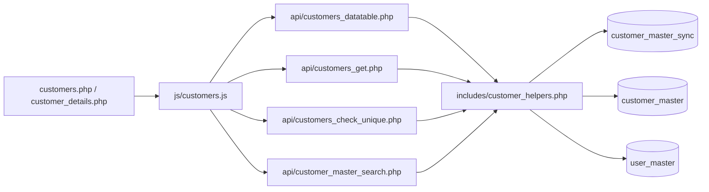

# Low-Level Design (LLD) — Customer Master Sync Module

| Attribute | Value |
|-----------|--------|
| Module | Customer Master Sync |
| Menu path | ADMINISTRATION → SYSTEM CONFIGURATION → Customer Master Sync |
| Landing page | `customers.php` |
| Application | Complaint Management Portal |
| Stack | Core PHP + PostgreSQL (PDO) |
| Document version | 1.0 |
| Access | System Admin only (`require_system_admin`) |

---

## **1. Module Overview**

### 1.1 Purpose

The Customer Master Sync module allows admins to maintain a controlled list of customer codes in `customer_master_sync`. Codes are selected from `customer_master`, and customer name is auto-resolved/read-only for display.

### 1.2 Scope

- Add, edit, list, view, soft-delete sync records
- Validate selected customer code exists in source master
- Ensure unique active customer code in sync table
- Reset assigned users (`user_master.customer_code`) when sync code is deleted or changed

---

## **2. Functional Requirements**

- FR-01: Admin can view paginated/searchable sync list
- FR-02: Admin can add a sync entry by selecting customer code
- FR-03: Customer name auto-populates from selected code and is read-only
- FR-04: Admin can edit selected customer code
- FR-05: Admin can view sync record details
- FR-06: Admin can soft-delete sync records
- FR-07: On delete, assigned users must be unassigned (`customer_code = NULL`)
- FR-08: On code change during edit, users mapped to old code must be unassigned

---

## **3. User Roles & Access**

- Only System Admin can access:
  - `customers.php`
  - `customer_details.php`
  - `delete_customer.php`
  - related customer APIs
- API access is guarded through `admin_api_require_system_admin($obconn)`.

---

## **4. Business Rules**

- BR-01: `customer_code` is required.
- BR-02: `customer_code` max length is 9.
- BR-03: `customer_code` must exist in `customer_master.cuno`.
- BR-04: Active uniqueness in sync table is case/trim-insensitive.
- BR-05: Delete is soft delete (`deleted_at` set).
- BR-06: When a sync code is removed or replaced, users with that old code are reset to `NULL`.

---

## **5. Database Design**

### 5.1 Sync table

- Table: `customer_master_sync`
- Fields:
  - `id` (PK, serial)
  - `customer_code` (varchar(9), required)
  - `added_by` (varchar(100), nullable)
  - `updated_by` (varchar(100), nullable)
  - `created_at` (timestamp)
  - `updated_at` (timestamp, nullable)
  - `deleted_at` (timestamp, nullable)

### 5.2 Constraints

- Unique index on active rows:
  - `LOWER(TRIM(customer_code)) WHERE deleted_at IS NULL`

### 5.3 Reference source

- Source customer list is read from `customer_master`:
  - `cuno` (code)
  - `cuname` (name)

---

## **6. Component Architecture**

---

## **7. Page-Level Flow**

### 7.1 List + form page (`customers.php`)

- Shows flash/success/error messages
- Contains Add/Edit form panel
- Contains DataTable list
- Performs server-side add/update on POST

### 7.2 Details page (`customer_details.php`)

- Decodes id from base64 query param
- Loads active sync record by id
- Shows code/name and audit fields

### 7.3 Delete page (`delete_customer.php`)

- Validates record exists and active
- Calls helper soft-delete flow
- Redirects with flash message

---

## **8. API Design**

- `api/customers_datatable.php`
  - server-side pagination, order, search
  - joins `customer_master` for name display
- `api/customers_get.php`
  - returns record for edit modal/panel
- `api/customers_check_unique.php`
  - validates duplicate active code
- `api/customer_master_search.php`
  - Select2 source for customer code (`customer_master`)

---

## **9. Validation**

### 9.1 Client-side (`js/customers.js`)

- `validate.js` enforces required `customer_code`
- async uniqueness call before submit
- Select2 invalid state styling

### 9.2 Server-side (`includes/customer_helpers.php`, `customers.php`)

- required and length checks
- code existence check in `customer_master`
- uniqueness check in `customer_master_sync`

---

## **10. Search, Pagination, Sorting**

- Implemented using DataTables server-side mode
- Uses helper `dt_parse_request(...)`
- Search filters on:
  - sync code
  - resolved customer name

---

## **11. Soft Delete & User Unassignment**

When deleting a sync record:

1. Load sync record and capture its `customer_code`
2. Soft-delete sync row
3. Update `user_master` and set `customer_code = NULL` for users assigned to that code
4. Commit transaction

Same reset logic runs on update when old code changes to a new code.

---

## **12. Transaction Handling**

- `customer_soft_delete(...)` uses transaction:
  - update sync table
  - clear user assignments
- `customer_update(...)` uses transaction:
  - update sync row
  - clear old-code user assignments when code changed

---

## **13. Security Considerations**

- System Admin gate on pages and APIs
- Parameterized SQL everywhere (PDO prepared statements)
- Output escaping via `htmlspecialchars(...)`
- ID obfuscation in details/delete links via base64

---

## **14. Error Handling**

- Invalid id/code -> friendly error message
- Missing/deleted record -> guarded and redirected
- DB exceptions -> generic failure messages
- API errors return JSON with proper HTTP codes/messages

---

## **15. Integration with User Management**

User module uses sync table as source for Customer Code assignment:

- `api/user_customer_search.php` uses `user_customer_code_search(...)`
- helper reads from `customer_master_sync` (active only)
- display names may still resolve via `customer_master` join for label text

---

## **16. Key Files**

- `customers.php`
- `customer_details.php`
- `delete_customer.php`
- `includes/customer_helpers.php`
- `js/customers.js`
- `api/customers_datatable.php`
- `api/customers_get.php`
- `api/customers_check_unique.php`
- `api/customer_master_search.php`
- `sql/create_customer_master_sync.sql`

---

## **17. Test Scenarios**

- Add new sync record with valid code
- Prevent duplicate active code
- Edit code and verify old code users are unassigned
- Delete code and verify assigned users are unassigned
- Verify list pagination/search/sort
- Verify details page for valid/invalid id
- Verify non-admin access denied

---

## **18. Future Enhancements**

- Add audit trail table for before/after sync changes
- Add bulk sync upload from source master
- Add “active assignment count” in list view before delete

