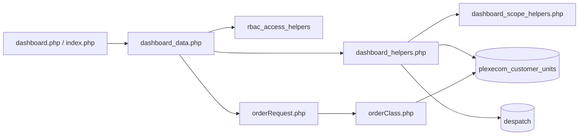
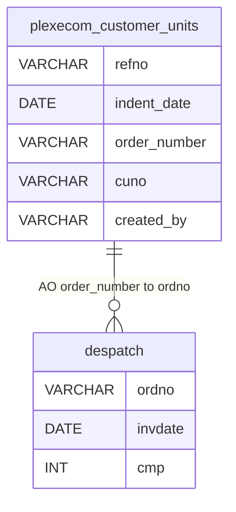
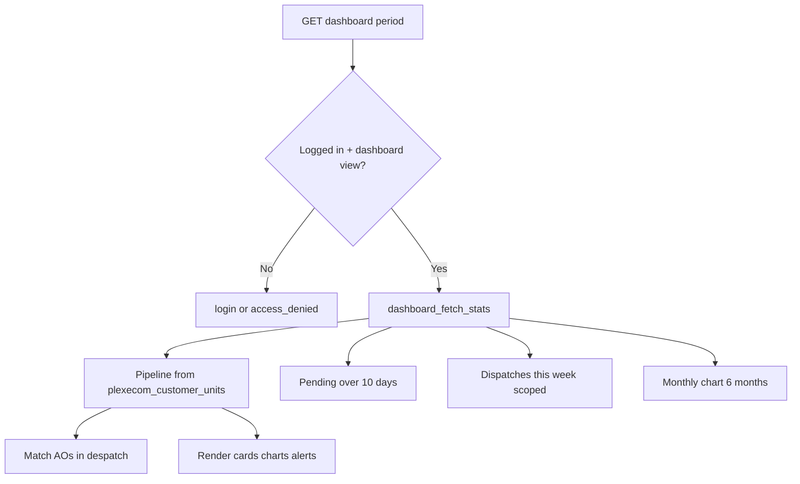
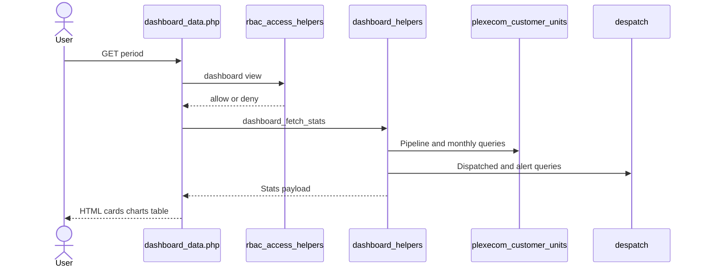
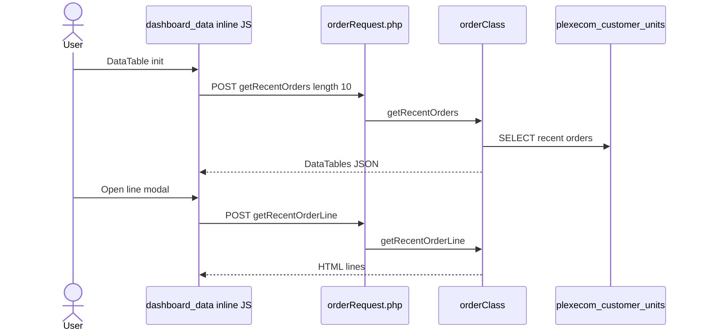
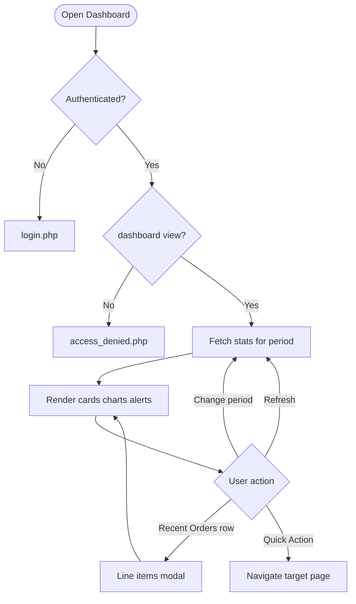
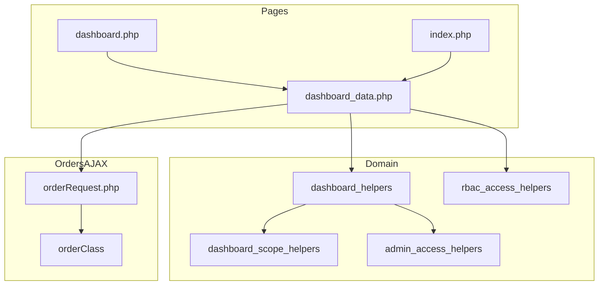

# Low-Level Design (LLD) — Dashboard Module

| Attribute | Value |
|-----------|--------|
| Module | Dashboard (Dealer / Order Overview Home) |
| Menu path | OVERVIEW → Dashboard |
| Landing pages | `dashboard.php`, `index.php` (same body) |
| Application | Complaint / Dealer Portal |
| Stack (target) | Core PHP + MySQL (PDO) |
| Stack (current repo) | Core PHP + **PostgreSQL** via PDO (`$obconn`, `$dpconn`) |
| Document version | 1.0 |
| Access | RBAC module slug **`dashboard`** / permission **`view`** |

---

## **1. Module Overview**

### 1.1 Purpose

The Dashboard is the post-login home page. It presents **order-booking KPIs** for a selected date period: pipeline counts (Created / Acknowledged / Pending / Dispatched), alerts, Chart.js summaries, a Recent Orders DataTable preview, and Quick Actions (New Order, Pending Orders, File Complaint). It does **not** show complaint or after-market KPI widgets.

### 1.2 Scope

| In scope | Out of scope |
|----------|--------------|
| Period filter + Refresh | Complaint / IB / Service Log / Spare Parts KPIs |
| Pipeline + stat cards + alerts | Full Recent Orders / Pending Orders CRUD pages |
| Monthly bar + status doughnut charts | Select2 on this page |
| Recent Orders preview (10 rows) + line modal | Dedicated `api/*dashboard*` JSON KPI API |
| Quick Actions (permission-gated links) | Outstanding Balance card (UI hidden placeholder) |

### 1.3 High-level architecture



---

## **2. Functional Requirements**

| ID | Requirement | Priority |
|----|-------------|----------|
| FR-01 | Authenticated user with `dashboard`/`view` can open Dashboard | Must |
| FR-02 | Filter KPIs by period (Today … Last Year); default This Month | Must |
| FR-03 | Show pipeline counts: Created, Acknowledged, Pending, Dispatched | Must |
| FR-04 | Show Total / Pending / Dispatched summary cards | Must |
| FR-05 | Alerts: pending > 10 days; dispatches delivered this week | Should |
| FR-06 | Monthly Orders bar chart (last 6 months) | Should |
| FR-07 | Status Distribution doughnut chart | Should |
| FR-08 | Recent Orders preview DataTable (10 rows) when permitted | Must |
| FR-09 | Line-items modal for a recent order | Should |
| FR-10 | Quick Actions: New Order, Pending Orders, File Complaint | Should |
| FR-11 | Scope data by role / customer / SC assignments | Must |
| FR-12 | `index.php` and `dashboard.php` share the same dashboard body | Must |

---

## **3. User Roles & Permissions**

### 3.1 RBAC module slug

| Resource | Module | Permission |
|----------|--------|------------|
| `dashboard.php`, `index.php` | `dashboard` | `view` |

Gate: `rbac_user_can($conn, 'dashboard', 'view')` inside `dashboard_data.php`. Denied → `access_denied.php`. Unauthenticated → `login.php`.

System Admin does **not** auto-bypass this module (`dashboard` is in `rbac_modules_enforcing_role_permissions()`); grants come from `role_permissions`.

### 3.2 Related module permissions (widgets / links)

| UI capability | Module slug | Permission |
|---------------|-------------|------------|
| New Order / Created | `order-booking` | `create-order` |
| Recent Orders table / Total | `recent-orders` | `list` |
| Acknowledged | `order-acknowledgement` | `list` |
| Pending Orders | `pending-order` | `list` |
| Dispatched | `despatch-details` | `list` |
| File Complaint | `complaint-entry` | `view` |

Resolved via `dashboard_order_module_permissions()`.

### 3.3 Data scoping (runtime)

| Source | Behavior |
|--------|----------|
| Active pipeline / monthly chart | See-all if System Admin or Management; else filter `cuno = $_SESSION['customer_number_vayu']` (empty customer → zeros) |
| `dashboard_resolve_view_scope` | `all` (System Admin / CCS Admin), `assigned` (Sales Coordinator), `self` (Management / Dealers / Engineers), `none` |
| Despatch “this week” alert | Uses view-scope helpers |
| Added By column | System Admin / Management / CCS Admin |

**Known inconsistency:** Management is see-all in active pipeline queries but `self` in `dashboard_resolve_view_scope`. CCS Admin is `all` in scope helpers but not in pipeline see-all (customer-scoped unless session customer set).

### 3.4 UI gate note

Many per-widget `if ($can…)` checks in `dashboard_data.php` are **commented out**. Once order cards show, most KPI pieces render even if finer-grained module permissions are missing. Quick Action links still respect individual flags where active.

---

## **4. Business Rules**

| ID | Rule |
|----|------|
| BR-01 | Default period = `this_month`; unknown `?period=` falls back to `this_month`. |
| BR-02 | Pipeline source = distinct recent rows from `plexecom_customer_units` filtered by `indent_date` period. |
| BR-03 | **Created / Total** = row count for period. |
| BR-04 | **Acknowledged** = non-empty `order_number` (AO). |
| BR-05 | **Pending** = empty `order_number`. |
| BR-06 | **Dispatched** = acknowledged AOs present in `despatch` (`cmp != 600`, trimmed `ordno` match). |
| BR-07 | Pending > 10 days = AO-empty rows with `indent_date` older than 10 days. |
| BR-08 | “Dispatches delivered this week” uses period `this_week` on despatch `invdate` with view scope. |
| BR-09 | Monthly chart always covers last **6 months** (not the period dropdown). |
| BR-10 | Recent Orders preview: `start=0`, `length=10`, search/paging/sort UI disabled. |
| BR-11 | Outstanding Balance card is hidden (`d-none`) with placeholder value. |
| BR-12 | Chart payloads embedded as JSON with `JSON_HEX_*` + htmlspecialchars for XSS hardening. |
| BR-13 | Helper exceptions swallowed → counts return `0` (silent failure). |
| BR-14 | No session flash success/error for KPIs; alerts are computed copy only. |
| BR-15 | Post-login / SSO / remember-me land on `index.php` (same dashboard body). |

---

## **5. Database Design**

### 5.1 Logical ER (KPI sources)



### 5.2 Tables used

| Table | Connection | Usage |
|-------|------------|-------|
| `plexecom_customer_units` | `$obconn` | Pipeline KPIs, monthly chart, pending > 10 days, Recent Orders |
| `despatch` | `$dpconn` | Dispatched count; delivered-this-week alert |
| `lr_details` / `dpst_master` | `$dpconn` | Despatch alert joins (as implemented) |
| Lookup masters | `$obconn` | Recent Orders joins (delivery term, category, payterm, transporter) |
| `user_master` | `$obconn` | Optional Added By |

### 5.3 Period SQL patterns (`dashboard_period_date_sql`)

| Period key | Predicate idea |
|------------|----------------|
| `today` | `date = CURRENT_DATE` |
| `this_week` | From week trunc through today |
| `this_month` | Same calendar month |
| `last_3_months` / `last_6_months` | Rolling intervals |
| `this_year` / `last_year` | Year trunc |

### 5.4 Reference sources

| Source | Usage |
|--------|--------|
| `dashboard_period_options()` | Period dropdown |
| `dashboard_order_module_permissions()` | Widget / link flags |
| `dashboard_resolve_view_scope()` | Despatch/alert scoping |
| `$_SESSION['customer_number_vayu']` | Dealer customer filter |

---

## **6. API / Backend Design**

### 6.1 Page endpoints

| Endpoint | Method | Auth | Description |
|----------|--------|------|-------------|
| `dashboard.php` | GET `?period=` | `dashboard`/`view` | Dashboard shell |
| `index.php` | GET `?period=` | `dashboard`/`view` | Same body (login landing) |

KPIs are **server-rendered** on page load via `dashboard_fetch_stats()` — no dedicated dashboard JSON KPI API.

### 6.2 AJAX endpoints (shared order module)

| Endpoint | Action | Description |
|----------|--------|-------------|
| `POST orderRequest.php` | `getRecentOrders` | DataTables server-side for Recent Orders |
| `POST orderRequest.php` | `getRecentOrderLine` | HTML modal body for line items (`orderNo`) |

Implemented in `orderClass::getRecentOrders()` / `getRecentOrderLine()`.

### 6.3 Supporting lookup APIs

N/A for Dashboard KPIs (period options + stats in PHP).

### 6.4 Core PHP responsibilities

| File | Role |
|------|------|
| `dashboard.php` / `index.php` | HTML shell + security headers |
| `dashboard_data.php` | Auth, RBAC, render KPIs/charts/table/actions |
| `includes/dashboard_helpers.php` | Period, stats, charts, alerts, permissions map |
| `includes/dashboard_scope_helpers.php` | Role view-scope SQL helpers |
| `includes/rbac_access_helpers.php` | Page/menu AuthZ |
| `orderRequest.php` + `orderClass.php` | Recent Orders AJAX |

---

## **7. Validation Rules**

### 7.1 Server-side

| Field / rule | Behavior |
|--------------|----------|
| Session user | Empty `usr_name` → redirect `login.php` |
| Idle / `session_version` | Enforced before content |
| `dashboard`/`view` | Fail → `access_denied.php` |
| `period` query | Whitelist via `dashboard_resolve_period`; else `this_month` |
| Recent Orders AJAX | Relies on `orderRequest` / `orderClass` (no dedicated dashboard validator) |

### 7.2 Client-side

- Period change: set `period`, clear `month`, navigate (full reload)
- Refresh: full page reload
- No validate.js form on Dashboard
- Chart data read from JSON script tags

---

## **8. UI Screen Specifications**

### 8.1 Main surface — `dashboard_data.php`

| Element | Spec |
|---------|------|
| Title | Dealer Dashboard |
| Period filter | Today, This Week, This Month, Last 3/6 Month, This Year, Last Year |
| Refresh | Reload current URL |
| Alerts | Orange pending > 10 days; green dispatches this week |
| Stat cards | Total Orders, Pending Orders, Dispatched This Month; Outstanding Balance hidden |
| Order Pipeline | Created / Acknowledged / Pending / Dispatched |
| Monthly Orders | Chart.js bar (Acknowledged + Pending) |
| Status Distribution | Chart.js doughnut |
| Recent Orders | DataTable preview + link to `recent_orders.php` |
| Quick Actions | New Order, Pending Orders, File Complaint |
| Modal | Order line items |

### 8.2 Libraries

| Library | Usage |
|---------|--------|
| Chart.js | Bar + doughnut |
| DataTables 1.13.8 | `#orderTable` serverSide |
| jQuery / Bootstrap 5 | AJAX modal + layout |
| Select2 | Loaded globally; **not used** on Dashboard |

### 8.3 Modals

Recent order line-items modal filled by `getRecentOrderLine`.

---

## **9. Database Flow**

### 9.1 KPI load



### 9.2 Pipeline count pattern (conceptual)

```sql
-- Distinct recent units in period (simplified)
SELECT DISTINCT ON (refno) *
FROM plexecom_customer_units
WHERE /* period on indent_date */
  AND /* optional cuno = :customer */
ORDER BY refno, /* latest */;
-- Created = count(*)
-- Acknowledged = order_number not empty
-- Pending = order_number empty
-- Dispatched = AO in despatch where cmp <> 600
```

---

## **10. Sequence Diagram**

### 10.1 Page load



### 10.2 Recent Orders AJAX



---

## **11. Activity Diagram**



---

## **12. Class / Module Diagram**



### 12.1 Key functions

| Function | Role |
|----------|------|
| `dashboard_order_module_permissions` | Widget / link RBAC flags |
| `dashboard_period_options` / `dashboard_resolve_period` / `dashboard_period_date_sql` | Period whitelist + SQL |
| `dashboard_fetch_stats` | Orchestrate KPI payload |
| `dashboard_fetch_recent_order_pipeline_stats` | Created/ack/pending/dispatched |
| `dashboard_count_recent_orders_with_invoice` | Dispatched via despatch AO match |
| `dashboard_fetch_pending_over_10_days_count` | Alert count |
| `dashboard_fetch_monthly_chart_data` | 6-month series |
| `dashboard_fetch_dispatched_count` | Scoped despatch alert |
| `dashboard_format_*_alert` | Alert copy |
| `dashboard_resolve_view_scope` / `dashboard_bind_*` | Role SQL scope |
| `orderClass::getRecentOrders` / `getRecentOrderLine` | Table + modal |

---

## **13. Folder Structure**

```text
ComplaintManagement/
├── dashboard.php
├── index.php
├── dashboard_data.php
├── orderRequest.php
├── orderClass.php
├── access_denied.php
├── includes/
│   ├── dashboard_helpers.php
│   ├── dashboard_scope_helpers.php
│   ├── rbac_access_helpers.php
│   ├── admin_access_helpers.php
│   └── security_headers_helpers.php
├── css/
│   ├── stats.css
│   ├── pipeline.css
│   ├── chart.css
│   └── orderbook_style.css
├── header_css.php
├── script_js.php
├── sidebar.php
└── docs/
    └── LLD_Dashboard_Module.md
```

---

## **14. Error Handling**

| Layer | Pattern |
|-------|---------|
| Unauthenticated | Redirect `login.php` |
| No `dashboard`/`view` | `access_denied.php` |
| KPI query failure | Catch in helpers → return `0` / empty series |
| Recent Orders AJAX | Handled by `orderRequest` / `orderClass` JSON/HTML |
| `rePushOrder()` | Client `alert('Coming Soon')` only |

### 14.1 User-visible messages

| Message / UI | When |
|--------------|------|
| Pending > 10 days alert | Count > 0 |
| Dispatches delivered this week | Count > 0 |
| Access denied page | Missing `dashboard`/`view` |
| Coming Soon | Re-push action stub |

No create/update flash messages on Dashboard itself.

---

## **15. Security Considerations**

| Area | Control |
|------|---------|
| Page AuthZ | RBAC `dashboard`/`view` + login + idle + `session_version` |
| XSS | Chart JSON escaped (`JSON_HEX_*` / htmlspecialchars) |
| SQL | Prepared / bound customer and scope params in helpers |
| KPI over-show | Many per-card permission `if`s commented out |
| AJAX AuthZ gap | `orderRequest.php` lacks explicit `recent-orders` RBAC check |
| Tenant risk | `orderClass` may default `customer_code` to `'10001'` if session customer missing |
| Silent failures | Exceptions → zero counts (masks DB/config issues) |
| Headers | `security_send_http_headers()` on shell pages |

---

## **16. Audit Logs**

### 16.1 Built-in field-level audit

| Item | Behavior |
|------|----------|
| Dashboard read audit table | **Not implemented** |
| KPI change history | N/A (read-only surface) |
| Underlying order/despatch audit | Owned by Order Booking / Despatch modules |

Dashboard is a **read aggregation** UI; it does not write business tables.

---

## **17. Test Cases**

### 17.1 Functional

| ID | Scenario | Expected |
|----|----------|----------|
| TC-01 | Guest opens `dashboard.php` | Redirect login |
| TC-02 | User without `dashboard`/`view` | `access_denied.php` |
| TC-03 | User with view opens page | KPIs render for default This Month |
| TC-04 | Change period to Last Year | Counts/charts reload for that period |
| TC-05 | Invalid `?period=foo` | Falls back to This Month |
| TC-06 | Dealer with customer code | Pipeline scoped to `cuno` |
| TC-07 | Dealer without customer code | Pipeline zeros |
| TC-08 | System Admin / Management | See-all pipeline data |
| TC-09 | Pending AO empty > 10 days | Orange alert shows count |
| TC-10 | User with `recent-orders`/`list` | Recent Orders table loads 10 rows |
| TC-11 | Open line modal | Line HTML from `getRecentOrderLine` |
| TC-12 | Quick Action File Complaint without perm | Link hidden / not actionable |
| TC-13 | Login success | Lands on `index.php` dashboard |
| TC-14 | Outstanding Balance card | Not visible (`d-none`) |

---

## **18. Assumptions & Dependencies**

### 18.1 Assumptions

1. `dashboard`/`view` is assigned to roles that should see the home page.
2. Order pipeline truth is `plexecom_customer_units` + `despatch` AO matching.
3. `index.php` and `dashboard.php` remain equivalent shells over `dashboard_data.php`.
4. Complaint and after-market analytics are intentionally out of scope for this page.
5. Document target stack Core PHP + MySQL; repo runs PostgreSQL date functions (`DATE_TRUNC`, `INTERVAL`).
6. Commented per-widget RBAC gates may be re-enabled later; document current behavior (mostly ungated once cards show).

### 18.2 Dependencies

| Dependency | Purpose |
|------------|---------|
| RBAC / Assign Permissions | `dashboard`/`view` and related module grants |
| Order Booking data (`plexecom_customer_units`) | Pipeline + charts + Recent Orders |
| Despatch DB (`despatch`) | Dispatched KPIs / alerts |
| `orderClass` / `orderRequest` | Recent Orders AJAX |
| Chart.js + DataTables + jQuery | Visualization + preview table |
| Session `customer_number_vayu` / role helpers | Data scoping |

---

## Appendix A — Period keys

| Key | Label |
|-----|-------|
| `today` | Today |
| `this_week` | This Week |
| `this_month` | This Month (default) |
| `last_3_months` | Last 3 Month |
| `last_6_months` | Last 6 Month |
| `this_year` | This Year |
| `last_year` | Last Year |

---

## Appendix B — Select2 control map

**N/A.** Period control is a native select / navigation pattern; Select2 is not used on Dashboard.

---

## Appendix C — Pipeline definition matrix

| Metric | Definition |
|--------|------------|
| Created / Total | Count of period units rows |
| Acknowledged | `order_number` non-empty |
| Pending | `order_number` empty |
| Dispatched | AO found in `despatch` (`cmp != 600`) |

---

## Appendix D — Post-login landing

| Entry | Target |
|-------|--------|
| Password login | `index.php` |
| Remember-me | `index.php` |
| SSO (`dashboard_path`) | `index.php` |
| Sidebar Dashboard | `dashboard.php` |

Both shells include `dashboard_data.php`.

---

*End of LLD — Dashboard Module*
