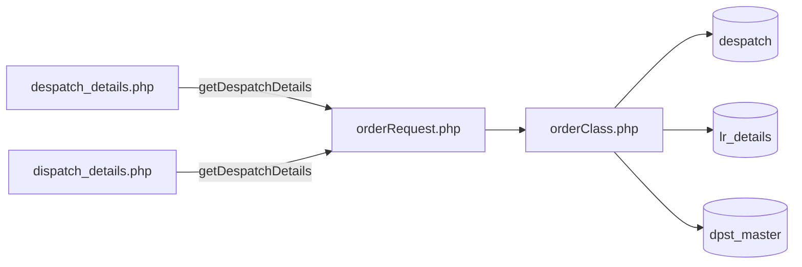
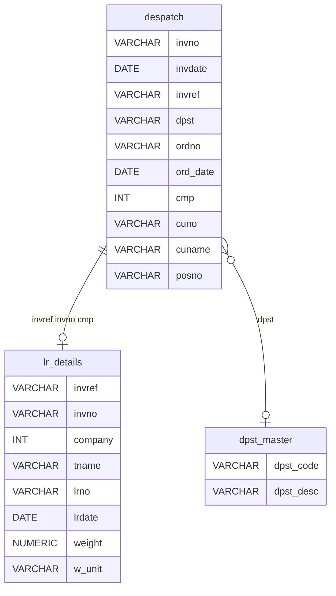
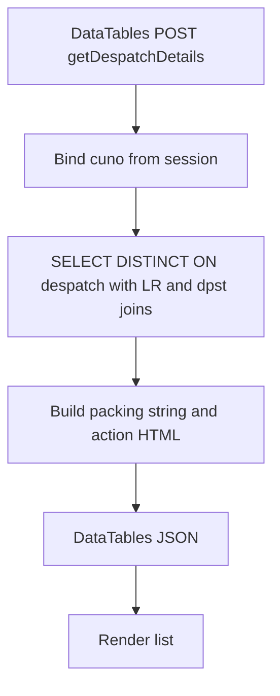
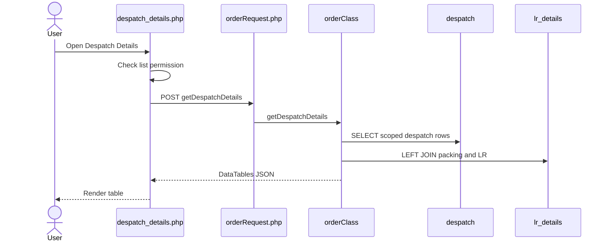
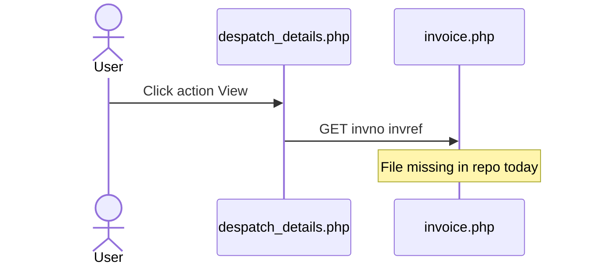
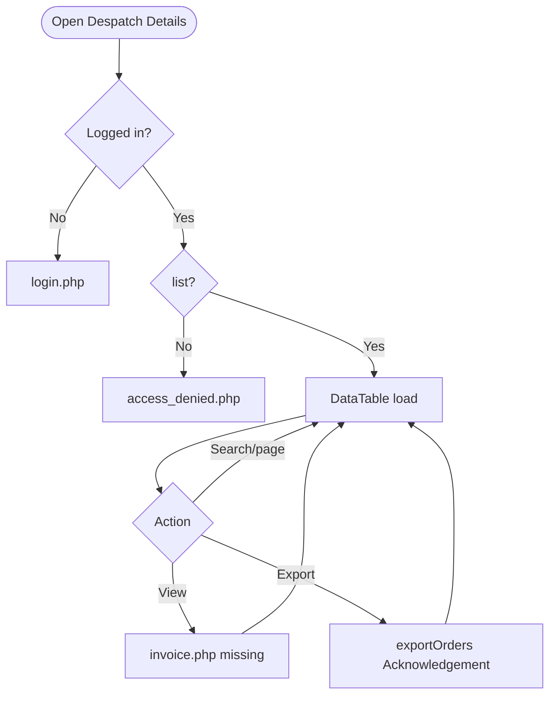
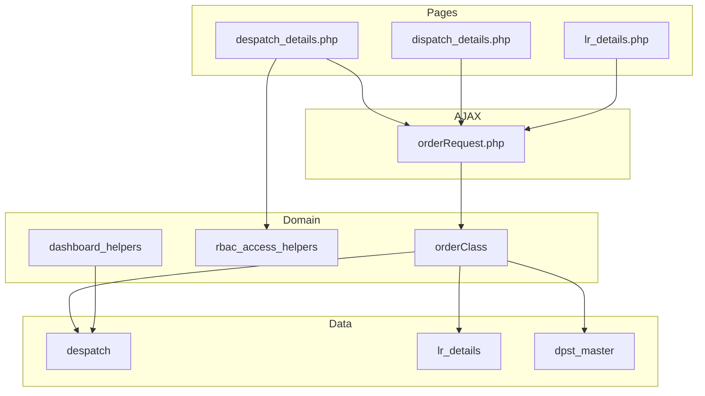

# Low-Level Design (LLD) — Despatch Details Module

| Attribute | Value |
|-----------|--------|
| Module | Despatch Details (List / View of Despatched Invoices) |
| Menu path | ORDERS → Despatch Details |
| Landing page | `despatch_details.php` (sidebar) |
| Alternate page | `dispatch_details.php` (orphaned; column keys align better with API) |
| Application | Complaint / Dealer Portal |
| Stack (target) | Core PHP + MySQL (PDO) |
| Stack (current repo) | Core PHP + **PostgreSQL** via PDO (`$dpconn` dealerportal) |
| Document version | 1.0 |
| Access | RBAC module slug **`despatch-details`** / permission **`list`** (`view` / `export-excel` reserved) |

---

## **1. Module Overview**

### 1.1 Purpose

Authenticated users with Despatch Details permissions browse despatched invoice/shipment rows from Dealerportal `despatch`, enriched with LR packing data (`lr_details`) and product-group description (`dpst_master`). The list is server-side DataTables via `orderRequest.php` → `orderClass::getDespatchDetails()`. The module is read-only; it does not create despatch records.

### 1.2 Scope

| In scope | Out of scope |
|----------|--------------|
| Despatch list (DataTables) | Order Booking create |
| LR join / packing / weight display | Recent Orders Re-Push |
| RBAC list / view / export flags | Pending Orders list |
| Dashboard “Dispatched” KPI gate (related) | Writing to `despatch` / ERP |
| Related LR Details sibling module (noted) | Working invoice/detail pages (targets missing) |

### 1.3 High-level architecture



---

## **2. Functional Requirements**

| ID | Requirement | Priority |
|----|-------------|----------|
| FR-01 | User with `despatch-details`/`list` can open Despatch Details list | Must |
| FR-02 | Server-side DataTables list from `despatch` | Must |
| FR-03 | Exclude `cmp = 600` and excluded `dpst` codes | Must |
| FR-04 | Scope rows to session customer `cuno` | Must |
| FR-05 | Show AO / invoice / transporter / LR / packing / weight / action | Must |
| FR-06 | Join LR details for packing and transporter | Should |
| FR-07 | Global search on invoice / AO / customer / dpst | Should |
| FR-08 | View permission controls detail links | Should |
| FR-09 | Export Excel when permitted | Could (wrong target today) |
| FR-10 | Deduplicate logical despatch keys | Should |

---

## **3. User Roles & Permissions**

### 3.1 RBAC module slug

| Resource | Module | Permission |
|----------|--------|------------|
| `despatch_details.php` / menu | `despatch-details` | `list` |
| View-link strip (client) | `despatch-details` | `view` |
| Export button visibility | `despatch-details` | `export-excel` |
| Dashboard Dispatched KPI gate | `despatch-details` | `list` |

Unauthenticated → `login.php`. No `list` → `access_denied.php`.

### 3.2 Page / API mapping

| Resource | Gate |
|----------|------|
| `despatch_details.php` | `list` |
| `dispatch_details.php` | `list` (not in sidebar) |
| `POST orderRequest.php` `getDespatchDetails` | Session only — **no** module RBAC |
| `POST orderRequest.php` `getLrDetails` | Session only (LR module) |

### 3.3 Scoping notes

| Layer | Scope |
|-------|--------|
| Despatch list API | Always `cuno = customer_number_vayu` (fallback **`'10001'`**) |
| Admin/Management seeAll | **Not implemented** on despatch list (unlike Recent Orders) |
| Sales coordinator widen | Used in dashboard scope helpers; **not** in `getDespatchDetails` |

---

## **4. Business Rules**

| ID | Rule |
|----|------|
| BR-01 | Despatch list row = `despatch` with `cmp != 600` and `dpst` not in excluded set. |
| BR-02 | Excluded `dpst`: `SLS500`, `SLS01`, `SO0600`, `SAL01`. |
| BR-03 | Customer scope: `cuno = session customer_number_vayu` (or `'10001'`). |
| BR-04 | Dedupe via `DISTINCT ON (invdate, cmp, ordno, invref, invno)`. |
| BR-05 | LR join on `invref` + `invno` + `cmp = company`. |
| BR-06 | Packing string built from cases / boxes / bundles / carton / special cases. |
| BR-07 | Read-only module — no insert/update/delete of despatch in this UI. |
| BR-08 | Soft-delete / `deleted_at` not used on this path. |
| BR-09 | Cross-module “Despatched” status (Recent/Pending) = `despatch` match on `cuno` + `TRIM(ordno)` + `cmp != 600` (no dpst exclusion in those helpers). |
| BR-10 | Dashboard pipeline “Dispatched” = booking AOs found in `despatch`. |
| BR-11 | Action links currently target `invoice.php` — **file missing** in repo. |
| BR-12 | Primary page column keys may not match API keys (known UI↔API mismatch). |
| BR-13 | Export button points to `exportOrders.php` (Acknowledgement-shaped) — not despatch data. |
| BR-14 | No date-range filter on list (DataTables search only). |

---

## **5. Database Design**

### 5.1 Logical model



### 5.2 Tables

| Table | Conn | Role |
|-------|------|------|
| `despatch` | `$dpconn` | Primary list source |
| `lr_details` | `$dpconn` | LR / packing / transporter join |
| `dpst_master` | `$dpconn` | DPST description |
| `lrdetails` | `$dpconn` | Separate LR list API table name (sibling module) |

### 5.3 List query pattern

```sql
SELECT DISTINCT ON (a.invdate, a.cmp, a.ordno, a.invref, a.invno)
  a.*, b.tname, b.lrno, /* packing fields */, d.dpst_desc
FROM despatch a
LEFT JOIN lr_details b
  ON a.invref = b.invref AND a.invno = b.invno AND a.cmp = b.company
LEFT JOIN dpst_master d
  ON d.dpst_code::text = a.dpst
WHERE a.cmp != 600
  AND a.dpst NOT IN ('SLS500','SLS01','SO0600','SAL01')
  AND a.cuno = :cuno
  AND /* optional ILIKE search */
ORDER BY a.invdate DESC, /* cmp should lead with DISTINCT ON */, a.ordno, a.invref, a.invno
LIMIT :length OFFSET :start;
```

---

## **6. API / Backend Design**

### 6.1 Page endpoints

| Endpoint | Method | Auth | Description |
|----------|--------|------|-------------|
| `despatch_details.php` | GET | `despatch-details`/`list` | Primary list (sidebar) |
| `dispatch_details.php` | GET | `list` (orphan) | Alternate list UI |

### 6.2 AJAX — `POST orderRequest.php`

| Action | Description |
|--------|-------------|
| `getDespatchDetails` | DataTables JSON for despatch list |
| `getLrDetails` | LR Details sibling list JSON |

### 6.3 Response shape (API keys)

Typical row keys: `cuno`, `dpst`, `ordno`, `invno`, `invdt`, `transporter`, `lrno`, `packing`, `weight`, `action`.

Primary page may expect different keys (`ao_number`, `order_ref_number`, `invoice_date`, …) — **mismatch**.

### 6.4 Core PHP responsibilities

| File | Role |
|------|------|
| `despatch_details.php` | Primary list + RBAC flags + DataTable |
| `dispatch_details.php` | Alternate list (better key alignment) |
| `orderRequest.php` / `orderClass.php` | `getDespatchDetails`, status helpers |
| `includes/rbac_access_helpers.php` | Page/menu AuthZ |
| `includes/dashboard_helpers.php` | Dispatched KPI / weekly alert |
| `lr_details.php` | Sibling LR module |

---

## **7. Validation Rules**

### 7.1 Server-side

| Field / rule | Behavior |
|--------------|----------|
| Session + `list` | Redirect login / access_denied |
| DataTables params | `start` / `length` cast to int; search bound |
| Customer bind | Always session `cuno` (or default) |
| CSRF | **Not implemented** |

### 7.2 Client-side

- DataTables serverSide; `pageLength` 10; `scrollX`; `processing`
- Export button `d-none` without `export-excel`
- `drawCallback` strips `order_data.php` links when no `view` (API actually emits `invoice.php` — gate ineffective)
- No Select2 filters; no date pickers
- No validate.js form (read-only)

---

## **8. UI Screen Specifications**

### 8.1 Primary list — `despatch_details.php`

| Element | Spec |
|---------|------|
| Layout | Bootstrap card + `#orderTable` (OA-style) |
| Table | DataTables serverSide |
| Intended columns | AO, Order Ref, Invoice Date, Transporter, LR No, Packaging, Weight, Action |
| API columns | `ordno`, `invno`, `invdt`, `transporter`, `lrno`, `packing`, `weight`, `action` (+ `cuno`/`dpst`) |
| Export | Excel button (wrong exporter target) |
| Select2 | **Not used** |
| Modals | **None** |
| CSS | `order_acknowledge_style.css` / `orderbook_style.css` (`dispatch_details.css` unused) |

### 8.2 Alternate — `dispatch_details.php`

Column keys align more closely with API; not linked in sidebar.

### 8.3 Detail navigation

Action HTML links to `invoice.php?invno=&invref=` — **file not in repo** (dead link).

---

## **9. Database Flow**

### 9.1 List load



### 9.2 Cross-module status use


---

## **10. Sequence Diagram**

### 10.1 List DataTables



### 10.2 Open action link (intended)



---

## **11. Activity Diagram**



---

## **12. Class / Module Diagram**



### 12.1 Key functions

| Function | Role |
|----------|------|
| `getDespatchDetails` | Server-side despatch list JSON |
| `getLrDetails` | Sibling LR list JSON |
| `resolveRecentOrderStatus` / `Label` | Cross-module Despatched badge |
| `dashboard_count_recent_orders_with_invoice` | Pipeline Dispatched KPI |
| `dashboard_fetch_dispatched_count` | “Dispatches this week” alert |
| `dashboard_order_module_permissions` | Maps dispatched UI to `despatch-details`/`list` |
| `rbac_user_can` / `rbac_can_access_menu` | Page/menu gating |

---

## **13. Folder Structure**

```text
ComplaintManagement/
├── despatch_details.php
├── dispatch_details.php
├── lr_details.php
├── orderRequest.php
├── orderClass.php
├── exportOrders.php
├── access_denied.php
├── includes/
│   ├── rbac_access_helpers.php
│   ├── dashboard_helpers.php
│   └── dashboard_scope_helpers.php
├── css/
│   ├── order_acknowledge_style.css
│   ├── orderbook_style.css
│   └── dispatch_details.css
└── docs/
    └── LLD_Despatch_Details_Module.md
```

Missing referenced targets: `invoice.php`, `despatchview1.php`, `lrview.php`.

---

## **14. Error Handling**

| Layer | Pattern |
|-------|---------|
| Unauthenticated | Redirect `login.php` |
| No `list` | `access_denied.php` |
| AJAX SQL/exception | JSON `{ draw:0, data:[], error: message }` (often empty table) |
| Success flashes | **None** (read-only) |
| Dead view links | Browser 404 / missing page |

### 14.1 User-visible messages

| Message / UI | When |
|--------------|------|
| Access denied page | Missing `list` |
| Empty DataTable | No rows / query error swallowed |
| Broken View | Missing `invoice.php` |

---

## **15. Security Considerations**

| Area | Control |
|------|---------|
| Page AuthZ | RBAC `despatch-details`/`list` |
| AJAX AuthZ gap | `orderRequest` lacks module permission check |
| Customer fallback | Missing session customer → `'10001'` |
| No seeAll | Admins still customer-scoped on list API |
| View gate ineffective | Strips wrong href pattern vs API links |
| Export wrong data | `exportOrders.php` is OA-shaped; no despatch RBAC |
| XSS risk | Action/packing HTML built from ERP fields without full escaping |
| DISTINCT ON / ORDER BY | May omit `cmp` leading expression → query failure |
| CSRF | **Not implemented** on AJAX |
| Dead detail targets | Missing invoice/view PHP files |

---

## **16. Audit Logs**

### 16.1 Built-in field-level audit

| Item | Behavior |
|------|----------|
| Despatch list audit table | **Not implemented** |
| Module nature | Read-only ERP despatch / LR aggregation |
| Despatch creation audit | Owned by ERP / warehouse systems outside this UI |

---

## **17. Test Cases**

### 17.1 Functional

| ID | Scenario | Expected |
|----|----------|----------|
| TC-01 | Guest opens Despatch Details | Redirect login |
| TC-02 | User without `list` | `access_denied.php` |
| TC-03 | User with `list` | DataTable requests `getDespatchDetails` |
| TC-04 | Session with valid `cuno` | Only that customer’s rows |
| TC-05 | `cmp = 600` or excluded dpst | Not listed |
| TC-06 | Search by invno / ordno | Filtered rows |
| TC-07 | Primary page column keys vs API | **Gap:** fields may appear blank |
| TC-08 | Click View action | **Gap:** `invoice.php` missing |
| TC-09 | User without `export-excel` | Export button hidden |
| TC-10 | Click Export | Downloads Acknowledgement-shaped export (wrong) |
| TC-11 | Admin without customer_number_vayu | Falls back to `10001` |
| TC-12 | Dashboard Dispatched KPI without list perm | KPI gated off |
| TC-13 | Recent Orders despatch match | Shows Despatched badge |
| TC-14 | Open `dispatch_details.php` | Alternate UI may show API fields correctly |

---

## **18. Assumptions & Dependencies**

### 18.1 Assumptions

1. `despatch-details`/`list` is assigned to roles that may see despatches.
2. ERP writes `despatch` / `lr_details`; portal does not create them here.
3. Live menu path is `despatch_details.php` despite column-key mismatch with API.
4. `dispatch_details.php` remains an alternate until primary page is aligned or removed.
5. Document target stack Core PHP + MySQL; repo runs PostgreSQL (`DISTINCT ON`, `ILIKE`).
6. Detail/invoice PHP pages may be restored later; currently missing.
7. Dashboard “Dispatched” remains AO∩despatch unless product aligns definitions with list filters.

### 18.2 Dependencies

| Dependency | Purpose |
|------------|---------|
| RBAC / Assign Permissions | `despatch-details` grants |
| `$dpconn` / `despatch` | List source |
| `lr_details` / `dpst_master` | Enrichment |
| `orderClass` / `orderRequest` | Shared order AJAX surface |
| DataTables + jQuery | List UX |
| Recent Orders / Pending / Dashboard | Consumers of despatch for status/KPIs |
| LR Details module | Sibling ORDERS menu item |

---

## Appendix A — API vs primary UI column keys

| Primary UI expectation | API key |
|------------------------|---------|
| `ao_number` | `ordno` |
| `order_ref_number` | (not mapped 1:1; `invref` related) |
| `invoice_date` | `invdt` |
| `transporter` | `transporter` |
| `lr_no` | `lrno` |
| `packaging_details` | `packing` |
| `weight` | `weight` |
| `action` | `action` |

---

## Appendix B — Select2 control map

**N/A.** Despatch Details list does not use Select2 filters.

---

## Appendix C — RBAC permission matrix

| Permission | Effect |
|------------|--------|
| `list` | Open Despatch Details / menu / dashboard Dispatched gate |
| `view` | Intended to control detail links (currently ineffective) |
| `export-excel` | Show Export button (wrong exporter) |

---

## Appendix D — Inclusion filters

| Filter | Value |
|--------|-------|
| Company | `cmp != 600` |
| DPST exclude | `SLS500`, `SLS01`, `SO0600`, `SAL01` |
| Customer | `cuno = session customer` |
| Dedupe | `DISTINCT ON (invdate, cmp, ordno, invref, invno)` |

---

## Appendix E — Pipeline position

```text
Order Booking → plexecom (AO empty)
        ↓
Acknowledgement / AO populated
        ↓
Pending Orders (open LN lines)
        ↓
Despatch Details (this module) ← despatch + LR
        ↓
Recent Orders status badge: Despatched
```

---

## Appendix F — Known defects checklist

| Defect | Impact |
|--------|--------|
| UI↔API column key mismatch | Blank/wrong columns on sidebar page |
| Missing `invoice.php` | Dead View links |
| Export → OA exporter | Wrong data downloaded |
| No API RBAC | AuthZ gap |
| No admin seeAll | Admins limited to one cuno / default |
| DISTINCT ON vs ORDER BY | Possible empty error responses |
| `view` strips wrong href | View permission unused |

---

*End of LLD — Despatch Details Module*
