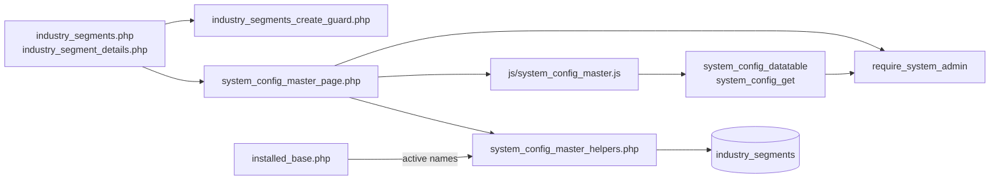
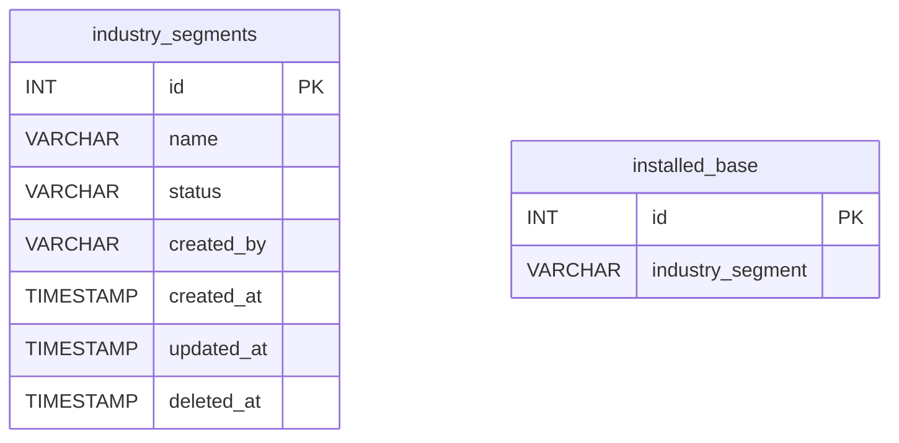
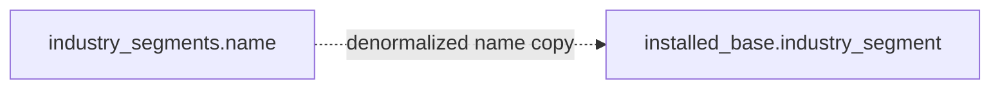
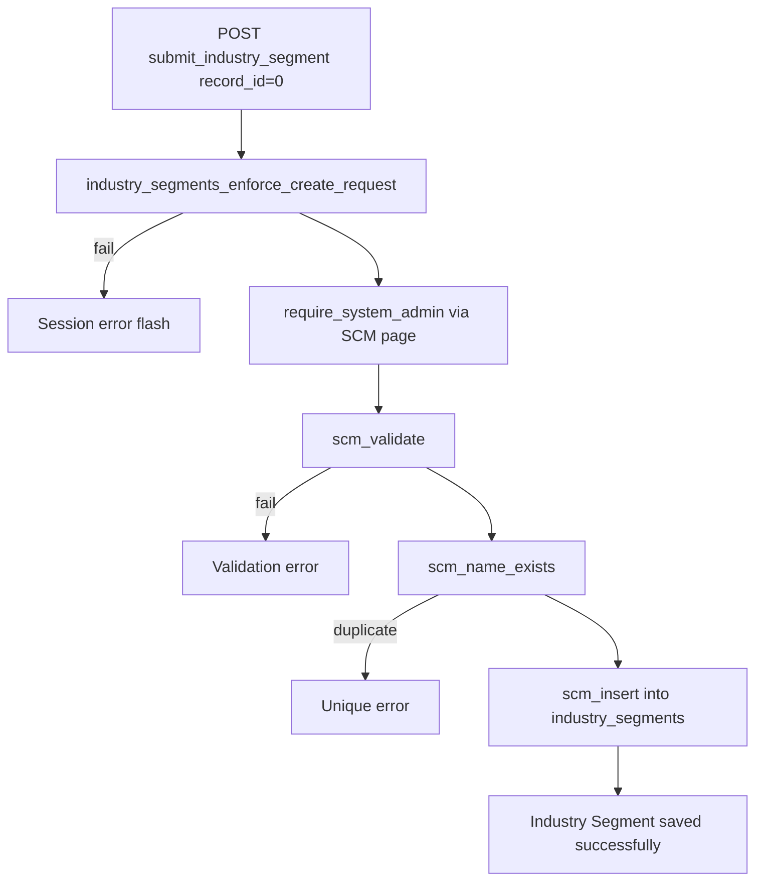
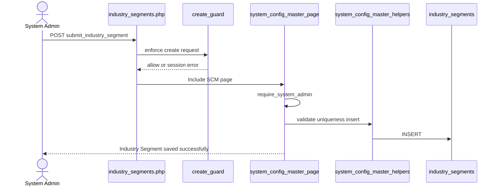
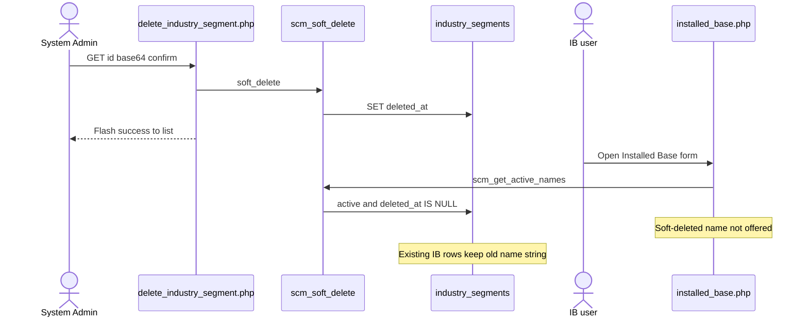
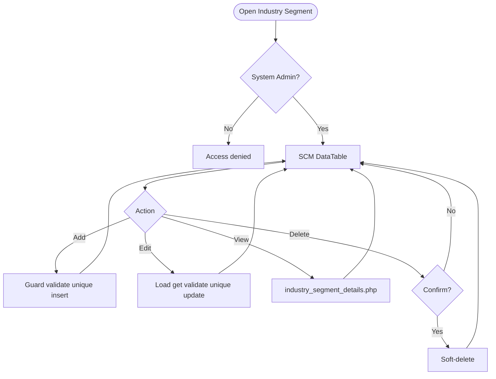
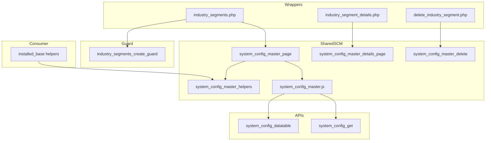

# Low-Level Design (LLD) — Industry Segment Module

| Attribute | Value |
|-----------|--------|
| Module | Industry Segment (System Config Master) |
| Menu path | ADMINISTRATION → Industry Segment |
| Landing page | `industry_segments.php` |
| Application | Complaint / Dealer Portal |
| Stack (target) | Core PHP + MySQL (PDO) |
| Stack (current repo) | Core PHP + **PostgreSQL** via PDO |
| Document version | 1.0 |
| Access | **System Admin only** (role id `6`) — no RBAC module slug |
| Architecture | Shared **SCM** stack (`$scmType = 'industry_segment'`) |

---

## **1. Module Overview**

### 1.1 Purpose

System Administrators maintain industry segment options in `industry_segments` for Installed Base Capture. The module is a thin SCM wrapper: list/create/edit/details/soft-delete share `system_config_master_*` pages, helpers, APIs, and JS. Installed Base stores the selected **name string** (not an FK id).

### 1.2 Scope

| In scope | Out of scope |
|----------|--------------|
| List / Add / Edit / Details / Soft-delete | Complaint Entry (does not use this master) |
| Active / Inactive status | Hard delete |
| Case-insensitive name uniqueness | Dedicated `industry_segment_helpers.php` (uses SCM helpers) |
| Create abuse / rate-limit guard | Cascading rename/delete to `installed_base` |
| Active names for IB Select2 | Other SCM types (Warranty, Part Replaced, etc.) |

### 1.3 High-level architecture



---

## **2. Functional Requirements**

| ID | Requirement | Priority |
|----|-------------|----------|
| FR-01 | System Admin can open Industry Segments list (DataTables) | Must |
| FR-02 | Create industry segment with name and status | Must |
| FR-03 | Edit via inline slide-down form | Must |
| FR-04 | Soft-delete; hide from list | Must |
| FR-05 | Unique name among non-deleted (case/trim-insensitive) | Must |
| FR-06 | Filter / search list; status active/inactive | Should |
| FR-07 | View read-only details + audit fields | Should |
| FR-08 | Throttle / rate-limit create requests | Should |
| FR-09 | Client validate.js for name + status | Should |
| FR-10 | Expose active names to Installed Base dropdown | Must |

---

## **3. User Roles & Permissions**

### 3.1 RBAC module slug

**None.** Industry Segment administration is gated by **System Admin** (`SYSTEM_ADMIN_ROLE = 6`), not a permission slug.

### 3.2 Permission matrix

| Capability | Gate |
|------------|------|
| All Industry Segment admin pages | `require_system_admin($obconn)` (via SCM page) |
| SCM APIs with `type=industry_segment` | `admin_api_require_system_admin` |
| Denied | `Access denied. System Admin privileges required.` |

Pages (`industry_segments.php`, `industry_segment_details.php`, `delete_industry_segment.php`) are in `rbac_admin_pages()` and skip module RBAC; System Admin check is authoritative.

### 3.3 Page / API mapping

| Resource | Gate |
|----------|------|
| `industry_segments.php` | System Admin |
| `industry_segment_details.php` | System Admin |
| `delete_industry_segment.php` | System Admin |
| `api/system_config_datatable.php?type=industry_segment` | System Admin API |
| `api/system_config_get.php?type=industry_segment` | System Admin API |

### 3.4 Consumer access

Installed Base users need Installed Base module permissions (separate). They only see **active, non-deleted** names via `scm_get_active_names('industry_segment')` / `installed_base_industry_segments()`.

---

## **4. Business Rules**

| ID | Rule |
|----|------|
| BR-01 | Soft-deleted rows excluded from list, get, uniqueness, and IB options. |
| BR-02 | Name unique among non-deleted: `LOWER(TRIM(name))`; edit excludes self. |
| BR-03 | Soft-deleted names may be reused on create. |
| BR-04 | Status must be `active` or `inactive`. |
| BR-05 | Inactive names stay in admin list but are **not** offered in Installed Base. |
| BR-06 | Soft-delete / rename does **not** update existing `installed_base.industry_segment` values. |
| BR-07 | No “in use” check before soft-delete. |
| BR-08 | Create-only abuse guard: max 1/request; min 3s interval; max 20 creates / 15 min. |
| BR-09 | Edit requires existing non-deleted row. |
| BR-10 | `created_by` = `current_username()` on insert; `created_at` / `updated_at` timestamps. |
| BR-11 | Details/delete URL ids are `base64_encode((string) id)`. |
| BR-12 | Create/update stay on page (no PRG). Delete redirects to list with session flash. |
| BR-13 | Installed Base stores the **name string**, not `industry_segments.id`. |
| BR-14 | SCM type key is `industry_segment`; table `industry_segments`; submit key `submit_industry_segment`. |

---

## **5. Database Design**

### 5.1 ER diagram



Logical link (name string, not FK):



### 5.2 Table: `industry_segments`

| Column | MySQL type | Notes |
|--------|------------|-------|
| `id` | `INT UNSIGNED AUTO_INCREMENT` | PK |
| `name` | `VARCHAR(100)` | Required; unique among non-deleted |
| `status` | `VARCHAR(20)` | `active` / `inactive` |
| `created_by` | `VARCHAR(100)` | Creator username |
| `created_at` | `TIMESTAMP` | Insert |
| `updated_at` | `TIMESTAMP NULL` | Update / soft-delete |
| `deleted_at` | `TIMESTAMP NULL` | Soft-delete |

### 5.3 Related tables

| Table | Role |
|-------|------|
| `installed_base` | Consumer; stores name in `industry_segment` |

### 5.4 Reference / lookup sources

| Source | Usage |
|--------|--------|
| `scm_registry()['industry_segment']` | Labels, pages, table, submit key |
| `rbac_status_options()` | Status `<select>` |
| `scm_get_active_names('industry_segment')` | IB dropdown |
| `installed_base_industry_segments()` | IB helper wrapper |

---

## **6. API / Backend Design**

### 6.1 Page endpoints

| Endpoint | Method | Auth | Description |
|----------|--------|------|-------------|
| `industry_segments.php` | GET | System Admin | List + Add/Edit panel |
| `industry_segments.php` | POST `submit_industry_segment` | System Admin | Create or update |
| `industry_segment_details.php?id=` | GET | System Admin | Read-only details |
| `delete_industry_segment.php?id=` | GET | System Admin | Soft-delete |

Wrappers set `$scmType = 'industry_segment'` and include shared SCM templates.

### 6.2 JSON APIs

#### `POST api/system_config_datatable.php`

Body/query includes `type=industry_segment`. Server-side DataTables over `industry_segments` where `deleted_at IS NULL`.

```json
{
  "draw": 1,
  "recordsTotal": 10,
  "recordsFiltered": 2,
  "data": [{ "id": "#1", "name": "...", "status": "...", "actions": "<html>" }]
}
```

#### `GET api/system_config_get.php?type=industry_segment&id=`

Returns row for edit form population. System Admin API gated.

### 6.3 Supporting lookup APIs

N/A for admin UI. Installed Base loads active names server-side into Select2 options.

### 6.4 Core PHP responsibilities

| File | Role |
|------|------|
| `industry_segments.php` | Create-guard hook + `$scmType` wrapper |
| `includes/system_config_master_page.php` | Shared list/form POST handler |
| `includes/system_config_master_details_page.php` | Shared details |
| `includes/system_config_master_delete.php` | Shared soft-delete |
| `includes/system_config_master_helpers.php` | Registry, validate, CRUD, options |
| `includes/module_create_guards/industry_segments_create_guard.php` | Create throttle / rate limit |
| `includes/admin_access_helpers.php` | System Admin gate |

---

## **7. Validation Rules**

### 7.1 Server-side (`scm_validate` + uniqueness + create guard)

| Field / rule | Message |
|--------------|---------|
| Name empty | `Industry Segment name is required.` |
| Name > 100 | `Industry Segment name cannot exceed 100 characters.` |
| Status missing/invalid | `Status is required.` |
| Duplicate name | `Industry Segment name already exists. Please choose a different name.` |
| Missing edit target | `Industry Segment not found or already deleted.` |
| Create throttle | `Please wait a few seconds before creating another record.` |
| Rate limit | `Create rate limit exceeded. You may create up to 20 records every 15 minutes...` |
| Bulk payload | `Too many records in a single request. A maximum of 1 record(s)...` |

**Installed Base consumer:** `Industry Segment is required.` / `Invalid Industry Segment selected.`

### 7.2 Client-side (`js/system_config_master.js`)

- validate.js: Name required + max 100; Status required
- Edit load failure: `Failed to load record details.`
- Success alert fades after 3s
- Status is native `<select>` (no Select2 on master)

---

## **8. UI Screen Specifications**

### 8.1 Listing — `industry_segments.php`

| Element | Spec |
|---------|------|
| Subtitle | Manage industry segment options for installed base. |
| Placeholder | e.g. Manufacturing |
| CTA | Add / Cancel (SCM form card `#scmFormCard`) |
| Grid | `#scmTable` — ID, Name, Status, Created At, Action |
| Actions | View / Edit / Delete (`confirm('Delete this record?')`) |
| Icon | `bi-building` |

### 8.2 Form panel

Fields: Name*, Status* (`active` / `inactive`).  
Hidden: `record_id`, `submit_industry_segment`, SCM type wiring via `scm_page_js_config`.

### 8.3 Details — `industry_segment_details.php`

Name, status badge, created by, created/updated timestamps (shared record-details layout).

### 8.4 Modals / Select2

- No CRUD modals on master.
- **Admin:** native status select — **no Select2**.
- **Installed Base:** Select2 on `#industrySegmentSelect` (consumer).

---

## **9. Database Flow**

### 9.1 Create



### 9.2 Soft-delete

```sql
UPDATE industry_segments
SET deleted_at = CURRENT_TIMESTAMP,
    updated_at = CURRENT_TIMESTAMP
WHERE id = :id
  AND deleted_at IS NULL;
```

### 9.3 Active options for Installed Base

```sql
SELECT name
FROM industry_segments
WHERE deleted_at IS NULL
  AND status = 'active'
ORDER BY created_at ASC, id ASC;
```

---

## **10. Sequence Diagram**

### 10.1 Create industry segment



### 10.2 Soft-delete and Installed Base impact



---

## **11. Activity Diagram**



---

## **12. Class / Module Diagram**



### 12.1 Key functions

| Function | Role |
|----------|------|
| `scm_registry` / `scm_config` | Type → table/pages/labels |
| `scm_safe_table` | Whitelist table name |
| `scm_from_post` / `scm_validate` | Parse + validate |
| `scm_name_exists` | Uniqueness |
| `scm_insert` / `scm_update` / `scm_soft_delete` | Persist |
| `scm_get_by_id` / `scm_get_active_names` / `scm_option_exists` | Reads |
| `scm_entry_actions` / `scm_page_js_config` | UI/API wiring |
| `industry_segments_enforce_create_request` | Create abuse guard |
| `installed_base_industry_segments` | IB active-name options |
| `require_system_admin` | Access gate |

---

## **13. Folder Structure**

```text
ComplaintManagement/
├── industry_segments.php
├── industry_segment_details.php
├── delete_industry_segment.php
├── api/
│   ├── system_config_datatable.php
│   └── system_config_get.php
├── includes/
│   ├── system_config_master_helpers.php
│   ├── system_config_master_page.php
│   ├── system_config_master_details_page.php
│   ├── system_config_master_delete.php
│   ├── admin_access_helpers.php
│   ├── admin_api_guard.php
│   └── module_create_guards/
│       └── industry_segments_create_guard.php
├── js/
│   └── system_config_master.js
├── storage/
│   └── request_abuse/industry_segments/
└── docs/
    └── LLD_Industry_Segment_Module.md
```

---

## **14. Error Handling**

| Layer | Pattern |
|-------|---------|
| Create guard fail | `$_SESSION['error_message']`; POST submit unset |
| Page POST | Inline / session success or error via SCM page |
| Delete | Session flash → `industry_segments.php` |
| Details invalid | `die('Invalid record.')` / `die('Industry Segment not found.')` |
| APIs | JSON + HTTP 403/404 |
| Create guard log | `storage/request_abuse/industry_segments/` |

### 14.1 Common messages

| Message | When |
|---------|------|
| `Industry Segment saved successfully.` | Create |
| `Industry Segment updated successfully.` | Update |
| `Industry Segment deleted successfully.` | Soft-delete |
| `Failed to save industry segment.` / `Failed to update...` / `Failed to delete...` | Persist fail |
| `Industry Segment not found or already deleted.` | Missing target |
| `Industry Segment name already exists...` | Unique violation |
| `Invalid record.` | Bad delete id |
| `Access denied. System Admin privileges required.` | Non-admin |

---

## **15. Security Considerations**

| Area | Control |
|------|---------|
| Authorization | System Admin hard-gate on SCM pages + APIs |
| Soft-delete | Excluded from active queries and IB options |
| Create abuse | Throttle, rate limit, payload size, monitor log |
| Table safety | `scm_safe_table` whitelist for datatable SQL |
| CSRF | **Not implemented** on POST or GET delete |
| Delete method | **GET** soft-delete — CSRF-friendly; confirm only |
| PRG | **Not used** on create/update |
| Guard order gap | Create guard in wrapper can run **before** `require_system_admin` → non-admins may write throttle/abuse files |
| Option exists gap | `scm_option_exists` ignores `status` → inactive name can pass IB server check if forced in POST |
| Denormalized IB name | Rename/delete orphans historical `installed_base.industry_segment` values |
| Uniqueness | App-level only; race without DB UNIQUE |

---

## **16. Audit Logs**

### 16.1 Built-in field-level audit

| Field | Behavior |
|-------|----------|
| `created_by` / `created_at` | On create |
| `updated_at` | On update / soft-delete |
| `deleted_at` | Soft-delete |
| Dedicated audit table | **Not implemented** |
| Create abuse log | `storage/request_abuse/industry_segments/abuse_monitor.log` |

---

## **17. Test Cases**

### 17.1 Functional

| ID | Scenario | Expected |
|----|----------|----------|
| TC-01 | Non-admin opens Industry Segment | Denied |
| TC-02 | Create with empty name | Validation error |
| TC-03 | Create duplicate name (different case) | Rejected |
| TC-04 | Soft-delete then recreate same name | Allowed |
| TC-05 | Set status inactive | In admin list; not in IB Select2 |
| TC-06 | Soft-delete name used on IB rows | IB keeps old string; dropdown omits it |
| TC-07 | Edit via pencil | Form filled from `system_config_get` |
| TC-08 | Delete confirmed | Soft-deleted; flash success |
| TC-09 | Create twice within 3 seconds | Throttle error |
| TC-10 | Create >20 in 15 minutes | Rate-limit error |
| TC-11 | IB submit without industry segment | `Industry Segment is required.` |
| TC-12 | IB submit unknown name | `Invalid Industry Segment selected.` |
| TC-13 | Details with bad base64 id | Invalid record |
| TC-14 | Datatable `type=industry_segment` as admin | Rows from `industry_segments` |

---

## **18. Assumptions & Dependencies**

### 18.1 Assumptions

1. Role id `6` is System Admin.
2. Soft-delete is the only remove mechanism.
3. Installed Base is the only runtime consumer of this master.
4. Name string denormalization on IB is intentional for historical display.
5. Shared SCM stack remains the implementation vehicle (no dedicated helpers file).
6. Document target stack Core PHP + MySQL; repo runs PostgreSQL.
7. Create-guard storage under `storage/request_abuse/industry_segments/` is writable.

### 18.2 Dependencies

| Dependency | Purpose |
|------------|---------|
| SCM shared pages/helpers/JS/APIs | CRUD UI and persistence |
| `admin_access_helpers` / `admin_api_guard` | System Admin gate |
| `rbac_helpers` | Status options / validation / badges |
| Create-guard storage | Throttle state + abuse log |
| jQuery + DataTables + validate.js | List / form UX |
| Installed Base module | Consumer of active names |

---

## Appendix A — Success flashes

| Event | Message |
|-------|---------|
| Create | Industry Segment saved successfully. |
| Update | Industry Segment updated successfully. |
| Delete | Industry Segment deleted successfully. |

---

## Appendix B — Select2 control map

| Screen | Control | Select2? |
|--------|---------|----------|
| Admin status select | Native `<select>` | No |
| Installed Base `#industrySegmentSelect` | Select2 | Yes (consumer) |

---

## Appendix C — SCM registry entry

| Key | Value |
|-----|-------|
| Type | `industry_segment` |
| Table | `industry_segments` |
| Label | Industry Segment |
| Page | `industry_segments.php` |
| Submit key | `submit_industry_segment` |
| Icon | `bi-building` |

---

## Appendix D — Create guard limits

| Limit | Value |
|-------|-------|
| Max records per request | 1 |
| Min interval between creates | 3 seconds |
| Max creates per window | 20 |
| Window | 15 minutes |

---

## Appendix E — Status vs consumer visibility

| Value | Admin list | Installed Base options |
|-------|------------|------------------------|
| `active` | Yes | Yes |
| `inactive` | Yes | No |
| Soft-deleted | No | No |

---

*End of LLD — Industry Segment Module*
