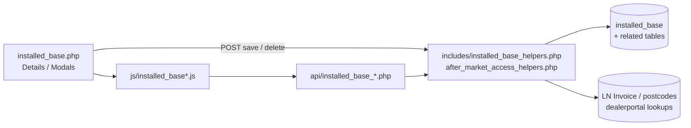
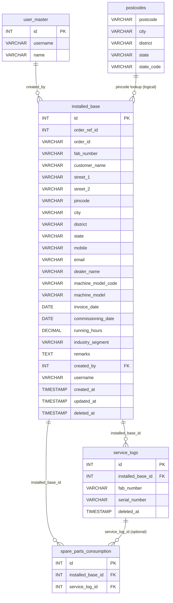
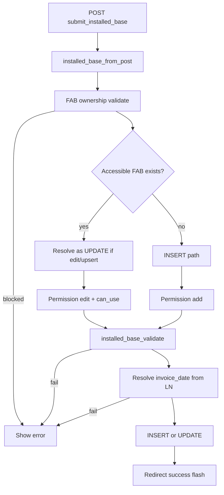
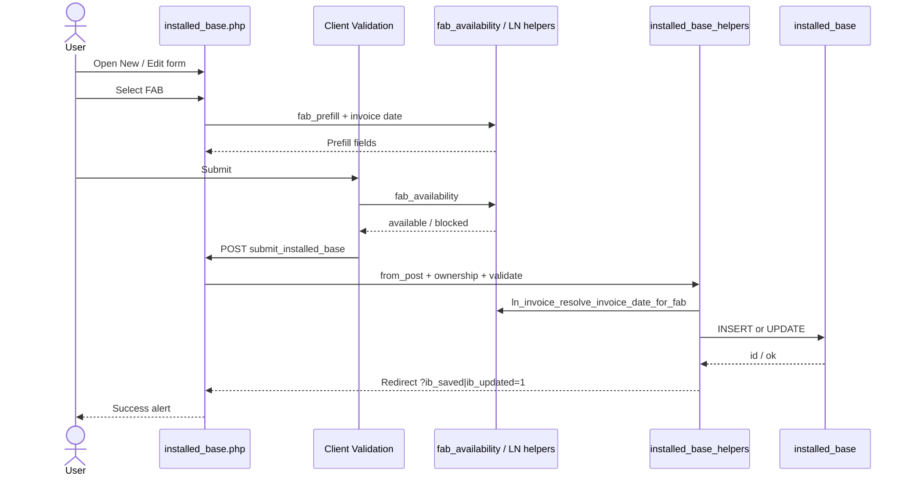
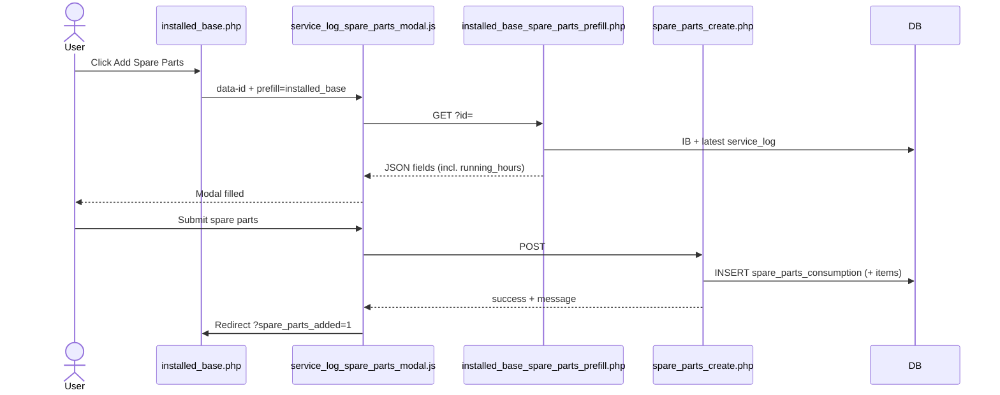
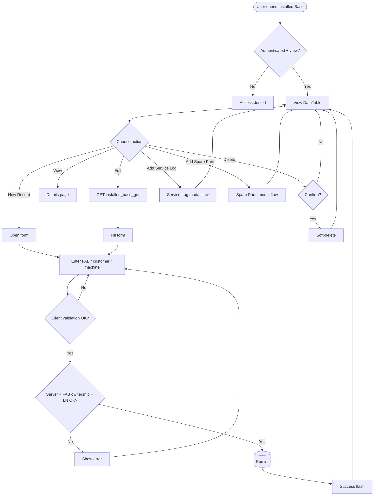
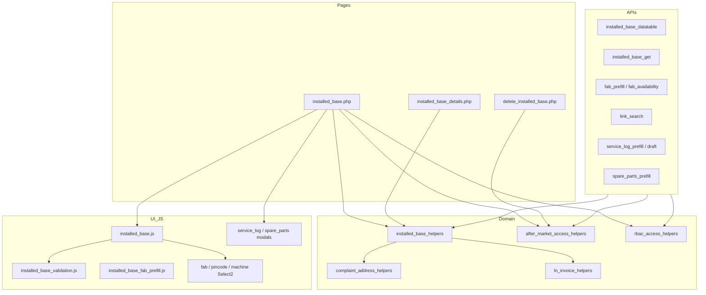

# Low-Level Design (LLD) — Installed Base Capture Module

| Attribute | Value |
|-----------|--------|
| Module | Installed Base Capture |
| Application | Complaint / Dealer Portal (After Market) |
| Stack (target) | Core PHP + MySQL (PDO) |
| Stack (current repo) | Core PHP + **PostgreSQL** via PDO (`pdo_obconn.php`) — schema maps 1:1 to MySQL |
| Document version | 1.0 |
| Related modules | Service Log Capture, Spare Parts Consumption, Complaints, RBAC |

---

## 1. Module Overview

### 1.1 Purpose

Installed Base Capture records the **physical machine / customer install footprint** after sale: Fab Number (FAB), customer & address, dealer, machine model, invoice & commissioning dates, running hours, and industry segment. It is the **parent master** for after-market Service Log and Spare Parts Consumption records.

### 1.2 Scope

| In scope | Out of scope |
|----------|--------------|
| Create / update / soft-delete installed base | Hard delete / cascade delete of child records |
| Server-side DataTable listing with role scope | Standalone order booking (Order ID UI is hidden; saved as `0`) |
| FAB ownership & uniqueness rules | Full LN ERP sync (uses invoice lookup helpers only) |
| Prefill from FAB / complaint | Changing RBAC admin UI |
| Launch Service Log / Spare Parts from IB row | Pricing / inventory of spare kits |

### 1.3 High-level architecture



---

## 2. Functional Requirements

| ID | Requirement | Priority |
|----|-------------|----------|
| FR-01 | Authenticated users with `view` can open listing and details | Must |
| FR-02 | Users with `add` can create a new installed base record | Must |
| FR-03 | Users with `edit` can update records they are allowed to use | Must |
| FR-04 | Users with `delete` can soft-delete allowed records | Must |
| FR-05 | Listing is server-side searchable/sortable (DataTables) | Must |
| FR-06 | FAB Number is required and must exist in invoice (LN) data on save | Must |
| FR-07 | FAB cannot be claimed if owned by another user | Must |
| FR-08 | Same FAB for current owner upserts (create vs update resolution) | Must |
| FR-09 | Invoice date is resolved from LN invoice by FAB (form value overridden) | Must |
| FR-10 | Address city/district/state auto-fill from pincode Select2 | Must |
| FR-11 | Machine model selectable via Select2; locked when FAB already has IB / on edit | Must |
| FR-12 | Users with `add-service-log-capture` can open Add Service Log from a row | Must |
| FR-13 | Users with `add-spare-parts-consumption` can open Add Spare Parts from a row | Must |
| FR-14 | Details page shows IB + linked service logs + spare parts | Must |
| FR-15 | Deep-link open form with FAB / complaint_id for complaint flow | Should |
| FR-16 | Soft-deleted records excluded from all active queries | Must |
| FR-17 | List visibility follows after-market scope (admin / sales coordinator / owner) | Must |

---

## 3. User Roles & Permissions

### 3.1 RBAC module slug

`installed-base-capture`

### 3.2 Permission matrix

| Permission slug | Capability |
|-----------------|------------|
| `view` | List, details, get, datatable, FAB prefill/availability, link search |
| `add` | Create new installed base |
| `edit` | Update existing installed base |
| `delete` | Soft-delete |
| `add-service-log-capture` | Row action + service-log modal from IB |
| `add-spare-parts-consumption` | Row action + spare-parts modal from IB |

### 3.3 Page / API mapping

| Resource | Required permission |
|----------|---------------------|
| `installed_base.php` | `view` |
| `installed_base_details.php` | `view` |
| `delete_installed_base.php` | `delete` |
| `api/installed_base_datatable.php` | `view` |
| `api/installed_base_get.php` | `view` |
| `api/installed_base_fab_prefill.php` | `view` |
| `api/installed_base_fab_availability.php` | `view` |
| `api/installed_base_link_search.php` | `view` |
| `api/installed_base_service_log_prefill.php` | Service Log `add` (+ after-market helper) |
| `api/installed_base_service_log_draft_create.php` | Service Log `add` |
| `api/installed_base_spare_parts_prefill.php` | Spare Parts `add` **or** IB `add-spare-parts-consumption` |

### 3.4 After-market list scope

| Role class | List scope (`deleted_at IS NULL` always) |
|------------|------------------------------------------|
| System Admin / CCS Admin / Management | All active records |
| Sales Coordinator | Records whose `username` is in assigned dealers/engineers |
| Other roles | `username = current user` |

### 3.5 FAB ownership (stricter than list scope)

A user **owns** a record if `created_by = current_user_id` **OR** `username = current_username`.

- Privileged list access does **not** allow claiming another user’s FAB.
- Message: `This FAB Number is already assigned to another user and cannot be used.`

---

## 4. Business Rules

| ID | Rule |
|----|------|
| BR-01 | Active FAB uniqueness is case-insensitive on `TRIM(fab_number)` among `deleted_at IS NULL` rows (ownership-aware upsert). |
| BR-02 | On save, FAB must resolve in LN invoice helpers; else error: `Selected Fab Number was not found in invoice details.` |
| BR-03 | `invoice_date` is always overwritten from LN resolve helper, not free-typed. |
| BR-04 | `running_hours` required, numeric, strictly `> 0`. |
| BR-05 | On **insert**, `dealer_name` = `current_assignee_name()` (display name or username). |
| BR-06 | On **update**, empty dealer in POST keeps existing dealer_name. |
| BR-07 | `order_ref_id` / `order_id` currently persisted as `0` (Order Select2 hidden). |
| BR-08 | Industry segment must exist in System Config Master (`industry_segment`). |
| BR-09 | Soft-delete sets `deleted_at` + `updated_at`; no cascade to `service_logs` / `spare_parts_consumption`. |
| BR-10 | Service Log / Spare Parts require an accessible non-deleted IB parent. |
| BR-11 | Machine model Select2 disabled when FAB already maps to IB (prefill) or when editing. |
| BR-12 | Customer name: alphabetic characters and spaces only. |
| BR-13 | Mobile: 10 digits, first digit 1–9. Pincode: exactly 6 digits. |
| BR-14 | Remarks optional, max 1000 characters. |

---

## 5. Database Design

> **Note:** Current production uses **PostgreSQL**. Types below are MySQL-equivalent for the requested stack. Map `TIMESTAMP` ↔ PostgreSQL `timestamp`, `DECIMAL` ↔ `numeric`, `INT AUTO_INCREMENT` ↔ `SERIAL`/`BIGSERIAL`.

### 5.1 ER diagram



### 5.2 Table: `installed_base`

| Column | MySQL type | Null | Default | Description |
|--------|------------|------|---------|-------------|
| `id` | `INT UNSIGNED AUTO_INCREMENT` | NO | — | PK |
| `order_ref_id` | `INT` | YES | `0` | Legacy; currently saved as `0` |
| `order_id` | `VARCHAR(50)` | YES | `'0'` | Legacy; currently saved as `'0'` |
| `fab_number` | `VARCHAR(100)` | NO | — | Business key (FAB) |
| `customer_name` | `VARCHAR(150)` | NO | — | |
| `street_1` | `VARCHAR(255)` | NO | — | |
| `street_2` | `VARCHAR(255)` | YES | NULL | |
| `pincode` | `CHAR(6)` | NO | — | |
| `city` | `VARCHAR(100)` | NO | — | Auto from postcodes |
| `district` | `VARCHAR(100)` | NO | — | Auto from postcodes |
| `state` | `VARCHAR(100)` | NO | — | Auto from postcodes |
| `mobile` | `VARCHAR(15)` | NO | — | 10-digit |
| `email` | `VARCHAR(150)` | NO | — | |
| `dealer_name` | `VARCHAR(150)` | NO | — | Set on insert from assignee |
| `machine_model_code` | `VARCHAR(100)` | NO | — | |
| `machine_model` | `VARCHAR(255)` | NO | — | Description / label |
| `invoice_date` | `DATE` | NO | — | From LN invoice resolve |
| `commissioning_date` | `DATE` | NO | — | |
| `running_hours` | `DECIMAL(12,2)` | NO | — | Must be `> 0` |
| `industry_segment` | `VARCHAR(150)` | NO | — | SCM option name |
| `remarks` | `VARCHAR(1000)` | YES | NULL | |
| `created_by` | `INT UNSIGNED` | NO | — | FK → `user_master.id` |
| `username` | `VARCHAR(100)` | NO | — | Owner username for scope |
| `created_at` | `TIMESTAMP` | NO | `CURRENT_TIMESTAMP` | |
| `updated_at` | `TIMESTAMP` | YES | NULL | On update / soft-delete |
| `deleted_at` | `TIMESTAMP` | YES | NULL | Soft-delete marker |
| `address` | `VARCHAR(500)` | YES | NULL | Legacy; display/search fallback only |

**Constraints (recommended):**

```sql
PRIMARY KEY (id),
KEY idx_ib_fab (fab_number),
KEY idx_ib_username (username),
KEY idx_ib_deleted (deleted_at),
KEY idx_ib_created_by (created_by),
-- Optional unique among active rows (MySQL 8+ functional / generated column, or app-enforced):
-- UNIQUE KEY uq_ib_fab_active (fab_number, (IF(deleted_at IS NULL, 1, NULL)))
```

### 5.3 Related tables (logical FKs)

| Child table | FK column | Parent | Notes |
|-------------|-----------|--------|-------|
| `service_logs` | `installed_base_id` | `installed_base.id` | Soft-delete independent |
| `spare_parts_consumption` | `installed_base_id` | `installed_base.id` | Optional `service_log_id` |
| `user_master` | — | referenced by `created_by` | “Added By” on details |
| `postcodes` | `postcode` | logical | Select2 lookup only |
| `complaints` | — | prefill source | By `complaint_id` or FAB |
| Dealerportal `pendingordersnew` | — | external DB | Order search (hidden UI) |

### 5.4 Reference / lookup sources

| Source | Usage |
|--------|--------|
| `postcodes` | Pincode → city, district, state, state_code |
| System Config Master `industry_segment` | Dropdown options |
| LN invoice helpers (`ln_invoice_*`) | FAB search + invoice date |
| Machine model search API | Code + description |

---

## 6. API / Backend Design

### 6.1 Page endpoints (HTML / form POST)

| Endpoint | Method | Auth | Description |
|----------|--------|------|-------------|
| `installed_base.php` | GET | Session + `view` | Listing + form panel |
| `installed_base.php` | POST (`submit_installed_base`) | `add` / `edit` | Create or update |
| `installed_base_details.php?id=` | GET | `view` + record ACL | Details (`id` base64-encoded) |
| `delete_installed_base.php?id=` | GET | `delete` + record ACL | Soft-delete (`id` base64) |

#### POST `installed_base.php` — request fields

| Field | Required | Notes |
|-------|----------|-------|
| `record_id` | No | `0` = new; >0 = edit candidate |
| `fab_number` | Yes | |
| `customer_name`, `street_1`, `pincode`, `city`, `district`, `state` | Yes | |
| `street_2` | No | |
| `mobile`, `email` | Yes | |
| `dealer_name` | Yes (update) | Forced on insert |
| `machine_model_code`, `machine_model` | Yes | |
| `invoice_date`, `commissioning_date` | Yes | Invoice overwritten from LN |
| `running_hours` | Yes | `> 0` |
| `industry_segment` | Yes | |
| `remarks` | No | Max 1000 |
| `return_complaint_id` | No | Complaint return flow |
| `order_id` / `order_ref_id` | No | Persisted as `0` |

#### POST success redirects

| Condition | Redirect / flash |
|-----------|------------------|
| Insert | `installed_base.php?ib_saved=1` |
| Update | `installed_base.php?ib_updated=1` |
| Complaint return | Complaint list + session success |

### 6.2 JSON APIs

#### `GET api/installed_base_datatable.php`

DataTables server-side. Scoped by `after_market_list_scope`.

**Response (shape):**

```json
{
  "draw": 1,
  "recordsTotal": 100,
  "recordsFiltered": 12,
  "data": [
    {
      "id": 1,
      "fab_number": "FAB001",
      "customer_name": "Acme",
      "dealer_name": "Dealer A",
      "machine_model": "MODEL - Desc",
      "commissioning_date": "01 Jan 2026",
      "created_at": "01 Jan 2026 10:00",
      "action": "<html actions>"
    }
  ]
}
```

#### `GET api/installed_base_get.php?id={id}`

**Success:** full form payload (dates as `YYYY-MM-DD`, invoice refreshed from LN when FAB present).

**Errors:** `400` invalid id; `404` not found / no ACL.

#### `GET api/installed_base_fab_prefill.php`

| Param | Description |
|-------|-------------|
| `fab_number` | FAB to resolve |
| `complaint_id` | Optional complaint source |
| `record_id` | Optional edit context |

**Blocked:**

```json
{
  "found": false,
  "blocked": true,
  "available": false,
  "has_installed_base": false,
  "message": "This FAB Number is already assigned to another user and cannot be used."
}
```

**Found (partial):** `found`, `available`, `has_installed_base`, customer/address fields, and when `has_installed_base`: machine model, commissioning, running hours, industry, remarks.

#### `GET|POST api/installed_base_fab_availability.php`

```json
{ "available": true, "existing_id": 12, "message": "" }
```

#### `GET api/installed_base_link_search.php?q=`

Select2 results for Service Log “link to IB”:

```json
{
  "results": [
    {
      "id": 1,
      "text": "#1 - FAB001 - Acme",
      "installed_base_id": 1,
      "fab_number": "FAB001",
      "machine_model": "...",
      "machine_model_code": "...",
      "running_hours": "1200"
    }
  ]
}
```

#### `GET api/installed_base_service_log_prefill.php?id=`

Prefills Add Service Log modal (IB label, FAB, machine model, running hours, next serial peek).

#### `POST api/installed_base_service_log_draft_create.php`

Creates draft service log from IB modal.

#### `GET api/installed_base_spare_parts_prefill.php?id=`

Prefills Add Spare Parts modal; prefers latest scoped service log for serial/warranty fields; `running_hours` from IB.

### 6.3 Supporting lookup APIs

| API | Purpose |
|-----|---------|
| `api/postcode_search.php?q=` | Pincode Select2 → `postcodes` |
| `api/ln_invoice_fabno_search.php` | FAB Select2 |
| `api/machine_model_search.php` | Machine model Select2 |
| `api/order_search.php` | Order Select2 (UI hidden) |
| `api/service_log_create.php` | Submit service log from IB modal |
| `api/spare_parts_create.php` | Create spare parts from IB modal |

### 6.4 Core PHP module responsibilities

| Module / file | Responsibility |
|---------------|----------------|
| `includes/installed_base_helpers.php` | `from_post`, `validate`, insert/update, FAB ownership, UI action HTML |
| `includes/after_market_access_helpers.php` | Scope, ACL, action permissions |
| `includes/complaint_address_helpers.php` | Address parse + validate |
| `includes/ln_invoice_helpers.php` | Invoice date by FAB |
| `includes/rbac_*` | Session page/API guards |

---

## 7. Validation Rules

### 7.1 Server-side (`installed_base_validate` + address helpers)

| Field | Rule | Error message |
|-------|------|---------------|
| Fab Number | Required | `Fab Number is required.` |
| Fab Number | Ownership | `This FAB Number is already assigned to another user and cannot be used.` |
| Fab Number | Must exist in LN | `Selected Fab Number was not found in invoice details.` |
| Customer Name | Required | `Customer Name is required.` |
| Customer Name | `/^[A-Za-z]+(?:\s+[A-Za-z]+)*$/` | `Customer Name can contain only alphabetic characters and spaces.` |
| Street 1 | Required | `Street 1 is required.` |
| Pincode | Required, 6 digits | `Pincode is required.` / `Pincode must be a 6-digit number.` |
| City / District / State | Required | `City|District|State is required.` |
| Mobile | Required, `/^[1-9]\d{9}$/` | `Mobile is required.` / `Mobile must be a valid 10-digit number.` |
| Email | Required, valid email | `Email is required.` / `Email must be a valid email address.` |
| Dealer Name | Required | `Dealer Name is required.` |
| Machine Model | Code + description | `Machine Model is required.` |
| Invoice Date | Required (then LN overwrite) | `Invoice Date is required.` |
| Commissioning Date | Required | `Commissioning Date is required.` |
| Running Hours | Required, numeric `> 0` | `Running Hours is required.` / `Running Hours must be greater than 0.` |
| Industry Segment | Required + SCM exists | `Industry Segment is required.` / `Invalid Industry Segment selected.` |
| Remarks | Max 1000 | `Remarks cannot exceed 1000 characters.` |

### 7.2 Client-side (`js/installed_base_validation.js` + validate.js)

- Mirrors server presence/format rules (validate.js constraint messages).
- Pre-submit AJAX: `api/installed_base_fab_availability.php`.
- Disabled machine-model Select2 posts via hidden `#machineModelCodeLocked`.
- HTML5 / Select2 invalid class + `.validation-msg[data-field]`.

---

## 8. UI Screen Specifications

### 8.1 Listing — `installed_base.php`

| Element | Spec |
|---------|------|
| Title | Installed Base Capture |
| Primary CTA | **New Record** (if `add`) → opens slide-in `#installedBaseFormCard` |
| Grid | DataTable: ID, Fab Number, Customer, Dealer, Machine Model, Commissioning, Created At, Action |
| Empty | `No installed base records found.` |
| Flash | Query flags `ib_saved`, `ib_updated`, `service_log_added`, `service_log_draft_added`, `spare_parts_added` + session flashes |
| Row actions | View, Edit, Add Service Log, Add Spare Parts, Delete (permission-gated) |

### 8.2 Form panel (3 sections)

**Section 1 — Order & Machine**

| Field | Control | Notes |
|-------|---------|-------|
| Order ID | Select2 | **Hidden (`d-none`)** |
| Fab Number | Select2 | Required |
| Machine Model | Select2 | Required; may lock |
| Invoice Date | date | Required; overwritten from LN |
| Commissioning Date | date | Required |
| Running Hours | number | Required `> 0` |

**Section 2 — Customer**

| Field | Control | Notes |
|-------|---------|-------|
| Customer Name | text | Required |
| Dealer Name | text | Required; default on create |
| Street 1 / 2 | text | Street 1 required |
| Pincode | Select2 | Fills city/district/state |
| City, District, State | text readonly | Auto |
| Mobile, Email | text | Required |

**Section 3 — Business**

| Field | Control | Notes |
|-------|---------|-------|
| Industry Segment | static Select2 | SCM options |
| Remarks | textarea | Optional |

Hidden: `record_id`, `return_complaint_id`.

Deep link: `?open_form=1&fab_number=&complaint_id=`.

### 8.3 Details — `installed_base_details.php`

- Header badges: service log / draft / spare parts counts.
- Read-only IB sections (Order & Machine / Customer / Business / Added By).
- Embedded linked Service Log and Spare Parts sections.
- Back to listing.

### 8.4 Modals (from listing)

| Modal | Include / JS |
|-------|----------------|
| Add Service Log | `includes/installed_base_service_log_modal.php` + `js/installed_base_service_log_modal.js` (+ draft JS) |
| Add Spare Parts | `includes/service_log_spare_parts_modal.php` + `js/service_log_spare_parts_modal.js` (`data-prefill="installed_base"`) |

---

## 9. Database Flow

### 9.1 Create



### 9.2 Soft-delete

```sql
UPDATE installed_base
SET deleted_at = CURRENT_TIMESTAMP,
    updated_at = CURRENT_TIMESTAMP
WHERE id = :id
  AND deleted_at IS NULL;
```

### 9.3 List query pattern

```sql
SELECT ... FROM installed_base
WHERE /* after_market_list_scope: deleted_at IS NULL [AND username ...] */
  AND /* optional DataTables search */
ORDER BY {col} {ASC|DESC}
LIMIT :limit OFFSET :offset;
```

---

## 10. Sequence Diagram

### 10.1 Create / update installed base



### 10.2 Add Spare Parts from Installed Base row



---

## 11. Activity Diagram



---

## 12. Class / Module Diagram

Core PHP is procedural; treat helpers as modules.



### 12.1 Key functions (`installed_base_helpers.php`)

| Function | Role |
|----------|------|
| `installed_base_from_post()` | Map POST → data array |
| `installed_base_validate()` | Server validation |
| `installed_base_insert_record()` | INSERT |
| `installed_base_update_record()` | UPDATE |
| `installed_base_validate_fab_for_current_user()` | Ownership gate |
| `installed_base_find_accessible_id_by_fab()` | Upsert target resolve |
| `installed_base_current_user_owns_record()` | Owner check |
| `installed_base_action_html()` / permissions | Row actions |
| `installed_base_fab_prefill_row()` | Prefill source row |

---

## 13. Folder Structure

Existing project layout (not strict MVC; page + `api/` + `includes/` + `js/`):

```text
ComplaintManagement/
├── installed_base.php                 # List + create/update UI
├── installed_base_details.php         # Read-only details
├── delete_installed_base.php          # Soft-delete
├── pdo_obconn.php                     # PDO connections
├── sidebar.php                        # AFTER MARKET menu
├── api/
│   ├── installed_base_datatable.php
│   ├── installed_base_get.php
│   ├── installed_base_fab_prefill.php
│   ├── installed_base_fab_availability.php
│   ├── installed_base_link_search.php
│   ├── installed_base_service_log_prefill.php
│   ├── installed_base_service_log_draft_create.php
│   ├── installed_base_spare_parts_prefill.php
│   ├── postcode_search.php
│   ├── machine_model_search.php
│   ├── order_search.php
│   └── ln_invoice_fabno_search.php
├── includes/
│   ├── installed_base_helpers.php
│   ├── installed_base_record_details_section.php
│   ├── installed_base_service_log_modal.php
│   ├── service_log_spare_parts_modal.php
│   ├── after_market_access_helpers.php
│   ├── complaint_address_helpers.php
│   ├── ln_invoice_helpers.php
│   ├── rbac_access_helpers.php
│   └── rbac_page_guard.php
├── js/
│   ├── installed_base.js
│   ├── installed_base_validation.js
│   ├── installed_base_fab_prefill.js
│   ├── installed_base_fabno_select2.js
│   ├── installed_base_order_select2.js
│   ├── installed_base_machine_model_select2.js
│   ├── installed_base_service_log_modal.js
│   ├── installed_base_service_log_draft.js
│   ├── service_log_spare_parts_modal.js
│   ├── pincode_select2.js
│   ├── fabno_select2.js
│   └── static_select2.js
└── docs/
    └── LLD_Installed_Base_Capture_Module.md
```

**Suggested MVC mapping (if refactoring later):**

| Layer | Maps to |
|-------|---------|
| Controller | `installed_base.php`, `api/installed_base_*.php` |
| Model / Service | `includes/installed_base_helpers.php` |
| View | PHP templates + Bootstrap form/modal partials |
| Assets | `js/installed_base*.js` |

---

## 14. Error Handling

| Layer | Pattern |
|-------|---------|
| Page POST | `$error_message` alert on same page; no silent fail |
| Delete / ACL | `$_SESSION['error_message']` + redirect listing |
| JSON APIs | HTTP `400` / `401` / `403` / `404` / `422` + `{"error":"..."}` |
| Client AJAX | `alert()` or in-page Bootstrap alert helpers |
| DB exceptions | PDO `ERRMODE_EXCEPTION`; catch at page/API boundary with user-safe message |
| Soft-delete miss | Treat as not found / already deleted |

### Common messages

| Message | When |
|---------|------|
| `Access denied. You do not have permission for this action.` | RBAC / ACL |
| `Unable to resolve logged-in user.` | Missing session user id |
| `Record not found or already deleted.` | Update target missing |
| `Failed to save installed base record.` | Persist failure |
| `Unable to load record.` | Edit GET fail (JS fallback) |

---

## 15. Security Considerations

| Area | Control |
|------|---------|
| SQL Injection | Prepared statements (`PDO` bindValue) for all IB queries |
| XSS | `htmlspecialchars(..., ENT_QUOTES, 'UTF-8')` on output; JSON APIs return data consumed via textContent / careful HTML action builders |
| CSRF | Session-authenticated POST; **recommend** adding CSRF tokens on `submit_installed_base` and mutating APIs if not already global |
| Authentication | `session_start` + login session checks / `session_check` patterns |
| Authorization | RBAC module permissions + `after_market_user_can_access_record` + FAB ownership |
| IDOR | Details/delete/get scoped by ACL; IDs for delete/details often base64-encoded (obfuscation only — ACL is authoritative) |
| Soft-delete | All reads filter `deleted_at IS NULL` |
| Mass assignment | Explicit `from_post` whitelist; order fields forced to `0` |
| Sensitive headers | Align with app-wide security headers / cookie flags |

---

## 16. Audit Logs

### 16.1 Built-in field-level audit

| Field | Behavior |
|-------|----------|
| `created_by` | Set on insert (`user_master.id`) |
| `username` | Set on insert (scope / ownership) |
| `created_at` | DB default |
| `updated_at` | Set on update and soft-delete |
| `deleted_at` | Soft-delete timestamp |
| `updated_by` | **Not implemented** |

Details “Added By”: `COALESCE(user_master.name, user_master.username, installed_base.username)`.

### 16.2 Recommended audit enhancement (future)

Table `installed_base_audit_log`:

| Column | Type | Notes |
|--------|------|-------|
| `id` | PK | |
| `installed_base_id` | INT | |
| `action` | ENUM(`create`,`update`,`soft_delete`) | |
| `actor_user_id` | INT | |
| `actor_username` | VARCHAR | |
| `before_json` | JSON | Nullable on create |
| `after_json` | JSON | Nullable on delete |
| `ip_address` | VARCHAR(45) | |
| `created_at` | TIMESTAMP | |

No dedicated IB audit table exists in the current codebase.

---

## 17. Test Cases

### 17.1 Functional

| ID | Scenario | Expected |
|----|----------|----------|
| TC-01 | User with `view` opens listing | DataTable loads scoped rows |
| TC-02 | User without `add` | New Record hidden; POST add denied |
| TC-03 | Create with valid FAB + fields | Redirect `ib_saved=1`; row appears |
| TC-04 | Create with FAB owned by other user | Error ownership message; no insert |
| TC-05 | Create with FAB not in LN invoice | Invoice not found error |
| TC-06 | Edit own record | `ib_updated=1`; values persist |
| TC-07 | Soft-delete | Row disappears from list; `deleted_at` set |
| TC-08 | Details for accessible id | Shows IB + children counts/sections |
| TC-09 | Details for inaccessible id | Denied / not found |
| TC-10 | Pincode select | City/district/state auto-fill |
| TC-11 | Running hours `0` or blank | Validation error |
| TC-12 | Invalid mobile / email / customer name | Validation errors |
| TC-13 | Add Service Log from row (permitted) | Modal prefills; save redirects success |
| TC-14 | Add Spare Parts from row | Modal prefills running hours from IB; success flash |
| TC-15 | Sales coordinator scope | Sees only assigned usernames’ records |
| TC-16 | Admin list | Sees all active; still cannot claim others’ FAB |
| TC-17 | Deep-link `open_form` + complaint_id | Form opens with prefill |
| TC-18 | DataTable search by FAB/customer | Filtered results |

### 17.2 Security / negative

| ID | Scenario | Expected |
|----|----------|----------|
| TC-S1 | Unauthenticated API call | 401 / redirect login |
| TC-S2 | Tamper `record_id` to another user’s IB | ACL / ownership deny |
| TC-S3 | SQL payload in search `q` | No injection; safe bind |
| TC-S4 | Script tags in remarks | Stored escaped on render |
| TC-S5 | Delete without `delete` permission | Denied |

### 17.3 Regression

| ID | Scenario | Expected |
|----|----------|----------|
| TC-R1 | Machine model lock on edit | Select2 disabled; value still submitted |
| TC-R2 | Order ID hidden | Saved order fields remain `0` |
| TC-R3 | Soft-deleted FAB | Can be reused per ownership rules for new insert (if no active row) |

---

## 18. Assumptions & Dependencies

### 18.1 Assumptions

1. Users are authenticated via existing portal session (`user_master`).
2. RBAC permissions for `installed-base-capture` are seeded for applicable roles.
3. FAB numbers exist in LN invoice source before IB save.
4. `postcodes` master is populated for India (6-digit) pincodes.
5. Industry segments are maintained in System Config Master.
6. Soft-deleted children are filtered independently; deleting IB does not auto-delete children.
7. Order linkage is intentionally disabled in UI; design retains columns for compatibility.
8. Document target stack is Core PHP + MySQL; **this repository currently runs PostgreSQL** with equivalent PDO SQL.

### 18.2 Dependencies

| Dependency | Purpose |
|------------|---------|
| PHP PDO + MySQL (or PostgreSQL) | Persistence |
| Session + RBAC helpers | AuthZ |
| jQuery + Select2 + DataTables + Bootstrap | UI |
| validate.js | Client validation |
| `ln_invoice_helpers` + dealerportal connection | FAB / invoice |
| `postcodes` table | Address autofill |
| Service Log / Spare Parts modules | Child capture flows |
| Complaints module | Optional prefill / return deep-links |
| `current_username_helpers` | Actor identity & dealer default |

### 18.3 Non-functional targets

| NFR | Guidance |
|-----|----------|
| Maintainability | Keep domain logic in helpers; thin pages/APIs |
| Performance | Indexed `fab_number`, `username`, `deleted_at`; DataTables LIMIT/OFFSET |
| Observability | Prefer structured audit log (section 16.2) for compliance |
| Compatibility | Preserve soft-delete and FAB ownership semantics when porting PG → MySQL |

---

## Appendix A — Success flash query flags

| Query flag | Message |
|------------|---------|
| `ib_saved=1` | Installed base record saved successfully. |
| `ib_updated=1` | Installed base record updated successfully. |
| `service_log_added=1` | Service Log Capture added successfully. |
| `service_log_draft_added=1` | Service log saved as draft successfully. |
| `spare_parts_added=1` | Spare Parts Consumption added successfully. |

## Appendix B — Select2 control map

| Control ID | API |
|------------|-----|
| `fabNumberSelect` | `api/ln_invoice_fabno_search.php` |
| `machineModelSelect` | `api/machine_model_search.php` |
| `installedBasePincodeSelect` | `api/postcode_search.php` |
| `orderIdSelect` | `api/order_search.php` (hidden) |
| `industrySegmentSelect` | Static SCM options |
| `installedBaseLinkSelect` (Service Log page) | `api/installed_base_link_search.php` |

---

*End of LLD — Installed Base Capture Module*
