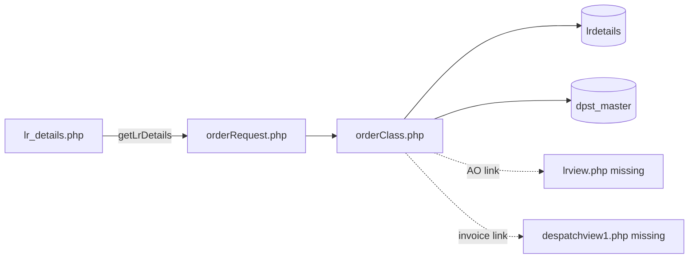
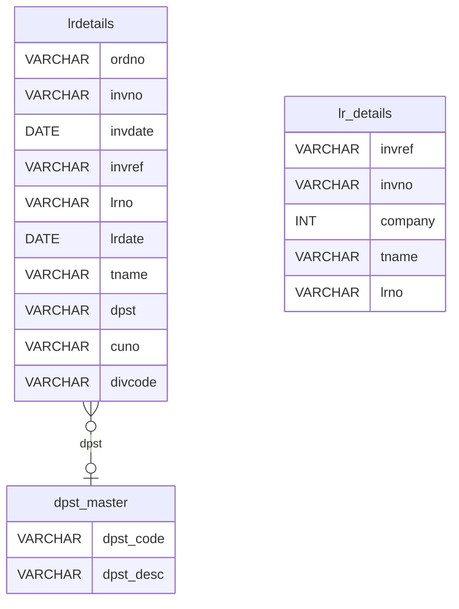
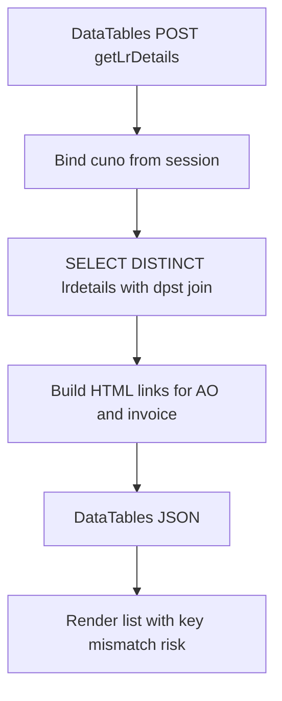
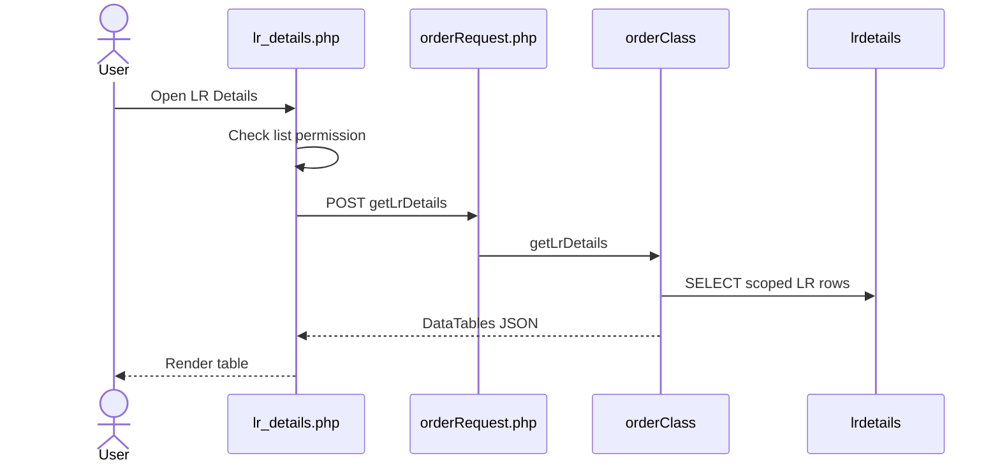
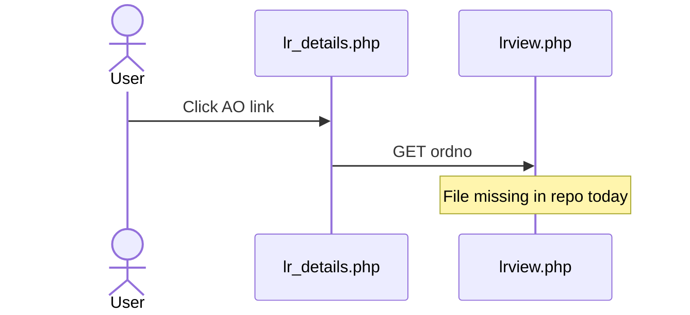
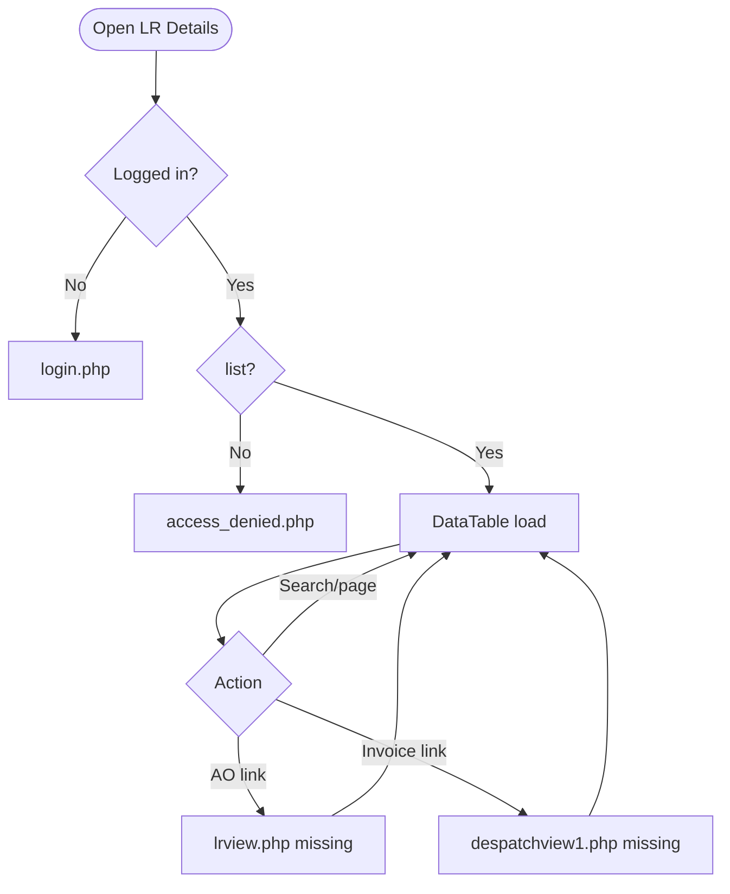
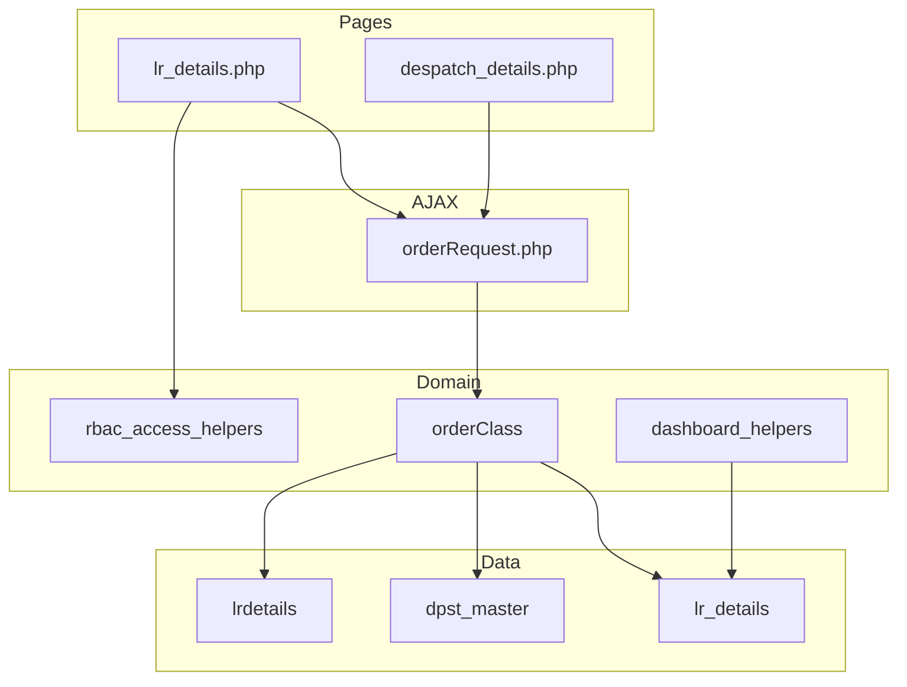

# Low-Level Design (LLD) — LR Details Module

| Attribute | Value |
|-----------|--------|
| Module | LR Details (Lorry Receipt List / View) |
| Menu path | ORDERS → LR Details |
| Landing page | `lr_details.php` |
| Application | Complaint / Dealer Portal |
| Stack (target) | Core PHP + MySQL (PDO) |
| Stack (current repo) | Core PHP + **PostgreSQL** via PDO (`$dpconn` dealerportal) |
| Document version | 1.0 |
| Access | RBAC module slug **`lr-details`** / permission **`list`** |

---

## **1. Module Overview**

### 1.1 Purpose

Authenticated users with LR Details permissions browse Lorry Receipt (LR) rows from Dealerportal table `lrdetails`, enriched with product-group description from `dpst_master`. The list is server-side DataTables via `orderRequest.php` → `orderClass::getLrDetails()`. The module is read-only; detail/view PHP targets referenced by the API are currently missing from the repo.

### 1.2 Scope

| In scope | Out of scope |
|----------|--------------|
| LR list (DataTables) | Creating / updating LR in ERP |
| Product group / AO / invoice / transporter / LR no+date | Despatch Details primary UI |
| RBAC `lr-details`/`list` | Writing packing into `despatch` |
| Sibling relationship to Despatch (noted) | Dashboard KPI implementation (uses `lr_details` join on despatch) |
| Intended detail links (`lrview.php`) | Working detail pages (targets missing) |

### 1.3 High-level architecture



---

## **2. Functional Requirements**

| ID | Requirement | Priority |
|----|-------------|----------|
| FR-01 | User with `lr-details`/`list` can open LR Details list | Must |
| FR-02 | Server-side DataTables list from `lrdetails` | Must |
| FR-03 | Scope rows to session customer `cuno` | Must |
| FR-04 | Exclude `divcode = '6'` | Must |
| FR-05 | Show product group, AO, invoice, despatch date, transporter, LR no, LR date | Must |
| FR-06 | Join `dpst_master` for product-group description | Should |
| FR-07 | Global search on dpst / AO / invoice / LR / transporter | Should |
| FR-08 | Open LR detail by AO (`lrview.php`) | Should (target missing) |
| FR-09 | Open despatch/invoice view from invoice link | Could (target missing) |
| FR-10 | Deduplicate logical LR keys | Should |

---

## **3. User Roles & Permissions**

### 3.1 RBAC module slug

| Resource | Module | Permission |
|----------|--------|------------|
| `lr_details.php` / menu | `lr-details` | `list` |

Unauthenticated → `login.php`. No `list` → `access_denied.php`.

Sidebar: `rbac_can_access_menu($obconn, 'lr_details.php')`.

### 3.2 Page / API mapping

| Resource | Gate |
|----------|------|
| `lr_details.php` | `list` |
| `POST orderRequest.php` `getLrDetails` | Session only — **no** module RBAC |

`rbac_api_access_rules()` does not list `orderRequest.php`.

### 3.3 Scoping notes

| Layer | Scope |
|-------|--------|
| LR list API | Always `cuno = customer_number_vayu` (fallback **`'10001'`**) |
| Admin/Management seeAll | **Not implemented** |
| Sales coordinator widen | Dashboard helpers only — **not** on LR API |

---

## **4. Business Rules**

| ID | Rule |
|----|------|
| BR-01 | LR list row = `lrdetails` with `divcode <> '6'` and matching `cuno`. |
| BR-02 | Customer scope: `cuno = session customer_number_vayu` (or `'10001'`). |
| BR-03 | Product group from `dpst` (+ `dpst_desc` via join). |
| BR-04 | Deduplication via `DISTINCT` on `(ordno, invno, invdate, invref)`. |
| BR-05 | Sort by `invdate DESC`. |
| BR-06 | Read-only module — no insert/update/delete of LR in this UI. |
| BR-07 | Soft-delete / `deleted_at` not used on this path. |
| BR-08 | AO link targets `lrview.php?ordno=` — **file missing**. |
| BR-09 | Invoice link targets `despatchview1.php?invref=&invno=` — **file missing**. |
| BR-10 | LR list uses table **`lrdetails`**; Despatch/Dashboard join uses **`lr_details`** — different sources. |
| BR-11 | No date-range filter (DataTables global search only). |
| BR-12 | No modals on LR page. |
| BR-13 | UI column keys currently mismatch API JSON keys (known defect). |
| BR-14 | No status workflow column — presence in `lrdetails` with filters = listed. |

---

## **5. Database Design**

### 5.1 Logical model



Note: `lr_details` (underscore) is used by Despatch/Dashboard, not by this list API.

### 5.2 Tables

| Table | Conn | Role |
|-------|------|------|
| `lrdetails` | `$dpconn` | Primary LR list source |
| `dpst_master` | `$dpconn` | Product group description |
| `lr_details` | `$dpconn` | Used by Despatch Details / dashboard — sibling data path |

### 5.3 List query pattern

```sql
SELECT DISTINCT
  l.ordno, l.invno, l.invdate, l.invref, l.lrno, l.lrdate,
  l.tname, l.dpst, d.dpst_desc
FROM lrdetails l
LEFT JOIN dpst_master d
  ON TRIM(l.dpst) = TRIM(d.dpst_code::text)
WHERE l.cuno = :cuno
  AND l.divcode <> '6'
  AND /* optional ILIKE search */
ORDER BY l.invdate DESC
LIMIT :length OFFSET :start;
```

---

## **6. API / Backend Design**

### 6.1 Page endpoints

| Endpoint | Method | Auth | Description |
|----------|--------|------|-------------|
| `lr_details.php` | GET | `lr-details`/`list` | LR list |

### 6.2 AJAX — `POST orderRequest.php`

| Action | Description |
|--------|-------------|
| `getLrDetails` | DataTables JSON for LR list |

### 6.3 Response shape (API keys)

| API key | Content |
|---------|---------|
| `dpst` / `dpst_desc` | Product group |
| `ordno` | AO number (HTML link to `lrview.php`) |
| `invoice` | Invoice number (HTML link to `despatchview1.php`) |
| `invdate` | Despatch / invoice date |
| `tname` | Transporter |
| `lrno` | LR number |
| `lrdate` | LR date |

### 6.4 Core PHP responsibilities

| File | Role |
|------|------|
| `lr_details.php` | List UI + RBAC + DataTable init |
| `orderRequest.php` | Action router |
| `orderClass.php` | `getLrDetails()` |
| `includes/rbac_access_helpers.php` | Page/menu AuthZ |
| `despatch_details.php` / dashboard helpers | Sibling consumers of `lr_details` |

---

## **7. Validation Rules**

### 7.1 Server-side

| Field / rule | Behavior |
|--------------|----------|
| Session + `list` | Redirect login / access_denied |
| DataTables params | `draw` / `start` / `length` cast; search bound as `%…%` |
| Customer bind | Always session `cuno` (or default) |
| CSRF | **Not implemented** |

### 7.2 Client-side

- DataTables serverSide `#LrTable`; `pageLength` 10; `scrollX`
- No Select2 widgets (Select2 CSS may be linked unused)
- No date pickers / custom filters
- No validate.js form (read-only)

---

## **8. UI Screen Specifications**

### 8.1 List — `lr_details.php`

| Element | Spec |
|---------|------|
| Table | `#LrTable` DataTables serverSide |
| Intended columns | Product Group, AO Number, Invoice No, Despatch Date, Transporter, LR Number, LR Date |
| Page length | 10 |
| Search | DataTables global search |
| Modals | None |
| Select2 | **Not used** |
| Layout | Similar to orphaned `dispatch_details.php` style |

### 8.2 UI ↔ API column mismatch (critical)

| UI `columns.data` | API key | Result |
|-------------------|---------|--------|
| `dpst` | `dpst` | OK |
| `ordno` | `ordno` | OK (HTML) |
| `invno` | **`invoice`** | Blank / wrong |
| `invdt` | **`invdate`** | Blank / wrong |
| `transporter` | **`tname`** | Blank / wrong |
| `lrno` | `lrno` | OK |
| `packing` | **`lrdate`** | Wrong cell |
| `weight` | *(not returned)* | Blank; 8th col vs 7 headers |

### 8.3 Detail navigation (intended)

| Link | Target | Status |
|------|--------|--------|
| AO | `lrview.php?ordno=` | **Missing file** |
| Invoice | `despatchview1.php?invref=&invno=` | **Missing file** |

---

## **9. Database Flow**

### 9.1 List load



### 9.2 Sibling data path (Despatch)


---

## **10. Sequence Diagram**

### 10.1 List DataTables



### 10.2 Open AO link (intended)



---

## **11. Activity Diagram**



---

## **12. Class / Module Diagram**



### 12.1 Key functions

| Function | Role |
|----------|------|
| `getLrDetails` | Server-side LR list JSON |
| `getDespatchDetails` | Sibling despatch list (joins `lr_details`) |
| `orderClass` constructor | Sets `customer_code` (+ `'10001'` fallback) |
| `rbac_user_can` / `rbac_can_access_menu` | Page/menu gating |
| `dashboard_fetch_dispatched_count` | Uses `despatch` + `lr_details` (not this list) |

---

## **13. Folder Structure**

```text
ComplaintManagement/
├── lr_details.php
├── despatch_details.php
├── orderRequest.php
├── orderClass.php
├── access_denied.php
├── includes/
│   ├── rbac_access_helpers.php
│   └── dashboard_helpers.php
├── css/
│   ├── orderbook_style.css
│   └── select2_change.css
└── docs/
    └── LLD_LR_Details_Module.md
```

Missing referenced targets: `lrview.php`, `despatchview1.php`.

---

## **14. Error Handling**

| Layer | Pattern |
|-------|---------|
| Unauthenticated | Redirect `login.php` |
| No `list` | `access_denied.php` |
| AJAX | DataTables JSON (method echoes JSON; router may also echo null) |
| Success flashes | **None** (read-only) |
| Dead view links | Browser 404 / missing page |

### 14.1 User-visible messages

| Message / UI | When |
|--------------|------|
| Access denied page | Missing `list` |
| Empty / wrong DataTable cells | Column key mismatch or no rows |
| Broken AO / invoice links | Missing view PHP files |

---

## **15. Security Considerations**

| Area | Control |
|------|---------|
| Page AuthZ | RBAC `lr-details`/`list` |
| AJAX AuthZ gap | `orderRequest` lacks module permission check |
| Customer fallback | Missing session customer → `'10001'` |
| No seeAll | Admins still customer-scoped on list API |
| XSS risk | AO/invoice HTML embeds ERP fields; URL params urlencoded, display may not be fully escaped |
| Dual table names | Easy to query `lr_details` vs `lrdetails` incorrectly |
| CSRF | **Not implemented** on AJAX |
| Dead detail targets | Missing `lrview.php` / `despatchview1.php` |
| `display_errors` | Enabled in `orderClass.php` (information leakage risk) |

---

## **16. Audit Logs**

### 16.1 Built-in field-level audit

| Item | Behavior |
|------|----------|
| LR list audit table | **Not implemented** |
| Module nature | Read-only ERP LR aggregation |
| LR creation audit | Owned by ERP / warehouse systems outside this UI |

---

## **17. Test Cases**

### 17.1 Functional

| ID | Scenario | Expected |
|----|----------|----------|
| TC-01 | Guest opens LR Details | Redirect login |
| TC-02 | User without `list` | `access_denied.php` |
| TC-03 | User with `list` | DataTable requests `getLrDetails` |
| TC-04 | Session with valid `cuno` | Only that customer’s LR rows |
| TC-05 | `divcode = '6'` | Excluded |
| TC-06 | Search by AO / LR / transporter | Filtered rows |
| TC-07 | UI column keys vs API | **Gap:** blank/wrong cells for several columns |
| TC-08 | Click AO link | **Gap:** `lrview.php` missing |
| TC-09 | Click invoice link | **Gap:** `despatchview1.php` missing |
| TC-10 | Admin without customer_number_vayu | Falls back to `10001` |
| TC-11 | User without `list` but hits AJAX | **Gap:** may still get data if session valid |
| TC-12 | Despatch list packing fields | Come from `lr_details`, not this module’s `lrdetails` query |

---

## **18. Assumptions & Dependencies**

### 18.1 Assumptions

1. `lr-details`/`list` is assigned to roles that may see LRs.
2. ERP writes `lrdetails`; portal does not create LR rows here.
3. Live menu path is `lr_details.php` despite UI↔API column mismatch.
4. `lrdetails` and `lr_details` may both exist in dealerportal with related but not identical data.
5. Detail view PHP pages may be restored later; currently missing.
6. Document target stack Core PHP + MySQL; repo runs PostgreSQL (`ILIKE`, `DISTINCT`).
7. Aligning DataTables `columns.data` to API keys (`invoice`, `invdate`, `tname`, `lrdate`) is required for a usable list.

### 18.2 Dependencies

| Dependency | Purpose |
|------------|---------|
| RBAC / Assign Permissions | `lr-details` grants |
| `$dpconn` / `lrdetails` | List source |
| `dpst_master` | Product group label |
| `orderClass` / `orderRequest` | Shared order AJAX surface |
| DataTables + jQuery | List UX |
| Despatch Details / Dashboard | Sibling consumers of `lr_details` |

---

## Appendix A — API vs UI column keys

| UI expectation | API key |
|----------------|---------|
| Product Group | `dpst` (`dpst_desc` also returned) |
| AO Number | `ordno` |
| Invoice No | `invoice` (UI looks for `invno`) |
| Despatch Date | `invdate` (UI looks for `invdt`) |
| Transporter | `tname` (UI looks for `transporter`) |
| LR Number | `lrno` |
| LR Date | `lrdate` (UI looks for `packing`) |
| Weight | Not returned (UI still defines `weight`) |

---

## Appendix B — Select2 control map

**N/A.** Select2 CSS may be included; no Select2 controls on LR Details list.

---

## Appendix C — RBAC permission matrix

| Permission | Effect |
|------------|--------|
| `list` | Open LR Details page and sidebar link |

No separate `view` / `export-excel` flags on the live LR page today.

---

## Appendix D — Inclusion filters

| Filter | Value |
|--------|-------|
| Customer | `cuno = session customer` |
| Division | `divcode <> '6'` |
| Dedup | `DISTINCT` on ordno/invno/invdate/invref |
| Sort | `invdate DESC` |

---

## Appendix E — ORDERS menu position

```text
ORDERS
├── Recent Orders
├── Despatch Details   → despatch JOIN lr_details
└── LR Details         → lrdetails list (this module)
```

---

## Appendix F — Known defects checklist

| Defect | Impact |
|--------|--------|
| UI↔API column key mismatch | Blank/wrong columns |
| Missing `lrview.php` | Dead AO links |
| Missing `despatchview1.php` | Dead invoice links |
| No API RBAC | AuthZ gap |
| No admin seeAll | Admins limited to one cuno / default |
| Dual table names | Confusion with Despatch join source |
| Extra `weight` column def | Header/column count mismatch |

---

*End of LLD — LR Details Module*
