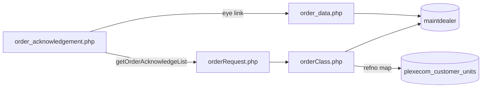
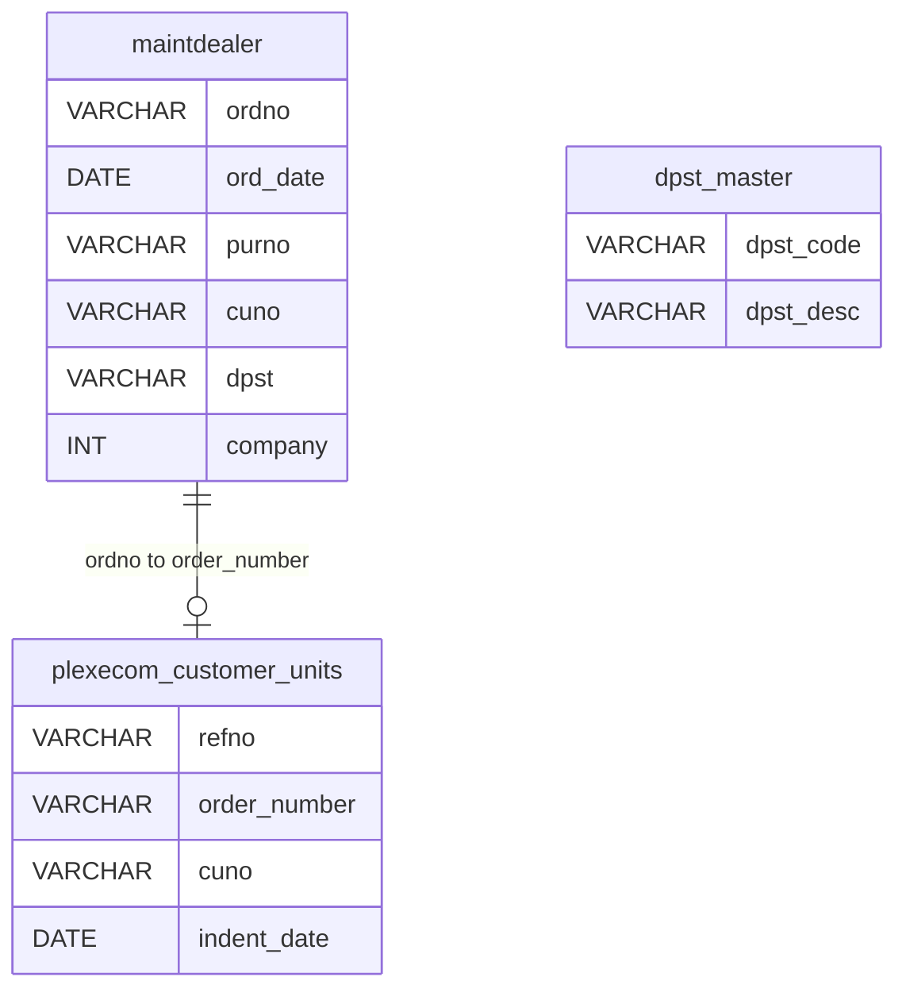
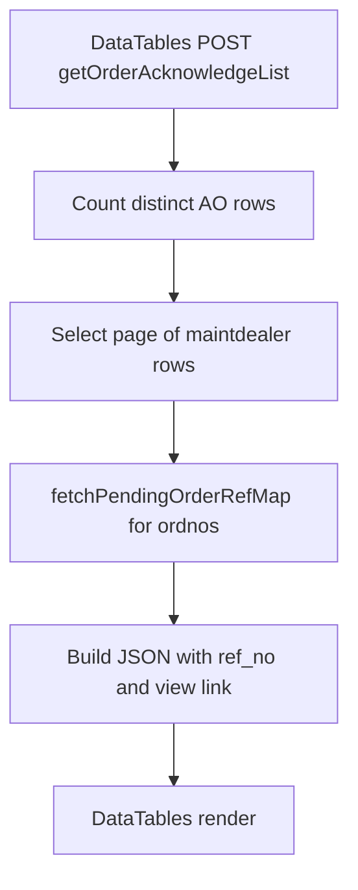
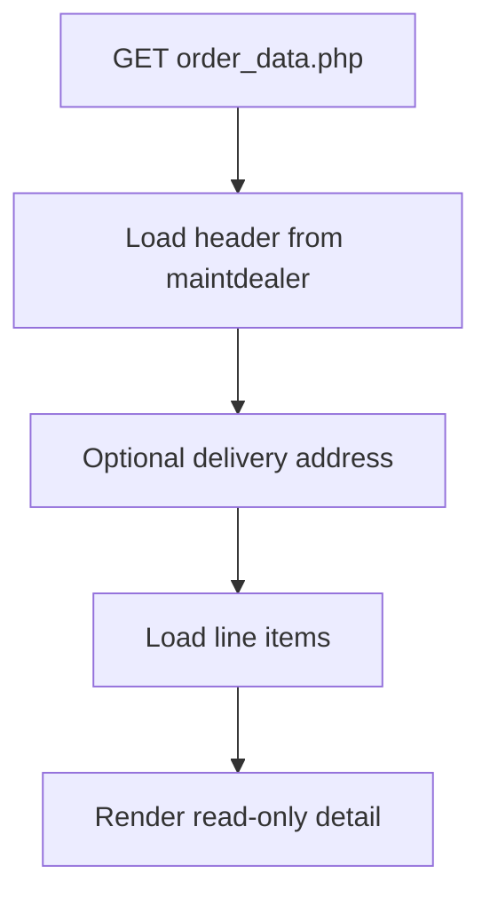
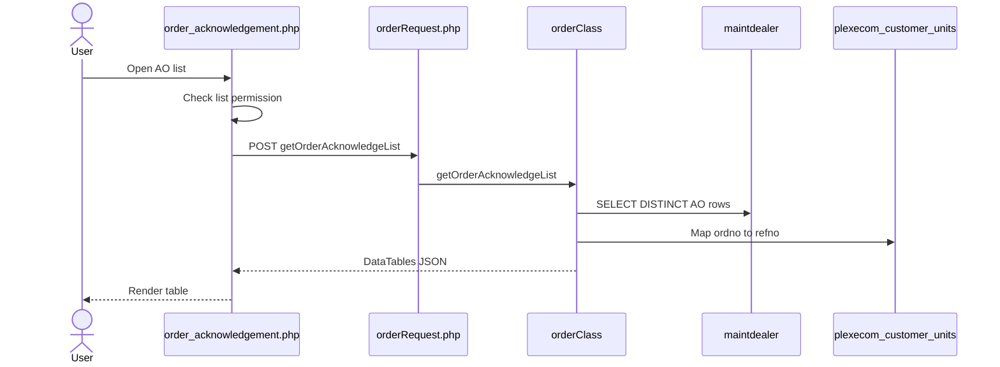
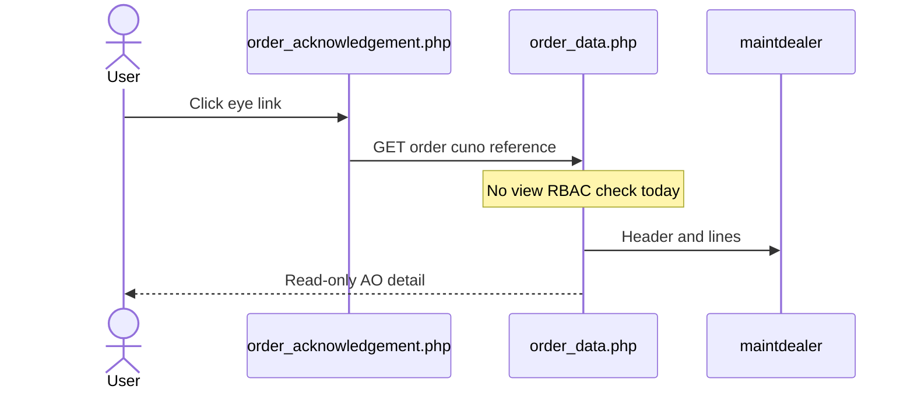
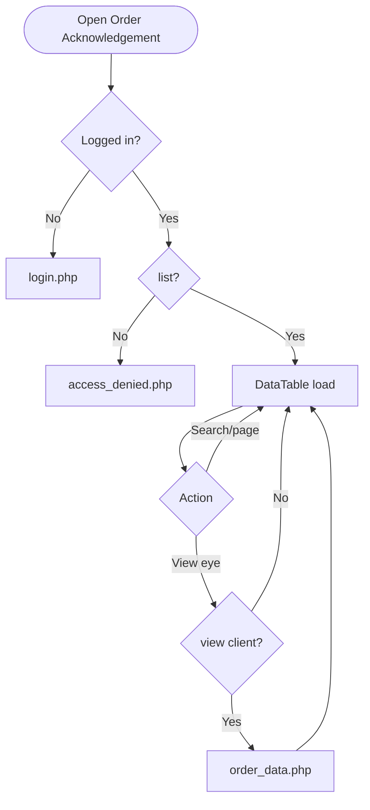
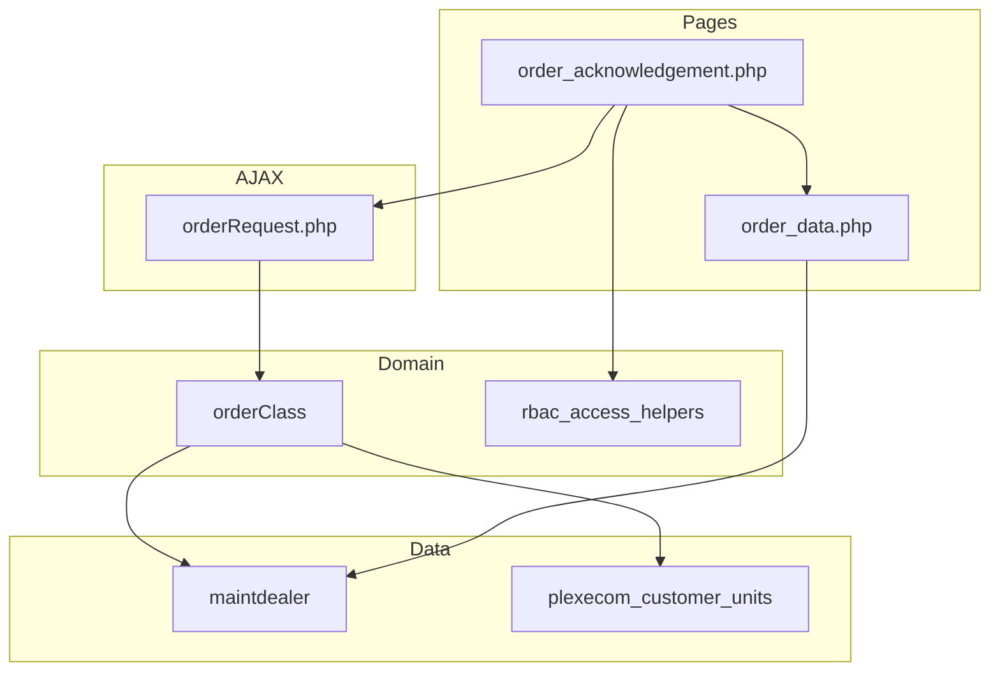

# Low-Level Design (LLD) — Order Acknowledgement Module

| Attribute | Value |
|-----------|--------|
| Module | Order Acknowledgement (AO List / View) |
| Menu path | ORDER BOOKING → Order Acknowledgement |
| Landing page | `order_acknowledgement.php` |
| Detail page | `order_data.php` |
| Application | Complaint / Dealer Portal |
| Stack (target) | Core PHP + MySQL (PDO) |
| Stack (current repo) | Core PHP + **PostgreSQL** via PDO (`$obconn`, `$dpconn`) |
| Document version | 1.0 |
| Access | RBAC module slug **`order-acknowledgement`** / permission **`list`** (view eye: **`view`**) |

---

## **1. Module Overview**

### 1.1 Purpose

Authenticated users with Order Acknowledgement permissions browse ERP-acknowledged orders (AO) from `maintdealer` and open a read-only detail view. The list is server-side DataTables via `orderRequest.php` → `orderClass::getOrderAcknowledgeList()`. Optional Ref No is resolved from booking table `plexecom_customer_units` by matching `order_number` to AO `ordno`.

### 1.2 Scope

| In scope | Out of scope |
|----------|--------------|
| AO list (DataTables) | Order Booking create / cart submit |
| AO detail view (`order_data.php`) | Pending Orders list UI |
| RBAC list / view (export-excel reserved) | Despatch Details UI |
| Ref No bridge from booking `order_number` | Creating / updating AO in ERP |
| Dashboard “Acknowledged” KPI gate (related) | Excel export (button commented out) |

### 1.3 High-level architecture



---

## **2. Functional Requirements**

| ID | Requirement | Priority |
|----|-------------|----------|
| FR-01 | User with `order-acknowledgement`/`list` can open AO list | Must |
| FR-02 | Server-side DataTables list of AO rows | Must |
| FR-03 | Show Ref No, PO Number, AO Number, AO Date, Action | Must |
| FR-04 | View permission controls eye link visibility | Should |
| FR-05 | Open detail in new tab via `order_data.php` | Must |
| FR-06 | Resolve booking Ref No from `order_number` match | Should |
| FR-07 | Scope list to current customer / user context | Must |
| FR-08 | Global search by AO number | Should |
| FR-09 | Export Excel when permitted | Could (UI commented out) |

---

## **3. User Roles & Permissions**

### 3.1 RBAC module slug

| Resource | Module | Permission |
|----------|--------|------------|
| `order_acknowledgement.php` | `order-acknowledgement` | `list` |
| Eye / view link | `order-acknowledgement` | `view` |
| Export (reserved) | `order-acknowledgement` | `export-excel` |

Gate on list page: `rbac_user_can(..., 'list')` → else `access_denied.php`. Unauthenticated → `login.php`.

Sidebar: `rbac_can_access_menu($obconn, 'order_acknowledgement.php')`.

### 3.2 Page / API mapping

| Resource | Gate |
|----------|------|
| `order_acknowledgement.php` | `list` |
| `POST orderRequest.php` `getOrderAcknowledgeList` | Session only — **no** module RBAC |
| `order_data.php` | **Not** in `rbac_page_access_rules` — any logged-in user with URL |

### 3.3 Client-side view gating

`$canViewOrderAck` passed to JS; eye links removed when `view` is false (client-side only — not a server gate on `order_data.php`).

### 3.4 Scoping notes

| Layer | Scope |
|-------|--------|
| List SQL | `maintdealer.cuno = :uname` where uname is session **`usr_name`** |
| Ref map | `plexecom_customer_units.cuno = customer_number_vayu` (or fallback) |
| Dashboard AO count | Admin/Management see-all; others customer-scoped |
| Contrast | Recent Orders may see-all for admin; **AO list has no see-all** |

---

## **4. Business Rules**

| ID | Rule |
|----|------|
| BR-01 | AO list row = distinct `maintdealer` order with `company != 600`. |
| BR-02 | AO identity = ERP `ordno`; AO date = `ord_date`; PO = `purno`. |
| BR-03 | List excludes `company = 600`. |
| BR-04 | Ref No = booking `refno` where `TRIM(order_number)` matches AO `ordno` (latest by indent_date). |
| BR-05 | Read-only module — no create/update/delete of AO in this UI. |
| BR-06 | Detail URL: `order_data.php?order={ordno}&cuno={cuno}&reference=order_acknowledgement`. |
| BR-07 | Sidebar highlights AO when `reference=order_acknowledgement`. |
| BR-08 | Dashboard “Acknowledged” uses **`plexecom_customer_units.order_number` non-empty** — different definition than AO list (`maintdealer`). |
| BR-09 | No date-range filter on AO list. |
| BR-10 | Export Excel button is commented out (permission still evaluated). |
| BR-11 | Soft-delete / `deleted_at` not used on this path. |
| BR-12 | Legacy `getAcknowledgeLine` ( `tbl_vayu_orders_line` ) is unused by current list UI. |

---

## **5. Database Design**

### 5.1 Logical model



### 5.2 Tables

| Table | Conn | Role |
|-------|------|------|
| `maintdealer` | `$dpconn` | AO list + detail header/lines |
| `dpst_master` | `$dpconn` | Optional dpst description join |
| `customer_master` | `$dpconn` | Detail header join |
| `cust_delivery_address` | `$dpconn` | Detail delivery when `del_add` length = 3 |
| `plexecom_customer_units` | `$obconn` | Ref No bridge via `order_number` |

### 5.3 List query pattern

```sql
SELECT DISTINCT m.cuno, m.ordno, m.ord_date, m.purno, m.dpst, d.dpst_desc
FROM maintdealer m
LEFT JOIN dpst_master d ON trim(m.dpst) = d.dpst_code::text
WHERE company != 600
  AND cuno = :uname
ORDER BY m.ord_date DESC
LIMIT :length OFFSET :start;
```

### 5.4 Ref No map pattern

```sql
-- Conceptual: DISTINCT ON (order_number) refno
-- WHERE TRIM(order_number) IN (:aos) AND cuno = :customer_code
-- ORDER BY order_number, indent_date DESC
```

---

## **6. API / Backend Design**

### 6.1 Page endpoints

| Endpoint | Method | Auth | Description |
|----------|--------|------|-------------|
| `order_acknowledgement.php` | GET | `order-acknowledgement`/`list` | AO list |
| `order_data.php` | GET `order`, `cuno`, `reference` | Session only (gap) | AO detail |

### 6.2 AJAX

| Endpoint | Action | Description |
|----------|--------|-------------|
| `POST orderRequest.php` | `getOrderAcknowledgeList` | DataTables JSON |
| `POST orderRequest.php` | `getAcknowledgeLine` | Legacy line HTML — unused by list |

### 6.3 Core PHP responsibilities

| File | Role |
|------|------|
| `order_acknowledgement.php` | Page + RBAC flags + DataTable init |
| `order_data.php` | Read-only AO detail |
| `orderRequest.php` | Action router |
| `orderClass.php` | `getOrderAcknowledgeList`, `fetchPendingOrderRefMap` |
| `includes/rbac_access_helpers.php` | Page/menu AuthZ |
| `css/order_acknowledge_style.css` | List styling |

---

## **7. Validation Rules**

### 7.1 Server-side

| Field / rule | Behavior |
|--------------|----------|
| Session user | Empty → `login.php` |
| `list` permission | Fail → `access_denied.php` |
| DataTables params | `start` / `length` / search string |
| Detail `order` / `cuno` | Prepared queries; no module `view` check |

### 7.2 Client-side

- DataTables serverSide; pageLength 10; `scrollX`
- Remove view links when `$canViewOrderAck` is false
- No Select2 filters; no date pickers on list
- No validate.js form (read-only)

### 7.3 Known search gap

Count query may apply `ordno ILIKE :search`, but main data SQL historically **omits** the same `$where` — search may not filter displayed rows.

---

## **8. UI Screen Specifications**

### 8.1 List — `order_acknowledgement.php`

| Element | Spec |
|---------|------|
| Table | `#orderTable` DataTables serverSide |
| Columns | Ref No, PO Number, AO Number, AO Date, Action |
| Action | Eye link → detail (if `view`) |
| Export | Excel button commented out |
| Page length | 10 |
| Select2 | Loaded globally; **not used** on this list |
| Modals | None |

### 8.2 Detail — `order_data.php`

| Element | Spec |
|---------|------|
| Header | AO / customer fields from `maintdealer` ⋈ `customer_master` |
| Delivery | `cust_delivery_address` when applicable |
| Lines | Positions: item, UOM, qty, price, dates |
| Navigation | `reference=order_acknowledgement` keeps AO menu active |

### 8.3 Libraries

DataTables 1.13.x + Bootstrap 5 + jQuery; shared `orderbook_style.css`.

---

## **9. Database Flow**

### 9.1 List load



### 9.2 Detail load



---

## **10. Sequence Diagram**

### 10.1 List DataTables



### 10.2 Open detail



---

## **11. Activity Diagram**



---

## **12. Class / Module Diagram**



### 12.1 Key functions

| Function | Role |
|----------|------|
| `getOrderAcknowledgeList` | Server-side AO list JSON |
| `fetchPendingOrderRefMap` | AO `ordno` → booking `refno` |
| `getAcknowledgeLine` | Legacy line HTML (unused by list) |
| `rbac_user_can` | list / view / export-excel flags |
| Dashboard helpers | “Acknowledged” KPI from booking `order_number` |

---

## **13. Folder Structure**

```text
ComplaintManagement/
├── order_acknowledgement.php
├── order_data.php
├── orderRequest.php
├── orderClass.php
├── exportOrders.php
├── access_denied.php
├── includes/
│   ├── rbac_access_helpers.php
│   └── dashboard_helpers.php
├── css/
│   ├── order_acknowledge_style.css
│   └── orderbook_style.css
└── docs/
    └── LLD_Order_Acknowledgement_Module.md
```

---

## **14. Error Handling**

| Layer | Pattern |
|-------|---------|
| Unauthenticated | Redirect `login.php` |
| No `list` | `access_denied.php` |
| AJAX | DataTables JSON (empty / error shapes per `orderClass`) |
| Detail missing | Page renders empty / limited data (no flash) |
| Success flashes | **None** (read-only) |

### 14.1 User-visible messages

| Message / UI | When |
|--------------|------|
| Access denied page | Missing `list` |
| Empty DataTable | No AO rows for scoped customer |
| No session flash | N/A for this module |

---

## **15. Security Considerations**

| Area | Control |
|------|---------|
| Page AuthZ | RBAC `order-acknowledgement`/`list` |
| View link | Client strip if no `view` |
| AJAX AuthZ gap | `orderRequest` lacks module permission check |
| Detail IDOR gap | `order_data.php` not module-gated |
| Scoping mismatch | List uses `usr_name` as `cuno`; ref map uses `customer_number_vayu` |
| Customer fallback | Missing session customer → `'10001'` in class paths |
| Search integrity | `$where` may not apply to data SQL |
| Ref No mapping bug | Per-row `array_column` misuse can yield wrong/empty ref |
| CSRF | **Not implemented** on AJAX |
| Export | Commented out; legacy export lacks RBAC / wrong table |

---

## **16. Audit Logs**

### 16.1 Built-in field-level audit

| Item | Behavior |
|------|----------|
| AO list/view audit table | **Not implemented** |
| Module nature | Read-only aggregation of ERP + booking bridge |
| AO creation audit | Owned by ERP / booking acknowledgement process outside this UI |

---

## **17. Test Cases**

### 17.1 Functional

| ID | Scenario | Expected |
|----|----------|----------|
| TC-01 | Guest opens AO page | Redirect login |
| TC-02 | User without `list` | `access_denied.php` |
| TC-03 | User with `list` | DataTable loads AO rows |
| TC-04 | User without `view` | Eye links hidden |
| TC-05 | Click eye with `view` | Opens `order_data.php` with AO detail |
| TC-06 | AO matched to booking `order_number` | Ref No shown when map works |
| TC-07 | `company = 600` rows | Excluded from list |
| TC-08 | Search by AO number | Should filter (verify data SQL applies search) |
| TC-09 | Pagination | LIMIT/OFFSET page of 10 |
| TC-10 | Username ≠ customer number | List may be empty / mis-scoped |
| TC-11 | Direct `order_data.php` URL without `view` | **Gap:** may still open if logged in |
| TC-12 | Dashboard Acknowledged vs AO list | Counts may differ (plexecom vs maintdealer) |

---

## **18. Assumptions & Dependencies**

### 18.1 Assumptions

1. `order-acknowledgement`/`list` (and optionally `view`) are assigned to roles that may see AO.
2. ERP writes AO rows into `maintdealer`; portal does not create them in this module.
3. Booking acknowledgement populates `plexecom_customer_units.order_number` for Ref No bridging.
4. Live list path is `getOrderAcknowledgeList` over `maintdealer`, not `tbl_vayu_orders`.
5. Document target stack Core PHP + MySQL; repo runs PostgreSQL (`ILIKE`, `DISTINCT ON`).
6. Export Excel remains out of active UI until re-enabled and secured.

### 18.2 Dependencies

| Dependency | Purpose |
|------------|---------|
| RBAC / Assign Permissions | `order-acknowledgement` grants |
| `$dpconn` / `maintdealer` | AO list and detail |
| `$obconn` / `plexecom_customer_units` | Ref No bridge |
| `orderClass` / `orderRequest` | Shared order AJAX surface |
| DataTables + jQuery | List UX |
| Order Booking / ERP | Upstream AO creation |
| Dashboard helpers | Related KPI (different definition) |

---

## Appendix A — Column map (list)

| UI column | Source |
|-----------|--------|
| Ref No | `plexecom_customer_units.refno` via `order_number` = `ordno` |
| PO Number | `maintdealer.purno` |
| AO Number | `maintdealer.ordno` |
| AO Date | `maintdealer.ord_date` |
| Action | Eye → `order_data.php` |

---

## Appendix B — Select2 control map

**N/A on list.** Select2 is loaded globally but not used on Order Acknowledgement. No date filter controls.

---

## Appendix C — RBAC permission matrix

| Permission | Effect |
|------------|--------|
| `list` | Open AO list page |
| `view` | Show eye / open detail (client-enforced today) |
| `export-excel` | Reserved; Export button commented out |

---

## Appendix D — Acknowledged definition matrix

| Surface | Definition |
|---------|------------|
| AO list (this module) | Row in `maintdealer` with `company != 600` |
| Dashboard / pipeline “Acknowledged” | `plexecom_customer_units.order_number` non-empty |
| Recent Orders “AO” badge | `order_number` set and not yet despatched |

---

## Appendix E — Pipeline position

```text
Order Booking (plexecom, order_number empty)
        ↓ ERP acknowledgement
Order Acknowledgement list (maintdealer.ordno)
        ↕ optional refno via order_number
Pending / Despatch (separate modules)
```

---

*End of LLD — Order Acknowledgement Module*
