# Low-Level Design (LLD) — Order Booking Module

| Attribute | Value |
|-----------|--------|
| Module | Order Booking (Create / Submit Dealer Orders) |
| Menu path | ORDER BOOKING → Order Booking (or equivalent sidebar) |
| Landing page | `orderbooking.php` |
| Application | Complaint / Dealer Portal |
| Stack (target) | Core PHP + MySQL (PDO) |
| Stack (current repo) | Core PHP + **PostgreSQL** via PDO (`$obconn`, `$dpconn`) |
| Document version | 1.1 |
| Access | RBAC module slug **`order-booking`** / permission **`create-order`** |

---

## **1. Module Overview**

### 1.1 Purpose

Authenticated users with Order Booking create permission build a product cart and submit dealer orders. Draft lines live in `tbl_vayu_cartitems` (`status = 0`). On submit, the system inserts one `plexecom_customer_units` row per cart line under a shared `refno`, clears the cart, and (live path) posts a ProcessSalesOrder XML to ION. Success redirects to Recent Orders for the new `refno`.

### 1.2 Scope

| In scope | Out of scope |
|----------|--------------|
| Header form + product cart + submit | Order Acknowledgement list UI |
| Cart AJAX (add / update / delete / price) | Pending Orders / Despatch Details UIs |
| `submitCartApi` (live) + legacy `submitCart` | Installed Base soft-delete `orders` / `api/order_create.php` |
| Customer address / dealer / product Select2 | Complaint Entry |
| Price breakup modal (display GST/freight) | Full EDI monitoring console |

### 1.3 High-level architecture

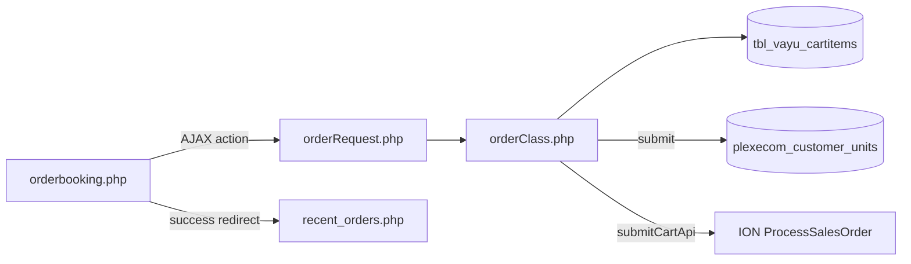

---

## **2. Functional Requirements**

| ID | Requirement | Priority |
|----|-------------|----------|
| FR-01 | User with `order-booking`/`create-order` can open booking page | Must |
| FR-02 | Capture header: category, area, PO, delivery date, terms, transporter, address, order type | Must |
| FR-03 | Search/add products to cart with qty and price | Must |
| FR-04 | Prevent mixed Units/Spares in one cart | Must |
| FR-05 | Update qty and remove cart lines | Must |
| FR-06 | Show cart totals and price breakup (display) | Should |
| FR-07 | Submit order → persist lines under new `refno` | Must |
| FR-08 | Live submit posts order to ION (`submitCartApi`) | Must |
| FR-09 | Clear draft cart after successful book | Must |
| FR-10 | Redirect to Recent Orders with `order_no` | Should |
| FR-11 | Dealer Engineer / ELGi Engineer: dealer Select2 for addresses | Should |

---

## **3. User Roles & Permissions**

### 3.1 RBAC module slug

| Resource | Module | Permission |
|----------|--------|------------|
| `orderbooking.php` | `order-booking` | `create-order` |

Gate: `rbac_user_can($obconn, 'order-booking', 'create-order')`. Denied → `access_denied.php`. Unauthenticated → `login.php`.

Sidebar uses the same page → module/permission map.

### 3.2 AJAX access

| Resource | Gate |
|----------|------|
| `orderRequest.php` | Session / idle / `session_version` only — **no** `order-booking`/`create-order` check |

**Gap:** any authenticated user who can call the endpoint may invoke cart/submit actions.

### 3.3 Role UI differences

| Role | Id | Booking UI note |
|------|----|-----------------|
| Dealer User | 1 | Address via session customer (if set) |
| Dealer Engineer | 2 | Extra `#dealerlist` Select2 |
| ELGi Engineer | 3 | Extra `#dealerlist` Select2 |
| Others | 4–7 | No dealer list block (`in_array([2,3])`) |

### 3.4 Customer scoping on create

Order `cuno` = `$_SESSION['customer_number_vayu'] ?? '10001'`.  
Dealer list filters **address search** only; selected dealer is **not** written as booking customer on submit. Login often does not populate `customer_number_vayu` → frequent fallback to `'10001'`.

---

## **4. Business Rules**

| ID | Rule |
|----|------|
| BR-01 | Draft = cart rows with `created_by = usr_name` and `status = 0`. |
| BR-02 | Booked lines insert immediately; no draft flag on `plexecom_customer_units`. |
| BR-03 | One shared `refno` per submit for all cart lines. |
| BR-04 | `refno` = `E/UNITS/{YYMMDD}{4-digit nextval('dp_spares')}`. |
| BR-05 | Cart cannot mix different `order_type` values (Units vs Spares). |
| BR-06 | Duplicate cart item merges qty/price for same `item_code` (+ dpst/order_type). |
| BR-07 | After submit, user’s active cart rows are **hard-deleted**. |
| BR-08 | Inserted line `status = 'A'`; `edistatus = 'Y'`; `order_number` empty at create. |
| BR-09 | Live UI submit uses **`submitCartApi`**; `submitCart` button is hidden (`d-none`). |
| BR-10 | `submitCartApi` forces delivery terms `"CIF"`; `dpst` Units=`Y0001` / Spares=`Y0011`. |
| BR-11 | Missing product match for `tplcode`+`dpst` → line **skipped** (partial order possible). |
| BR-12 | Cart `price`/`total_amount` store line totals (qty × unit), not unit alone. |
| BR-13 | Display freight ≈ 4% of base; CGST/SGST 9%/9% in cart UI (display breakup). |
| BR-14 | Order Category UI locked Standard (`1`); Payment Term UI locked Advance (`804`). |
| BR-15 | `emp_code` hardcoded `"102464"` on insert. |
| BR-16 | Empty cart submit → `Cart is empty.` |
| BR-17 | Success → `SuccessModal` then `recent_orders.php?order_no={refno}`. |

---

## **5. Database Design**

### 5.1 ER / logical model

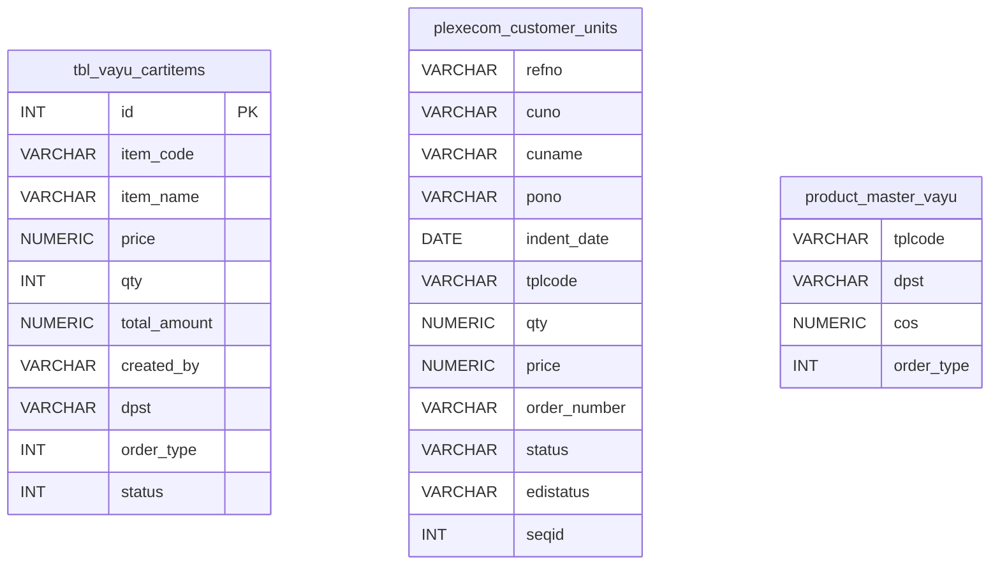

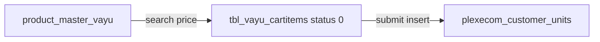

### 5.2 Tables

| Table | Conn | Role |
|-------|------|------|
| `tbl_vayu_cartitems` | `$obconn` | Draft cart (`status = 0`) |
| `plexecom_customer_units` | `$obconn` | Booked order lines |
| `product_master_vayu` | `$obconn` | Item search / price / attrs |
| `area`, `transporter_master`, `customer_address`, `customer_master` | ob/dp | Header lookups |
| `dpst_master`, `elgi_item_master`, `gst_hsn`, `user_master` | `$obconn` | Indent / HSN / tax / EDI email |
| Sequences `dp_spares`, `plexecom_unique_sequence` | `$obconn` | `refno` serial / `seqid` |

### 5.3 Booked line key fields (create)

| Field | Notes |
|-------|-------|
| `refno` | Shared booking id |
| `cuno` / `cuname` | Customer |
| `pono`, `indent_*`, `delivery_date` | Header |
| `tplcode`, `tpldesc`, `qty`, `price`, `dpst` | Line |
| `status` | `'A'` |
| `edistatus` | `'Y'` |
| `order_number` | Empty until acknowledgement |

### 5.4 Pipeline relation (downstream)

| Metric | Definition |
|--------|------------|
| Created | Distinct `refno` |
| Acknowledged | `order_number` (AO) non-empty |
| Pending | AO empty |
| Dispatched | AO matches `despatch.ordno` |

---

## **6. API / Backend Design**

### 6.1 Page endpoints

| Endpoint | Method | Auth | Description |
|----------|--------|------|-------------|
| `orderbooking.php` | GET | `order-booking`/`create-order` | Booking UI |

### 6.2 AJAX router — `POST orderRequest.php`

| Action | Description |
|--------|-------------|
| `searchItems` | Product Select2 |
| `getPrice` | Unit price + order-type guard |
| `addItem` | Insert/merge cart line |
| `getCartItems` | Render cart HTML |
| `updatePrice` | Update qty/total |
| `deleteItem` | Hard-delete cart row |
| `getCartPriceBreakup` / `getCartOrderPriceBreakup` | Display GST/freight |
| `customer_master` | Address Select2 |
| `search_dealer` | Dealer Select2 (`$dpconn`) |
| `submitCart` | DB-only book (UI hidden) |
| `submitCartApi` | Book + ION (live button) |

### 6.3 API flow (request / response)

All booking AJAX calls use **one entry point**:

```text
Browser → POST orderRequest.php (action=...) → orderClass method → JSON or HTML → jQuery handler
```

Session idle / `session_version` are enforced on `orderRequest.php`. Module RBAC `create-order` is enforced on the **page**, not on each AJAX action.

#### 6.3.1 Overall API router flow

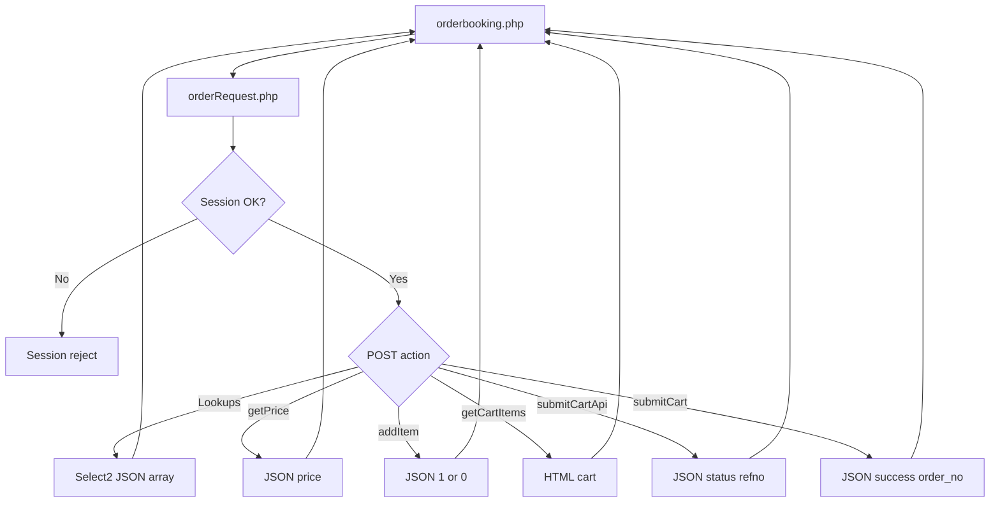

#### 6.3.2 Cart build API chain

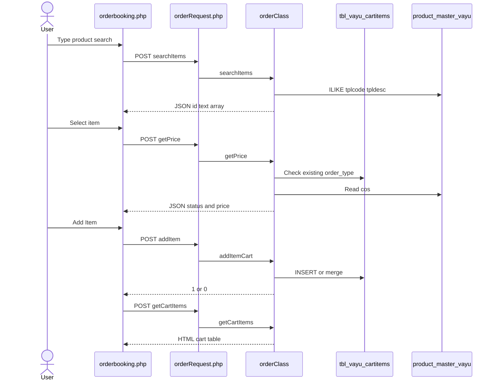

#### 6.3.3 Live submit API + response flow (`submitCartApi`)

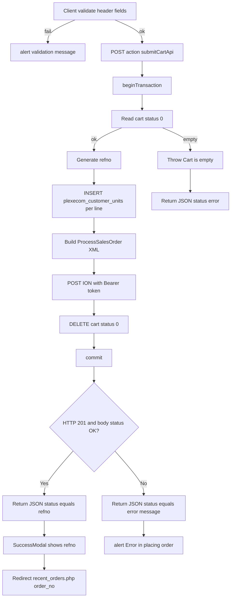

**Important:** `INSERT` into `plexecom_customer_units` and cart `DELETE` happen **before** the success JSON is returned. After ION success there is **no second INSERT/UPDATE** of order rows — only the JSON response to the browser.

#### 6.3.4 Request / response matrix

| Action | Main POST fields | Success response | UI handling |
|--------|------------------|------------------|-------------|
| `searchItems` | `search`, `ordertype` | `[{id, text}, ...]` | Select2 options |
| `getPrice` | `item`, `orderType` | `{status:true, price}` | Fill `#price` |
| `addItem` | `item`, `qty`, `price`, `orderType` | `1` | Alert + `getItems()` |
| `getCartItems` | (optional category) | HTML string | `$(".divCart").html(...)` |
| `submitCartApi` | header + address fields | `{status: "<refno>"}` | SuccessModal → Recent Orders |
| `submitCart` | header fields | `{status:"success", order_no}` | SuccessModal uses `order_no` |

| Action | Failure response | UI handling |
|--------|------------------|-------------|
| `getPrice` mixed types | `{status:false, message:"Items with different order types..."}` | Alert / block |
| `addItem` | `0` | `Unable to Add Item` |
| `submitCartApi` | `{status:"error", message}` or `{status:"<ION message>"}` | `Error in placing order ! Please contact IT` |
| unknown action | `{status:false, message:"Invalid action"}` | — |

#### 6.3.5 Success response shapes (submit)

**Live API path (`submitCartApi`):**

```json
{ "status": "E/UNITS/2608110001" }
```

UI treats truthy `res.status` as success and uses **`res.status` as the refno**.

**Hidden DB-only path (`submitCart`):**

```json
{ "status": "success", "order_no": "E/UNITS/2608110001" }
```

UI uses **`res.order_no`** for the modal and redirect.

### 6.4 Not this module

`api/order_create.php` / `orders` soft-delete table = Installed Base–style orders — **different** subsystem.

### 6.5 Core PHP responsibilities

| File | Role |
|------|------|
| `orderbooking.php` | Page shell, RBAC, inline JS UI |
| `orderRequest.php` | Action router |
| `orderClass.php` | Cart, submit, EDI, lookups |
| `pdo_obconn.php` | `$obconn` / `$dpconn` |
| `includes/rbac_access_helpers.php` | Page/menu AuthZ |
| `js/success_modal.js` / `js/pincode_select2.js` | Success UX / pincode |

---

## **7. Validation Rules**

### 7.1 Client-side (`orderbooking.php`)

| Context | Messages (examples) |
|---------|---------------------|
| Add item | `Please select an item` · `Please enter a quantity` · `Please enter a price` · `Please select a order type` · `Please check the quantity` |
| Submit header | `Please select a order category` · `Please select a delivery term` · `Please select a payment term` · `Please select a transporter` · `Please select area` · `Please select delivery date` · `Please enter PO Number` · `Please select ordertype` |
| Address / end customer | `Please select an address` · `Please enter name` · `Please enter email` · `Please enter street 1` · `Please select pincode` · `Please enter city/district/state` · `Please enter a valid email address` |
| Fail | `Error in placing order ! Please contact IT` · `Unable to fetch price breakup.` |

### 7.2 Server-side (`orderClass`)

| Rule | Message |
|------|---------|
| Empty cart | `Cart is empty.` |
| Order category (`submitCart`) | `Order category is required.` |
| Mixed order types | `Items with different order types cannot be added to the same cart...` |
| Insert fail | `Failed to insert order item` / `Error in request` |
| Price breakup | `Invalid cart item.` · `Cart item not found.` · `No cart items found.` |

**Gap:** most header fields (area, PO, transporter, email, etc.) are **client-only**; server largely trusts POST.

---

## **8. UI Screen Specifications**

### 8.1 Booking page — `orderbooking.php`

| Element | Spec |
|---------|------|
| Header card | Category, area, PO, delivery date, delivery terms, payment term, transporter, address type, order type |
| Product card | Item Select2, qty, price, Add Item |
| Cart section | Custom HTML table `#cartTable` (not DataTables) |
| Submit | **Submit Order Api** (live); Submit Order hidden |
| Modal | `#priceBreakupModal` line/order breakup |
| Date | jQuery UI datepicker `#dDate` (`dd.mm.yy`, `minDate: 0`) |
| Locked fields | Order Category Standard; Payment 100% Advance (`804`) |

### 8.2 Select2 controls

| Control | Purpose |
|---------|---------|
| Item search | Products from `product_master_vayu` |
| Customer address | Ship-to / invoice address |
| Dealer list | Roles 2/3 only |
| Transporter / Area / Delivery term | Header |
| Pincode | End-customer city/district/state (`pincode_select2.js`) |

### 8.3 Success UX

`SuccessModal`: title `Order Created Successfully`; message `Your order has been created successfully.`; then redirect `recent_orders.php?order_no=`.

---

## **9. Database Flow**

### 9.1 Submit (live `submitCartApi`)

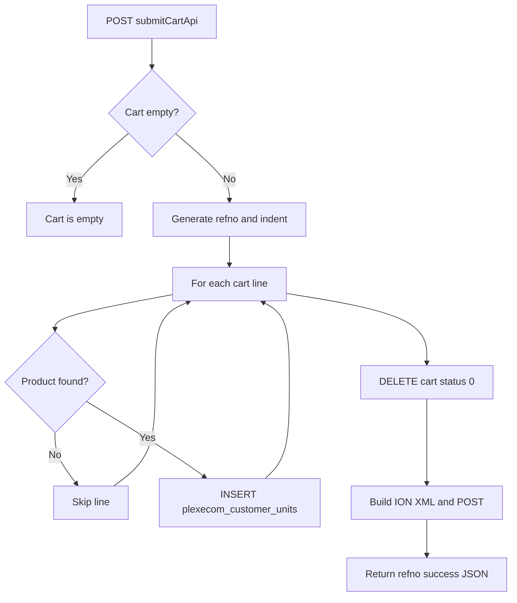

### 9.2 Cart draft

```sql
-- Active draft lines for user
SELECT * FROM tbl_vayu_cartitems
WHERE created_by = :usr_name
  AND status = 0;
```

### 9.3 Clear cart after book

```sql
DELETE FROM tbl_vayu_cartitems
WHERE created_by = :usr_name
  AND status = 0;
```

---

## **10. Sequence Diagram**

### 10.1 Add to cart

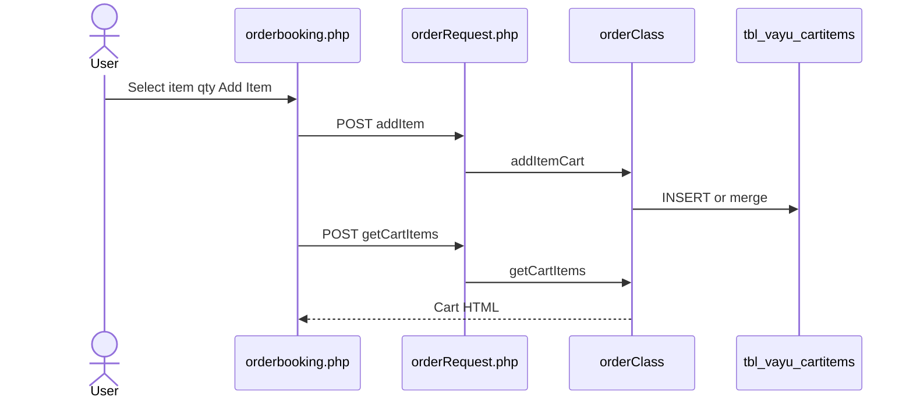

### 10.2 Submit via API

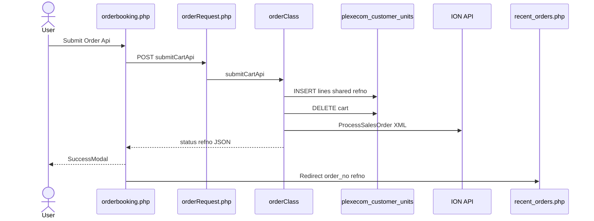

---

## **11. Activity Diagram**

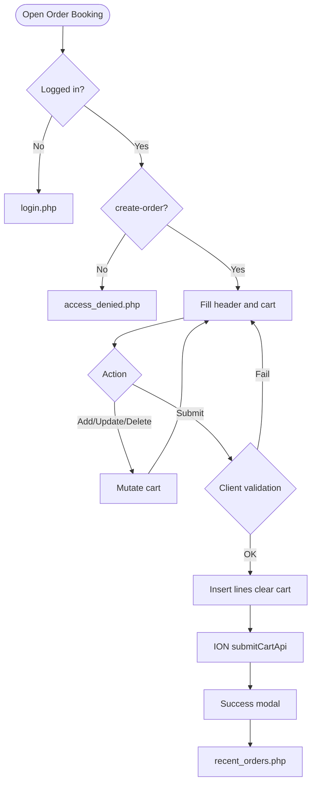

---

## **12. Class / Module Diagram**

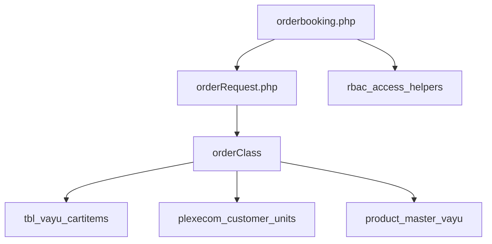

### 12.1 Key functions (`orderClass`)

| Function | Role |
|----------|------|
| `searchItems` | Product Select2 |
| `getPrice` | Unit price + mixed-type guard |
| `addItemCart` | Insert/merge cart |
| `getCartItems` | Cart HTML + totals |
| `deleteItem` / `updatePrice` | Cart mutations |
| `getCartPriceBreakup` / `getCartOrderPriceBreakup` | Display breakup |
| `submitCart` | DB-only book |
| `submitCartApi` | Book + ION |
| `customer_master` / `search_dealer` | Address / dealer Select2 |

---

## **13. Folder Structure**

```text
ComplaintManagement/
├── orderbooking.php
├── orderRequest.php
├── orderClass.php
├── recent_orders.php
├── access_denied.php
├── pdo_obconn.php
├── includes/
│   ├── rbac_access_helpers.php
│   ├── admin_access_helpers.php
│   └── login_helpers.php
├── css/
│   ├── orderbook_style.css
│   ├── success_modal.css
│   └── select2_change.css
├── js/
│   ├── success_modal.js
│   └── pincode_select2.js
└── docs/
    └── LLD_Order_Booking_Module.md
```

---

## **14. Error Handling**

| Layer | Pattern |
|-------|---------|
| Page access | Redirect login / access_denied |
| AJAX | JSON `{status, message}` (shapes vary by action) |
| Empty cart | `Cart is empty.` |
| Submit fail | Client alert `Error in placing order ! Please contact IT` |
| Success | SuccessModal (no session flash) |
| Exceptions | Often appended to JSON message (class may `display_errors`) |

### 14.1 Common messages

| Message | When |
|---------|------|
| `Item Added Successfully` | Cart add OK |
| `Unable to Add Item` | Cart add fail |
| `Cart is empty.` | Submit with no lines |
| `Items with different order types cannot be added...` | Mixed Units/Spares |
| `Order Created Successfully` | SuccessModal title |
| `Your order has been created successfully.` | SuccessModal body |

---

## **15. Security Considerations**

| Area | Control |
|------|---------|
| Page AuthZ | RBAC `order-booking`/`create-order` |
| AJAX AuthZ gap | `orderRequest.php` lacks create-order check |
| Cart IDOR | `deleteItem` / `updatePrice` do not verify `created_by` |
| Customer fallback | Missing `customer_number_vayu` → `cuno = '10001'` |
| Dealer-on-behalf | UI dealer list does not set submit `cuno` |
| Header trust | Most required fields validated client-side only |
| Partial book | Missing product lines skipped silently |
| EDI | DB commit/cart clear before ION success handling; XML escaping weak; env credentials |
| Secrets | DB credentials in `pdo_obconn.php`; `display_errors` in `orderClass.php` |
| CSRF | **Not implemented** on AJAX POSTs |

---

## **16. Audit Logs**

### 16.1 Built-in field-level audit

| Item | Behavior |
|------|----------|
| Cart `created_by` | Session username |
| Booked `usr_name` / `indent_date` / `order_time` | On insert |
| `edistatus` / `edi_date` | EDI-related fields on create path |
| Dedicated booking audit table | **Not implemented** |
| Downstream AO / despatch | Owned by Acknowledgement / Despatch modules |

---

## **17. Test Cases**

### 17.1 Functional

| ID | Scenario | Expected |
|----|----------|----------|
| TC-01 | Guest opens `orderbooking.php` | Redirect login |
| TC-02 | User without `create-order` | `access_denied.php` |
| TC-03 | Add item without qty | Client validation |
| TC-04 | Add Units then Spares item | Blocked mixed-type message |
| TC-05 | Add duplicate item | Qty/price merged |
| TC-06 | Update qty / delete line | Cart updates |
| TC-07 | Submit empty cart | `Cart is empty.` |
| TC-08 | Submit valid cart via API | Lines inserted; cart cleared; SuccessModal; redirect Recent Orders |
| TC-09 | Product missing for line | Line skipped; others may still book |
| TC-10 | Role 2/3 sees dealer Select2 | Dealer list shown |
| TC-11 | Session without customer_number_vayu | `cuno` defaults to `10001` |
| TC-12 | Price breakup modal | Returns display GST/freight JSON |
| TC-13 | Hidden `submitCart` path | DB-only book if invoked |
| TC-14 | User without page perm but hits `orderRequest` | **Gap:** may still mutate cart if session valid |

---

## **18. Assumptions & Dependencies**

### 18.1 Assumptions

1. `order-booking`/`create-order` is assigned to roles that may book.
2. Live production submit path is `submitCartApi` (ION-integrated).
3. Cart `status = 0` means active draft; booked truth is `plexecom_customer_units`.
4. Downstream AO/despatch modules populate `order_number` / despatch matching later.
5. Installed Base `orders` / `api/order_create.php` remain a separate subsystem.
6. Document target stack Core PHP + MySQL; repo runs PostgreSQL sequences/`CURRENT_DATE`.
7. `customer_number_vayu` should be set at login for correct tenant scoping (known gap today).

### 18.2 Dependencies

| Dependency | Purpose |
|------------|---------|
| RBAC / Assign Permissions | `order-booking`/`create-order` |
| `product_master_vayu` | Catalog / price |
| Area / transporter / address / customer masters | Header lookups |
| `$obconn` / `$dpconn` | Order DB / dealer DB |
| ION ProcessSalesOrder | External book (`submitCartApi`) |
| Recent Orders page | Post-success landing |
| Select2 + jQuery UI + SuccessModal | UI |

---

## Appendix A — Success UX

| Element | Value |
|---------|-------|
| Modal title | Order Created Successfully |
| Modal message | Your order has been created successfully. |
| Redirect | `recent_orders.php?order_no={refno}` |
| Session flash | None |

---

## Appendix B — Select2 control map

| Control | Select2? |
|---------|----------|
| Item / Address / Dealer / Transporter / Area / Delivery term / Pincode | Yes |
| Order Category / Payment Term (locked) | Native / readonly |

---

## Appendix C — `submitCart` vs `submitCartApi`

| Aspect | `submitCart` (hidden) | `submitCartApi` (live) |
|--------|----------------------|------------------------|
| ION EDI | No | Yes |
| `paycode` | Forced `301` | From POST |
| `delterms` | From POST | Forced `CIF` |
| `dpst` | `90092` | Units `Y0001` / Spares `Y0011` |
| Company / series / warehouse | Fixed `401` / `501` / `257` | Units `401`/`YUU`/`Y57`; Spares `490`/`YUS`/`102` |
| Success JSON | `{status:'success', order_no}` | `{status: refno}` |

---

## Appendix D — Cart vs booked lifecycle

| Stage | Storage | Status |
|-------|---------|--------|
| Draft | `tbl_vayu_cartitems` | `status = 0` |
| Booked | `plexecom_customer_units` | line `status = 'A'`; AO empty |
| Acknowledged | same table | `order_number` set |
| Dispatched | + `despatch` | AO matches `ordno` |

---

## Appendix E — Booking AJAX action list

`addItem`, `searchItems`, `itemSync`, `getCartItems`, `deleteItem`, `updatePrice`, `getPrice`, `getCartPriceBreakup`, `getCartOrderPriceBreakup`, `customer_master`, `search_dealer`, `submitCart`, `submitCartApi`

---

*End of LLD — Order Booking Module*
