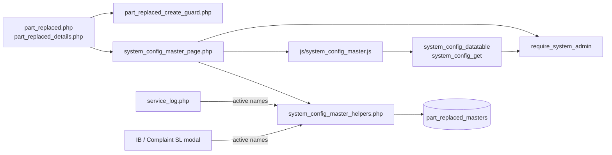
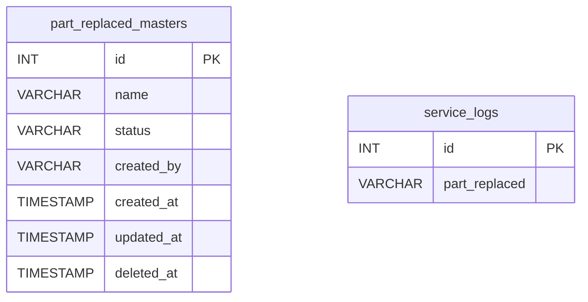
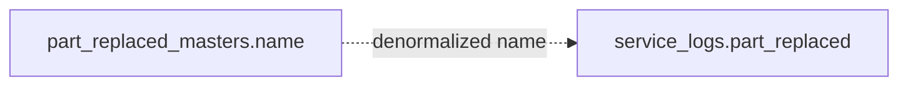
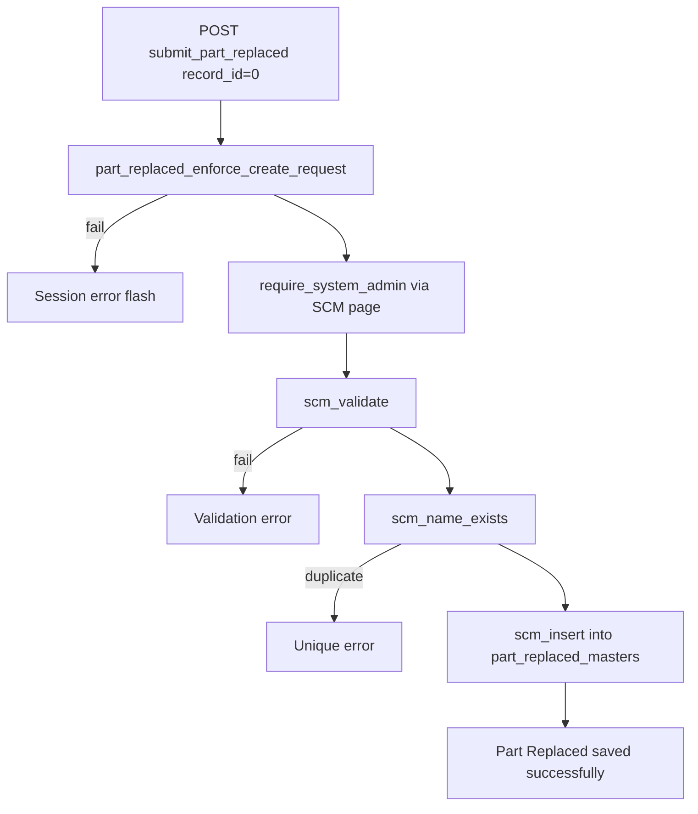
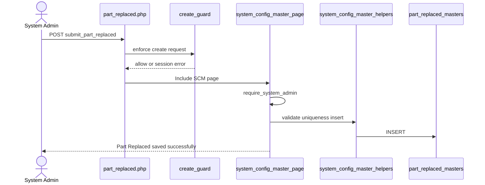
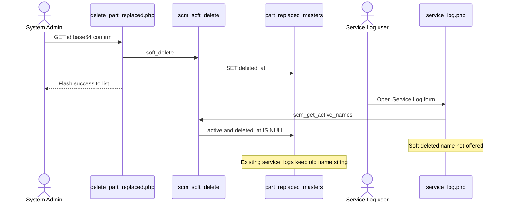
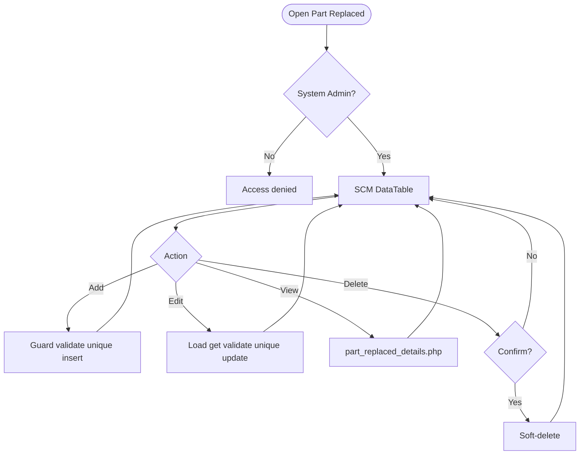
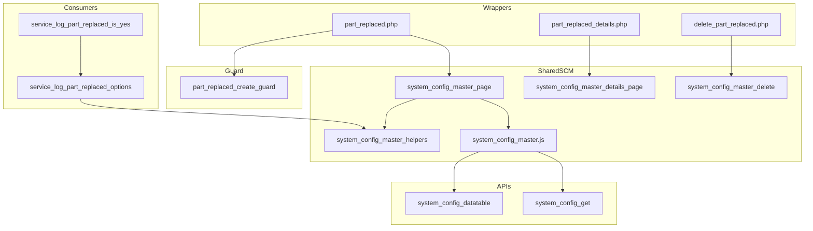

# Low-Level Design (LLD) — Part Replaced Module

| Attribute | Value |
|-----------|--------|
| Module | Part Replaced (System Config Master) |
| Menu path | SYSTEM CONFIGURATION → Part Replaced |
| Landing page | `part_replaced.php` |
| Application | Complaint / Dealer Portal |
| Stack (target) | Core PHP + MySQL (PDO) |
| Stack (current repo) | Core PHP + **PostgreSQL** via PDO |
| Document version | 1.0 |
| Access | **System Admin only** (role id `6`) — no RBAC module slug |
| Architecture | Shared **SCM** stack (`$scmType = 'part_replaced'`) |

---

## **1. Module Overview**

### 1.1 Purpose

System Administrators maintain Part Replaced options in `part_replaced_masters` for Service Log Capture (and nested Service Log modals on Installed Base / Complaint). The module is a thin SCM wrapper sharing `system_config_master_*` pages, helpers, APIs, and JS. Consumers store the selected **name string** (not an FK id). Typical values include `Yes` / `No` (placeholder: e.g. Yes).

### 1.2 Scope

| In scope | Out of scope |
|----------|--------------|
| List / Add / Edit / Details / Soft-delete | Spare Parts Capture (does not use this master) |
| Active / Inactive status | Assigned Complaint visit free-text `part_replaced` field |
| Case-insensitive name uniqueness | Hard delete |
| Create abuse / rate-limit guard | Cascading rename/delete to `service_logs` |
| Active names for Service Log Select2 | Other SCM types |

### 1.3 High-level architecture



---

## **2. Functional Requirements**

| ID | Requirement | Priority |
|----|-------------|----------|
| FR-01 | System Admin can open Part Replaced list (DataTables) | Must |
| FR-02 | Create option with name and status | Must |
| FR-03 | Edit via inline slide-down form | Must |
| FR-04 | Soft-delete; hide from list | Must |
| FR-05 | Unique name among non-deleted (case/trim-insensitive) | Must |
| FR-06 | Filter / search list; status active/inactive | Should |
| FR-07 | View read-only details + audit fields | Should |
| FR-08 | Throttle / rate-limit create requests | Should |
| FR-09 | Client validate.js for name + status | Should |
| FR-10 | Expose active names to Service Log (and nested SL modals) | Must |

---

## **3. User Roles & Permissions**

### 3.1 RBAC module slug

**None.** Part Replaced administration is gated by **System Admin** (`SYSTEM_ADMIN_ROLE = 6`), not a permission slug.

### 3.2 Permission matrix

| Capability | Gate |
|------------|------|
| All Part Replaced admin pages | `require_system_admin($obconn)` (via SCM page) |
| SCM APIs with `type=part_replaced` | `admin_api_require_system_admin` |
| Denied | `Access denied. System Admin privileges required.` |

Pages (`part_replaced.php`, `part_replaced_details.php`, `delete_part_replaced.php`) are in `rbac_admin_pages()` and skip module RBAC; System Admin check is authoritative.

### 3.3 Page / API mapping

| Resource | Gate |
|----------|------|
| `part_replaced.php` | System Admin |
| `part_replaced_details.php` | System Admin |
| `delete_part_replaced.php` | System Admin |
| `api/system_config_datatable.php?type=part_replaced` | System Admin API |
| `api/system_config_get.php?type=part_replaced` | System Admin API |

### 3.4 Consumer access

Service Log users need Service Log module permissions (separate). They only see **active, non-deleted** names via `scm_get_active_names('part_replaced')` / `service_log_part_replaced_options()`.

---

## **4. Business Rules**

| ID | Rule |
|----|------|
| BR-01 | Soft-deleted rows excluded from list, get, uniqueness, and SL options. |
| BR-02 | Name unique among non-deleted: `LOWER(TRIM(name))`; edit excludes self. |
| BR-03 | Soft-deleted names may be reused on create (partial unique index). |
| BR-04 | Status must be `active` or `inactive`. |
| BR-05 | Inactive names stay in admin list but are **not** offered in Service Log. |
| BR-06 | Soft-delete / rename does **not** update existing `service_logs.part_replaced` values. |
| BR-07 | No “in use” check before soft-delete. |
| BR-08 | Create-only abuse guard: max 1/request; min 3s interval; max 20 creates / 15 min. |
| BR-09 | Edit requires existing non-deleted row. |
| BR-10 | `created_by` = `current_username()` on insert; `created_at` / `updated_at` timestamps. |
| BR-11 | Details/delete URL ids are `base64_encode((string) id)`. |
| BR-12 | Create/update stay on page (no PRG). Delete redirects to list with session flash. |
| BR-13 | Service Log stores the **name string**, not `part_replaced_masters.id`. |
| BR-14 | SCM type key is `part_replaced`; table `part_replaced_masters`; submit key `submit_part_replaced`. |
| BR-15 | Master name max **100**; `service_logs.part_replaced` is **`VARCHAR(10)`** — keep option names ≤ 10 for safe storage. |
| BR-16 | When Part Replaced is **Yes** (`service_log_part_replaced_is_yes`), Service Log requires related part / machine entries (consumer rule). |
| BR-17 | Assigned Complaint service-update free-text `part_replaced` is **not** this SCM master. |

---

## **5. Database Design**

### 5.1 ER diagram



Logical link (name string, not FK):



### 5.2 Table: `part_replaced_masters`

| Column | MySQL type | Notes |
|--------|------------|-------|
| `id` | `INT UNSIGNED AUTO_INCREMENT` | PK |
| `name` | `VARCHAR(100)` | Required; unique among non-deleted |
| `status` | `VARCHAR(20)` | `active` / `inactive`; default `active` |
| `created_by` | `VARCHAR(100)` | Creator username |
| `created_at` | `TIMESTAMP` | Insert |
| `updated_at` | `TIMESTAMP NULL` | Update / soft-delete |
| `deleted_at` | `TIMESTAMP NULL` | Soft-delete |

**Indexes (current repo):** PK on `id`; partial unique on `lower(trim(name)) WHERE deleted_at IS NULL`; index on `deleted_at`.

### 5.3 Related tables

| Table | Column | Role |
|-------|--------|------|
| `service_logs` | `part_replaced` `VARCHAR(10)` | Primary SCM consumer |
| `complaint_service_updates` | `part_replaced` (text) | **Not SCM** — free-text visit update |

### 5.4 Reference / lookup sources

| Source | Usage |
|--------|--------|
| `scm_registry()['part_replaced']` | Labels, pages, table, submit key |
| `rbac_status_options()` | Status `<select>` |
| `scm_get_active_names('part_replaced')` | SL dropdown |
| `service_log_part_replaced_options()` | Consumer wrapper |
| `service_log_part_replaced_is_yes()` | Yes-branch gating |

---

## **6. API / Backend Design**

### 6.1 Page endpoints

| Endpoint | Method | Auth | Description |
|----------|--------|------|-------------|
| `part_replaced.php` | GET | System Admin | List + Add/Edit panel |
| `part_replaced.php` | POST `submit_part_replaced` | System Admin | Create or update |
| `part_replaced_details.php?id=` | GET | System Admin | Read-only details |
| `delete_part_replaced.php?id=` | GET | System Admin | Soft-delete |

Wrappers set `$scmType = 'part_replaced'` and include shared SCM templates.

### 6.2 JSON APIs

#### `POST api/system_config_datatable.php`

Body/query includes `type=part_replaced`. Server-side DataTables over `part_replaced_masters` where `deleted_at IS NULL`.

```json
{
  "draw": 1,
  "recordsTotal": 10,
  "recordsFiltered": 2,
  "data": [{ "id": "#1", "name": "...", "status": "...", "actions": "<html>" }]
}
```

#### `GET api/system_config_get.php?type=part_replaced&id=`

Returns row for edit form population. System Admin API gated.

### 6.3 Supporting lookup APIs

N/A for admin UI. Service Log / IB / Complaint SL modals load active names server-side into Select2 options.

### 6.4 Core PHP responsibilities

| File | Role |
|------|------|
| `part_replaced.php` | Create-guard hook + `$scmType` wrapper |
| `includes/system_config_master_page.php` | Shared list/form POST handler |
| `includes/system_config_master_details_page.php` | Shared details |
| `includes/system_config_master_delete.php` | Shared soft-delete |
| `includes/system_config_master_helpers.php` | Registry, validate, CRUD, options |
| `includes/module_create_guards/part_replaced_create_guard.php` | Create throttle / rate limit |
| `includes/admin_access_helpers.php` | System Admin gate |

---

## **7. Validation Rules**

### 7.1 Server-side (`scm_validate` + uniqueness + create guard)

| Field / rule | Message |
|--------------|---------|
| Name empty | `Part Replaced name is required.` |
| Name > 100 | `Part Replaced name cannot exceed 100 characters.` |
| Status missing/invalid | `Status is required.` |
| Duplicate name | `Part Replaced name already exists. Please choose a different name.` |
| Missing edit target | `Part Replaced not found or already deleted.` |
| Create throttle | `Please wait a few seconds before creating another record.` |
| Rate limit | `Create rate limit exceeded. You may create up to 20 records every 15 minutes...` |
| Bulk payload | `Too many records in a single request. A maximum of 1 record(s)...` |

**Service Log consumer:** `Part Replaced is required.` / `Invalid Part Replaced selection.`  
**Yes-branch:** `At least one Machine Model / Part entry is required when Part Replaced is Yes.`

### 7.2 Client-side (`js/system_config_master.js`)

- validate.js: Name required + max 100; Status required (generic wording)
- Edit load failure: `Failed to load record details.`
- Success alert fades after 3s
- Status is native `<select>` (no Select2 on master)

---

## **8. UI Screen Specifications**

### 8.1 Listing — `part_replaced.php`

| Element | Spec |
|---------|------|
| Subtitle | Manage part replaced options for service logs. |
| Placeholder | e.g. Yes |
| CTA | Add Part Replaced / Cancel (`#scmFormCard`) |
| Grid | `#scmTable` — ID, Name, Status, Created At, Action |
| List title | Part Replaced Options List |
| Actions | View / Edit / Delete (`confirm('Delete this record?')`) |
| Icon | `bi-tools` |

### 8.2 Form panel

Fields: Name*, Status* (`active` / `inactive`).  
Hidden: `record_id`, `submit_part_replaced`, SCM type wiring via `scm_page_js_config`.

### 8.3 Details — `part_replaced_details.php`

Name, status badge, created by, created/updated timestamps (shared record-details layout).

### 8.4 Modals / Select2

- No CRUD modals on master.
- **Admin:** native status select — **no Select2**.
- **Consumers:** Select2 on `#serviceLogPartReplacedSelect`, `#ibServiceLogPartReplacedSelect`.

---

## **9. Database Flow**

### 9.1 Create



### 9.2 Soft-delete

```sql
UPDATE part_replaced_masters
SET deleted_at = CURRENT_TIMESTAMP,
    updated_at = CURRENT_TIMESTAMP
WHERE id = :id
  AND deleted_at IS NULL;
```

### 9.3 Active options for Service Log

```sql
SELECT name
FROM part_replaced_masters
WHERE deleted_at IS NULL
  AND status = 'active'
ORDER BY created_at ASC, id ASC;
```

---

## **10. Sequence Diagram**

### 10.1 Create part replaced option



### 10.2 Soft-delete and Service Log impact



---

## **11. Activity Diagram**



---

## **12. Class / Module Diagram**



### 12.1 Key functions

| Function | Role |
|----------|------|
| `scm_registry` / `scm_config` | Type → table/pages/labels |
| `scm_safe_table` | Whitelist table name |
| `scm_from_post` / `scm_validate` | Parse + validate |
| `scm_name_exists` | Uniqueness |
| `scm_insert` / `scm_update` / `scm_soft_delete` | Persist |
| `scm_get_by_id` / `scm_get_active_names` / `scm_option_exists` | Reads |
| `scm_entry_actions` / `scm_page_js_config` | UI/API wiring |
| `part_replaced_enforce_create_request` | Create abuse guard |
| `service_log_part_replaced_options` | SL active-name options |
| `service_log_part_replaced_is_yes` | Yes-branch consumer rule |
| `require_system_admin` | Access gate |

---

## **13. Folder Structure**

```text
ComplaintManagement/
├── part_replaced.php
├── part_replaced_details.php
├── delete_part_replaced.php
├── api/
│   ├── system_config_datatable.php
│   └── system_config_get.php
├── includes/
│   ├── system_config_master_helpers.php
│   ├── system_config_master_page.php
│   ├── system_config_master_details_page.php
│   ├── system_config_master_delete.php
│   ├── admin_access_helpers.php
│   ├── admin_api_guard.php
│   └── module_create_guards/
│       └── part_replaced_create_guard.php
├── js/
│   └── system_config_master.js
├── storage/
│   └── request_abuse/part_replaced/
└── docs/
    └── LLD_Part_Replaced_Module.md
```

---

## **14. Error Handling**

| Layer | Pattern |
|-------|---------|
| Create guard fail | `$_SESSION['error_message']`; POST submit unset |
| Page POST | Inline / session success or error via SCM page |
| Delete | Session flash → `part_replaced.php` |
| Details invalid | `die('Invalid record.')` / `die('Part Replaced not found.')` |
| APIs | JSON + HTTP 403/404 |
| Create guard log | `storage/request_abuse/part_replaced/` |

### 14.1 Common messages

| Message | When |
|---------|------|
| `Part Replaced saved successfully.` | Create |
| `Part Replaced updated successfully.` | Update |
| `Part Replaced deleted successfully.` | Soft-delete |
| `Failed to save part replaced.` / `Failed to update...` / `Failed to delete...` | Persist fail |
| `Part Replaced not found or already deleted.` | Missing target |
| `Part Replaced name already exists...` | Unique violation |
| `Invalid record.` | Bad delete id |
| `Access denied. System Admin privileges required.` | Non-admin |

---

## **15. Security Considerations**

| Area | Control |
|------|---------|
| Authorization | System Admin hard-gate on SCM pages + APIs |
| Soft-delete | Excluded from active queries and SL options |
| Create abuse | Throttle, rate limit, payload size, monitor log |
| Table safety | `scm_safe_table` whitelist for datatable SQL |
| DB uniqueness | Partial unique index on `lower(trim(name))` among non-deleted |
| CSRF | **Not implemented** on POST or GET delete |
| Delete method | **GET** soft-delete — CSRF-friendly; confirm only |
| PRG | **Not used** on create/update |
| Guard order gap | Create guard runs **before** `require_system_admin` → non-admins may write throttle/abuse files |
| Option exists gap | `scm_option_exists` ignores `status` → inactive name can pass SL server check if forced in POST |
| Length mismatch | Master `VARCHAR(100)` vs `service_logs.part_replaced` **`VARCHAR(10)`** |
| Denormalized names | Rename/delete orphans historical SL values |
| Confusion risk | Assigned Complaint free-text `part_replaced` is a different field |

---

## **16. Audit Logs**

### 16.1 Built-in field-level audit

| Field | Behavior |
|-------|----------|
| `created_by` / `created_at` | On create |
| `updated_at` | On update / soft-delete |
| `deleted_at` | Soft-delete |
| Dedicated audit table | **Not implemented** |
| Create abuse log | `storage/request_abuse/part_replaced/abuse_monitor.log` |

---

## **17. Test Cases**

### 17.1 Functional

| ID | Scenario | Expected |
|----|----------|----------|
| TC-01 | Non-admin opens Part Replaced | Denied |
| TC-02 | Create with empty name | Validation error |
| TC-03 | Create duplicate name (different case) | Rejected (app + DB unique) |
| TC-04 | Soft-delete then recreate same name | Allowed |
| TC-05 | Set status inactive | In admin list; not in SL Select2 |
| TC-06 | Soft-delete name used on SL rows | Rows keep old string; dropdown omits it |
| TC-07 | Edit via pencil | Form filled from `system_config_get` |
| TC-08 | Delete confirmed | Soft-deleted; flash success |
| TC-09 | Create twice within 3 seconds | Throttle error |
| TC-10 | Create >20 in 15 minutes | Rate-limit error |
| TC-11 | Service Log submit without Part Replaced | `Part Replaced is required.` |
| TC-12 | Service Log submit unknown name | `Invalid Part Replaced selection.` |
| TC-13 | Part Replaced = Yes without part rows | Yes-branch validation error |
| TC-14 | Name longer than 10 chars | May save on master but truncate/fail risk on SL |
| TC-15 | Datatable `type=part_replaced` as admin | Rows from `part_replaced_masters` |
| TC-16 | Assigned visit free-text part_replaced | Saves without SCM option check |

---

## **18. Assumptions & Dependencies**

### 18.1 Assumptions

1. Role id `6` is System Admin.
2. Soft-delete is the only remove mechanism.
3. Service Log (including IB / Complaint SL modals) is the primary SCM consumer.
4. Operational practice keeps option names ≤ **10** characters to match `service_logs.part_replaced`.
5. Name string denormalization on SL is intentional for historical display.
6. Shared SCM stack remains the implementation vehicle.
7. Document target stack Core PHP + MySQL; repo runs PostgreSQL.
8. Create-guard storage under `storage/request_abuse/part_replaced/` is writable.
9. Typical catalog values are short labels such as `Yes` / `No`.

### 18.2 Dependencies

| Dependency | Purpose |
|------------|---------|
| SCM shared pages/helpers/JS/APIs | CRUD UI and persistence |
| `admin_access_helpers` / `admin_api_guard` | System Admin gate |
| `rbac_helpers` | Status options / validation / badges |
| Create-guard storage | Throttle state + abuse log |
| jQuery + DataTables + validate.js | List / form UX |
| Service Log module | Consumer of active names + Yes-branch rules |

---

## Appendix A — Success flashes

| Event | Message |
|-------|---------|
| Create | Part Replaced saved successfully. |
| Update | Part Replaced updated successfully. |
| Delete | Part Replaced deleted successfully. |

---

## Appendix B — Select2 control map

| Screen | Control | Select2? |
|--------|---------|----------|
| Admin status select | Native `<select>` | No |
| Service Log `#serviceLogPartReplacedSelect` | Select2 | Yes (consumer) |
| IB / Complaint SL modal `#ibServiceLogPartReplacedSelect` | Select2 | Yes (consumer) |

---

## Appendix C — SCM registry entry

| Key | Value |
|-----|-------|
| Type | `part_replaced` |
| Table | `part_replaced_masters` |
| Label | Part Replaced |
| Plural | Part Replaced Options |
| Page | `part_replaced.php` |
| Submit key | `submit_part_replaced` |
| Icon | `bi-tools` |

---

## Appendix D — Create guard limits

| Limit | Value |
|-------|-------|
| Max records per request | 1 |
| Min interval between creates | 3 seconds |
| Max creates per window | 20 |
| Window | 15 minutes |

---

## Appendix E — Status vs consumer visibility

| Value | Admin list | Service Log options |
|-------|------------|---------------------|
| `active` | Yes | Yes |
| `inactive` | Yes | No |
| Soft-deleted | No | No |

---

## Appendix F — Consumer column map

| Module | Column | SCM-gated? | Max length |
|--------|--------|------------|------------|
| Service Log | `service_logs.part_replaced` | Yes | 10 |
| Master | `part_replaced_masters.name` | N/A | 100 |
| Assigned visit update | `complaint_service_updates.part_replaced` | **No** (free text) | text |

---

## Appendix G — Yes-branch note

`service_log_part_replaced_is_yes($value)` treats trimmed case-insensitive **`Yes`** as true. When true, Service Log requires at least one Machine Model / Part entry (and related running hours / feedback paths as implemented in Service Log module).

---

*End of LLD — Part Replaced Module*
