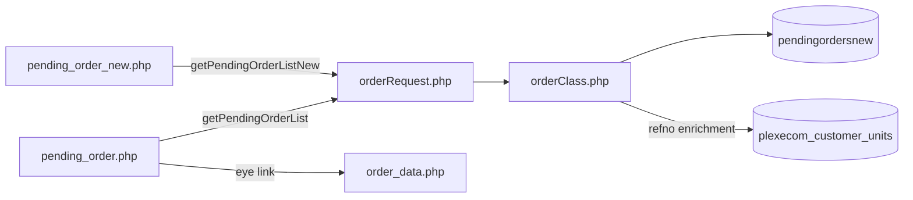
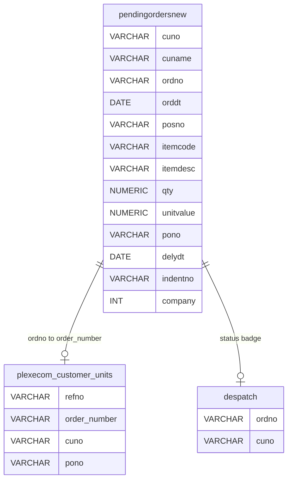
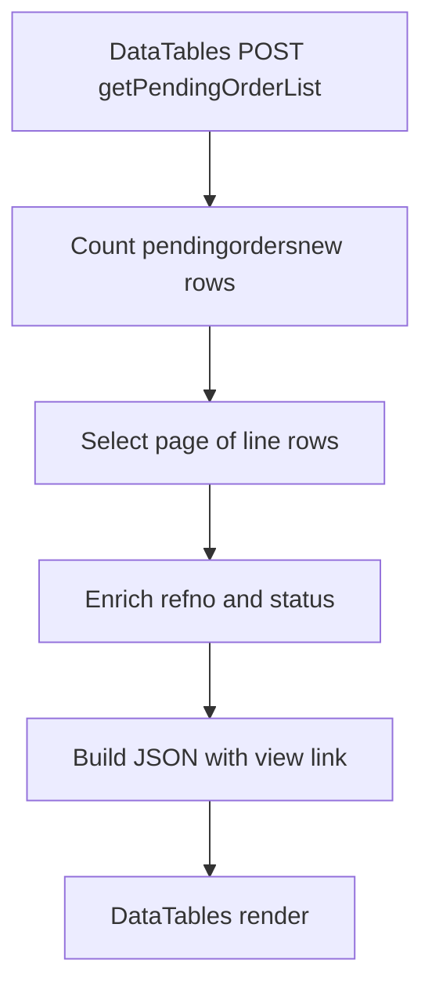
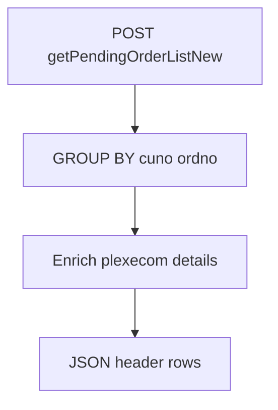
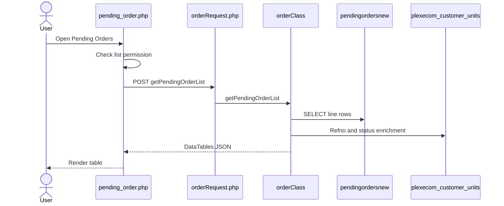
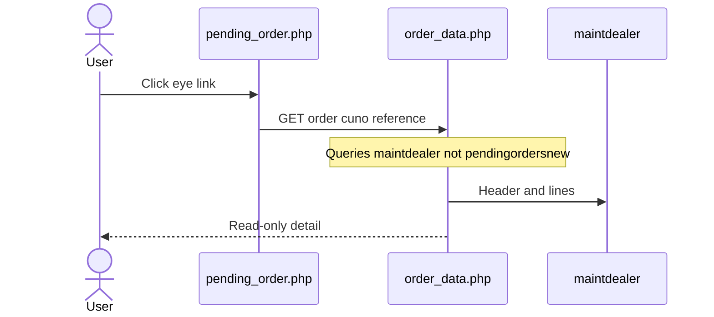
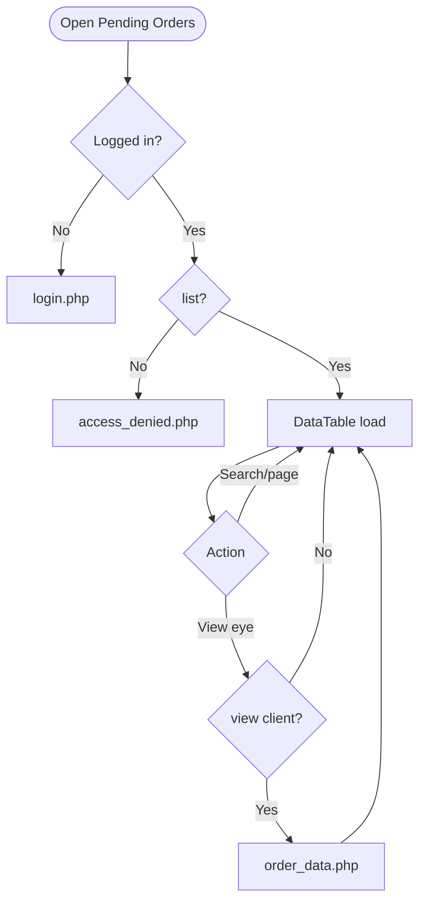
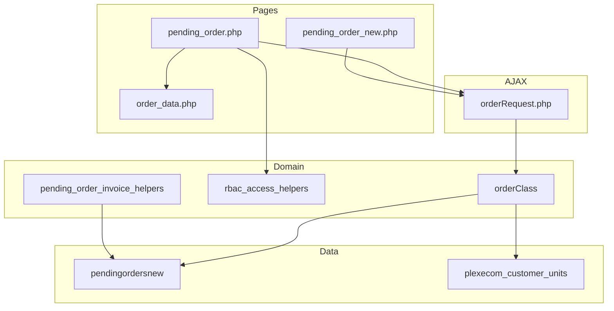

# Low-Level Design (LLD) — Pending Orders Module

| Attribute | Value |
|-----------|--------|
| Module | Pending Orders (List / View) |
| Menu path | ORDER BOOKING → Pending Orders |
| Landing page | `pending_order.php` (live) |
| Alternate page | `pending_order_new.php` (not in sidebar) |
| Detail pages | `order_data.php` / `order_data_new.php` |
| Application | Complaint / Dealer Portal |
| Stack (target) | Core PHP + MySQL (PDO) |
| Stack (current repo) | Core PHP + **PostgreSQL** via PDO (`$obconn`, `$dpconn`) |
| Document version | 1.0 |
| Access | RBAC module slug **`pending-order`** / permission **`list`** (view eye: **`view`**) |

---

## **1. Module Overview**

### 1.1 Purpose

Authenticated users with Pending Orders permissions browse open LN pending order lines from Dealerportal `pendingordersnew` and open a read-only detail view. The live list is server-side DataTables via `orderRequest.php` → `orderClass::getPendingOrderList()` (line-level). An alternate header-level UI (`pending_order_new.php` / `getPendingOrderListNew`) exists but is not linked in the sidebar.

### 1.2 Scope

| In scope | Out of scope |
|----------|--------------|
| Pending list (live line-level UI) | Order Booking create / cart submit |
| Alternate header-level list (documented) | Order Acknowledgement list UI |
| Detail view links (`order_data*`) | Despatch Details UI |
| Price breakup AJAX (new UI; button disabled) | Dashboard “Pending” KPI definition (different) |
| RBAC list / view (export reserved) | Re-Push (Recent Orders, not pending list) |

### 1.3 High-level architecture



---

## **2. Functional Requirements**

| ID | Requirement | Priority |
|----|-------------|----------|
| FR-01 | User with `pending-order`/`list` can open Pending Orders list | Must |
| FR-02 | Server-side DataTables list from `pendingordersnew` | Must |
| FR-03 | Show Ref No, PO, AO, Delivery Date, Status, Action (live UI) | Must |
| FR-04 | View permission controls eye link visibility | Should |
| FR-05 | Open detail in new tab via `order_data.php` | Must |
| FR-06 | Scope list to current customer / user context | Must |
| FR-07 | Global search by AO / PO / indent | Should |
| FR-08 | Exclude `company = 600` | Must |
| FR-09 | Export Excel when permitted | Could (UI commented out) |
| FR-10 | Header-level list + price breakup (alternate UI) | Could |

---

## **3. User Roles & Permissions**

### 3.1 RBAC module slug

| Resource | Module | Permission |
|----------|--------|------------|
| `pending_order.php` | `pending-order` | `list` |
| Eye / view link | `pending-order` | `view` |
| Export (reserved) | `pending-order` | `export-excel` |

Gate on live list: `rbac_user_can(..., 'list')` → else `access_denied.php`. Unauthenticated → `login.php`.

Sidebar: `rbac_can_access_menu($obconn, 'pending_order.php')`.

### 3.2 Page / API mapping

| Resource | Gate |
|----------|------|
| `pending_order.php` | `list` |
| `pending_order_new.php` | **Not** in page RBAC map (alternate) |
| `POST orderRequest.php` pending actions | Session only — **no** module RBAC |
| `order_data.php` / `order_data_new.php` | Session only (gap) |
| Invoice pages | **No** auth/customer check documented |

### 3.3 Client-side view gating

`$canView…` style flags strip eye links in DataTables `drawCallback` when `view` is false (client-side only).

### 3.4 Scoping notes

| Layer | Scope |
|-------|--------|
| Live old list SQL | `pendingordersnew.cuno = userId` (`usr_name`) — mismatch risk |
| New list / price breakup | `cuno = customer_number_vayu` (fallback `'10001'`) |
| Admin see-all | Forced off / commented out on pending lists |
| Dashboard pipeline Pending | Admin/Management see-all; else customer-scoped **plexecom** |

---

## **4. Business Rules**

| ID | Rule |
|----|------|
| BR-01 | Pending list row = exists in `pendingordersnew` with `company != 600`. |
| BR-02 | Live UI is **line-level** (one DataTable row per line / position). |
| BR-03 | Alternate UI is **header-level** (`GROUP BY cuno, ordno`). |
| BR-04 | AO identity = `ordno`; PO = `pono`; delivery date = `delydt`. |
| BR-05 | Ref No enriched from `plexecom_customer_units` via `order_number` / `pono` lookups. |
| BR-06 | Status badge computed (Pending / AO / Despatched) — not a column on `pendingordersnew`. |
| BR-07 | Read-only list — no create/update/delete of pending rows in this UI. |
| BR-08 | Detail URL (live): `order_data.php?order={ordno}&cuno={cuno}&reference=pending_order`. |
| BR-09 | Detail pages query **`maintdealer`** (ack-style), not `pendingordersnew`. |
| BR-10 | No date-range filter on pending list UIs. |
| BR-11 | Export Excel button commented out. |
| BR-12 | Price breakup modal on new UI; action button commented out in row HTML. |
| BR-13 | Dashboard “Pending” = empty `plexecom_customer_units.order_number` — **different** from this list. |
| BR-14 | Re-Push is on Recent Orders (empty AO), not on Pending Orders list. |
| BR-15 | Soft-delete / `deleted_at` not used on `pendingordersnew`. |

---

## **5. Database Design**

### 5.1 Logical model



### 5.2 Tables

| Table | Conn | Role |
|-------|------|------|
| `pendingordersnew` | `$dpconn` | Primary pending list source |
| `dpst_master` | `$dpconn` | Description join (live list) |
| `tbl_commitment` | `$dpconn` | Commitment date (selected; may not show) |
| `plexecom_customer_units` | `$obconn` | Ref No / address / terms enrichment |
| `despatch` | `$dpconn` | Despatched status badge |
| `maintdealer` | `$dpconn` | Detail pages (shared with AO) |

### 5.3 Live list filter pattern

```sql
SELECT ...
FROM pendingordersnew p
-- joins ...
WHERE p.company != 600
  AND p.cuno = :uname
  AND /* optional search ILIKE on ordno/pono/indentno */
ORDER BY ...
LIMIT :length OFFSET :start;
```

### 5.4 Two “Pending” definitions

| Surface | Definition |
|---------|------------|
| Pending Orders module | Rows in `pendingordersnew` (`company != 600`) |
| Dashboard / Recent “Pending” | `plexecom_customer_units.order_number` empty |

---

## **6. API / Backend Design**

### 6.1 Page endpoints

| Endpoint | Method | Auth | Description |
|----------|--------|------|-------------|
| `pending_order.php` | GET | `pending-order`/`list` | Live line-level list |
| `pending_order_new.php` | GET | Session (not in RBAC map) | Alternate header list |
| `order_data.php` | GET | Session | Detail (live link) |
| `order_data_new.php` | GET | Session | Detail (new UI link) |
| Invoice pages | GET | **Ungated** | PDF / invoice helpers |

### 6.2 AJAX — `POST orderRequest.php`

| Action | Description |
|--------|-------------|
| `getPendingOrderList` | Live DataTables JSON (line-level) |
| `getPendingOrderListNew` | Alternate DataTables JSON (header-level) |
| `getPendingOrderPriceBreakup` | GST/freight for one AO |
| `rePushOrder` | Recent Orders only — not pending list UI |

### 6.3 Core PHP responsibilities

| File | Role |
|------|------|
| `pending_order.php` | Live list + RBAC + DataTable |
| `pending_order_new.php` | Alternate header list |
| `orderRequest.php` / `orderClass.php` | Pending list + breakup APIs |
| `order_data.php` / `order_data_new.php` | Read-only detail |
| `includes/pending_order_invoice_helpers.php` | Invoice/PDF |
| `includes/rbac_access_helpers.php` | Page/menu AuthZ |

---

## **7. Validation Rules**

### 7.1 Server-side

| Field / rule | Behavior |
|--------------|----------|
| Session user | Empty → `login.php` |
| `list` permission (live page) | Fail → `access_denied.php` |
| DataTables params | `start` / `length` / search |
| Price breakup | Requires `ordno`; scoped to `customer_code` |
| Detail `order` / `cuno` | Query string; no module `view` check |

### 7.2 Client-side

- DataTables serverSide; processing indicator
- Eye links stripped when no `view`
- Price breakup failures → `alert()`
- No Select2 filters; no date pickers on list
- No validate.js form (read-only)

---

## **8. UI Screen Specifications**

### 8.1 Live list — `pending_order.php`

| Element | Spec |
|---------|------|
| Table | DataTables serverSide |
| Grain | Line-level |
| Columns | Ref No, PO, AO, Delivery Date, Status, Action |
| Action | Eye → `order_data.php` |
| Search | `ordno`, `pono`, `indentno` |
| Export | Commented out |
| Select2 | **Not used** |
| CSS | `order_acknowledge_style.css` + `orderbook_style.css` (`pending_order.css` unused) |

### 8.2 Alternate list — `pending_order_new.php`

| Element | Spec |
|---------|------|
| Grain | Header per AO (`GROUP BY`) |
| Columns | Order Number, AO, Order Date, Customer, PO, invoice/payment/delivery fields, Action |
| Detail | `order_data_new.php` |
| Modal | Price breakup (button disabled in row actions) |
| Sidebar | **Not linked** |

### 8.3 Detail

Shared ack-style detail from `maintdealer` (+ customer / delivery / lines). `reference=pending_order` keeps menu context.

---

## **9. Database Flow**

### 9.1 Live list load



### 9.2 Alternate header load



---

## **10. Sequence Diagram**

### 10.1 Live list DataTables



### 10.2 Open detail



---

## **11. Activity Diagram**



---

## **12. Class / Module Diagram**



### 12.1 Key functions

| Function | Role |
|----------|------|
| `getPendingOrderList` | Live line-level DataTable JSON |
| `getPendingOrderListNew` | Header-level DataTable JSON |
| `getPendingOrderPriceBreakup` | AO GST/freight breakup |
| `fetchPendingOrderRefMap` / `fetchPendingOrderPlexecomDetails` | Enrichment |
| `resolveRecentOrderStatus` | Status badge labels |
| `rePushOrder` | Recent Orders re-push (related, not list UI) |
| `pending_invoice_fetch` / PDF helpers | Invoice generation |

---

## **13. Folder Structure**

```text
ComplaintManagement/
├── pending_order.php
├── pending_order_new.php
├── order_data.php
├── order_data_new.php
├── pending_order_invoice.php
├── generate_pending_order_invoice.php
├── orderRequest.php
├── orderClass.php
├── includes/
│   ├── rbac_access_helpers.php
│   ├── dashboard_helpers.php
│   └── pending_order_invoice_helpers.php
├── css/
│   ├── order_acknowledge_style.css
│   ├── orderbook_style.css
│   └── pending_order.css
└── docs/
    └── LLD_Pending_Orders_Module.md
```

---

## **14. Error Handling**

| Layer | Pattern |
|-------|---------|
| Unauthenticated | Redirect `login.php` |
| No `list` (live) | `access_denied.php` |
| AJAX | DataTables JSON / `{error}` / `status: false` |
| Price breakup fail | Client `alert()` |
| Success flashes | **None** (read-only list) |

### 14.1 User-visible messages

| Message / UI | When |
|--------------|------|
| Access denied page | Missing `list` |
| Empty DataTable | No pending rows for scope |
| Price breakup alerts | Breakup AJAX fail (new UI) |

---

## **15. Security Considerations**

| Area | Control |
|------|---------|
| Page AuthZ (live) | RBAC `pending-order`/`list` |
| View link | Client strip if no `view` |
| AJAX AuthZ gap | `orderRequest` lacks module permission check |
| Scoping bug (live) | List may bind `cuno` to `usr_name` instead of `customer_number_vayu` |
| Alternate page | Not in RBAC page map / not in sidebar |
| Detail IDOR gap | `order_data*` not module-gated; uses `maintdealer` |
| Invoice ungated | Ordno fetch without auth/customer check; sample defaults risk |
| Customer fallback | Missing session customer → `'10001'` |
| Admin see-all | Disabled on pending lists |
| CSRF | **Not implemented** on AJAX |
| Export | Commented out |

---

## **16. Audit Logs**

### 16.1 Built-in field-level audit

| Item | Behavior |
|------|----------|
| Pending list/view audit table | **Not implemented** |
| Module nature | Read-only view of LN pending + enrichment |
| Re-Push / EDI timestamps | Owned by Recent Orders / `ediprocessdt` path |

---

## **17. Test Cases**

### 17.1 Functional

| ID | Scenario | Expected |
|----|----------|----------|
| TC-01 | Guest opens `pending_order.php` | Redirect login |
| TC-02 | User without `list` | `access_denied.php` |
| TC-03 | User with `list` | Line-level DataTable loads |
| TC-04 | User without `view` | Eye links hidden |
| TC-05 | Click eye | Opens `order_data.php` (may show maintdealer data) |
| TC-06 | `company = 600` rows | Excluded |
| TC-07 | Search by AO / PO / indent | Filtered rows |
| TC-08 | Username ≠ customer number | Live list may empty / mis-scope |
| TC-09 | Open `pending_order_new.php` | Header-level list (if reachable) |
| TC-10 | Dashboard Pending vs list | Counts/datasets may differ |
| TC-11 | Re-Push from pending list | Not available (Recent Orders only) |
| TC-12 | Direct invoice URL | **Gap:** may generate without RBAC |
| TC-13 | Direct `order_data.php` without `view` | **Gap:** may open if logged in |

---

## **18. Assumptions & Dependencies**

### 18.1 Assumptions

1. `pending-order`/`list` (and optionally `view`) are assigned to roles that may see pending orders.
2. LN / ERP populates `pendingordersnew`; portal does not insert pending lines in this UI.
3. Live production menu path is `pending_order.php` + `getPendingOrderList`.
4. `pending_order_new.php` is an alternate/experimental path until promoted to sidebar.
5. Dashboard “Pending” KPI remains booking-AO-empty unless product decides to align definitions.
6. Document target stack Core PHP + MySQL; repo runs PostgreSQL (`ILIKE`, `GROUP BY`).
7. Detail pages remaining on `maintdealer` is a known shared-pattern limitation.

### 18.2 Dependencies

| Dependency | Purpose |
|------------|---------|
| RBAC / Assign Permissions | `pending-order` grants |
| `$dpconn` / `pendingordersnew` | List source |
| `$obconn` / `plexecom_customer_units` | Ref No / terms enrichment |
| `orderClass` / `orderRequest` | Shared order AJAX surface |
| DataTables + jQuery | List UX |
| Order Acknowledgement detail pages | Shared `order_data*` |
| Dashboard / Recent Orders | Related but different “Pending” meaning |

---

## Appendix A — Live list column map

| UI column | Source / notes |
|-----------|----------------|
| Ref No | plexecom enrichment / pono lookup |
| PO Number | `pendingordersnew.pono` |
| AO Number | `pendingordersnew.ordno` |
| Delivery Date | `pendingordersnew.delydt` |
| Status | Computed badge (Pending / AO / Despatched) |
| Action | Eye → `order_data.php` |

---

## Appendix B — Select2 control map

**N/A on pending list pages.** Select2 may load globally; not used for pending filters.

---

## Appendix C — RBAC permission matrix

| Permission | Effect |
|------------|--------|
| `list` | Open live Pending Orders page |
| `view` | Show eye / open detail (client-enforced today) |
| `export-excel` | Reserved; Export button commented out |

---

## Appendix D — Old vs new UI

| Aspect | Live (`pending_order.php`) | Alternate (`pending_order_new.php`) |
|--------|----------------------------|-------------------------------------|
| Sidebar | Yes | No |
| API | `getPendingOrderList` | `getPendingOrderListNew` |
| Grain | Line | Header (`GROUP BY ordno`) |
| Detail | `order_data.php` | `order_data_new.php` |
| Modal | None | Price breakup (button disabled) |
| Scope key | Often `usr_name` | `customer_code` |

---

## Appendix E — Pipeline position

```text
Order Booking (plexecom, order_number empty)  ← Dashboard "Pending"
        ↓ ERP AO
Order Acknowledgement (maintdealer)
        ↓ open LN lines
Pending Orders list (pendingordersnew)        ← This module
        ↓ despatch
Despatch Details
```

---

## Appendix F — Related but out-of-list actions

| Action | Where |
|--------|-------|
| Re-Push order | `recent_orders.php` → `rePushOrder` |
| Dashboard Quick Action | Link to `pending_order.php` |
| Installed Base order search | May query `pendingordersnew` |

---

*End of LLD — Pending Orders Module*
