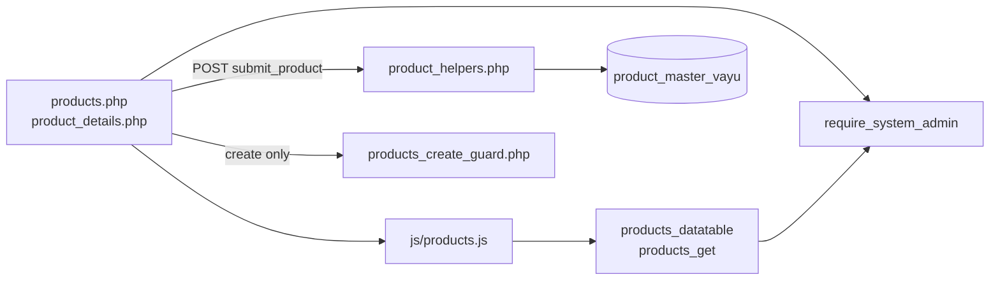
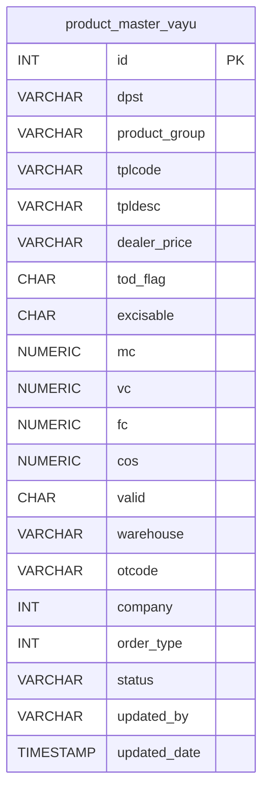
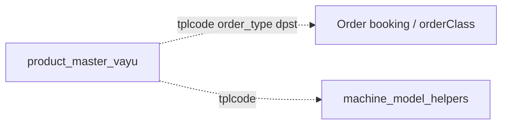
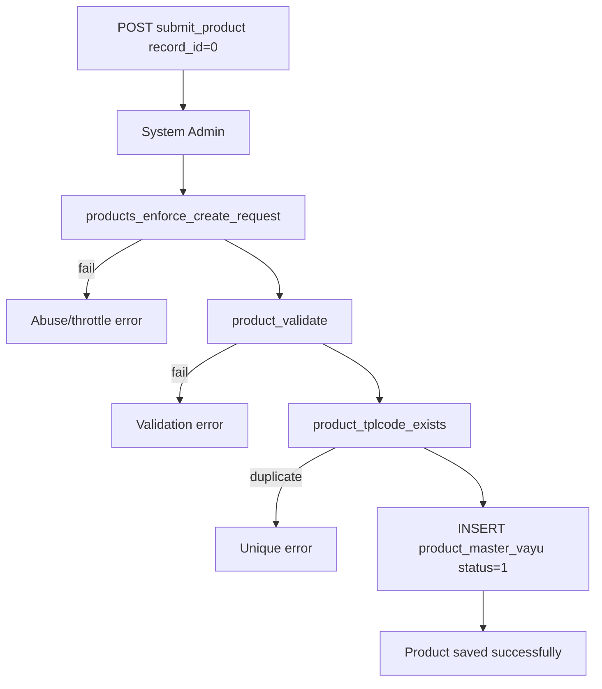
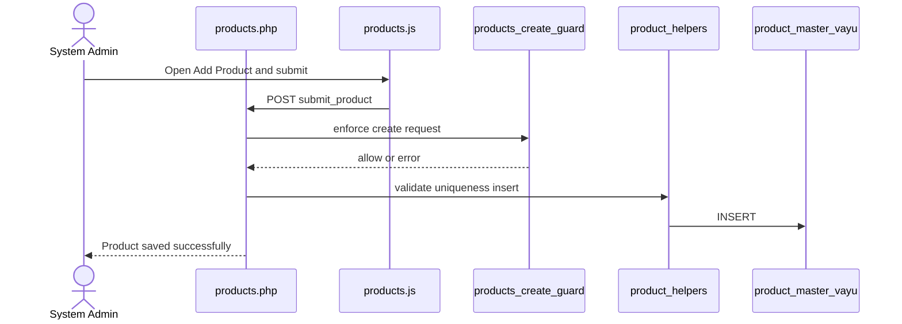
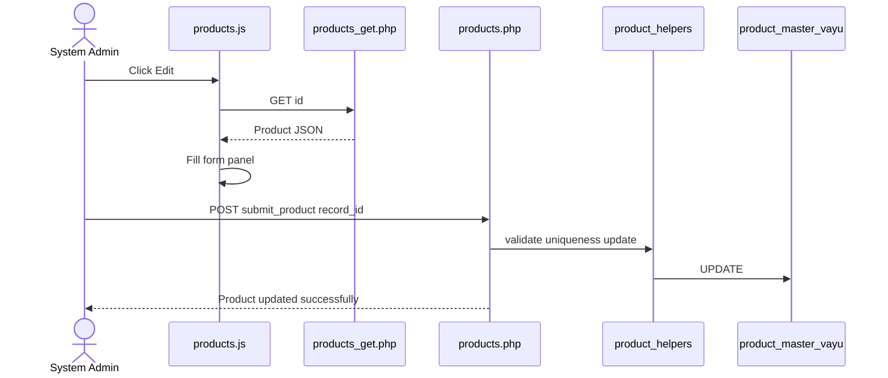
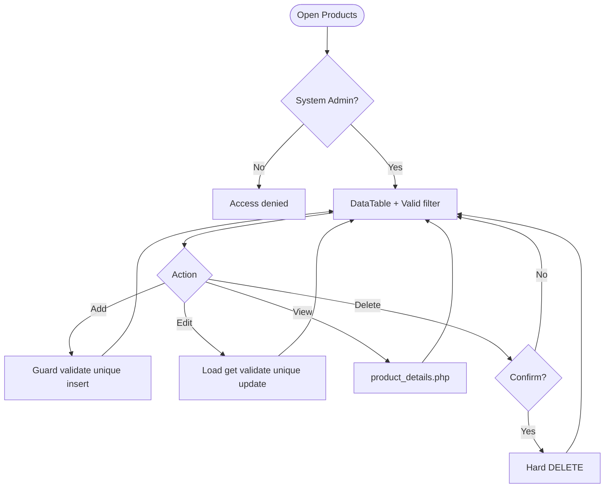
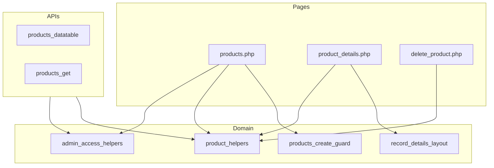

# Low-Level Design (LLD) — Products Module

| Attribute | Value |
|-----------|--------|
| Module | Products (Product Master Administration) |
| Menu path | SYSTEM CONFIGURATION → Products |
| Landing page | `products.php` |
| Application | Complaint / Dealer Portal |
| Stack (target) | Core PHP + MySQL (PDO) |
| Stack (current repo) | Core PHP + **PostgreSQL** via PDO |
| Document version | 1.0 |
| Access | **System Admin only** (role id `6`) — no RBAC module slug |

---

## **1. Module Overview**

### 1.1 Purpose

System Administrators maintain the product catalog in `product_master_vayu`: create and edit product rows (DPST, TPL code/description, pricing, validity, warehouse, company, order type), list/filter via DataTables, view details, and hard-delete products. Downstream modules (order booking, machine-model helpers) resolve products by `tplcode` (and often `order_type` / `dpst`), not by admin UI id.

### 1.2 Scope

| In scope | Out of scope |
|----------|--------------|
| List / Add / Edit / Details / Delete | Spare Parts Consumption capture |
| Valid (Y/N) list filter | Soft-delete lifecycle |
| TPL Code + Order Type uniqueness | Select2 (native selects used) |
| Create abuse / rate-limit guard | Order booking product search UX |
| Y/N flags (TOD, Excisable, Valid) | RBAC module-slug gating |

### 1.3 High-level architecture



---

## **2. Functional Requirements**

| ID | Requirement | Priority |
|----|-------------|----------|
| FR-01 | System Admin can open Products list (DataTables) | Must |
| FR-02 | Create product with required catalog and pricing fields | Must |
| FR-03 | Edit product via inline slide-down form | Must |
| FR-04 | Hard-delete product with client confirm | Must |
| FR-05 | Unique `tplcode` per `order_type` (case-insensitive) | Must |
| FR-06 | Filter list by Valid (Y/N) | Should |
| FR-07 | View read-only product details | Should |
| FR-08 | Throttle / rate-limit create requests | Should |
| FR-09 | Client validate.js constraints + numeric input filters | Should |
| FR-10 | Load product for edit via JSON get API | Must |

---

## **3. User Roles & Permissions**

### 3.1 RBAC module slug

**None.** Products administration is gated by **System Admin** (`SYSTEM_ADMIN_ROLE = 6`), not a permission slug.

### 3.2 Permission matrix

| Capability | Gate |
|------------|------|
| All Products pages | `require_system_admin($obconn)` |
| Products APIs | `admin_api_require_system_admin` |
| Denied | `Access denied. System Admin privileges required.` |

Admin pages (`products.php`, `product_details.php`, `delete_product.php`) are listed in `rbac_admin_pages()` and skip module RBAC; System Admin check is authoritative.

### 3.3 Page / API mapping

| Resource | Gate |
|----------|------|
| `products.php` | System Admin |
| `product_details.php` | System Admin |
| `delete_product.php` | System Admin |
| `api/products_datatable.php` | System Admin API |
| `api/products_get.php` | System Admin API |

### 3.4 After-market list scope

N/A for Products admin UI. Product rows are consumed elsewhere by `tplcode` / `order_type` / `dpst` lookups.

---

## **4. Business Rules**

| ID | Rule |
|----|------|
| BR-01 | Uniqueness: `LOWER(TRIM(tplcode))` + `order_type` among all rows (edit excludes self). |
| BR-02 | Order type values: **1** = Units, **2** = Spares. |
| BR-03 | `valid` is required Y/N; used as list filter, not soft-delete. |
| BR-04 | `tod_flag` / `excisable` default to **N** when blank on bind. |
| BR-05 | Empty `dealer_price` binds as `'0'`; empty `otcode` binds as `NULL`. |
| BR-06 | Optional numerics `mc` / `vc` / `fc` may be blank; `cos` is required numeric. |
| BR-07 | Insert sets `status = '1'`; update does not change `status`; delete does not flip status. |
| BR-08 | Delete is **hard** `DELETE FROM product_master_vayu` (no `deleted_at`). |
| BR-09 | Create-only abuse guard: max 1 record/request; min 3s interval; max 20 creates / 15 min. |
| BR-10 | Edit requires existing row; otherwise *Product not found or already deleted.* |
| BR-11 | `updated_by` = current username (max 30); `updated_date` = `CURRENT_TIMESTAMP`. |
| BR-12 | Details/delete URL ids are `base64_encode((string) id)`. |
| BR-13 | No DB FK cascade in app; consumers reference by `tplcode` (orphan risk on delete). |
| BR-14 | Create/update stay on page (no PRG redirect). Delete redirects to `products.php`. |

---

## **5. Database Design**

### 5.1 ER diagram



Logical consumers (not FK-enforced in this module):



### 5.2 Table: `product_master_vayu`

| Column | MySQL type | Notes |
|--------|------------|-------|
| `id` | `INT UNSIGNED AUTO_INCREMENT` | PK |
| `dpst` | `VARCHAR(10)` | Required |
| `product_group` | `VARCHAR(50)` | Required |
| `tplcode` | `VARCHAR(20)` | Unique with `order_type` |
| `tpldesc` | `VARCHAR(60)` | Required |
| `dealer_price` | `VARCHAR(7)` | Empty → `'0'` |
| `tod_flag` | `CHAR(1)` | Y/N; default N |
| `excisable` | `CHAR(1)` | Y/N; default N |
| `mc` / `vc` / `fc` | `DECIMAL` NULL | Optional |
| `cos` | `DECIMAL` | Required price |
| `valid` | `CHAR(1)` | Y/N required |
| `warehouse` | `VARCHAR(3)` | Required |
| `otcode` | `VARCHAR(3)` NULL | Optional |
| `company` | `INT` | Required integer |
| `order_type` | `INT` | 1 Units / 2 Spares |
| `status` | `VARCHAR` | Insert `'1'` only |
| `updated_by` | `VARCHAR(30)` | Last editor |
| `updated_date` | `TIMESTAMP` | Last change |

### 5.3 Related tables

| Table / consumer | Role |
|------------------|------|
| Order booking classes | Resolve products by tplcode / order type |
| `machine_model_helpers` | Model/product lookups |

### 5.4 Reference / lookup sources

| Source | Usage |
|--------|--------|
| `product_yn_options()` | TOD / Excisable / Valid selects |
| `product_order_type_options()` | Units / Spares |
| Valid filter (`valid_filter`) | DataTable ajax reload |

---

## **6. API / Backend Design**

### 6.1 Page endpoints

| Endpoint | Method | Auth | Description |
|----------|--------|------|-------------|
| `products.php` | GET | System Admin | List + Add/Edit panel |
| `products.php` | POST `submit_product` | System Admin | Create or update |
| `product_details.php?id=` | GET | System Admin | Read-only details |
| `delete_product.php?id=` | GET | System Admin | Hard delete |

### 6.2 JSON APIs

#### `POST api/products_datatable.php`

DataTables server-side. Optional `valid_filter` = `Y` / `N`. Search across catalog fields via `product_search_filter` / `rbac_search_filter`.

```json
{
  "draw": 1,
  "recordsTotal": 100,
  "recordsFiltered": 12,
  "data": [{ "id": "#1", "tplcode": "...", "actions": "<html>" }]
}
```

#### `GET api/products_get.php?id=`

Returns product fields for edit form population. System Admin API gated.

### 6.3 Supporting lookup APIs

N/A (Y/N and order-type options rendered server-side).

### 6.4 Core PHP responsibilities

| File | Role |
|------|------|
| `includes/product_helpers.php` | from_post, validate, CRUD, bind, display, actions |
| `includes/module_create_guards/products_create_guard.php` | Create throttle / rate limit / abuse log |
| `includes/admin_access_helpers.php` | System Admin gate |
| `includes/admin_api_guard.php` | System Admin API gate |
| `includes/record_details_layout.php` | Details page layout helpers |

---

## **7. Validation Rules**

### 7.1 Server-side (`product_validate` + uniqueness + create guard)

| Field / rule | Message |
|--------------|---------|
| DPST | Required; max 10 |
| Product Group | Required; max 50 |
| TPL Code | Required; max 20 |
| TPL Description | Required; max 60 |
| Dealer Price | Numeric if set; max 7 |
| TOD Flag / Excisable | Y or N if set |
| MC / VC / FC | Numeric if set |
| COS | Required; numeric |
| Valid | Required; Y or N |
| Warehouse | Required; max 3 |
| OT Code | Max 3 |
| Company | Required; integer |
| Order Type | Required; Units or Spares |
| Unique TPL | `TPL Code already exists for this Order Type...` |
| Create throttle | `Please wait a few seconds...` / rate-limit messages |

### 7.2 Client-side (`js/products.js`)

- validate.js constraints aligned with server lengths/required fields
- Numeric-only key/paste filters for `dealer_price`, `mc`, `vc`, `fc`, `cos`
- Form `novalidate`; JS owns validation
- `tod_flag` / `excisable` not constrained by validate.js (select defaults)

---

## **8. UI Screen Specifications**

### 8.1 Listing — `products.php`

| Element | Spec |
|---------|------|
| Subtitle | Manage product master records. (or equivalent page header) |
| CTA | Add Product / Cancel |
| Filter | Valid (All / Y / N) |
| Grid | Catalog columns + Valid + Order Type + Actions |
| Actions | View / Edit / Delete |
| Empty | DataTables empty / no-match messages |

### 8.2 Form panel

Slide-down `#productFormCard` fields: DPST*, Product Group*, TPL Code*, TPL Description*, Dealer Price, TOD Flag, Excisable, MC, VC, FC, COS*, Valid*, Warehouse*, OT Code, Company*, Order Type*.

Hidden: `record_id`, `submit_product`.

### 8.3 Details — `product_details.php`

Read-only sections via `record_details_*` helpers; Y/N badges for flags/valid; order-type label.

### 8.4 Modals

None for CRUD. Delete uses browser `confirm(...)`. Edit loads via `products_get` into the same form panel.

---

## **9. Database Flow**

### 9.1 Create



### 9.2 Hard delete

```sql
DELETE FROM product_master_vayu
WHERE id = :id;
```

### 9.3 List query pattern

```sql
SELECT *
FROM product_master_vayu
WHERE /* optional valid = :valid_filter */
  AND /* optional search ILIKE across fields */
ORDER BY id DESC
LIMIT :limit OFFSET :offset;
```

---

## **10. Sequence Diagram**

### 10.1 Create product



### 10.2 Edit product



---

## **11. Activity Diagram**



---

## **12. Class / Module Diagram**



### 12.1 Key functions

| Function | Role |
|----------|------|
| `product_from_post` / `product_validate` | Parse + validate |
| `product_tplcode_exists` | Uniqueness |
| `product_insert` / `product_update` / `product_delete` | Persist |
| `product_bind_common` | Shared PDO binds |
| `product_get_by_id` | Load row |
| `product_entry_actions` | View / Edit / Delete HTML |
| `product_yn_*` / `product_order_type_*` | Options / labels / badges |
| `products_enforce_create_request` | Create abuse guard |
| `require_system_admin` | Access gate |

---

## **13. Folder Structure**

```text
ComplaintManagement/
├── products.php
├── product_details.php
├── delete_product.php
├── api/
│   ├── products_datatable.php
│   └── products_get.php
├── includes/
│   ├── product_helpers.php
│   ├── admin_access_helpers.php
│   ├── admin_api_guard.php
│   ├── record_details_layout.php
│   └── module_create_guards/
│       └── products_create_guard.php
├── js/
│   └── products.js
├── storage/
│   └── request_abuse/products/
└── docs/
    └── LLD_Products_Module.md
```

---

## **14. Error Handling**

| Layer | Pattern |
|-------|---------|
| Page POST | Local `$error_message` / `$success_message` |
| Delete | Session flash → `products.php` |
| Details invalid | `die('Invalid record.')` / `die('Product not found.')` |
| APIs | JSON + HTTP 403/404 as applicable |
| Create guard | Inline error + abuse log under `storage/request_abuse/products/` |

### 14.1 Common messages

| Message | When |
|---------|------|
| `Product saved successfully.` | Create |
| `Product updated successfully.` | Update |
| `Product deleted successfully.` | Hard delete (session flash) |
| `Failed to save product.` / `Failed to update product.` | Persist fail |
| `Product not found or already deleted.` | Missing edit target |
| `TPL Code already exists for this Order Type...` | Unique violation |
| `Please wait a few seconds before creating another record.` | Min interval |
| `Create rate limit exceeded...` | 20 / 15 min |
| `Access denied. System Admin privileges required.` | Non-admin |

---

## **15. Security Considerations**

| Area | Control |
|------|---------|
| Authorization | System Admin hard-gate on pages + APIs |
| Create abuse | Throttle, rate limit, payload size, monitor log |
| XSS | Escaped alerts / table actions / details |
| CSRF | **Not implemented** on POST or GET delete |
| Delete method | **GET** delete — CSRF-friendly; confirm only |
| PRG | **Not used** on create/update — refresh may re-POST |
| Uniqueness | App-level only; race without DB UNIQUE |
| Hard delete | No referential check against order/booking consumers |
| Id encoding | Base64 obfuscation only; authz is admin gate |
| Gaps | `status` unused as lifecycle; empty-`usr_name` API check commented in guard |

---

## **16. Audit Logs**

### 16.1 Built-in field-level audit

| Field | Behavior |
|-------|----------|
| `updated_by` / `updated_date` | On insert and update |
| `status` | Set `'1'` on insert only |
| Dedicated audit table | **Not implemented** |
| Create abuse log | `storage/request_abuse/products/abuse_monitor.log` |

---

## **17. Test Cases**

### 17.1 Functional

| ID | Scenario | Expected |
|----|----------|----------|
| TC-01 | Non-admin opens Products | Denied |
| TC-02 | Create with missing COS | Validation error |
| TC-03 | Create duplicate tplcode + same order_type | Rejected |
| TC-04 | Create same tplcode different order_type | Allowed |
| TC-05 | Edit change tplcode to existing pair | Rejected |
| TC-06 | Valid filter = N | Only invalid rows |
| TC-07 | Edit via pencil | Form filled from `products_get` |
| TC-08 | Delete confirmed | Row removed; flash success |
| TC-09 | Create twice within 3 seconds | Throttle error |
| TC-10 | Create >20 in 15 minutes | Rate-limit error |
| TC-11 | Details with bad base64 id | Invalid record |
| TC-12 | Order type Spares label | Displays Spares |

---

## **18. Assumptions & Dependencies**

### 18.1 Assumptions

1. Role id `6` is System Admin.
2. `product_master_vayu` is the canonical product catalog for the portal.
3. Downstream modules look up by `tplcode` / `order_type` / `dpst`, not admin soft-delete semantics.
4. Hard delete is acceptable operationally (or callers tolerate missing products).
5. Document target stack Core PHP + MySQL; repo runs PostgreSQL.
6. App-level uniqueness is sufficient unless a DB UNIQUE constraint is added later.

### 18.2 Dependencies

| Dependency | Purpose |
|------------|---------|
| `admin_access_helpers` / `admin_api_guard` | System Admin gate |
| `record_details_layout` | Details presentation |
| Create-guard storage dir | Throttle state + abuse log |
| jQuery + DataTables + validate.js | List / form UX |
| Bootstrap 5 | Alerts / layout |

---

## Appendix A — Success flashes

| Event | Message |
|-------|---------|
| Create | Product saved successfully. |
| Update | Product updated successfully. |
| Delete | Product deleted successfully. |

---

## Appendix B — Select2 control map

**N/A.** Valid filter, TOD Flag, Excisable, Valid, and Order Type use native HTML selects.

---

## Appendix C — Order type reference

| Value | Label |
|-------|-------|
| `1` | Units |
| `2` | Spares |

---

## Appendix D — Create guard limits

| Limit | Value |
|-------|-------|
| Max records per request | 1 |
| Min interval between creates | 3 seconds |
| Max creates per window | 20 |
| Window | 15 minutes |

---

*End of LLD — Products Module*
