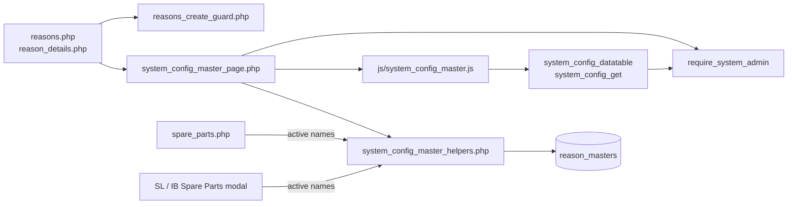
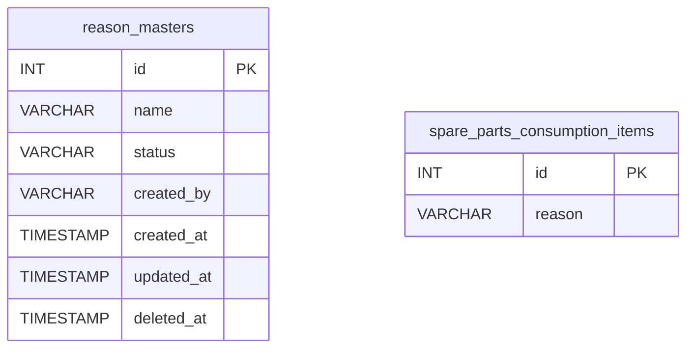
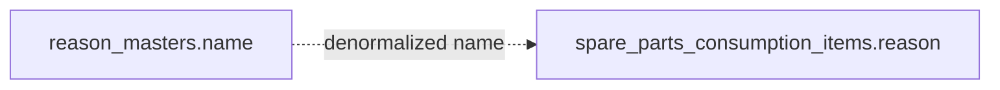
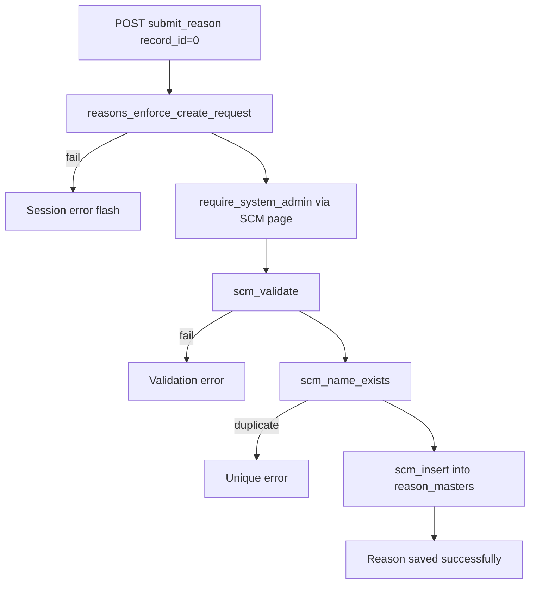
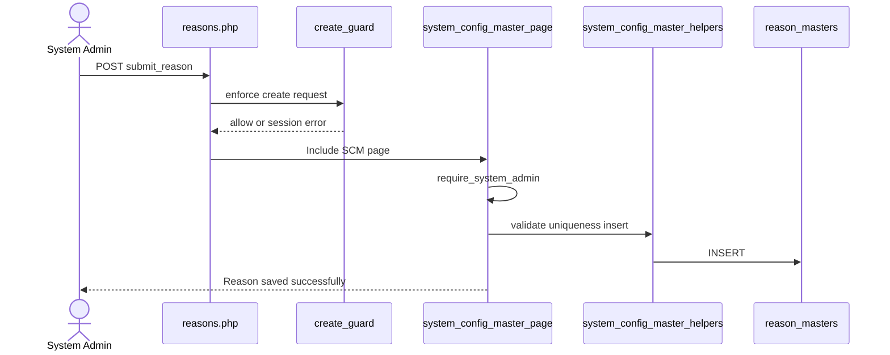
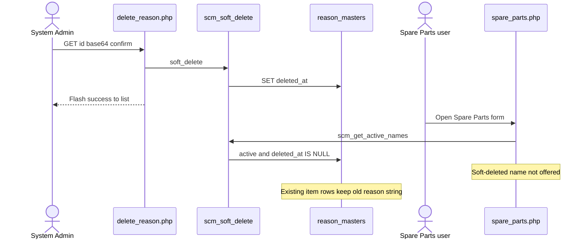
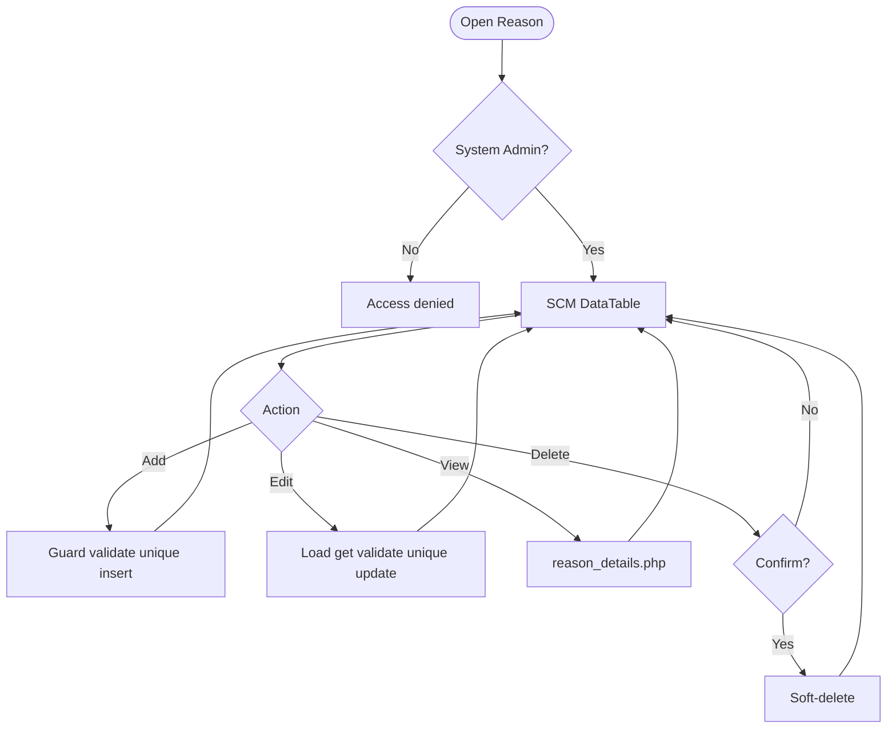
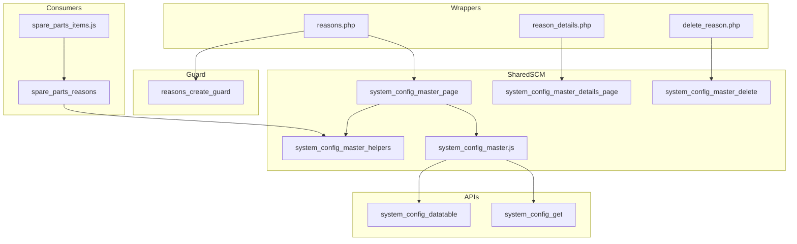

# Low-Level Design (LLD) — Reason Module

| Attribute | Value |
|-----------|--------|
| Module | Reason (System Config Master) |
| Menu path | SYSTEM CONFIGURATION → Reason |
| Landing page | `reasons.php` |
| Application | Complaint / Dealer Portal |
| Stack (target) | Core PHP + MySQL (PDO) |
| Stack (current repo) | Core PHP + **PostgreSQL** via PDO |
| Document version | 1.0 |
| Access | **System Admin only** (role id `6`) — no RBAC module slug |
| Architecture | Shared **SCM** stack (`$scmType = 'reason'`) |

---

## **1. Module Overview**

### 1.1 Purpose

System Administrators maintain Reason options in `reason_masters` for Spare Parts Consumption line items. The module is a thin SCM wrapper sharing `system_config_master_*` pages, helpers, APIs, and JS. Consumers store the selected **name string** on each spare-parts item (not an FK id). Service Log and Installed Base reuse the same options only inside their Add Spare Parts modals.

### 1.2 Scope

| In scope | Out of scope |
|----------|--------------|
| List / Add / Edit / Details / Soft-delete | Complaint Entry master field |
| Active / Inactive status | Service Log header field (modal SP items only) |
| Case-insensitive name uniqueness | Hard delete |
| Create abuse / rate-limit guard | Cascading rename/delete to spare-parts items |
| Active names for Spare Parts Select2 | Other SCM types |

### 1.3 High-level architecture



---

## **2. Functional Requirements**

| ID | Requirement | Priority |
|----|-------------|----------|
| FR-01 | System Admin can open Reason list (DataTables) | Must |
| FR-02 | Create reason with name and status | Must |
| FR-03 | Edit via inline slide-down form | Must |
| FR-04 | Soft-delete; hide from list | Must |
| FR-05 | Unique name among non-deleted (case/trim-insensitive) | Must |
| FR-06 | Filter / search list; status active/inactive | Should |
| FR-07 | View read-only details + audit fields | Should |
| FR-08 | Throttle / rate-limit create requests | Should |
| FR-09 | Client validate.js for name + status | Should |
| FR-10 | Expose active names to Spare Parts (and SL / IB SP modals) | Must |

---

## **3. User Roles & Permissions**

### 3.1 RBAC module slug

**None.** Reason administration is gated by **System Admin** (`SYSTEM_ADMIN_ROLE = 6`), not a permission slug.

### 3.2 Permission matrix

| Capability | Gate |
|------------|------|
| All Reason admin pages | `require_system_admin($obconn)` (via SCM page) |
| SCM APIs with `type=reason` | `admin_api_require_system_admin` |
| Denied | `Access denied. System Admin privileges required.` |

Pages (`reasons.php`, `reason_details.php`, `delete_reason.php`) are in `rbac_admin_pages()` and skip module RBAC; System Admin check is authoritative.

### 3.3 Page / API mapping

| Resource | Gate |
|----------|------|
| `reasons.php` | System Admin |
| `reason_details.php` | System Admin |
| `delete_reason.php` | System Admin |
| `api/system_config_datatable.php?type=reason` | System Admin API |
| `api/system_config_get.php?type=reason` | System Admin API |

### 3.4 Consumer access

Spare Parts users need Spare Parts module permissions (separate). They only see **active, non-deleted** names via `scm_get_active_names('reason')` / `spare_parts_reasons()`.

---

## **4. Business Rules**

| ID | Rule |
|----|------|
| BR-01 | Soft-deleted rows excluded from list, get, uniqueness, and SP options. |
| BR-02 | Name unique among non-deleted: `LOWER(TRIM(name))`; edit excludes self. |
| BR-03 | Soft-deleted names may be reused on create (partial unique index). |
| BR-04 | Status must be `active` or `inactive`. |
| BR-05 | Inactive names stay in admin list but are **not** offered in Spare Parts. |
| BR-06 | Soft-delete / rename does **not** update existing `spare_parts_consumption_items.reason` values. |
| BR-07 | No “in use” check before soft-delete. |
| BR-08 | Create-only abuse guard: max 1/request; min 3s interval; max 20 creates / 15 min. |
| BR-09 | Edit requires existing non-deleted row. |
| BR-10 | `created_by` = `current_username()` on insert; `created_at` / `updated_at` timestamps. |
| BR-11 | Details/delete URL ids are `base64_encode((string) id)`. |
| BR-12 | Create/update stay on page (no PRG). Delete redirects to list with session flash. |
| BR-13 | Spare Parts items store the **name string**, not `reason_masters.id`. |
| BR-14 | SCM type key is `reason`; table `reason_masters`; submit key `submit_reason`. |
| BR-15 | Master name max **100**; item column is **`VARCHAR(50)`** — keep option names ≤ 50 for safe storage. |
| BR-16 | Reason is required **per spare-parts line item** (not header-only). |

---

## **5. Database Design**

### 5.1 ER diagram



Logical link (name string, not FK):



### 5.2 Table: `reason_masters`

| Column | MySQL type | Notes |
|--------|------------|-------|
| `id` | `INT UNSIGNED AUTO_INCREMENT` | PK |
| `name` | `VARCHAR(100)` | Required; unique among non-deleted |
| `status` | `VARCHAR(20)` | `active` / `inactive`; default `active` |
| `created_by` | `VARCHAR(100)` | Creator username |
| `created_at` | `TIMESTAMP` | Insert |
| `updated_at` | `TIMESTAMP NULL` | Update / soft-delete |
| `deleted_at` | `TIMESTAMP NULL` | Soft-delete |

**Indexes (current repo):** PK on `id`; partial unique on `lower(trim(name)) WHERE deleted_at IS NULL`; index on `deleted_at`.

### 5.3 Related tables

| Table | Column | Role |
|-------|--------|------|
| `spare_parts_consumption_items` | `reason` `VARCHAR(50)` | Primary consumer (per item) |

### 5.4 Reference / lookup sources

| Source | Usage |
|--------|--------|
| `scm_registry()['reason']` | Labels, pages, table, submit key |
| `rbac_status_options()` | Status `<select>` |
| `scm_get_active_names('reason')` | SP dropdown options |
| `spare_parts_reasons()` | Consumer wrapper |

---

## **6. API / Backend Design**

### 6.1 Page endpoints

| Endpoint | Method | Auth | Description |
|----------|--------|------|-------------|
| `reasons.php` | GET | System Admin | List + Add/Edit panel |
| `reasons.php` | POST `submit_reason` | System Admin | Create or update |
| `reason_details.php?id=` | GET | System Admin | Read-only details |
| `delete_reason.php?id=` | GET | System Admin | Soft-delete |

Wrappers set `$scmType = 'reason'` and include shared SCM templates.

### 6.2 JSON APIs

#### `POST api/system_config_datatable.php`

Body/query includes `type=reason`. Server-side DataTables over `reason_masters` where `deleted_at IS NULL`.

```json
{
  "draw": 1,
  "recordsTotal": 10,
  "recordsFiltered": 2,
  "data": [{ "id": "#1", "name": "...", "status": "...", "actions": "<html>" }]
}
```

#### `GET api/system_config_get.php?type=reason&id=`

Returns row for edit form population. System Admin API gated.

### 6.3 Supporting lookup APIs

N/A for admin UI. Spare Parts (and SL / IB SP modals) embed active names as JSON (`#sparePartsReasonOptionsJson` / `#slSparePartsReasonOptionsJson`) for Select2.

### 6.4 Core PHP responsibilities

| File | Role |
|------|------|
| `reasons.php` | Create-guard hook + `$scmType` wrapper |
| `includes/system_config_master_page.php` | Shared list/form POST handler |
| `includes/system_config_master_details_page.php` | Shared details |
| `includes/system_config_master_delete.php` | Shared soft-delete |
| `includes/system_config_master_helpers.php` | Registry, validate, CRUD, options |
| `includes/module_create_guards/reasons_create_guard.php` | Create throttle / rate limit |
| `includes/spare_parts_helpers.php` | `spare_parts_reasons()` wrapper |
| `includes/admin_access_helpers.php` | System Admin gate |

---

## **7. Validation Rules**

### 7.1 Server-side (`scm_validate` + uniqueness + create guard)

| Field / rule | Message |
|--------------|---------|
| Name empty | `Reason name is required.` |
| Name > 100 | `Reason name cannot exceed 100 characters.` |
| Status missing/invalid | `Status is required.` |
| Duplicate name | `Reason name already exists. Please choose a different name.` |
| Missing edit target | `Reason not found or already deleted.` |
| Create throttle | `Please wait a few seconds before creating another record.` |
| Rate limit | `Create rate limit exceeded. You may create up to 20 records every 15 minutes...` |
| Bulk payload | `Too many records in a single request. A maximum of 1 record(s)...` |

**Spare Parts consumer (per item N):**  
`Spare part item N: Reason is required.` / `Spare part item N: Invalid Reason selected.`

### 7.2 Client-side (`js/system_config_master.js`)

- validate.js: Name required + max 100; Status required (generic wording)
- Edit load failure: `Failed to load record details.`
- Success alert fades after 3s
- Status is native `<select>` (no Select2 on master)
- Consumer JS (`spare_parts_items.js`): `Reason is required`

---

## **8. UI Screen Specifications**

### 8.1 Listing — `reasons.php`

| Element | Spec |
|---------|------|
| Subtitle | Manage reason options for spare parts consumption. |
| Placeholder | e.g. PM |
| CTA | Add Reason / Cancel (`#scmFormCard`) |
| Grid | `#scmTable` — ID, Name, Status, Created At, Action |
| List title | Reason Masters List |
| Actions | View / Edit / Delete (`confirm('Delete this record?')`) |
| Icon | `bi-list-check` |

### 8.2 Form panel

Fields: Name*, Status* (`active` / `inactive`).  
Hidden: `record_id`, `submit_reason`, SCM type wiring via `scm_page_js_config`.

### 8.3 Details — `reason_details.php`

Name, status badge, created by, created/updated timestamps (shared record-details layout).

### 8.4 Modals / Select2

- No CRUD modals on master.
- **Admin:** native status select — **no Select2**.
- **Consumers:** Select2 on `.spare-parts-reason-select` (`name="spare_parts_items[N][reason]"`), placeholder `Search reason`.

---

## **9. Database Flow**

### 9.1 Create



### 9.2 Soft-delete

```sql
UPDATE reason_masters
SET deleted_at = CURRENT_TIMESTAMP,
    updated_at = CURRENT_TIMESTAMP
WHERE id = :id
  AND deleted_at IS NULL;
```

### 9.3 Active options for Spare Parts

```sql
SELECT name
FROM reason_masters
WHERE deleted_at IS NULL
  AND status = 'active'
ORDER BY created_at ASC, id ASC;
```

---

## **10. Sequence Diagram**

### 10.1 Create reason



### 10.2 Soft-delete and Spare Parts impact



---

## **11. Activity Diagram**



---

## **12. Class / Module Diagram**



### 12.1 Key functions

| Function | Role |
|----------|------|
| `scm_registry` / `scm_config` | Type → table/pages/labels |
| `scm_safe_table` | Whitelist table name |
| `scm_from_post` / `scm_validate` | Parse + validate |
| `scm_name_exists` | Uniqueness |
| `scm_insert` / `scm_update` / `scm_soft_delete` | Persist |
| `scm_get_by_id` / `scm_get_active_names` / `scm_option_exists` | Reads |
| `scm_entry_actions` / `scm_page_js_config` | UI/API wiring |
| `reasons_enforce_create_request` | Create abuse guard |
| `spare_parts_reasons` | SP active-name options |
| `require_system_admin` | Access gate |

---

## **13. Folder Structure**

```text
ComplaintManagement/
├── reasons.php
├── reason_details.php
├── delete_reason.php
├── api/
│   ├── system_config_datatable.php
│   └── system_config_get.php
├── includes/
│   ├── system_config_master_helpers.php
│   ├── system_config_master_page.php
│   ├── system_config_master_details_page.php
│   ├── system_config_master_delete.php
│   ├── spare_parts_helpers.php
│   ├── admin_access_helpers.php
│   ├── admin_api_guard.php
│   └── module_create_guards/
│       └── reasons_create_guard.php
├── js/
│   ├── system_config_master.js
│   └── spare_parts_items.js
├── storage/
│   └── request_abuse/reasons/
└── docs/
    └── LLD_Reason_Module.md
```

---

## **14. Error Handling**

| Layer | Pattern |
|-------|---------|
| Create guard fail | `$_SESSION['error_message']`; POST submit unset |
| Page POST | Inline / session success or error via SCM page |
| Delete | Session flash → `reasons.php` |
| Details invalid | `die('Invalid record.')` / `die('Reason not found.')` |
| APIs | JSON + HTTP 403/404 |
| Create guard log | `storage/request_abuse/reasons/` |

### 14.1 Common messages

| Message | When |
|---------|------|
| `Reason saved successfully.` | Create |
| `Reason updated successfully.` | Update |
| `Reason deleted successfully.` | Soft-delete |
| `Failed to save reason.` / `Failed to update reason.` / `Failed to delete reason.` | Persist fail |
| `Reason not found or already deleted.` | Missing target |
| `Reason name already exists...` | Unique violation |
| `Invalid record.` | Bad delete id |
| `Access denied. System Admin privileges required.` | Non-admin |

---

## **15. Security Considerations**

| Area | Control |
|------|---------|
| Authorization | System Admin hard-gate on SCM pages + APIs |
| Soft-delete | Excluded from active queries and SP options |
| Create abuse | Throttle, rate limit, payload size, monitor log |
| Table safety | `scm_safe_table` whitelist for datatable SQL |
| DB uniqueness | Partial unique index on `lower(trim(name))` among non-deleted |
| CSRF | **Not implemented** on POST or GET delete |
| Delete method | **GET** soft-delete — CSRF-friendly; confirm only |
| PRG | **Not used** on create/update |
| Guard order gap | Create guard runs **before** `require_system_admin` → non-admins may write throttle/abuse files |
| Option exists gap | `scm_option_exists` ignores `status` → inactive name can pass SP server check if forced in POST |
| Length mismatch | Master `VARCHAR(100)` vs item `VARCHAR(50)` |
| Denormalized names | Rename/delete orphans historical item reason values |

---

## **16. Audit Logs**

### 16.1 Built-in field-level audit

| Field | Behavior |
|-------|----------|
| `created_by` / `created_at` | On create |
| `updated_at` | On update / soft-delete |
| `deleted_at` | Soft-delete |
| Dedicated audit table | **Not implemented** |
| Create abuse log | `storage/request_abuse/reasons/abuse_monitor.log` |

---

## **17. Test Cases**

### 17.1 Functional

| ID | Scenario | Expected |
|----|----------|----------|
| TC-01 | Non-admin opens Reason | Denied |
| TC-02 | Create with empty name | Validation error |
| TC-03 | Create duplicate name (different case) | Rejected (app + DB unique) |
| TC-04 | Soft-delete then recreate same name | Allowed |
| TC-05 | Set status inactive | In admin list; not in SP Select2 |
| TC-06 | Soft-delete name used on SP items | Items keep old string; dropdown omits it |
| TC-07 | Edit via pencil | Form filled from `system_config_get` |
| TC-08 | Delete confirmed | Soft-deleted; flash success |
| TC-09 | Create twice within 3 seconds | Throttle error |
| TC-10 | Create >20 in 15 minutes | Rate-limit error |
| TC-11 | Spare Parts item without reason | `Spare part item N: Reason is required.` |
| TC-12 | Spare Parts item unknown reason | `Spare part item N: Invalid Reason selected.` |
| TC-13 | Name longer than 50 chars | May save on master but truncate/fail risk on items |
| TC-14 | Datatable `type=reason` as admin | Rows from `reason_masters` |
| TC-15 | SL / IB Add Spare Parts modal | Reason Select2 loaded from same active names |

---

## **18. Assumptions & Dependencies**

### 18.1 Assumptions

1. Role id `6` is System Admin.
2. Soft-delete is the only remove mechanism.
3. Spare Parts Consumption (including SL / IB SP modals) is the only runtime consumer.
4. Operational practice keeps option names ≤ **50** characters to match item column length.
5. Name string denormalization on items is intentional for historical display.
6. Shared SCM stack remains the implementation vehicle.
7. Document target stack Core PHP + MySQL; repo runs PostgreSQL.
8. Create-guard storage under `storage/request_abuse/reasons/` is writable.

### 18.2 Dependencies

| Dependency | Purpose |
|------------|---------|
| SCM shared pages/helpers/JS/APIs | CRUD UI and persistence |
| `admin_access_helpers` / `admin_api_guard` | System Admin gate |
| `rbac_helpers` | Status options / validation / badges |
| Create-guard storage | Throttle state + abuse log |
| jQuery + DataTables + validate.js | List / form UX |
| Spare Parts module | Consumer of active names per line item |

---

## Appendix A — Success flashes

| Event | Message |
|-------|---------|
| Create | Reason saved successfully. |
| Update | Reason updated successfully. |
| Delete | Reason deleted successfully. |

---

## Appendix B — Select2 control map

| Screen | Control | Select2? |
|--------|---------|----------|
| Admin status select | Native `<select>` | No |
| Spare Parts `.spare-parts-reason-select` | Select2 | Yes (consumer) |
| SL / IB SP modal reason selects | Select2 | Yes (consumer) |

---

## Appendix C — SCM registry entry

| Key | Value |
|-----|-------|
| Type | `reason` |
| Table | `reason_masters` |
| Label | Reason |
| Plural | Reason Masters |
| Page | `reasons.php` |
| Submit key | `submit_reason` |
| Icon | `bi-list-check` |

---

## Appendix D — Create guard limits

| Limit | Value |
|-------|-------|
| Max records per request | 1 |
| Min interval between creates | 3 seconds |
| Max creates per window | 20 |
| Window | 15 minutes |

---

## Appendix E — Status vs consumer visibility

| Value | Admin list | Spare Parts options |
|-------|------------|---------------------|
| `active` | Yes | Yes |
| `inactive` | Yes | No |
| Soft-deleted | No | No |

---

## Appendix F — Consumer column map

| Module | Column | Max length |
|--------|--------|------------|
| Spare Parts items | `spare_parts_consumption_items.reason` | 50 |
| Master | `reason_masters.name` | 100 |

---

*End of LLD — Reason Module*
