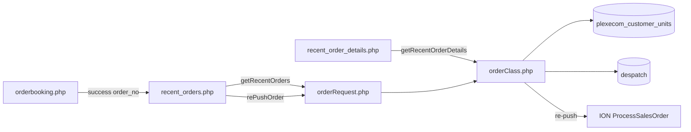
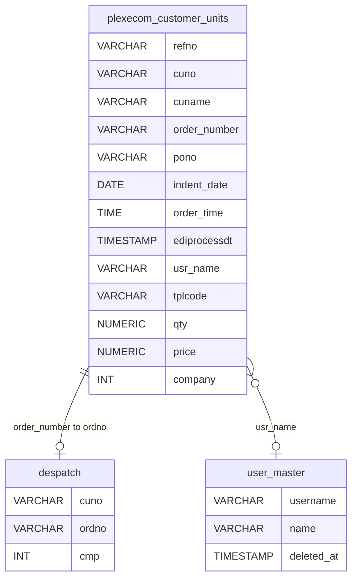
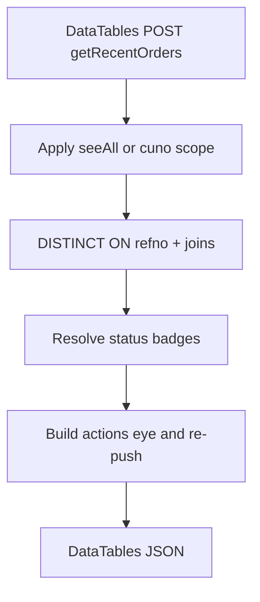
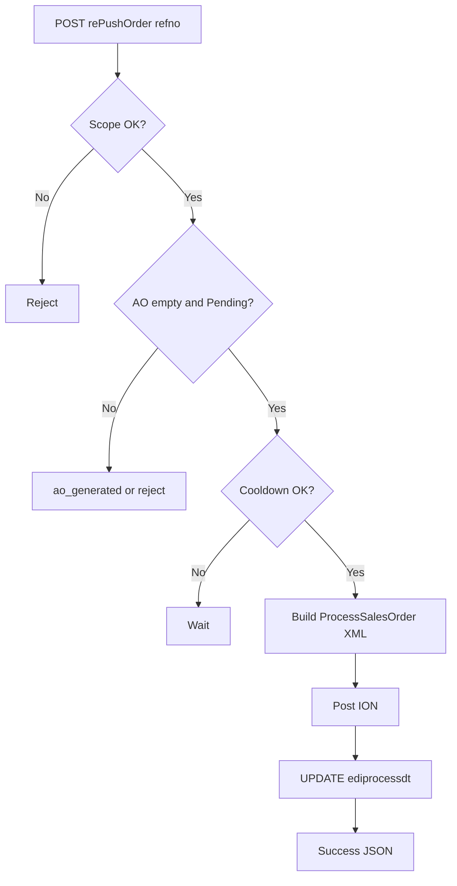
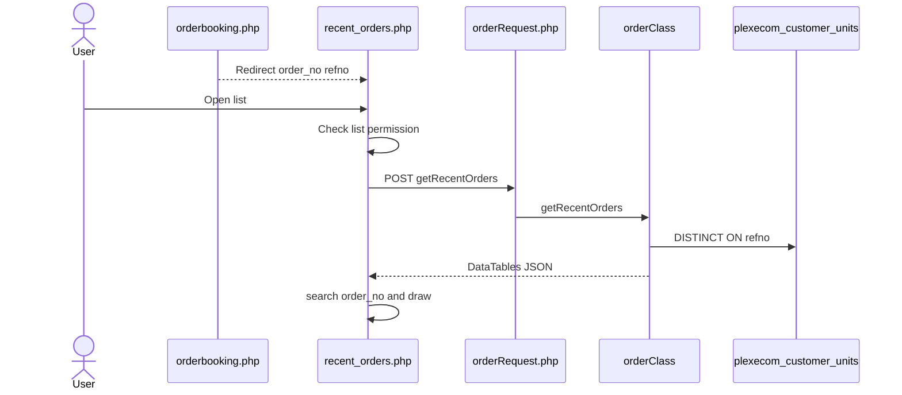
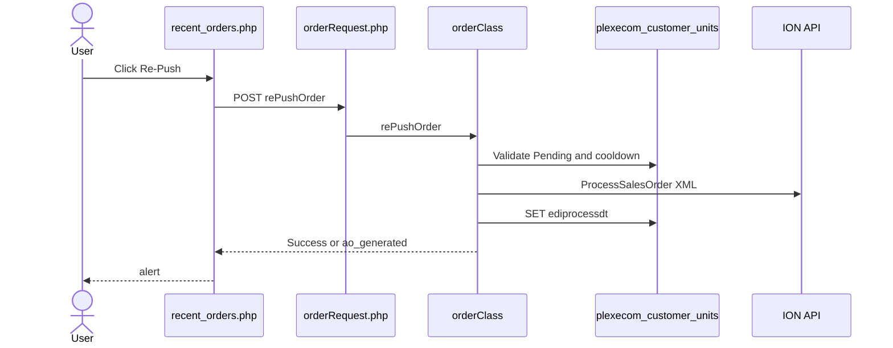
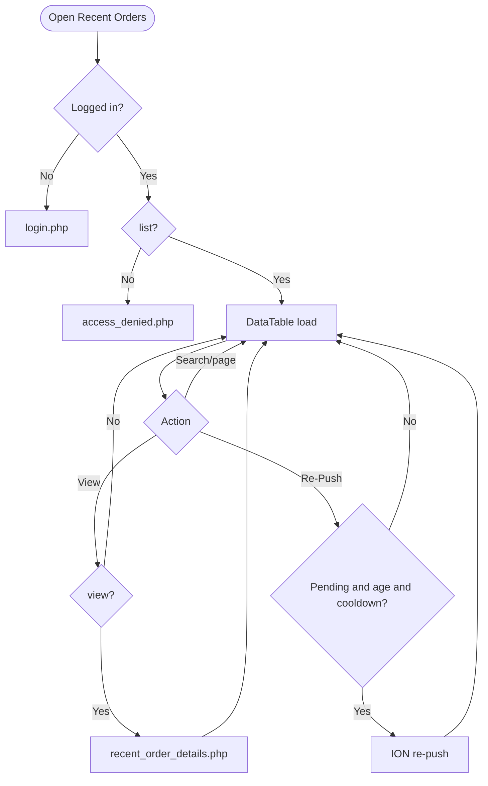
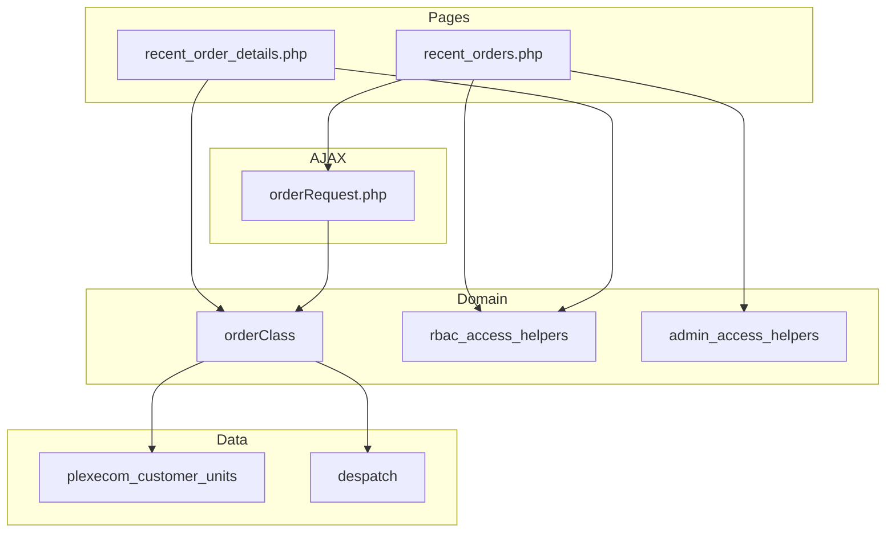

# Low-Level Design (LLD) — Recent Orders Module

| Attribute | Value |
|-----------|--------|
| Module | Recent Orders (List / Details / Re-Push) |
| Menu path | ORDER BOOKING → Recent Orders |
| Landing page | `recent_orders.php` |
| Details page | `recent_order_details.php` |
| Application | Complaint / Dealer Portal |
| Stack (target) | Core PHP + MySQL (PDO) |
| Stack (current repo) | Core PHP + **PostgreSQL** via PDO (`$obconn`, `$dpconn`) |
| Document version | 1.0 |
| Access | RBAC module slug **`recent-orders`** / permission **`list`** (details: **`view`**) |

---

## **1. Module Overview**

### 1.1 Purpose

Authenticated users with Recent Orders permissions browse booked dealer orders from `plexecom_customer_units` (one logical order per `refno`), view full details, and optionally Re-Push Pending orders to ION/LN. Booking success redirects here with `?order_no={refno}` to highlight the new order via DataTables search. Dashboard embeds a short Recent Orders preview using the same AJAX APIs.

### 1.2 Scope

| In scope | Out of scope |
|----------|--------------|
| Recent Orders DataTables list | Order Booking cart/create UI |
| Order details by `refno` | Pending Orders list (`pendingordersnew`) |
| Status badges: Pending / AO / Despatched | Order Acknowledgement list (`maintdealer`) |
| Re-Push for eligible Pending orders | Despatch Details UI |
| Booking success `?order_no=` deep-link | Excel export (button commented out) |
| Dashboard preview consumer | Line modal as primary list action (legacy) |

### 1.3 High-level architecture



---

## **2. Functional Requirements**

| ID | Requirement | Priority |
|----|-------------|----------|
| FR-01 | User with `recent-orders`/`list` can open Recent Orders list | Must |
| FR-02 | Server-side DataTables list grouped by `refno` | Must |
| FR-03 | Show Ref No, AO, category, terms, PO, transporter, status, date, actions | Must |
| FR-04 | Added By column for Admin / Management / CCS Admin | Should |
| FR-05 | Status badge Pending / AO / Despatched | Must |
| FR-06 | Eye link to details when `view` permitted | Must |
| FR-07 | Details page by `?refno=` with header + lines + totals | Must |
| FR-08 | Re-Push button for eligible Pending orders | Must |
| FR-09 | Honor `?order_no=` from booking success (search highlight) | Should |
| FR-10 | Scope non–seeAll users to session customer | Must |
| FR-11 | Export Excel when permitted | Could (UI commented out) |

---

## **3. User Roles & Permissions**

### 3.1 RBAC module slug

| Resource | Module | Permission |
|----------|--------|------------|
| `recent_orders.php` | `recent-orders` | `list` |
| `recent_order_details.php` | `recent-orders` | `view` |
| Export (reserved) | `recent-orders` | `export-excel` |
| Dashboard Recent block | `recent-orders` | `list` |

Unauthenticated → `login.php`. No `list` → `access_denied.php`. Details use `rbac_page_guard.php`.

### 3.2 Page / API mapping

| Resource | Gate |
|----------|------|
| `recent_orders.php` | `list` |
| `recent_order_details.php` | `view` |
| `POST orderRequest.php` (`getRecentOrders`, `getRecentOrderLine`, `rePushOrder`) | Session only — **no** module RBAC |

### 3.3 seeAll / Added By matrix

| Role | seeAll (all dealers) | Added By column |
|------|----------------------|-----------------|
| System Admin | Yes | Yes |
| Management | Yes | Yes |
| CCS Admin | No (own `cuno`) | Yes |
| Others | Own `cuno` | No |

```text
seeAll = is_system_admin() || is_management_user()
scope  = seeAll ? 1=1 : a.cuno = session customer_number_vayu
```

---

## **4. Business Rules**

| ID | Rule |
|----|------|
| BR-01 | Logical order key = `refno`; list uses `DISTINCT ON (refno)`. |
| BR-02 | Source table = `plexecom_customer_units` (booked lines from Order Booking). |
| BR-03 | Status **Pending** when `order_number` empty (or empty `cuno`). |
| BR-04 | Status **Despatched** when `despatch` has matching `(cuno, ordno)` with `cmp != 600`. |
| BR-05 | Status **AO** when AO exists on plexecom with `company != 600` and not despatched. |
| BR-06 | Eye action opens `recent_order_details.php?refno=...` (not modal on current list). |
| BR-07 | Re-Push UI shown only if: empty AO, status Pending, placed ≥ **30 minutes** ago. |
| BR-08 | Re-Push server: reject if AO already set (`ao_generated`); must be Pending; **5-minute** cooldown from `ediprocessdt`. |
| BR-09 | Re-Push success updates `ediprocessdt = CURRENT_TIMESTAMP` for `refno`. |
| BR-10 | Non–seeAll re-push must match session customer `cuno`. |
| BR-11 | `?order_no=` triggers client DataTables search for that refno. |
| BR-12 | Payment term display often defaults to `100% Advance` in UI enrichment. |
| BR-13 | No soft-delete filter on plexecom rows in this path. |
| BR-14 | Line modal `#lineModal` / `getRecentOrderLine` remains for Dashboard / legacy. |
| BR-15 | Export Excel button commented out. |

---

## **5. Database Design**

### 5.1 Logical model



### 5.2 Tables

| Table | Conn | Role |
|-------|------|------|
| `plexecom_customer_units` | `$obconn` | Primary list / details / re-push source |
| `tbl_vayu_delivery_term` | `$obconn` | Delivery term label |
| `tbl_vayu_order_category` | `$obconn` | Category label |
| `spp_payterm_master` | `$obconn` | Payment description |
| `transporter_master` | `$obconn` | Transporter name |
| `user_master` | `$obconn` | Added By (non-deleted) |
| `area` | `$obconn` | Details enrichment |
| `despatch` | `$dpconn` | Despatched status |
| `customer_address` | `$dpconn` | Re-push / address helpers |

### 5.3 List query pattern

```sql
SELECT DISTINCT ON (a.refno) a.*, /* joins for labels */
FROM plexecom_customer_units a
-- LEFT JOINs ...
WHERE /* seeAll or a.cuno = :customer */
  AND /* optional ILIKE search */
ORDER BY a.refno, /* then DataTables sort via outer query / mapped columns */
LIMIT :length OFFSET :start;
```

---

## **6. API / Backend Design**

### 6.1 Page endpoints

| Endpoint | Method | Auth | Description |
|----------|--------|------|-------------|
| `recent_orders.php` | GET `?order_no=` | `recent-orders`/`list` | List + deep-link search |
| `recent_order_details.php` | GET `?refno=` | `recent-orders`/`view` | Full details |

### 6.2 AJAX — `POST orderRequest.php`

| Action | Description |
|--------|-------------|
| `getRecentOrders` | DataTables JSON (list + dashboard) |
| `getRecentOrderLine` | HTML lines for modal (dashboard/legacy) |
| `rePushOrder` | Rebuild XML, post ION, bump `ediprocessdt` |

### 6.3 Core PHP responsibilities

| File | Role |
|------|------|
| `recent_orders.php` | List UI, RBAC flags, DataTable, re-push JS |
| `recent_order_details.php` | Details UI via `getRecentOrderDetails` |
| `orderRequest.php` / `orderClass.php` | List, lines, status, re-push, ION |
| `includes/rbac_access_helpers.php` | Page/menu AuthZ |
| `includes/admin_access_helpers.php` | seeAll / Added By role checks |
| `css/recent_order_details.css` | Details styling |

---

## **7. Validation Rules**

### 7.1 Server-side

| Field / rule | Behavior |
|--------------|----------|
| Session + `list`/`view` | Redirect login / access_denied / page guard |
| DataTables params | `start` / `length` / search / order |
| Re-Push `refno` | Required |
| Re-Push AO already set | `status: ao_generated` |
| Re-Push not Pending | Reject |
| Re-Push cooldown | Block if within 5 minutes of `ediprocessdt` |
| Re-Push scope | Non–seeAll: `cuno` must match session customer |
| Details `refno` | Load fail → error card (customer scope commented out — gap) |

### 7.2 Client-side

- DataTables serverSide; `pageLength` 10; `scrollX`
- `?order_no=` → `table.search(...).draw()`
- Re-Push: confirm/alert; cooldown UI via `data-repush-until`
- Eye links / re-push visibility driven by server-rendered HTML + RBAC flags
- No Select2 filters on list

---

## **8. UI Screen Specifications**

### 8.1 List — `recent_orders.php`

| Element | Spec |
|---------|------|
| Table | DataTables serverSide |
| Columns | Ref No, Order/AO No, Category, Delivery Term, PO, Payment Term, Transporter, Added By (conditional), Status, Order Date, Action |
| Default sort | Order Date descending |
| Action | Eye → details; Re-Push when eligible |
| Export | Commented out |
| Modal | `#lineModal` present (legacy; list uses details page) |
| Select2 | **Not used** |

### 8.2 Details — `recent_order_details.php`

| Element | Spec |
|---------|------|
| Header | Customer, PO, dates, terms, addresses, status |
| Lines | Item code/desc, qty, price, UOM, tax fields |
| Totals | Line aggregates / freight as implemented |
| Delivery type | Dealer vs end-customer from email / delivery_code |
| Fail | Inline error + link back to list |

### 8.3 Libraries

DataTables + Bootstrap 5 + jQuery; `order_acknowledge_style.css` / `orderbook_style.css` / `recent_order_details.css`.

---

## **9. Database Flow**

### 9.1 List load



### 9.2 Re-Push



---

## **10. Sequence Diagram**

### 10.1 List + booking deep-link



### 10.2 Re-Push



---

## **11. Activity Diagram**



---

## **12. Class / Module Diagram**



### 12.1 Key functions

| Function | Role |
|----------|------|
| `getRecentOrders` | DataTables JSON + actions |
| `getRecentOrderDetails` | Details payload |
| `getRecentOrderLine` | Modal HTML lines |
| `resolveRecentOrderStatus` / `Label` | Pending / AO / Despatched |
| `canShowRecentOrderRepush` | 30-min UI gate |
| `resolveRecentOrderRepushCooldownUntil` | 5-min cooldown |
| `rePushOrder` | ION re-submit + `ediprocessdt` |
| `buildProcessSalesOrderXmlForRepush` | BOD XML rebuild |
| `sendIonSalesOrderMessage` / `getBearerTokenLN` | ION transport |

---

## **13. Folder Structure**

```text
ComplaintManagement/
├── recent_orders.php
├── recent_order_details.php
├── orderbooking.php
├── orderRequest.php
├── orderClass.php
├── access_denied.php
├── includes/
│   ├── rbac_access_helpers.php
│   ├── rbac_page_guard.php
│   ├── admin_access_helpers.php
│   └── dashboard_helpers.php
├── css/
│   ├── recent_order_details.css
│   ├── order_acknowledge_style.css
│   └── orderbook_style.css
├── dashboard_data.php
└── docs/
    └── LLD_Recent_Orders_Module.md
```

---

## **14. Error Handling**

| Layer | Pattern |
|-------|---------|
| Unauthenticated | Redirect `login.php` |
| No `list` / `view` | `access_denied.php` / page guard |
| AJAX | JSON status/message; re-push `alert()` |
| Details load fail | Inline error card + back link |
| Booking land | SuccessModal then redirect (no session flash on list) |

### 14.1 Common messages / statuses

| Message / status | When |
|------------------|------|
| Access denied | Missing `list` |
| `ao_generated` | Re-Push when AO already exists |
| Cooldown / wait | Within 5 minutes of last `ediprocessdt` |
| Success alert | Re-Push OK |
| Coming Soon | Dashboard stub `rePushOrder()` |

---

## **15. Security Considerations**

| Area | Control |
|------|---------|
| Page AuthZ | RBAC `list` / `view` |
| AJAX AuthZ gap | `orderRequest` lacks `recent-orders` checks |
| Details IDOR gap | `getRecentOrderDetails` customer scope commented out |
| Line modal XSS / scope | `getRecentOrderLine` unscoped; raw field concat |
| Re-Push API gap | Does not enforce 30-minute age (UI does) |
| Customer fallback | Missing `customer_number_vayu` → `'10001'` |
| CCS Admin | Added By yes; seeAll no |
| CSRF | **Not implemented** on AJAX |
| Export | Commented out; not Recent-Orders-specific |
| EDI credentials | Env / ION token path (shared with booking) |

---

## **16. Audit Logs**

### 16.1 Built-in field-level audit

| Item | Behavior |
|------|----------|
| `ediprocessdt` | Updated on successful Re-Push |
| Booking create fields | Set at Order Booking insert |
| Dedicated Recent Orders audit table | **Not implemented** |
| ION submission trail | External system + local timestamp only |

---

## **17. Test Cases**

### 17.1 Functional

| ID | Scenario | Expected |
|----|----------|----------|
| TC-01 | Guest opens Recent Orders | Redirect login |
| TC-02 | User without `list` | `access_denied.php` |
| TC-03 | User with `list` | DataTable loads by `refno` |
| TC-04 | Booking success redirect with `order_no` | List searches that refno |
| TC-05 | Empty `order_number` | Status Pending |
| TC-06 | AO set, no despatch | Status AO |
| TC-07 | Despatch match | Status Despatched |
| TC-08 | Admin/Management | seeAll + Added By |
| TC-09 | CCS Admin | Own cuno + Added By |
| TC-10 | Dealer without `view` | No eye / details denied |
| TC-11 | Re-Push before 30 minutes | Button hidden |
| TC-12 | Re-Push within 5-min cooldown | Blocked |
| TC-13 | Re-Push after AO exists | `ao_generated` |
| TC-14 | Eligible Re-Push | ION call + `ediprocessdt` update |
| TC-15 | Direct details other dealer `refno` | **Gap:** may load despite scope |
| TC-16 | AJAX without `list` permission | **Gap:** may still return data if session valid |

---

## **18. Assumptions & Dependencies**

### 18.1 Assumptions

1. `recent-orders`/`list` and `view` are assigned to appropriate roles.
2. Order Booking writes all lines for an order under one `refno`.
3. ERP acknowledgement populates `order_number`; despatch writes `despatch` rows.
4. Live list primary navigation is eye → details page (modal is secondary/legacy).
5. Document target stack Core PHP + MySQL; repo runs PostgreSQL (`DISTINCT ON`, `ILIKE`).
6. Re-Push ION endpoint/credentials are configured in environment.

### 18.2 Dependencies

| Dependency | Purpose |
|------------|---------|
| RBAC / Assign Permissions | `recent-orders` grants |
| Order Booking | Creates rows; redirects with `order_no` |
| `$obconn` / `plexecom_customer_units` | List and details |
| `$dpconn` / `despatch` | Despatched status |
| ION / LN | Re-Push ProcessSalesOrder |
| DataTables + jQuery | List UX |
| Dashboard | Preview consumer of same APIs |

---

## Appendix A — List column map

| UI column | Source / notes |
|-----------|----------------|
| Ref No | `refno` |
| Order / AO No | `order_number` |
| Category | `tbl_vayu_order_category` |
| Delivery Term | `tbl_vayu_delivery_term` |
| PO Number | `pono` |
| Payment Term | pay master / default Advance |
| Transporter | `transporter_master` |
| Added By | `user_master` (conditional) |
| Status | Computed badge |
| Order Date | `indent_date` / `order_date` + time |
| Action | Eye + Re-Push |

---

## Appendix B — Select2 control map

**N/A.** Recent Orders list does not use Select2 filters.

---

## Appendix C — Status resolution matrix

| Condition | Badge |
|-----------|-------|
| Empty `order_number` | Pending |
| Despatch row for cuno+ordno (`cmp != 600`) | Despatched |
| AO on plexecom (`company != 600`) | AO |
| Else | Pending |

---

## Appendix D — Re-Push rules

| Gate | Where | Value |
|------|-------|-------|
| Empty AO + Pending | UI + server | Required |
| Placed ≥ 30 minutes | UI only | Required to show button |
| Cooldown from `ediprocessdt` | Server + UI | 5 minutes |
| Customer scope | Server | Non–seeAll must match `cuno` |
| Success side-effect | Server | Update `ediprocessdt` |

---

## Appendix E — RBAC permission matrix

| Permission | Effect |
|------------|--------|
| `list` | Open Recent Orders list / dashboard preview |
| `view` | Open `recent_order_details.php` |
| `export-excel` | Reserved; Export button commented out |

---

## Appendix F — Pipeline position

```text
Order Booking → plexecom_customer_units (refno, AO empty)
        ↓
Recent Orders list (this module) — status Pending
        ↓ AO populated
Status AO (+ Order Acknowledgement list elsewhere)
        ↓ despatch match
Status Despatched
```

Re-Push applies while still **Pending** (empty AO) after age/cooldown gates.

---

*End of LLD — Recent Orders Module*
