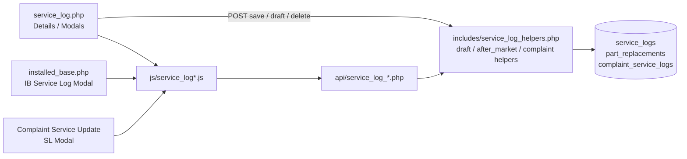
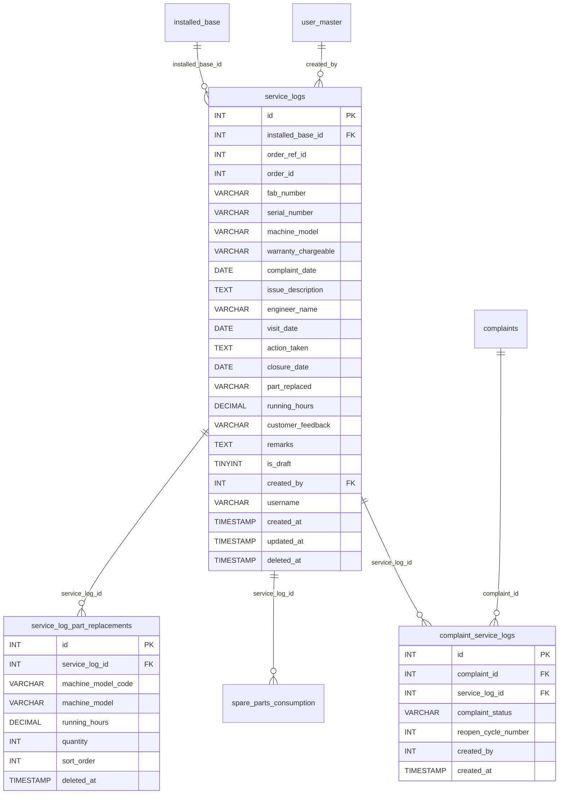
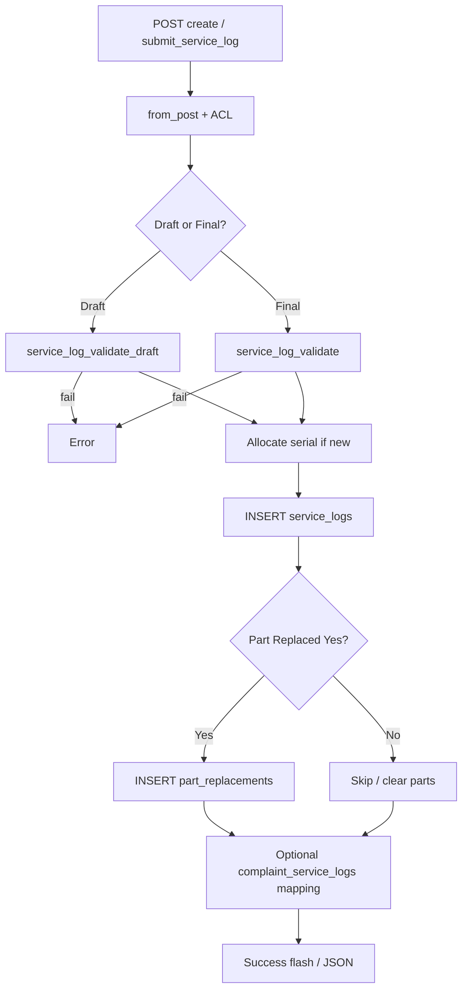
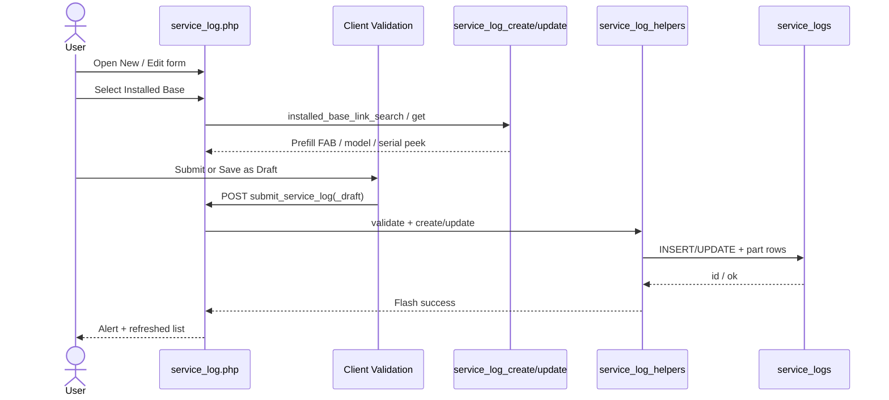
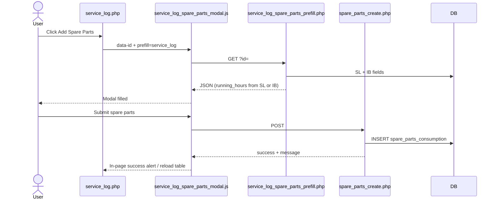
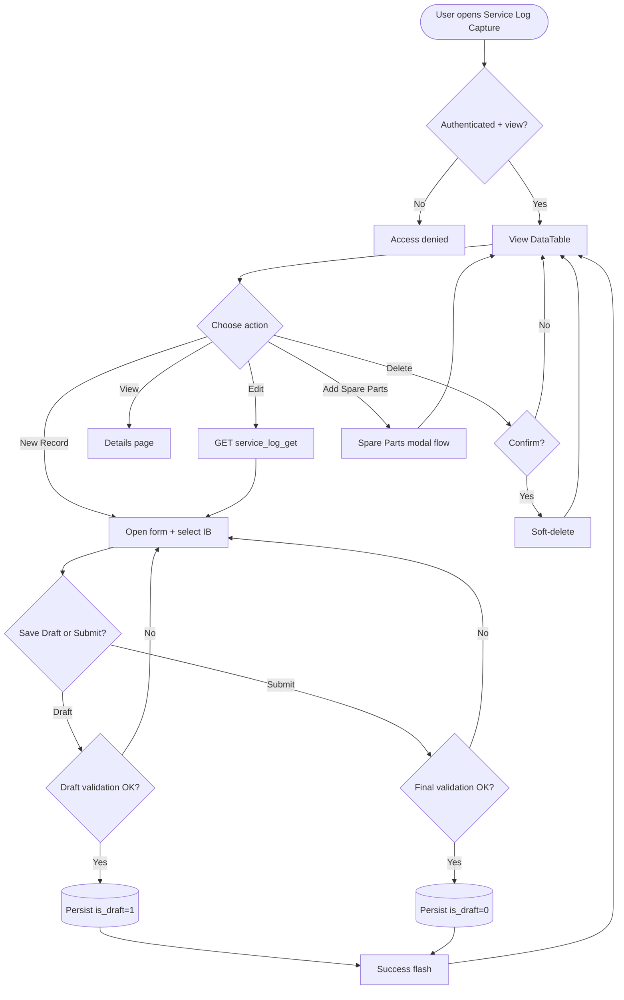
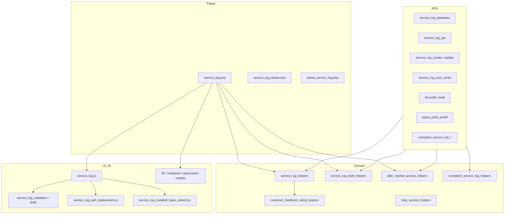

# Low-Level Design (LLD) — Service Log Capture Module

| Attribute | Value |
|-----------|--------|
| Module | Service Log Capture |
| Menu path | After Market → Service Log Capture |
| Application | Complaint / Dealer Portal (After Market) |
| Stack (target) | Core PHP + MySQL (PDO) |
| Stack (current repo) | Core PHP + **PostgreSQL** via PDO (`pdo_obconn.php`) — schema maps 1:1 to MySQL |
| Document version | 1.0 |
| Related modules | Installed Base Capture, Spare Parts Consumption, Complaints (Service Update), RBAC |

---

## 1. Module Overview

### 1.1 Purpose

Service Log Capture records a **field service visit** against an existing Installed Base machine: issue description, engineer, visit/closure dates, warranty type, part replacement (optional multi-line parts), running hours, customer feedback, and remaining consumable life. It supports **draft** and **final** (completed) states, and is a parent link for Spare Parts Consumption and for Complaint Service Update cycles.

### 1.2 Scope

| In scope | Out of scope |
|----------|--------------|
| Create / update / soft-delete service logs | Hard delete / cascade to spare parts |
| Draft save and promote to final submit | Changing RBAC admin UI |
| Server-side DataTable listing with after-market scope | Order booking (Order ID hidden; saved as `0`) |
| Link to Installed Base (FAB / machine model from IB) | Inventory / pricing of spare kits |
| Part-replaced multi entries + remaining consumables | Full ERP sync |
| Launch Add Spare Parts from SL row | Installed Base master CRUD (separate module) |
| Create/draft from IB modal and Complaint Service Update modal | |

### 1.3 High-level architecture



---

## 2. Functional Requirements

| ID | Requirement | Priority |
|----|-------------|----------|
| FR-01 | Users with `view` can open listing and details | Must |
| FR-02 | Users with `add` (or IB `add-service-log-capture`) can create service logs | Must |
| FR-03 | Users with `edit` can update accessible records | Must |
| FR-04 | Users with `delete` can soft-delete accessible records | Must |
| FR-05 | Listing is server-side searchable/sortable (DataTables) with draft badge | Must |
| FR-06 | Service log requires an existing accessible Installed Base | Must |
| FR-07 | Fab Number must match the selected Installed Base FAB | Must |
| FR-08 | Serial number auto-allocated (10001–99999), read-only, preserved on update | Must |
| FR-09 | Machine model overwritten from Installed Base on save | Must |
| FR-10 | Final submit requires Closure Date and all remaining consumable date/hours | Must |
| FR-11 | Save as Draft allowed without closure / remaining dates | Must |
| FR-12 | When Part Replaced = Yes: running hours, ≥1 part row, feedback 1–10 required (final) | Must |
| FR-13 | When Part Replaced = No: part entries / hours / feedback / remarks cleared for save | Must |
| FR-14 | Users with spare-parts add permission can open Add Spare Parts from a row | Must |
| FR-15 | Create/draft from Installed Base modal and Complaint modal | Must |
| FR-16 | Soft-deleted logs excluded from active queries | Must |
| FR-17 | List visibility follows after-market scope | Must |
| FR-18 | Complaint flow: one SL per in-progress / reopen cycle; service update needs completed SL | Should |

---

## 3. User Roles & Permissions

### 3.1 RBAC module slug

`service-log-capture`

### 3.2 Permission matrix

| Permission slug | Capability |
|-----------------|------------|
| `view` | List, details, datatable, get, link search |
| `add` | Create service log / allocate serial / IB prefill (with after-market OR) |
| `edit` | Update service log |
| `delete` | Soft-delete |

**Cross-module permissions**

| Permission | Module | Use |
|------------|--------|-----|
| `add-service-log-capture` | `installed-base-capture` | Add SL from Installed Base row / modal |
| `add` **or** IB `add-spare-parts-consumption` | `spare-parts-consumption` / IB | Add Spare Parts from SL |
| `service-update` | `assigned-complaint-list` | Complaint SL modal APIs |

Create/prefill/next-serial APIs also accept: IB `add-service-log-capture` **OR** SL `add` via `after_market_require_service_log_add_api_access()`.

### 3.3 Page / API mapping

| Resource | Module | Permission |
|----------|--------|------------|
| `service_log.php` | `service-log-capture` | `view` |
| `service_log_details.php` | `service-log-capture` | `view` |
| `delete_service_log.php` | `service-log-capture` | `delete` |
| `api/service_log_datatable.php` | `service-log-capture` | `view` |
| `api/service_log_get.php` | `service-log-capture` | `view` |
| `api/service_log_link_search.php` | `service-log-capture` | `view` |
| `api/service_log_create.php` | `service-log-capture` | `add` (+ after-market OR) |
| `api/service_log_update.php` | `service-log-capture` | `edit` |
| `api/service_log_next_serial.php` | `service-log-capture` | `add` (+ after-market OR) |
| `api/installed_base_service_log_prefill.php` | `service-log-capture` | `add` (+ after-market OR) |
| `api/installed_base_service_log_draft_create.php` | `service-log-capture` | `add` (+ after-market OR) |
| `api/service_log_spare_parts_prefill.php` | `spare-parts-consumption` | `add` |
| `api/complaint_service_log_*.php` | `assigned-complaint-list` | `service-update` |

### 3.4 After-market list scope

| Role class | List scope (`deleted_at IS NULL` always) |
|------------|------------------------------------------|
| System Admin / CCS Admin / Management | All active service logs |
| Sales Coordinator | Records whose `username` is in assigned dealers/engineers |
| Other roles | `username = current user` |

Record ACL: `after_market_user_can_access_record($conn, 'service_logs', $id)` (and IB ACL when linking).

---

## 4. Business Rules

| ID | Rule |
|----|------|
| BR-01 | Installed Base is mandatory; must exist and be accessible to the user. |
| BR-02 | Submitted `fab_number` must equal linked `installed_base.fab_number`. |
| BR-03 | Machine model on save is taken from Installed Base label (not free-typed). |
| BR-04 | Serial is auto-allocated 10001–99999 (`%05d`) under advisory lock; preserved on update; not user-editable. |
| BR-05 | Forms send `part_replacement_multi=1`. If Part Replaced = **Yes**: ≥1 part row (code + description + qty ≥ 1); common running hours copied to each entry; feedback 1–10 required on final submit. |
| BR-06 | If Part Replaced = **No**: clear part entries; clear `running_hours`, `customer_feedback`, `remarks` for persist. |
| BR-07 | Running hours required only when Part Replaced = Yes (multi path); numeric and `> 0`. |
| BR-08 | Final submit requires Closure Date and all six remaining consumable **dates + hours** (hours ≥ 0). |
| BR-09 | Draft does not require Closure Date or remaining dates; remaining hours validated only if filled. |
| BR-10 | Only existing drafts can be re-saved as draft; completing draft sets `is_draft = 0`. |
| BR-11 | Soft-delete sets `deleted_at` on `service_logs` only (does not cascade part replacements or spare parts). |
| BR-12 | `order_ref_id` / `order_id` persisted as `0` (Order ID UI hidden). |
| BR-13 | Warranty / Chargeable and Part Replaced must be active SCM option names. |
| BR-14 | Customer feedback stored as digit string `"1"`–`"10"`. |
| BR-15 | Complaint: one SL per in-progress cycle and per reopen cycle via `complaint_service_logs`; IB resolved by complaint FAB. |
| BR-16 | Service Update blocked until a **final** (non-draft) SL exists for the cycle. |

---

## 5. Database Design

> **Note:** Current production uses **PostgreSQL**. Types below are MySQL-equivalent for the requested stack.

### 5.1 ER diagram



### 5.2 Table: `service_logs`

| Column | MySQL type | Null | Default | Description |
|--------|------------|------|---------|-------------|
| `id` | `INT UNSIGNED AUTO_INCREMENT` | NO | — | PK |
| `installed_base_id` | `INT UNSIGNED` | NO | — | FK → `installed_base.id` |
| `order_ref_id` | `INT` | YES | `0` | Legacy; saved as `0` |
| `order_id` | `INT` / `VARCHAR(50)` | YES | `0` | Legacy; saved as `0` |
| `fab_number` | `VARCHAR(100)` | NO | — | Must match IB |
| `serial_number` | `VARCHAR(10)` | NO | — | Auto 10001–99999 |
| `machine_model` | `VARCHAR(255)` | NO | — | From IB |
| `warranty_chargeable` | `VARCHAR(150)` | NO | — | SCM option |
| `complaint_date` | `DATE` | NO | — | Log Date |
| `issue_description` | `TEXT` | NO | — | |
| `engineer_name` | `VARCHAR(150)` | NO | — | Alpha + spaces |
| `visit_date` | `DATE` | NO | — | |
| `action_taken` | `TEXT` | NO | — | |
| `closure_date` | `DATE` | YES | NULL | Required on final submit |
| `part_replaced` | `VARCHAR(50)` | NO | — | SCM Yes/No etc. |
| `running_hours` | `DECIMAL(12,2)` | YES | NULL | Required if Part Replaced Yes |
| `customer_feedback` | `VARCHAR(10)` | YES | NULL | `"1"`–`"10"` |
| `remarks` | `VARCHAR(1000)` | YES | NULL | |
| `separator_remaining_date` | `DATE` | YES | NULL | Consumable |
| `separator_remaining_hours` | `DECIMAL(12,2)` | YES | NULL | |
| `air_filter_remaining_date` | `DATE` | YES | NULL | |
| `air_filter_remaining_hours` | `DECIMAL(12,2)` | YES | NULL | |
| `oil_filter_remaining_date` | `DATE` | YES | NULL | |
| `oil_filter_remaining_hours` | `DECIMAL(12,2)` | YES | NULL | |
| `oil_remaining_date` | `DATE` | YES | NULL | |
| `oil_remaining_hours` | `DECIMAL(12,2)` | YES | NULL | |
| `valve_kit_remaining_date` | `DATE` | YES | NULL | |
| `valve_kit_remaining_hours` | `DECIMAL(12,2)` | YES | NULL | |
| `grease_remaining_date` | `DATE` | YES | NULL | |
| `grease_remaining_hours` | `DECIMAL(12,2)` | YES | NULL | |
| `is_draft` | `TINYINT(1)` | NO | `0` | `1` = draft |
| `created_by` | `INT UNSIGNED` | NO | — | FK → `user_master.id` |
| `username` | `VARCHAR(100)` | NO | — | Scope / ownership |
| `created_at` | `TIMESTAMP` | NO | `CURRENT_TIMESTAMP` | |
| `updated_at` | `TIMESTAMP` | YES | NULL | Update / soft-delete |
| `deleted_at` | `TIMESTAMP` | YES | NULL | Soft-delete |

**Recommended indexes:** `PRIMARY KEY (id)`, `KEY idx_sl_ib (installed_base_id)`, `KEY idx_sl_username (username)`, `KEY idx_sl_deleted (deleted_at)`, `KEY idx_sl_serial (serial_number)`, `KEY idx_sl_draft (is_draft)`.

### 5.3 Related tables

| Table | Relationship | Notes |
|-------|--------------|-------|
| `installed_base` | Parent via `installed_base_id` | Soft-delete independent |
| `service_log_part_replacements` | Child rows when Part Replaced = Yes | Soft-delete via `deleted_at` |
| `spare_parts_consumption` | Optional `service_log_id` | Created from SL row action |
| `complaint_service_logs` | Maps complaint cycle ↔ SL | Status + `reopen_cycle_number` |
| `user_master` | `created_by` | Actor |
| SCM option tables | Logical | `warranty_chargeable`, `part_replaced` |

#### `service_log_part_replacements`

| Column | MySQL type | Description |
|--------|------------|-------------|
| `id` | `INT UNSIGNED AUTO_INCREMENT` | PK |
| `service_log_id` | `INT UNSIGNED` | FK |
| `machine_model_code` | `VARCHAR(100)` | Part / model code |
| `machine_model` | `VARCHAR(255)` | Description |
| `running_hours` | `DECIMAL(12,2)` | Copied from common hours |
| `quantity` | `INT` | ≥ 1 |
| `sort_order` | `INT` | Display order |
| `deleted_at` | `TIMESTAMP NULL` | Soft-delete |

### 5.4 Reference / lookup sources

| Source | Usage |
|--------|--------|
| `installed_base` (via `api/installed_base_link_search.php`) | Link Select2 |
| System Config Master `warranty_chargeable` | Service type dropdown |
| System Config Master `part_replaced` | Yes/No dropdown |
| `api/machine_model_search.php` | Part-replacement rows |
| `api/service_log_next_serial.php` | Peek next serial |
| Complaint record + FAB → IB | Complaint prefill |

---

## 6. API / Backend Design

### 6.1 Page endpoints (HTML / form POST)

| Endpoint | Method | Auth | Description |
|----------|--------|------|-------------|
| `service_log.php` | GET | `view` | Listing + form panel |
| `service_log.php` | POST `submit_service_log` | `add` / `edit` | Create or finalize/update |
| `service_log.php` | POST `submit_service_log_draft` | `add` / `edit` | Save / update draft |
| `service_log_details.php?id=` | GET | `view` + ACL | Details (`id` base64) |
| `delete_service_log.php?id=` | GET | `delete` + ACL | Soft-delete (`id` base64) |

**Deep-link draft edit:**  
`service_log.php?edit_draft={base64(slId)}&return_ib={base64(ibId)}`

#### Key POST fields

| Field | Notes |
|-------|-------|
| `record_id` | `0` = create; >0 = update |
| `installed_base_id`, `fab_number`, `machine_model` | IB-linked |
| `serial_number` | Server-allocated on create |
| `warranty_chargeable`, `complaint_date` | Log date |
| `issue_description`, `engineer_name`, `visit_date`, `action_taken`, `closure_date` | Service details |
| `part_replaced`, `running_hours`, `customer_feedback`, `remarks` | Usage & feedback |
| `part_replacement_multi` | `1` |
| `part_replacement_entries[...]` | Code, model, qty |
| `*_remaining_date` / `*_remaining_hours` | Six consumables |
| `from_installed_base_modal` / `from_complaint_modal` | Modal flags |
| `return_installed_base_id` | Redirect after save |

### 6.2 JSON APIs

#### `POST api/service_log_datatable.php`

Scoped DataTables. Columns include id (draft badge), serial, machine model, warranty, engineer, visit/closure dates, created_at, actions.

#### `GET api/service_log_get.php?id=`

Full form payload + `part_replacement_entries` + `is_draft`.  
Optional `complaint_id` for complaint-flow ACL.  
Errors: `Invalid record.` / `Record not found.`

#### `POST api/service_log_create.php`

```json
{ "success": true, "message": "...", "service_log_id": 1, "installed_base_id": 10 }
```

Messages vary by context (page / IB modal / complaint).

#### `POST api/service_log_update.php`

Same success shape; sets `is_draft = 0` on final update path.

#### `GET api/service_log_next_serial.php`

Returns next serial peek for UI.

#### `GET api/installed_base_service_log_prefill.php?id=`

```json
{
  "installed_base_id": 1,
  "installed_base_label": "#1 - FAB - Customer",
  "order_id": "",
  "fab_number": "...",
  "machine_model": "CODE - DESC",
  "machine_model_code": "...",
  "machine_model_desc": "...",
  "running_hours": "...",
  "serial_number": "10042"
}
```

#### `POST api/installed_base_service_log_draft_create.php`

Draft create from IB modal (`from_installed_base_modal=1`).

#### `GET api/service_log_spare_parts_prefill.php?id=`

Prefills Add Spare Parts; running hours = SL hours, else IB hours.

#### Complaint APIs

| API | Purpose |
|-----|---------|
| `GET api/complaint_service_log_prefill.php?complaint_id=` | Prefill + cycle metadata |
| `POST api/complaint_service_log_draft_save.php` | Draft + mapping row |
| `GET api/complaint_service_log_summary.php?complaint_id=` | Cycle summary / permissions |

### 6.3 Supporting lookup APIs

| API | Purpose |
|-----|---------|
| `api/installed_base_link_search.php` | IB Select2 on SL form |
| `api/machine_model_search.php` | Part-replacement model Select2 |
| `api/service_log_link_search.php` | SL picker (Spare Parts page) |
| `api/spare_parts_create.php` | Create spare parts from SL modal |

### 6.4 Core PHP module responsibilities

| Module / file | Responsibility |
|---------------|----------------|
| `includes/service_log_helpers.php` | from_post, validate, create/update, serial alloc, part replacements, actions HTML |
| `includes/service_log_draft_helpers.php` | Draft validate/save, badges, IB return URLs |
| `includes/after_market_access_helpers.php` | Scope, ACL, add-SL / spare-parts gates |
| `includes/customer_feedback_rating_helpers.php` | 1–10 rating validate/render |
| `includes/complaint_service_log_helpers.php` | Mapping, prefill, cycle rules |
| `includes/rbac_*` | Page/API guards |

---

## 7. Validation Rules

### 7.1 Server-side

#### Final submit (`service_log_validate`)

| Field / rule | Error message |
|--------------|---------------|
| Installed Base | `Installed base record is required.` |
| FAB | `Fab Number is required.` / `Fab Number does not match the selected installed base record.` |
| Serial (update) | `Serial Number is required.` |
| Machine Model | `Machine Model is required.` |
| Warranty | `Warranty / Chargeable is required.` / `Invalid Warranty / Chargeable selection.` |
| Log Date | `Log Date is required.` |
| Issue | `Issue / Service Description is required.` |
| Engineer | `Engineer Name is required.` / alpha-spaces / max 150 |
| Visit Date | `Visit Date is required.` |
| Action Taken | `Action Taken is required.` |
| Closure Date | `Closure Date is required to complete the service log.` |
| Part Replaced | `Part Replaced is required.` / `Invalid Part Replaced selection.` |
| Running Hours (Yes) | `Running Hours is required.` / `Running Hours must be greater than 0.` |
| Part rows (Yes) | At least one entry; entry N model/qty messages |
| Feedback (Yes) | `Customer Feedback is required.` / `Please select a customer feedback rating between 1 and 10.` |
| Remarks | `Remarks cannot exceed 1000 characters.` |
| Date order | Visit ≥ Log; Closure ≥ Visit |
| Remaining | `{Label} Remaining Date/Hours is required.` / hours non-negative |
| IB access | `Selected installed base record was not found or is not assigned to your account.` |
| Serial alloc | `Unable to allocate a unique service log serial number.` |

#### Draft (`service_log_validate_draft`)

Same core required fields **except** Closure Date and remaining dates; remaining hours only if filled; feedback optional but must be 1–10 if set; part qty validated when filled.

### 7.2 Client-side

| Script | Behavior |
|--------|----------|
| `js/service_log_validation.js` | Mirrors final submit (validate.js); messages often without trailing period |
| `js/service_log_draft_validation.js` | Draft rules; closure/remaining dates not required |
| `js/service_log_part_replacement.js` | Part rows + running hours + feedback when Yes |
| IB / complaint modal JS | Parallel constraints for modal forms |

---

## 8. UI Screen Specifications

### 8.1 Listing — `service_log.php`

| Element | Spec |
|---------|------|
| Title | Service Log Capture |
| Subtitle | Capture service visit and resolution details linked to installed base |
| Primary CTA | New Record (if add) → opens form panel |
| Grid columns | ID (draft badge), Serial No., Machine Model, Service Type, Engineer, Visit Date, Closure Date, Created At, Action |
| Empty | `No service logs found.` / `No matching service logs found.` |
| Draft rows | CSS class `service-log-draft-row` |
| Row actions | View, Edit, Add Spare Parts, Delete (permission-gated) |

### 8.2 Form panel — `#serviceLogForm`

**Section 1 — Machine & Order**

| Field | Control | Notes |
|-------|---------|-------|
| Installed Base | Select2 | Required |
| Fab Number | readonly | From IB |
| Machine Model | readonly | From IB |
| Serial Number | readonly | Auto |
| Warranty / Chargeable | static Select2 | Required |
| Log Date | date (`complaint_date`) | Required |
| Order ID | hidden | Saved as `0` |

**Section 2 — Issue / Services**

Issue Description*, Engineer*, Visit Date*, Closure Date* (final), Action Taken*

**Section 3 — Usage & Feedback**

Part Replaced*; if Yes → Running Hours*, multi part rows (Machine Model/Part Select2, Qty*), Customer Feedback 1–10*, Remarks

**Section 4 — Remaining Consumables**

Six parts × Remaining Date + Remaining Hours (required on final)

**Actions:** Cancel · **Save as Draft** · **Submit / Update Service Log**  
Hint: `Closure date is mandatory to complete the service log.`

### 8.3 Details — `service_log_details.php`

- Same four sections (read-only)
- Part Replaced Details only if Yes
- Optional linked complaint section
- Draft badge when `is_draft = 1`
- Back to Service Log Capture

### 8.4 Modals (from listing / related pages)

| Modal | Host | Behavior |
|-------|------|----------|
| Add Spare Parts | SL listing / details | `data-prefill="service_log"` → spare parts prefill + create |
| Add Service Log | Installed Base listing | Prefill IB; create or draft; redirect `?service_log_added=1` / `?service_log_draft_added=1` |
| Add Service Log | Complaint Service Update | Prefill by complaint; cycle mapping; draft/create APIs |

---

## 9. Database Flow

### 9.1 Create



### 9.2 Soft-delete

```sql
UPDATE service_logs
SET deleted_at = CURRENT_TIMESTAMP,
    updated_at = CURRENT_TIMESTAMP
WHERE id = :id
  AND deleted_at IS NULL;
```

Confirm UI: `Delete this service log?`  
Does **not** cascade to `service_log_part_replacements` or `spare_parts_consumption`.

### 9.3 List query pattern

```sql
SELECT ... FROM service_logs
WHERE /* after_market_list_scope: deleted_at IS NULL [AND username ...] */
  AND /* optional DataTables search */
ORDER BY {col} {ASC|DESC}
LIMIT :limit OFFSET :offset;
```

Draft indicator: `is_draft = 1` rendered as badge in ID column.

---

## 10. Sequence Diagram

### 10.1 Create / update service log



### 10.2 Add Spare Parts from Service Log row



---

## 11. Activity Diagram



---

## 12. Class / Module Diagram



### 12.1 Key functions

| Function / area | Role |
|-----------------|------|
| `service_log_from_post()` | Map POST → data |
| `service_log_validate()` / `service_log_validate_draft()` | Server validation |
| `service_log_create_record()` / `service_log_update_record()` | Persist final |
| `service_log_save_draft_record()` | Persist draft |
| `service_log_allocate_serial()` / next-serial peek | Serial 10001–99999 |
| `service_log_insert/sync_part_replacements()` | Child parts |
| `service_log_apply_part_replacement_fields_for_save()` | Yes/No field rules |
| `service_log_entry_actions()` | Row action HTML |
| `after_market_list_scope()` / `after_market_user_can_access_record()` | ACL |
| Complaint mapping helpers | Cycle link + prefill |

---

## 13. Folder Structure

```text
ComplaintManagement/
├── service_log.php
├── service_log_details.php
├── delete_service_log.php
├── api/
│   ├── service_log_datatable.php
│   ├── service_log_get.php
│   ├── service_log_create.php
│   ├── service_log_update.php
│   ├── service_log_next_serial.php
│   ├── service_log_link_search.php
│   ├── service_log_spare_parts_prefill.php
│   ├── installed_base_service_log_prefill.php
│   ├── installed_base_service_log_draft_create.php
│   ├── complaint_service_log_prefill.php
│   ├── complaint_service_log_draft_save.php
│   └── complaint_service_log_summary.php
├── includes/
│   ├── service_log_helpers.php
│   ├── service_log_draft_helpers.php
│   ├── service_log_record_details_section.php
│   ├── service_log_linked_complaint_details_section.php
│   ├── service_log_spare_parts_modal.php
│   ├── installed_base_service_log_modal.php
│   ├── complaint_service_log_helpers.php
│   ├── complaint_service_log_draft_helpers.php
│   ├── complaint_service_log_modal.php
│   ├── after_market_access_helpers.php
│   └── customer_feedback_rating_helpers.php
├── js/
│   ├── service_log.js
│   ├── service_log_validation.js
│   ├── service_log_draft_validation.js
│   ├── service_log_part_replacement.js
│   ├── service_log_installed_base_select2.js
│   ├── service_log_spare_parts_modal.js
│   ├── installed_base_service_log_modal.js
│   ├── installed_base_service_log_draft.js
│   ├── complaint_service_log_modal.js
│   └── complaint_service_log_draft.js
└── docs/
    └── LLD_Service_Log_Capture_Module.md
```

---

## 14. Error Handling

| Layer | Pattern |
|-------|---------|
| Page POST | `$error_message` / `$success_message` alerts |
| Delete / ACL | `$_SESSION['error_message']` + redirect |
| JSON APIs | HTTP `401` / `403` / `404` / `405` / `422` + `{"error":"..."}` |
| Client AJAX | `alert()` or in-page Bootstrap alerts |
| DB | PDO exceptions → user-safe message |

### 14.1 Common messages

| Message | When |
|---------|------|
| `Access denied. You do not have permission for this action.` | RBAC / ACL |
| `Access denied. You do not have permission to add/edit service log records.` | Add/edit gate |
| `Unable to resolve logged-in user.` | Missing user id |
| `Record not found or already deleted.` | Missing target |
| `Failed to save service log.` / `Failed to update service log.` / `Failed to save service log draft.` | Persist failure |
| `Failed to delete service log.` | Soft-delete failure |
| `Only draft service logs can be saved as draft.` | Re-draft non-draft |
| `Service Log Capture must create a new record.` | IB modal with existing `record_id` |
| `No installed base record found for this complaint Fab Number.` | Complaint prefill |
| `A service log already exists for the {status} cycle...` | Duplicate cycle SL |
| `Please complete the service log before submitting the service update.` | Complaint gate |

---

## 15. Security Considerations

| Area | Control |
|------|---------|
| SQL Injection | PDO prepared statements / bindValue |
| XSS | `htmlspecialchars` on output; careful action HTML builders |
| CSRF | Session-authenticated POST; **recommend** CSRF tokens on mutating forms/APIs |
| Authentication | Portal session |
| Authorization | RBAC + after-market scope + record ACL |
| IDOR | Details/delete/get scoped; base64 IDs are obfuscation only |
| Soft-delete | All reads filter `deleted_at IS NULL` |
| Serial allocation | Advisory lock to avoid races |
| Mass assignment | Explicit from_post whitelist; order fields forced to `0` |

---

## 16. Audit Logs

### 16.1 Built-in field-level audit

| Field | Behavior |
|-------|----------|
| `created_by` | Set on INSERT |
| `username` | Set on INSERT (list scope) |
| `created_at` | DB default |
| `updated_at` | Set on UPDATE and soft-delete |
| `deleted_at` | Soft-delete timestamp |
| `is_draft` | Draft vs final state |
| `updated_by` | **Not implemented** |

No dedicated `service_log_audit_log` table in the current codebase. Recommended future enhancement: action + before/after JSON + actor + IP (same pattern as Installed Base LLD §16.2).

---

## 17. Test Cases

### 17.1 Functional

| ID | Scenario | Expected |
|----|----------|----------|
| TC-01 | User with `view` opens listing | Scoped DataTable loads |
| TC-02 | Create with valid IB + final fields | Success; `is_draft=0`; serial assigned |
| TC-03 | Save as Draft without closure | Success; `is_draft=1`; draft badge |
| TC-04 | Submit draft with closure + consumables | Becomes final `is_draft=0` |
| TC-05 | FAB mismatch vs IB | Error: FAB does not match |
| TC-06 | Part Replaced Yes without part rows | Validation error |
| TC-07 | Part Replaced Yes without feedback (final) | Validation error |
| TC-08 | Part Replaced No | Hours/feedback/parts cleared on save |
| TC-09 | Visit before Log Date | Validation error |
| TC-10 | Soft-delete | Removed from list; `deleted_at` set |
| TC-11 | Edit accessible record | Update success |
| TC-12 | Add Spare Parts from row | Modal prefills; create succeeds |
| TC-13 | IB modal create | Redirect `service_log_added=1` |
| TC-14 | IB modal draft | Redirect `service_log_draft_added=1` |
| TC-15 | Complaint: no IB for FAB | Prefill error message |
| TC-16 | Complaint: duplicate cycle SL | Blocked with cycle message |
| TC-17 | Sales coordinator scope | Sees only assigned usernames |
| TC-18 | Admin list | Sees all active logs |
| TC-19 | Remaining hours missing on final | Validation error |
| TC-20 | Serial not editable by user | Remains server value on update |

---

## 18. Assumptions & Dependencies

### 18.1 Assumptions

1. Users authenticate via existing portal session (`user_master`).
2. RBAC permissions for `service-log-capture` (and cross-module add-SL / spare-parts) are seeded.
3. An Installed Base record already exists before a Service Log can be created.
4. SCM masters for `warranty_chargeable` and `part_replaced` are maintained.
5. Soft-deleted children (parts / spare parts) are filtered independently.
6. Order linkage is intentionally disabled in UI.
7. Document target stack is Core PHP + MySQL; **this repository currently runs PostgreSQL** with equivalent PDO SQL.

### 18.2 Dependencies

| Dependency | Purpose |
|------------|---------|
| PHP PDO + MySQL (or PostgreSQL) | Persistence |
| Session + RBAC helpers | AuthZ |
| Installed Base module | Parent machine record |
| jQuery + Select2 + DataTables + Bootstrap | UI |
| validate.js | Client validation |
| Spare Parts module | Child consumption from SL |
| Complaints / Service Update | Optional cycle coupling |
| `current_username_helpers` | Actor identity |
| Customer feedback rating helpers | 1–10 UI/validation |

---

## Appendix A — Success flash query flags

| Flag / source | Message |
|---------------|---------|
| Page create | Service log saved successfully. |
| Page update | Service log updated successfully. |
| Page/API draft create | Service log saved as draft successfully. |
| Page/API draft update | Service log draft updated successfully. |
| IB modal create / `?service_log_added=1` | Service Log Capture added successfully. |
| IB modal draft / `?service_log_draft_added=1` | Service log saved as draft successfully. |
| IB details `?service_log_updated=1` | Service log updated successfully. |
| IB details `?service_log_draft_updated=1` | Service log draft updated successfully. |
| Complaint create | Service log added successfully. |
| Delete (session) | Service log deleted successfully. |

---

## Appendix B — Select2 control map

| Control | Element / context | API / mode |
|---------|-------------------|------------|
| Installed Base | `#installedBaseLinkSelect` | `api/installed_base_link_search.php` |
| Warranty / Chargeable | `#serviceLogWarrantySelect` | Static SCM options |
| Part Replaced | `#serviceLogPartReplacedSelect` | Static SCM options |
| Part row Machine Model/Part | Part replacement entries | `api/machine_model_search.php` |
| IB / complaint modal machine parts | Modal forms | `api/machine_model_search.php` |
| Spare Parts page → Service Log | `#sparePartsServiceLogSelect` | `api/service_log_link_search.php` |
| Link search label format | — | `#id - {serial} - Visit: {visit_date}` |

---

*End of LLD — Service Log Capture Module*
