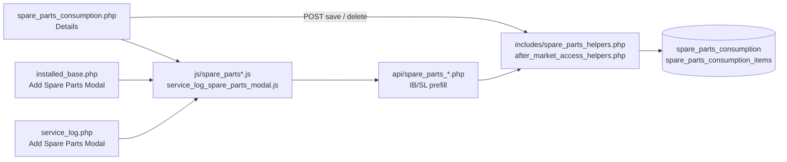
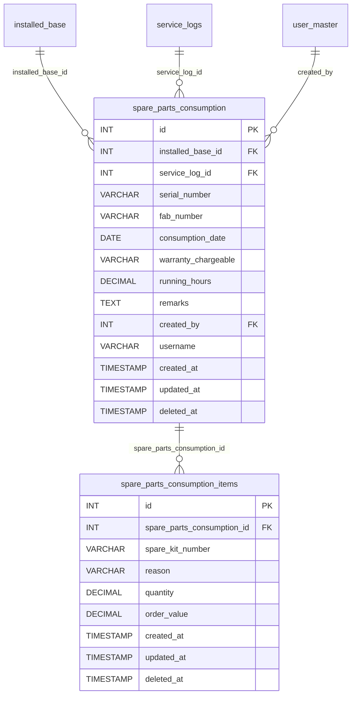
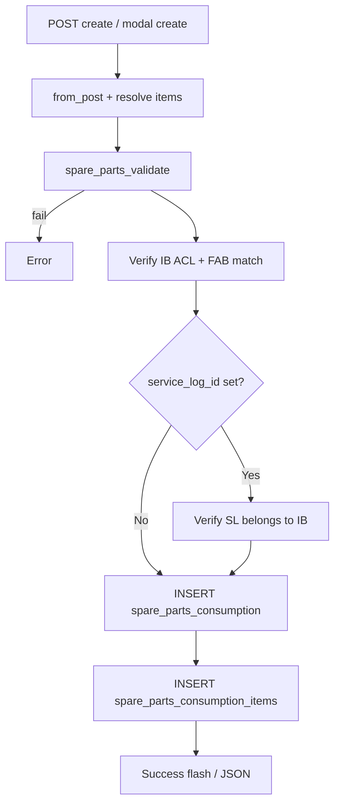
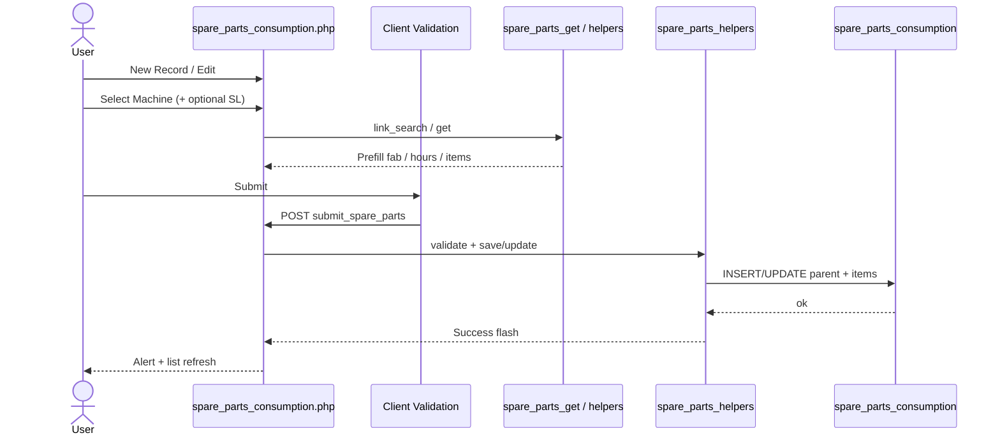
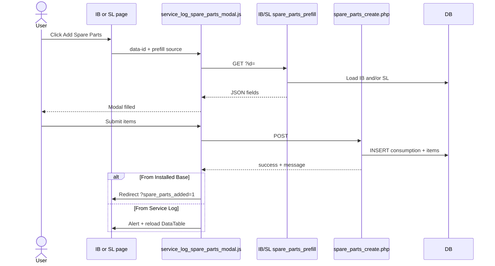
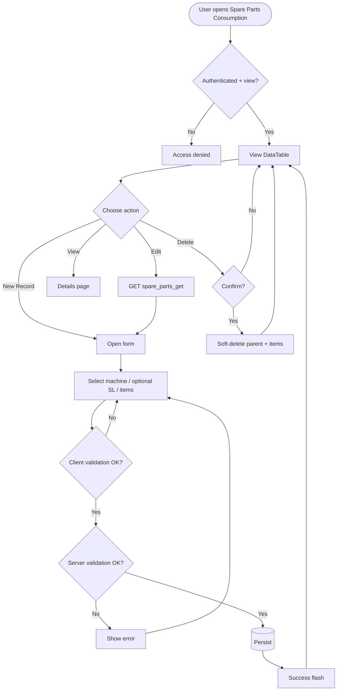
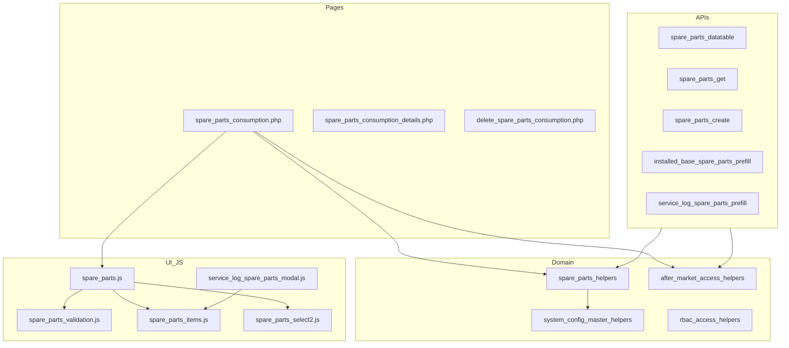

# Low-Level Design (LLD) — Spare Parts Consumption Module

| Attribute | Value |
|-----------|--------|
| Module | Spare Parts Consumption |
| Menu path | After Market → Spare Parts Consumption |
| Application | Complaint / Dealer Portal (After Market) |
| Stack (target) | Core PHP + MySQL (PDO) |
| Stack (current repo) | Core PHP + **PostgreSQL** via PDO (`pdo_obconn.php`) — schema maps 1:1 to MySQL |
| Document version | 1.0 |
| Related modules | Installed Base Capture, Service Log Capture, RBAC, System Config Master |

---

## 1. Module Overview

### 1.1 Purpose

Spare Parts Consumption records **parts consumed against a machine** (Installed Base), optionally linked to a Service Log: consumption date, warranty/chargeable type, running hours, remarks, and one or more line items (spare kit number, reason, quantity, order value). It can be created from the dedicated listing page or from **Add Spare Parts** actions on Installed Base / Service Log rows.

### 1.2 Scope

| In scope | Out of scope |
|----------|--------------|
| Create / update / soft-delete consumption headers + items | Hard delete / inventory stock deduction |
| Multi-item spare kit rows (unlimited) | Spare kit master / catalog Select2 (kit is free text) |
| Server-side DataTable listing with after-market scope | Pricing engine beyond entered order value |
| Prefill from Installed Base or Service Log modals | Cascade delete when IB/SL is soft-deleted |
| Optional Service Log link (must belong to selected IB) | Order booking (Order ID hidden / not stored on parent) |

### 1.3 High-level architecture



---

## 2. Functional Requirements

| ID | Requirement | Priority |
|----|-------------|----------|
| FR-01 | Users with `view` can open listing and details | Must |
| FR-02 | Users with spare-parts `add` **or** IB `add-spare-parts-consumption` can create records | Must |
| FR-03 | Users with `edit` can update accessible records | Must |
| FR-04 | Users with `delete` can soft-delete accessible records (parent + items) | Must |
| FR-05 | Listing is server-side searchable/sortable (DataTables) | Must |
| FR-06 | Installed Base (machine) is mandatory and must be accessible | Must |
| FR-07 | Service Log is optional; if set, must belong to selected IB | Must |
| FR-08 | Fab Number must match selected Installed Base | Must |
| FR-09 | At least one spare part item required (kit, reason, qty > 0, order value ≥ 0) | Must |
| FR-10 | Warranty / Chargeable and Reason from active SCM options | Must |
| FR-11 | Running Hours required, numeric, `> 0` | Must |
| FR-12 | Add Spare Parts from Installed Base row (IB permission) | Must |
| FR-13 | Add Spare Parts from Service Log row (after-market add OR) | Must |
| FR-14 | Soft-deleted records excluded from active queries | Must |
| FR-15 | List visibility follows after-market scope | Must |
| FR-16 | Prefill running hours: IB path uses IB hours; SL path prefers SL hours then IB | Must |

---

## 3. User Roles & Permissions

### 3.1 RBAC module slug

`spare-parts-consumption`

### 3.2 Permission matrix

| Permission slug | Capability |
|-----------------|------------|
| `view` | List, details, datatable, get |
| `add` | Create on Spare Parts page (also counts toward after-market OR) |
| `edit` | Update on Spare Parts page |
| `delete` | Soft-delete |

**Cross-module**

| Module | Permission | Use |
|--------|------------|-----|
| `installed-base-capture` | `add-spare-parts-consumption` | IB row “Add Spare Parts”; IB prefill API; also counts as create OR |

`after_market_user_can_add_spare_parts()` = IB `add-spare-parts-consumption` **OR** spare-parts `add`.

`spare_parts_action_permissions()`:
- `view` / `edit` / `delete` → module only  
- `add` → after-market OR above  

IB listing row action uses **IB permission only** (`installed_base_user_can_add_spare_parts`).  
SL listing row action uses **after-market OR**.

### 3.3 Page / API mapping

| Resource | Module | Permission / gate |
|----------|--------|-------------------|
| `spare_parts_consumption.php` | `spare-parts-consumption` | `view` |
| `spare_parts_consumption_details.php` | `spare-parts-consumption` | `view` |
| `delete_spare_parts_consumption.php` | `spare-parts-consumption` | `delete` |
| `api/spare_parts_datatable.php` | `spare-parts-consumption` | `view` |
| `api/spare_parts_get.php` | `spare-parts-consumption` | `view` |
| `api/spare_parts_create.php` | map `add` | Runtime: `after_market_require_spare_parts_add_api_access()` |
| `api/service_log_spare_parts_prefill.php` | map `add` | Runtime: after-market OR |
| `api/installed_base_spare_parts_prefill.php` | map `add` | Runtime: **IB `add-spare-parts-consumption` only** |
| `api/installed_base_link_search.php` | `installed-base-capture` | `view` |
| `api/service_log_link_search.php` | `service-log-capture` | `view` |

### 3.4 After-market list scope

| Role class | List scope (`deleted_at IS NULL` always) |
|------------|------------------------------------------|
| System Admin / CCS Admin / Management | All active records |
| Sales Coordinator | Records whose `username` is in assigned dealers/engineers |
| Other roles | `username = current user` |

Record ACL: `after_market_user_can_access_record($conn, 'spare_parts_consumption', $id)`.

---

## 4. Business Rules

| ID | Rule |
|----|------|
| BR-01 | Installed Base required; must exist, accessible, not soft-deleted. |
| BR-02 | Service Log optional; if provided, must belong to selected IB and be accessible. |
| BR-03 | Fab Number must equal selected IB `fab_number`. |
| BR-04 | ≥1 item: Spare Kit Number, Reason (active SCM `reason`), Quantity `> 0`, Order Value `≥ 0`. |
| BR-05 | Warranty / Chargeable required; active SCM `warranty_chargeable`. |
| BR-06 | Running Hours required; numeric; strictly `> 0`. |
| BR-07 | Remarks optional; max 1000 characters. |
| BR-08 | Forms send `spare_parts_multi=1`; unlimited item rows (no max). |
| BR-09 | Spare Kit Number is free text (max 100), not a Select2 master. |
| BR-10 | Soft-delete parent also soft-deletes all related items; no hard delete. |
| BR-11 | Soft-deleting IB/SL does **not** cascade to spare parts. |
| BR-12 | Order ID UI hidden; not persisted on consumption parent. |
| BR-13 | IB modal prefill: `running_hours` from IB; serial = latest SL serial or FAB. |
| BR-14 | SL modal prefill: `running_hours` = SL hours if set, else IB hours. |

---

## 5. Database Design

> **Note:** Current production uses **PostgreSQL**. Types below are MySQL-equivalent. Live DB has **no declarative FKs** — links are enforced in application code.

### 5.1 ER diagram



### 5.2 Table: `spare_parts_consumption`

| Column | MySQL type | Null | Default | Description |
|--------|------------|------|---------|-------------|
| `id` | `INT UNSIGNED AUTO_INCREMENT` | NO | — | PK |
| `installed_base_id` | `INT UNSIGNED` | NO | — | Logical FK → IB |
| `service_log_id` | `INT UNSIGNED` | YES | NULL | Logical FK → SL |
| `serial_number` | `VARCHAR(50)` | NO | — | |
| `fab_number` | `VARCHAR(50)` | YES* | NULL | Required by app |
| `consumption_date` | `DATE` | NO | — | |
| `warranty_chargeable` | `VARCHAR(50)` | NO | — | SCM option |
| `running_hours` | `DECIMAL(10,2)` | YES* | NULL | Required by app `> 0` |
| `remarks` | `TEXT` | YES | NULL | App max 1000 |
| `created_by` | `INT UNSIGNED` | NO | — | FK → `user_master` |
| `username` | `VARCHAR(100)` | YES | NULL | List scope |
| `created_at` | `TIMESTAMP` | YES | `CURRENT_TIMESTAMP` | |
| `updated_at` | `TIMESTAMP` | YES | NULL | Update / soft-delete |
| `deleted_at` | `TIMESTAMP` | YES | NULL | Soft-delete |

\*App treats as required even if DB allows NULL.

**Recommended indexes:** PK(`id`), `KEY idx_spc_ib (installed_base_id)`, `KEY idx_spc_sl (service_log_id)`, `KEY idx_spc_username (username)`, `KEY idx_spc_deleted (deleted_at)`.

### 5.3 Related tables

| Table | Relationship | Notes |
|-------|--------------|-------|
| `installed_base` | Parent machine | Soft-delete independent |
| `service_logs` | Optional parent visit | Soft-delete independent |
| `spare_parts_consumption_items` | Line items | Soft-deleted with parent |
| `user_master` | `created_by` | Actor |
| SCM masters | Logical | `warranty_chargeable`, `reason` |

#### `spare_parts_consumption_items`

| Column | MySQL type | Null | Description |
|--------|------------|------|-------------|
| `id` | `INT UNSIGNED AUTO_INCREMENT` | NO | PK |
| `spare_parts_consumption_id` | `INT UNSIGNED` | NO | Parent |
| `spare_kit_number` | `VARCHAR(100)` | NO | Free text |
| `reason` | `VARCHAR(50)` | NO | SCM `reason` |
| `quantity` | `DECIMAL(10,2)` | NO | `> 0` |
| `order_value` | `DECIMAL(12,2)` | NO | `≥ 0` |
| `created_at` | `TIMESTAMP` | YES | |
| `updated_at` | `TIMESTAMP` | YES | |
| `deleted_at` | `TIMESTAMP` | YES | Soft-delete |

### 5.4 Reference / lookup sources

| Source | Usage |
|--------|--------|
| `api/installed_base_link_search.php` | Machine Select2 |
| `api/service_log_link_search.php` | Service Log Select2 (filtered by IB) |
| SCM `warranty_chargeable` | Warranty dropdown |
| SCM `reason` | Per-item Reason dropdown |
| IB / SL prefill APIs | Modal autofill |

---

## 6. API / Backend Design

### 6.1 Page endpoints (HTML / form POST)

| Endpoint | Method | Auth | Description |
|----------|--------|------|-------------|
| `spare_parts_consumption.php` | GET | `view` | Listing + form panel |
| `spare_parts_consumption.php` | POST `submit_spare_parts` | `add` / `edit` | Create or update |
| `spare_parts_consumption_details.php?id=` | GET | `view` + ACL | Details (`id` base64) |
| `delete_spare_parts_consumption.php?id=` | GET | `delete` + ACL | Soft-delete (`id` base64) |

#### Key POST fields

| Field | Notes |
|-------|-------|
| `record_id` | `0` = create; >0 = update |
| `installed_base_id` | Required |
| `service_log_id` | Optional |
| `fab_number`, `serial_number` | Required |
| `consumption_date`, `warranty_chargeable`, `running_hours` | Required |
| `remarks` | Optional |
| `spare_parts_multi` | `1` |
| `spare_parts_items[...]` | kit, reason, quantity, order_value |

### 6.2 JSON APIs

#### `POST api/spare_parts_datatable.php`

Scoped DataTables. Aggregates first kit (+N more), sum qty/value, distinct reasons, service log label.

#### `GET api/spare_parts_get.php?id=`

Parent fields + `spare_parts_items[]` (+ legacy first-item fields for compatibility).  
Errors: `Invalid record.` / `Record not found.`

#### `POST api/spare_parts_create.php`

```json
{ "success": true, "message": "Spare parts record saved successfully." }
```

Errors: `422` `{ "error": "..." }` · `401` / `403` / `405`.

#### Prefill — shared shape

```json
{
  "service_log_id": "",
  "service_log_label": "",
  "installed_base_id": 1,
  "installed_base_label": "#1 - FAB - Customer",
  "customer_name": "",
  "dealer_name": "",
  "order_id": "",
  "fab_number": "",
  "serial_number": "",
  "machine_model": "",
  "warranty_chargeable": "",
  "complaint_date": "",
  "issue_description": "",
  "engineer_name": "",
  "visit_date": "",
  "action_taken": "",
  "closure_date": "",
  "running_hours": "",
  "service_remarks": ""
}
```

| API | Running hours | Serial |
|-----|---------------|--------|
| `GET api/installed_base_spare_parts_prefill.php` | IB hours | Latest SL serial or FAB |
| `GET api/service_log_spare_parts_prefill.php` | SL hours else IB hours | From SL |

### 6.3 Supporting lookup APIs

| API | Purpose |
|-----|---------|
| `api/installed_base_link_search.php` | Machine Select2 |
| `api/service_log_link_search.php` | SL Select2 by `installed_base_id` |

### 6.4 Core PHP module responsibilities

| Module / file | Responsibility |
|---------------|----------------|
| `includes/spare_parts_helpers.php` | from_post, validate, insert/update parent, items insert/sync, create_record, actions HTML |
| `includes/after_market_access_helpers.php` | Scope, ACL, add OR gates |
| `includes/system_config_master_helpers.php` | Warranty / reason options |
| `includes/rbac_*` | Page/API maps |
| `includes/service_log_spare_parts_modal.php` | Shared modal markup |

---

## 7. Validation Rules

### 7.1 Server-side (`spare_parts_validate`)

| Rule | Error message |
|------|---------------|
| IB missing | `Machine (installed base) is required.` |
| FAB missing | `Fab Number is required.` |
| Serial missing | `Serial Number is required.` |
| Date | `Consumption Date is required.` |
| Warranty | `Warranty / Chargeable is required.` / `Invalid Warranty / Chargeable selection.` |
| No items | `At least one spare part item is required.` |
| Item kit | `Spare part item N: Spare Kit Number is required.` |
| Item reason | `Spare part item N: Reason is required.` / `Invalid Reason selected.` |
| Item qty | `Quantity is required.` / `Quantity must be greater than zero.` |
| Item value | `Order Value is required.` / `Order Value must be a valid non-negative number.` |
| Hours | `Running Hours is required.` / `Running Hours must be greater than 0.` |
| Remarks | `Remarks cannot exceed 1000 characters.` |
| IB not found | `Selected machine was not found in installed base records.` |
| SL mismatch | `Selected service record does not belong to the selected machine.` |
| FAB mismatch | `Fab Number does not match the selected machine.` |
| Persist fail | `Failed to save spare parts record.` |

### 7.2 Client-side

| Script | Behavior |
|--------|----------|
| `js/spare_parts_validation.js` | Header fields (machine, fab, serial, date, warranty, hours, remarks) |
| `js/spare_parts_items.js` | ≥1 item; kit/reason/qty/value rules |
| `js/service_log_spare_parts_modal.js` | Modal constraints + same item rules |

---

## 8. UI Screen Specifications

### 8.1 Listing — `spare_parts_consumption.php`

| Element | Spec |
|---------|------|
| Title | Spare Parts Consumption |
| Primary CTA | New Record (if add) → form panel |
| Grid columns | ID, Serial No., Date, Type, Kit Number, Qty, Order Value (₹), Reason, Service Log, Created At, Action |
| Kit summary | First kit or `KIT (+N more)` |
| Empty | `No spare parts records found.` / `No matching records found.` |
| Row actions | View, Edit, Delete (permission-gated) |

### 8.2 Form panel

**Section 1 — Machine & Service Link**

| Field | Control | Notes |
|-------|---------|-------|
| Machine | Select2 | Required |
| Service Record | Select2 | Optional; depends on machine |
| Order ID | hidden | Not stored |
| Fab Number | text/readonly after select | Required |
| Serial Number | text | Required |
| Running Hours | number | Required `> 0` |

**Section 2 — Spare Parts Details**

Consumption Date*, Warranty*, multi-item rows (Kit*, Reason*, Qty*, Order Value*), Remarks, Add Spare Part button.

### 8.3 Details — `spare_parts_consumption_details.php`

- Machine & Service Link (IB / SL labels)
- Consumption Details
- Items table + totals
- Recorded By = `username`
- Empty items: `No spare part items recorded.`
- Also embeddable on Installed Base Details

### 8.4 Modals (from listing of IB / SL)

| Modal | Host | Prefill |
|-------|------|---------|
| Add Spare Parts Consumption | Installed Base | `data-prefill="installed_base"` |
| Add Spare Parts Consumption | Service Log | `data-prefill="service_log"` |

Modal sections: Service Log & Machine Link · Complaint/Service Details (hidden if no SL) · Spare Parts Details.

---

## 9. Database Flow

### 9.1 Create



### 9.2 Soft-delete

```sql
UPDATE spare_parts_consumption
SET deleted_at = CURRENT_TIMESTAMP,
    updated_at = CURRENT_TIMESTAMP
WHERE id = :id AND deleted_at IS NULL;

UPDATE spare_parts_consumption_items
SET deleted_at = CURRENT_TIMESTAMP,
    updated_at = CURRENT_TIMESTAMP
WHERE spare_parts_consumption_id = :id
  AND deleted_at IS NULL;
```

Confirm UI: `Delete this spare parts record?`

### 9.3 List query pattern

```sql
SELECT sp.*, aggregates(items), ib.customer_name, ...
FROM spare_parts_consumption sp
LEFT JOIN ... items / IB / SL
WHERE /* after_market_list_scope on sp */
  AND /* optional DataTables search */
ORDER BY {col} {ASC|DESC}
LIMIT :limit OFFSET :offset;
```

---

## 10. Sequence Diagram

### 10.1 Create / update on Spare Parts page



### 10.2 Add Spare Parts from Installed Base / Service Log row



---

## 11. Activity Diagram



---

## 12. Class / Module Diagram



### 12.1 Key functions

| Function | Role |
|----------|------|
| `spare_parts_from_post()` / `spare_parts_items_from_post()` | Map POST |
| `spare_parts_resolve_items()` | Multi or legacy single-item |
| `spare_parts_validate()` / `spare_parts_validate_item()` | Server validation |
| `spare_parts_insert_parent()` / `spare_parts_update_parent()` | Header CRUD |
| `spare_parts_insert_items()` / `spare_parts_sync_items()` | Line items |
| `spare_parts_save_consumption()` / `spare_parts_update_consumption()` | Page save paths |
| `spare_parts_create_record()` | Modal/API create |
| `spare_parts_soft_delete_items_for_consumption()` | Cascade soft-delete items |
| `spare_parts_entry_actions()` | Row action HTML |
| `spare_parts_format_kit_summary()` / totals helpers | Listing/details display |
| `after_market_user_can_add_spare_parts()` | Create OR gate |

---

## 13. Folder Structure

```text
ComplaintManagement/
├── spare_parts_consumption.php
├── spare_parts_consumption_details.php
├── delete_spare_parts_consumption.php
├── api/
│   ├── spare_parts_datatable.php
│   ├── spare_parts_get.php
│   ├── spare_parts_create.php
│   ├── installed_base_spare_parts_prefill.php
│   └── service_log_spare_parts_prefill.php
├── includes/
│   ├── spare_parts_helpers.php
│   ├── spare_parts_record_details_section.php
│   ├── service_log_spare_parts_modal.php
│   └── after_market_access_helpers.php
├── js/
│   ├── spare_parts.js
│   ├── spare_parts_validation.js
│   ├── spare_parts_items.js
│   ├── spare_parts_select2.js
│   └── service_log_spare_parts_modal.js
└── docs/
    └── LLD_Spare_Parts_Consumption_Module.md
```

---

## 14. Error Handling

| Layer | Pattern |
|-------|---------|
| Page POST | `$error_message` / `$success_message` |
| Delete / ACL | Session flash + redirect listing |
| JSON APIs | `401` / `403` / `404` / `405` / `422` + `{"error":"..."}` |
| Client AJAX | Modal/page Bootstrap alerts or `alert()` |

### 14.1 Common messages

| Message | When |
|---------|------|
| `Access denied. You do not have permission for this action.` | RBAC / ACL |
| `Access denied. You do not have permission to add/edit spare parts records.` | Add/edit gate |
| `Access denied. You do not have permission to edit this record.` | Record ACL |
| `Unable to resolve logged-in user.` | Missing user id |
| `Record not found or already deleted.` | Missing target |
| `Failed to save spare parts record.` / `Failed to delete spare parts record.` | Persist failure |
| `Invalid spare parts record.` | Bad delete id |
| `Unauthorized.` | API unauthenticated |
| `Unable to load installed base details...` / `Unable to load service log details.` | Prefill fail (JS) |

---

## 15. Security Considerations

| Area | Control |
|------|---------|
| SQL Injection | PDO prepared statements |
| XSS | Escaped output; careful action HTML |
| CSRF | Session POST; **recommend** CSRF tokens on mutating endpoints |
| Authentication | Portal session |
| Authorization | RBAC + after-market scope + record ACL + create OR gates |
| IDOR | Details/delete/get ACL; base64 IDs obfuscation only |
| Soft-delete | Filter `deleted_at IS NULL` |
| Mass assignment | Explicit from_post; order fields not stored on parent |

---

## 16. Audit Logs

### 16.1 Built-in field-level audit

| Field | Behavior |
|-------|----------|
| `created_by` | Set on parent INSERT |
| `username` | Set on parent INSERT (scope) |
| `created_at` | DB default |
| `updated_at` | Parent update; soft-delete; item sync |
| `deleted_at` | Soft-delete parent + items |
| Details UI | **Recorded By** = `username` |
| `updated_by` | **Not implemented** |

No dedicated spare-parts audit table. Recommended future: action + before/after JSON + actor + IP.

---

## 17. Test Cases

### 17.1 Functional

| ID | Scenario | Expected |
|----|----------|----------|
| TC-01 | User with `view` opens listing | Scoped DataTable loads |
| TC-02 | Create with IB + ≥1 valid item | Success flash; row appears |
| TC-03 | Create without items | Validation error |
| TC-04 | Qty `0` or negative order value | Validation error |
| TC-05 | Invalid SCM reason/warranty | Validation error |
| TC-06 | FAB mismatch vs IB | Validation error |
| TC-07 | SL linked to different IB | Validation error |
| TC-08 | Running hours blank / `0` | Validation error |
| TC-09 | Update accessible record | Update success |
| TC-10 | Soft-delete | Parent + items soft-deleted; gone from list |
| TC-11 | Add from IB row | Prefill IB hours; redirect `spare_parts_added=1` |
| TC-12 | Add from SL row | Prefill SL/IB hours; success alert + table reload |
| TC-13 | Optional SL cleared | Saves with `service_log_id` NULL |
| TC-14 | Multi kits | Listing shows `KIT (+N more)`; details lists all |
| TC-15 | Sales coordinator scope | Sees assigned usernames only |
| TC-16 | Admin list | Sees all active |
| TC-17 | User with only spare-parts `add` (no IB add-SP) | Can create on SP page / SL modal; **not** IB row if IB perm missing |
| TC-18 | Remarks > 1000 | Validation error |

---

## 18. Assumptions & Dependencies

### 18.1 Assumptions

1. Users authenticate via portal session (`user_master`).
2. RBAC for `spare-parts-consumption` and IB `add-spare-parts-consumption` are seeded.
3. Installed Base exists before consumption; Service Log is optional.
4. SCM masters for warranty and reason are maintained.
5. Soft-delete is the only delete path; no cascade from IB/SL.
6. Document target stack is Core PHP + MySQL; **repo currently runs PostgreSQL**.

### 18.2 Dependencies

| Dependency | Purpose |
|------------|---------|
| PHP PDO + MySQL (or PostgreSQL) | Persistence |
| Session + RBAC | AuthZ |
| Installed Base / Service Log modules | Parent links + modals |
| System Config Master | Warranty / reason |
| jQuery + Select2 + DataTables + Bootstrap | UI |
| validate.js | Client validation |
| `current_username_helpers` | Actor identity |

---

## Appendix A — Success flash query flags

| Source | Message |
|--------|---------|
| Page create | Spare parts record saved successfully. |
| Page update | Spare parts record updated successfully. |
| Delete (session) | Spare parts record deleted successfully. |
| Modal create JSON | Spare parts record saved successfully. |
| `installed_base.php?spare_parts_added=1` | Spare Parts Consumption added successfully. |

---

## Appendix B — Select2 control map

| Control | Element | API / mode |
|---------|---------|------------|
| Machine / IB | `#sparePartsMachineSelect` | `api/installed_base_link_search.php` |
| Service Log | `#sparePartsServiceLogSelect` | `api/service_log_link_search.php?installed_base_id=` |
| Warranty (page) | `#sparePartsWarrantySelect` | Static SCM |
| Warranty (modal) | `#slSparePartsWarrantySelect` | Static SCM |
| Reason (per item) | Item reason selects | Static SCM `reason` |
| Spare Kit Number | text input | **Not Select2** (free text, max 100) |

---

*End of LLD — Spare Parts Consumption Module*
