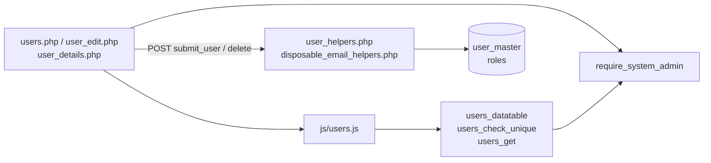
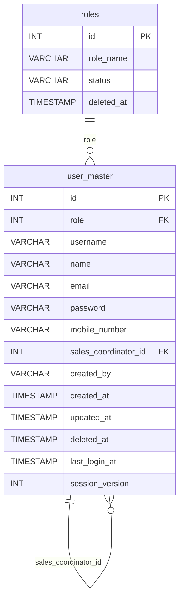
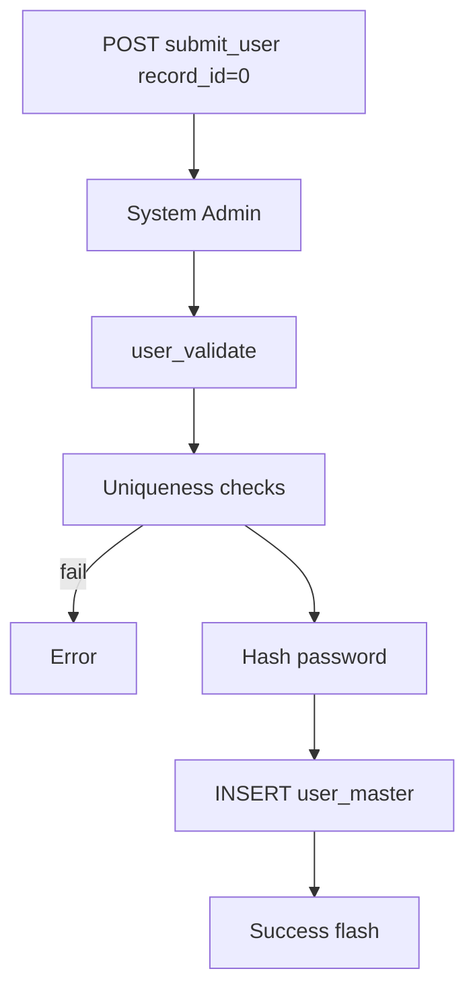
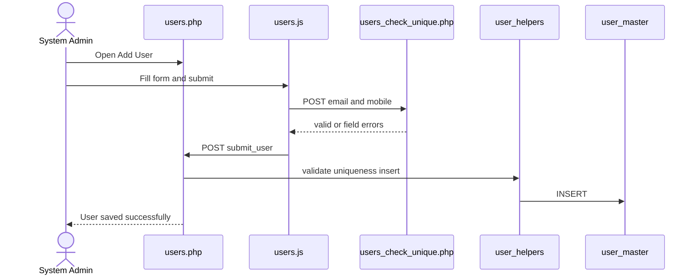
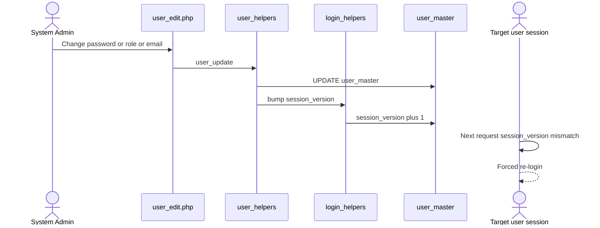
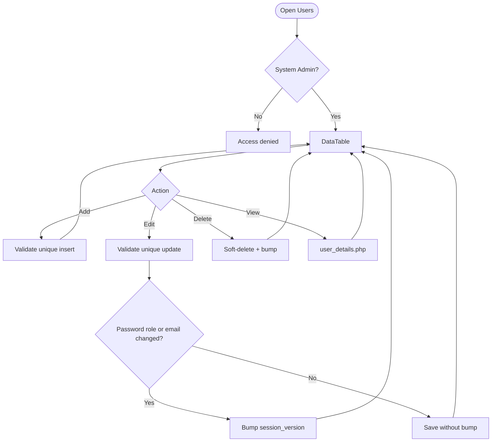
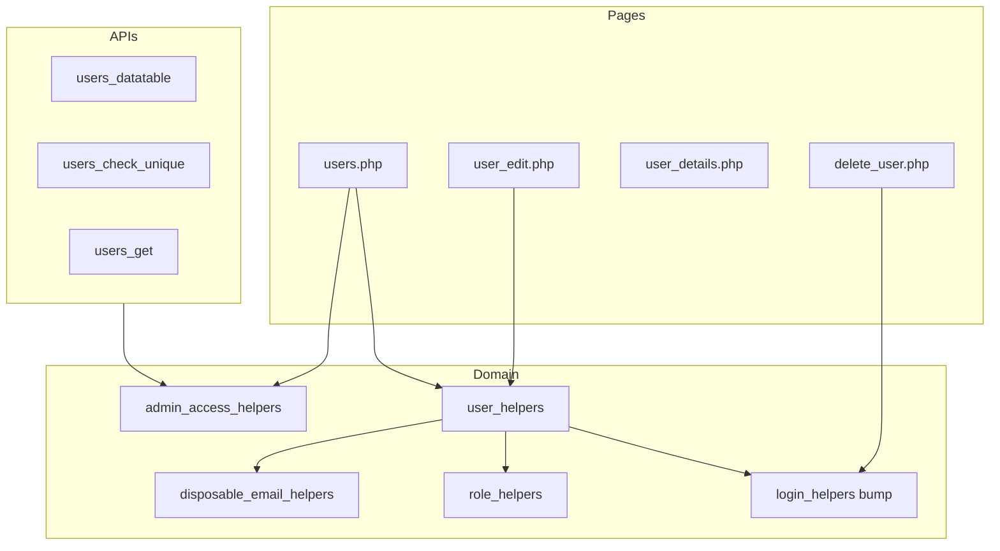

# Low-Level Design (LLD) — Users Module

| Attribute | Value |
|-----------|--------|
| Module | Users (User Master Administration) |
| Menu path | ADMINISTRATION → Users |
| Landing page | `users.php` |
| Application | Complaint / Dealer Portal |
| Stack (target) | Core PHP + MySQL (PDO) |
| Stack (current repo) | Core PHP + **PostgreSQL** via PDO |
| Document version | 1.0 |
| Access | **System Admin only** (role id `6`) — no RBAC module slug |

---

## 1. Module Overview

### 1.1 Purpose

System Administrators manage portal accounts in `user_master`: create/edit users, assign roles, link Sales Coordinators where required, set credentials, enforce uniqueness and email quality rules, soft-delete accounts, and revoke active sessions via `session_version` when password, role, or email changes.

### 1.2 Scope

| In scope | Out of scope |
|----------|--------------|
| List / Add / Edit / Details / Soft-delete | Self-service change password (Auth module) |
| Role + Sales Coordinator linkage | Role master CRUD (Roles module) |
| Unique username / email / mobile | Lockout counters (Auth; columns shared) |
| Disposable email block | Password history on admin-set password |
| `session_version` bump on critical edits | Select2 (native selects used) |

### 1.3 High-level architecture



---

## 2. Functional Requirements

| ID | Requirement | Priority |
|----|-------------|----------|
| FR-01 | System Admin can open Users list (DataTables) | Must |
| FR-02 | Create user with role, identity, password, optional SC | Must |
| FR-03 | Edit user on `user_edit.php` (password optional) | Must |
| FR-04 | Soft-delete user; hide from list | Must |
| FR-05 | Unique username, email, mobile among active users | Must |
| FR-06 | Roles 1/2/3 require valid Sales Coordinator | Must |
| FR-07 | Block disposable/open email domains | Must |
| FR-08 | Password strength on create; on edit if non-blank | Must |
| FR-09 | Bump `session_version` on password/role/email change and soft-delete | Must |
| FR-10 | Client uniqueness check for email/mobile before submit | Should |
| FR-11 | View read-only details | Should |

---

## 3. User Roles & Permissions

### 3.1 RBAC module slug

**None.** Users administration is gated by **System Admin** (`SYSTEM_ADMIN_ROLE = 6`), not a permission slug.

### 3.2 Permission matrix

| Capability | Gate |
|------------|------|
| All Users pages | `require_system_admin($obconn)` |
| Users APIs (datatable, unique) | `admin_api_require_system_admin` |
| Denied | `Access denied. System Admin privileges required.` |

Admin pages (`users.php`, `user_edit.php`, `user_details.php`, `delete_user.php`) are listed in `rbac_admin_pages()` and skip module RBAC; System Admin check is authoritative.

### 3.3 Page / API mapping

| Resource | Gate |
|----------|------|
| `users.php`, `user_edit.php`, `user_details.php`, `delete_user.php` | System Admin |
| `api/users_datatable.php` | System Admin API |
| `api/users_check_unique.php` | System Admin API (POST) |
| `api/users_get.php` | **Gap:** no admin guard in file today |

### 3.4 After-market list scope

N/A for Users UI. Sales Coordinator linkage on users feeds `sales_coordinator_access_helpers.php` for after-market record scoping elsewhere.

---

## 4. Business Rules

| ID | Rule |
|----|------|
| BR-01 | Soft-deleted users excluded from list, get, uniqueness, SC options. |
| BR-02 | Role must be active in `roles`. |
| BR-03 | Roles requiring SC: **1, 2, 3** (Dealer User / Dealer Engineer / ELGi Engineer). |
| BR-04 | SC must be active user whose role name is `Sales Coordinator`. |
| BR-05 | If role does not require SC → store `sales_coordinator_id = NULL`. |
| BR-06 | Username / email unique case-insensitive among non-deleted. |
| BR-07 | Mobile unique among non-deleted (TRIM). |
| BR-08 | Password required on create; blank on edit keeps existing hash. |
| BR-09 | No password-history check on admin create/update. |
| BR-10 | Disposable email domains blocked (exact + subdomain). |
| BR-11 | Update bumps `session_version` if password **or** role **or** email changed. |
| BR-12 | Soft-delete sets `deleted_at` + bumps `session_version`. |
| BR-13 | Username / name / mobile / SC-only updates do **not** bump `session_version`. |
| BR-14 | Create sets `created_by = current_username()`. |
| BR-15 | URL ids are `base64_encode((string) id)`. |

---

## 5. Database Design

### 5.1 ER diagram



### 5.2 Table: `user_master` (Users-relevant)

| Column | MySQL type | Notes |
|--------|------------|-------|
| `id` | `INT UNSIGNED AUTO_INCREMENT` | PK |
| `role` | `INT` | → `roles.id` |
| `username` | `VARCHAR(100)` | Unique among active |
| `name` | `VARCHAR(255)` | |
| `email` | `VARCHAR(255)` | Unique among active |
| `password` | `VARCHAR(255)` | `PASSWORD_DEFAULT` hash |
| `mobile_number` | `VARCHAR(10)` | 10-digit |
| `sales_coordinator_id` | `INT NULL` | Self-FK |
| `created_by` | `VARCHAR(100)` | Creator username |
| `created_at` | `TIMESTAMP` | |
| `updated_at` | `TIMESTAMP NULL` | |
| `deleted_at` | `TIMESTAMP NULL` | Soft-delete |
| `last_login_at` | `TIMESTAMP NULL` | Display only |
| `session_version` | `INT NOT NULL DEFAULT 1` | Revocation |

### 5.3 Related tables

| Table | Role |
|-------|------|
| `roles` | Active role dropdown (LIFO) |
| `user_master` (SC rows) | Sales Coordinator options |
| Auth tables | Lockout / history used by Auth, not Users CRUD |

### 5.4 Reference / lookup sources

| Source | Usage |
|--------|--------|
| `role_active_options_lifo()` | Role `<select>` |
| `user_sales_coordinator_*` | SC `<select>` |
| `disposable_email_blocked_domains()` | Client + server blocklist |
| `window.USER_ROLES_REQUIRING_SALES_COORDINATOR` | Client SC toggle |

---

## 6. API / Backend Design

### 6.1 Page endpoints

| Endpoint | Method | Auth | Description |
|----------|--------|------|-------------|
| `users.php` | GET | System Admin | List + Add panel |
| `users.php` | POST `submit_user` | System Admin | Create (or update if `record_id`) |
| `user_edit.php?id=` | GET/POST | System Admin | Edit |
| `user_details.php?id=` | GET | System Admin | Details |
| `delete_user.php?id=` | GET | System Admin | Soft-delete |

### 6.2 JSON APIs

#### `POST api/users_datatable.php`

DataTables server-side. Search: username/name/email/mobile + role name.

```json
{
  "draw": 1,
  "recordsTotal": 10,
  "recordsFiltered": 2,
  "data": [{ "id": "#1", "role": "...", "username": "...", "actions": "<html>" }]
}
```

#### `POST api/users_check_unique.php`

Body: `record_id`, `email`, `mobile_number`.

```json
{ "valid": true, "errors": {} }
```

or

```json
{ "valid": false, "errors": { "email": ["Email address already exists"] } }
```

Does **not** check username (server checks on form POST).

#### `GET api/users_get.php?id=`

Returns user fields for edit helpers (no password). **Security gap:** missing System Admin guard.

### 6.3 Supporting lookup APIs

N/A (roles/SC loaded server-side into HTML).

### 6.4 Core PHP responsibilities

| File | Role |
|------|------|
| `includes/user_helpers.php` | from_post, validate, insert/update, uniqueness, SC, actions |
| `includes/user_form_fields.php` | Shared form markup |
| `includes/disposable_email_helpers.php` | Domain blocklist |
| `includes/admin_access_helpers.php` | System Admin gate |
| `includes/password_reset_helpers.php` | Strength rules (reuse) |
| `includes/login_helpers.php` | `login_bump_session_version_by_id` |
| `includes/role_helpers.php` | Active roles |

---

## 7. Validation Rules

### 7.1 Server-side (`user_validate` + uniqueness)

| Field / rule | Message |
|--------------|---------|
| Role | `Role is required.` |
| Username | Required; `[A-Za-z0-9_]`; max 100 |
| Name | Required; letters/spaces/`.`/`'`/`-`; max 255 |
| Email | Required; format; not disposable; max 255 |
| Disposable | `Open or disposable email addresses are not allowed...` |
| Mobile | Required; `/^[1-9]\d{9}$/` |
| Password | Strength rules (create / edit if set) |
| SC | Required for roles 1–3; must be valid SC user |
| Unique | Username / email / mobile already exists messages |

### 7.2 Client-side (`js/users.js`)

- validate.js constraints + live input filtering
- Pre-submit `POST api/users_check_unique.php` for email/mobile
- SC show/hide from `USER_ROLES_REQUIRING_SALES_COORDINATOR`
- Disposable check via `BLOCKED_EMAIL_DOMAINS`

---

## 8. UI Screen Specifications

### 8.1 Listing — `users.php`

| Element | Spec |
|---------|------|
| Subtitle | Manage application users, roles, and credentials. |
| CTA | Add User / Cancel |
| Grid | ID, Role, Username, Name, Email, Mobile, Last Login, Created At, Action |
| Empty | `No users found.` / `No matching users found.` |
| Actions | View / Edit / Delete |

### 8.2 Form panel

Fields: Role*, Sales Coordinator (conditional)*, Username*, Name*, Email*, Mobile*, Password* (optional on edit).  
Hints: create strength text; edit “Leave blank to keep the current password.”

### 8.3 Details — `user_details.php`

Account Information + Activity (created/last login); SC when applicable.

### 8.4 Modals

None for CRUD (inline panel + dedicated edit page). Delete uses browser `confirm('Delete this user?')`.

---

## 9. Database Flow

### 9.1 Create



### 9.2 Soft-delete

```sql
UPDATE user_master
SET deleted_at = CURRENT_TIMESTAMP,
    updated_at = CURRENT_TIMESTAMP,
    session_version = COALESCE(session_version, 1) + 1
WHERE id = :id AND deleted_at IS NULL;
```

### 9.3 List query pattern

```sql
SELECT um.*, r.role_name
FROM user_master um
LEFT JOIN roles r ON r.id = um.role
WHERE um.deleted_at IS NULL
  AND /* optional search */
ORDER BY um.id DESC
LIMIT :limit OFFSET :offset;
```

---

## 10. Sequence Diagram

### 10.1 Create user



### 10.2 Edit with session revoke



---

## 11. Activity Diagram



---

## 12. Class / Module Diagram



### 12.1 Key functions

| Function | Role |
|----------|------|
| `user_from_post` / `user_validate` | Parse + validate |
| `user_insert` / `user_update` | Persist |
| `user_username_exists` / `user_email_exists` / `user_mobile_exists` | Uniqueness |
| `user_roles_requiring_sales_coordinator` | Roles 1–3 |
| `user_sales_coordinator_*` | SC options/validate |
| `disposable_email_is_blocked` | Email quality |
| `login_bump_session_version_by_id` | Session revoke |
| `require_system_admin` | Access gate |

---

## 13. Folder Structure

```text
ComplaintManagement/
├── users.php
├── user_edit.php
├── user_details.php
├── delete_user.php
├── api/
│   ├── users_datatable.php
│   ├── users_check_unique.php
│   └── users_get.php
├── includes/
│   ├── user_helpers.php
│   ├── user_form_fields.php
│   ├── disposable_email_helpers.php
│   ├── admin_access_helpers.php
│   ├── admin_api_guard.php
│   ├── login_helpers.php
│   └── role_helpers.php
├── js/
│   └── users.js
├── sql/
│   └── add_user_master_session_version.sql
└── docs/
    └── LLD_Users_Module.md
```

---

## 14. Error Handling

| Layer | Pattern |
|-------|---------|
| Page POST | `$error_message` / `$success_message` or session flash |
| Delete | Session flash → `users.php` |
| APIs | JSON errors + HTTP 403/400/404/405 |
| Client unique fail | `Unable to verify email and mobile number. Please try again.` |

### 14.1 Common messages

| Message | When |
|---------|------|
| `User saved successfully.` | Create |
| `User updated successfully.` | Update |
| `User deleted successfully.` | Soft-delete |
| `Failed to save user.` / `Failed to update user.` / `Failed to delete user.` | Persist fail |
| `User not found or already deleted.` | Missing target |
| `Access denied. System Admin privileges required.` | Non-admin |
| `Your account details were updated. Please log in again.` | Target session after bump |

---

## 15. Security Considerations

| Area | Control |
|------|---------|
| Authorization | System Admin hard-gate |
| Soft-delete | Excluded from active queries |
| Session revoke | `session_version` on password/role/email/delete |
| Passwords | Hashed; never returned by APIs |
| Email quality | Disposable domain blocklist |
| XSS | Escaped DataTable/form output |
| Unique check | POST-only (no email/mobile in query string) |
| Gaps | `users_get.php` lacks admin guard; admin-set passwords skip history check; base64 ids not signed |

---

## 16. Audit Logs

### 16.1 Built-in field-level audit

| Field | Behavior |
|-------|----------|
| `created_by` / `created_at` | On create |
| `updated_at` | On update / soft-delete |
| `deleted_at` | Soft-delete |
| `session_version` | Critical change / delete |
| Dedicated audit table | **Not implemented** |

---

## 17. Test Cases

### 17.1 Functional

| ID | Scenario | Expected |
|----|----------|----------|
| TC-01 | Non-admin opens Users | Denied |
| TC-02 | Create role 1/2/3 without SC | Validation error |
| TC-03 | Create with duplicate email/mobile/username | Rejected |
| TC-04 | Disposable email | Rejected |
| TC-05 | Weak password | Rejected |
| TC-06 | Edit blank password | Keeps hash |
| TC-07 | Change email/role/password | `session_version` bump; target re-login |
| TC-08 | Change name only | No bump |
| TC-09 | Soft-delete | Hidden from list; session bumped |
| TC-10 | DataTable search by role name | Filtered |
| TC-11 | Edit user whose SC inactive | Selected SC still shown (prepended) |

---

## 18. Assumptions & Dependencies

### 18.1 Assumptions

1. Role id `6` is System Admin.
2. Active role named `Sales Coordinator` exists for SC options.
3. Legacy role ids 1–3 still define SC requirement.
4. Auth module enforces `session_version` on subsequent requests.
5. Document target stack Core PHP + MySQL; repo runs PostgreSQL.

### 18.2 Dependencies

| Dependency | Purpose |
|------------|---------|
| `roles` master | Role dropdown |
| Auth / login helpers | Session version bump |
| Disposable email helper | Domain block |
| Password strength helper | Shared rules |
| jQuery + DataTables + validate.js | UI |

---

## Appendix A — Success flashes

| Event | Message |
|-------|---------|
| Create | User saved successfully. |
| Update | User updated successfully. |
| Delete | User deleted successfully. |

---

## Appendix B — Select2 control map

**N/A.** Role (`#userRoleSelect`) and Sales Coordinator (`#salesCoordinatorSelect`) are native HTML selects.

---

## Appendix C — session_version bump matrix

| Action | Bumps? |
|--------|--------|
| Soft-delete | Yes |
| Password change | Yes |
| Role change | Yes |
| Email change | Yes |
| Username / name / mobile / SC only | No |
| Create | No |

---

## Appendix D — Role constants (reference)

| Constant | Id | Notes |
|----------|----|-------|
| Dealer User | 1 | Requires SC |
| Dealer Engineer | 2 | Requires SC |
| ELGi Engineer | 3 | Requires SC |
| Sales Coordinator | 4 | |
| Management | 5 | |
| System Admin | 6 | Users module access |
| CCS Admin | 7 | |

---

*End of LLD — Users Module*
