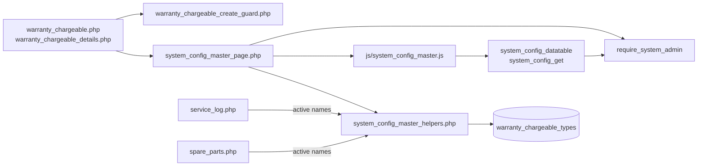
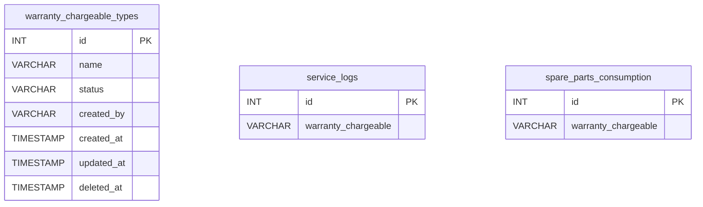
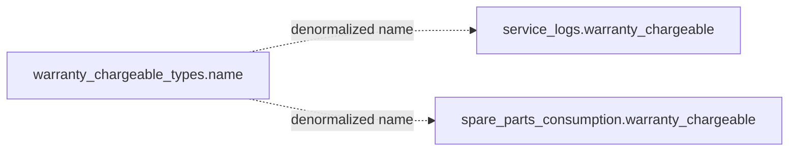
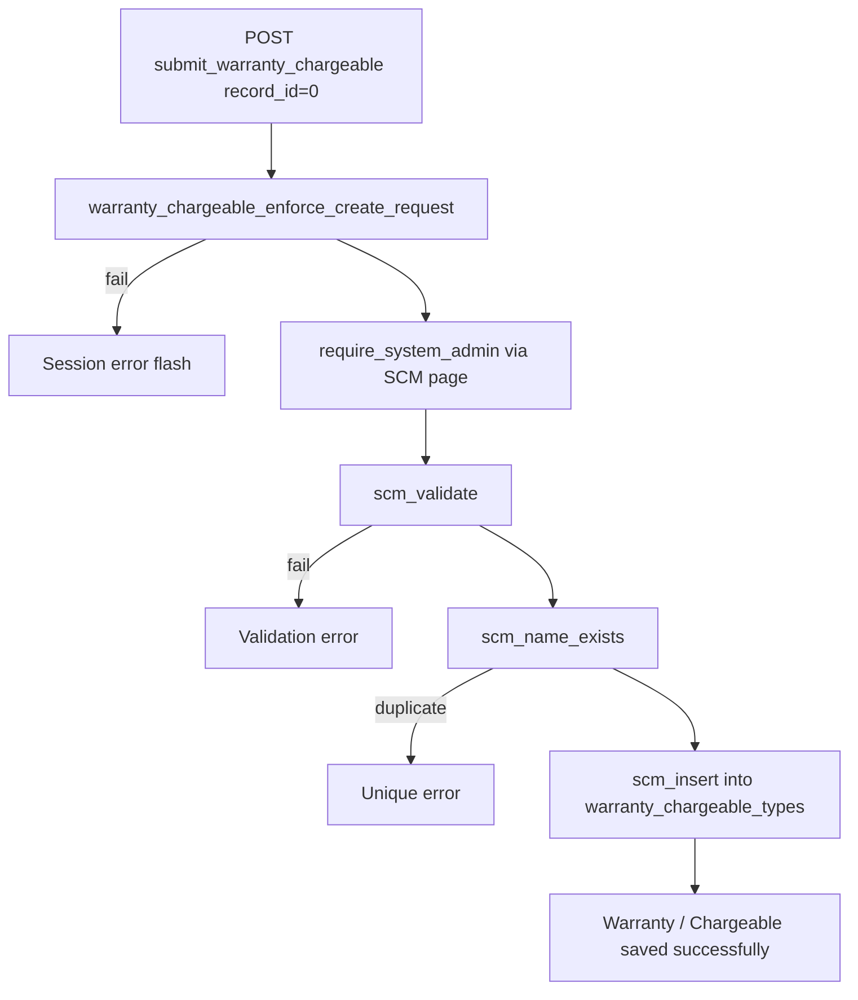
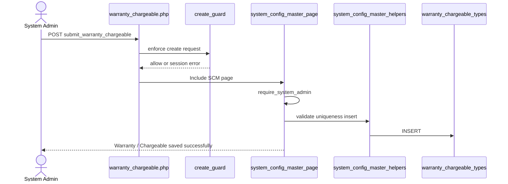
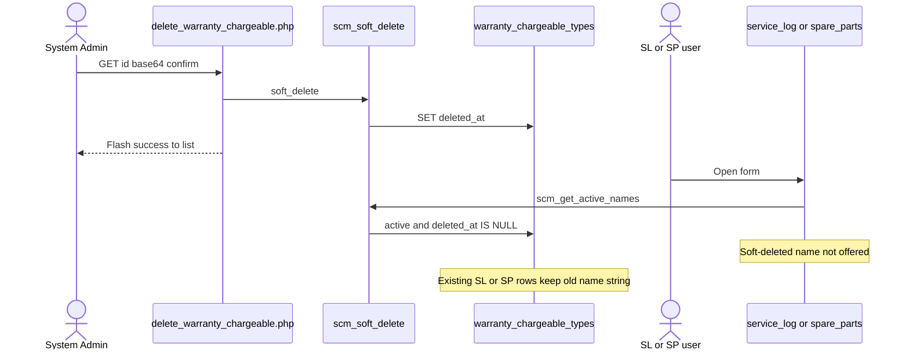
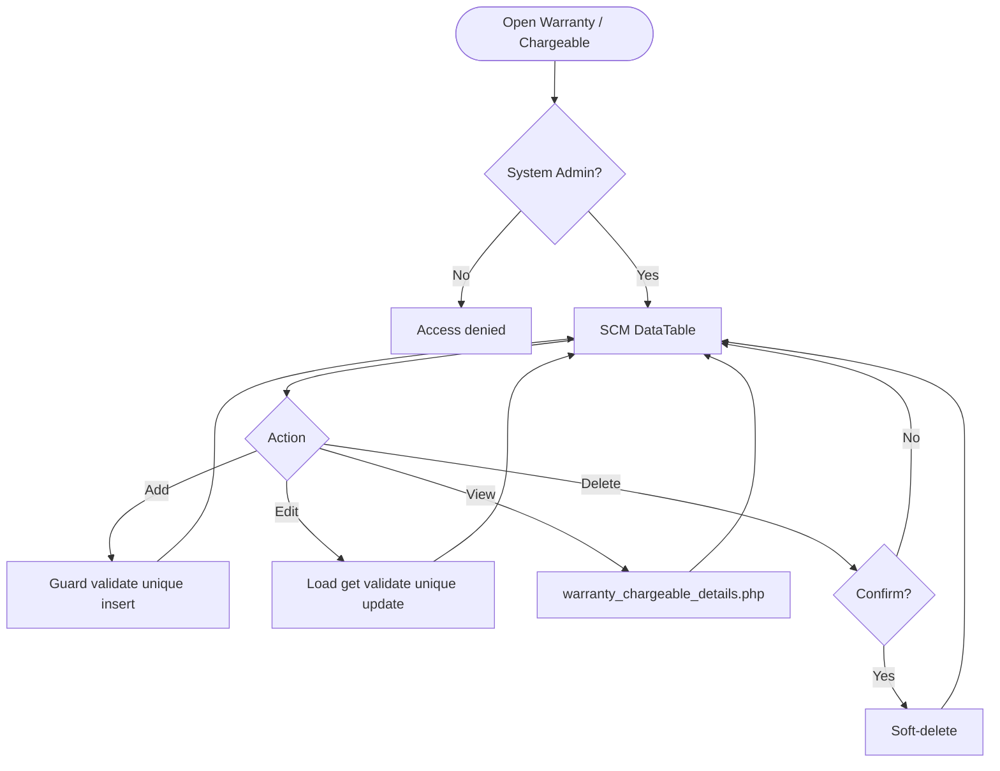
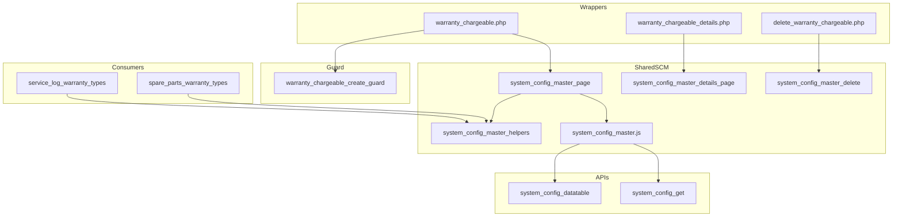

# Low-Level Design (LLD) — Warranty / Chargeable Module

| Attribute | Value |
|-----------|--------|
| Module | Warranty / Chargeable (System Config Master) |
| Menu path | ADMINISTRATION → Warranty / Chargeable |
| Landing page | `warranty_chargeable.php` |
| Application | Complaint / Dealer Portal |
| Stack (target) | Core PHP + MySQL (PDO) |
| Stack (current repo) | Core PHP + **PostgreSQL** via PDO |
| Document version | 1.0 |
| Access | **System Admin only** (role id `6`) — no RBAC module slug |
| Architecture | Shared **SCM** stack (`$scmType = 'warranty_chargeable'`) |

---

## **1. Module Overview**

### 1.1 Purpose

System Administrators maintain warranty / chargeable type options in `warranty_chargeable_types` for Service Log and Spare Parts Capture. The module is a thin SCM wrapper: list/create/edit/details/soft-delete share `system_config_master_*` pages, helpers, APIs, and JS. Consumers store the selected **name string** (not an FK id).

### 1.2 Scope

| In scope | Out of scope |
|----------|--------------|
| List / Add / Edit / Details / Soft-delete | Installed Base master field (no IB column) |
| Active / Inactive status | Complaint master field (no complaint column) |
| Case-insensitive name uniqueness | Hard delete |
| Create abuse / rate-limit guard | Cascading rename/delete to SL / SP rows |
| Active names for Service Log & Spare Parts Select2 | Other SCM types (Industry Segment, Part Replaced, etc.) |

### 1.3 High-level architecture



---

## **2. Functional Requirements**

| ID | Requirement | Priority |
|----|-------------|----------|
| FR-01 | System Admin can open Warranty / Chargeable list (DataTables) | Must |
| FR-02 | Create type with name and status | Must |
| FR-03 | Edit via inline slide-down form | Must |
| FR-04 | Soft-delete; hide from list | Must |
| FR-05 | Unique name among non-deleted (case/trim-insensitive) | Must |
| FR-06 | Filter / search list; status active/inactive | Should |
| FR-07 | View read-only details + audit fields | Should |
| FR-08 | Throttle / rate-limit create requests | Should |
| FR-09 | Client validate.js for name + status | Should |
| FR-10 | Expose active names to Service Log and Spare Parts | Must |

---

## **3. User Roles & Permissions**

### 3.1 RBAC module slug

**None.** Warranty / Chargeable administration is gated by **System Admin** (`SYSTEM_ADMIN_ROLE = 6`), not a permission slug.

### 3.2 Permission matrix

| Capability | Gate |
|------------|------|
| All Warranty / Chargeable admin pages | `require_system_admin($obconn)` (via SCM page) |
| SCM APIs with `type=warranty_chargeable` | `admin_api_require_system_admin` |
| Denied | `Access denied. System Admin privileges required.` |

Pages (`warranty_chargeable.php`, `warranty_chargeable_details.php`, `delete_warranty_chargeable.php`) are in `rbac_admin_pages()` and skip module RBAC; System Admin check is authoritative.

### 3.3 Page / API mapping

| Resource | Gate |
|----------|------|
| `warranty_chargeable.php` | System Admin |
| `warranty_chargeable_details.php` | System Admin |
| `delete_warranty_chargeable.php` | System Admin |
| `api/system_config_datatable.php?type=warranty_chargeable` | System Admin API |
| `api/system_config_get.php?type=warranty_chargeable` | System Admin API |

### 3.4 Consumer access

Service Log / Spare Parts users need their module permissions (separate). They only see **active, non-deleted** names via `scm_get_active_names('warranty_chargeable')` (wrappers: `service_log_warranty_types()`, `spare_parts_warranty_types()`).

---

## **4. Business Rules**

| ID | Rule |
|----|------|
| BR-01 | Soft-deleted rows excluded from list, get, uniqueness, and consumer options. |
| BR-02 | Name unique among non-deleted: `LOWER(TRIM(name))`; edit excludes self. |
| BR-03 | Soft-deleted names may be reused on create (partial unique index). |
| BR-04 | Status must be `active` or `inactive`. |
| BR-05 | Inactive names stay in admin list but are **not** offered in SL / SP dropdowns. |
| BR-06 | Soft-delete / rename does **not** update existing `service_logs` / `spare_parts_consumption` values. |
| BR-07 | No “in use” check before soft-delete. |
| BR-08 | Create-only abuse guard: max 1/request; min 3s interval; max 20 creates / 15 min. |
| BR-09 | Edit requires existing non-deleted row. |
| BR-10 | `created_by` = `current_username()` on insert; `created_at` / `updated_at` timestamps. |
| BR-11 | Details/delete URL ids are `base64_encode((string) id)`. |
| BR-12 | Create/update stay on page (no PRG). Delete redirects to list with session flash. |
| BR-13 | Consumers store the **name string**, not `warranty_chargeable_types.id`. |
| BR-14 | SCM type key is `warranty_chargeable`; table `warranty_chargeable_types`; submit key `submit_warranty_chargeable`. |
| BR-15 | Master name max **100**; consumer columns are `VARCHAR(50)` — keep option names ≤ 50 for safe storage. |

---

## **5. Database Design**

### 5.1 ER diagram



Logical link (name string, not FK):



### 5.2 Table: `warranty_chargeable_types`

| Column | MySQL type | Notes |
|--------|------------|-------|
| `id` | `INT UNSIGNED AUTO_INCREMENT` | PK |
| `name` | `VARCHAR(100)` | Required; unique among non-deleted |
| `status` | `VARCHAR(20)` | `active` / `inactive`; default `active` |
| `created_by` | `VARCHAR(100)` | Creator username |
| `created_at` | `TIMESTAMP` | Insert |
| `updated_at` | `TIMESTAMP NULL` | Update / soft-delete |
| `deleted_at` | `TIMESTAMP NULL` | Soft-delete |

**Indexes (current repo):** PK on `id`; partial unique on `lower(trim(name)) WHERE deleted_at IS NULL`; index on `deleted_at`.

### 5.3 Related tables

| Table | Column | Role |
|-------|--------|------|
| `service_logs` | `warranty_chargeable` `VARCHAR(50)` | Service Log consumer |
| `spare_parts_consumption` | `warranty_chargeable` `VARCHAR(50)` | Spare Parts consumer |

### 5.4 Reference / lookup sources

| Source | Usage |
|--------|--------|
| `scm_registry()['warranty_chargeable']` | Labels, pages, table, submit key |
| `rbac_status_options()` | Status `<select>` |
| `scm_get_active_names('warranty_chargeable')` | SL / SP dropdowns |
| `service_log_warranty_types()` / `spare_parts_warranty_types()` | Consumer wrappers |

---

## **6. API / Backend Design**

### 6.1 Page endpoints

| Endpoint | Method | Auth | Description |
|----------|--------|------|-------------|
| `warranty_chargeable.php` | GET | System Admin | List + Add/Edit panel |
| `warranty_chargeable.php` | POST `submit_warranty_chargeable` | System Admin | Create or update |
| `warranty_chargeable_details.php?id=` | GET | System Admin | Read-only details |
| `delete_warranty_chargeable.php?id=` | GET | System Admin | Soft-delete |

Wrappers set `$scmType = 'warranty_chargeable'` and include shared SCM templates.

### 6.2 JSON APIs

#### `POST api/system_config_datatable.php`

Body/query includes `type=warranty_chargeable`. Server-side DataTables over `warranty_chargeable_types` where `deleted_at IS NULL`.

```json
{
  "draw": 1,
  "recordsTotal": 10,
  "recordsFiltered": 2,
  "data": [{ "id": "#1", "name": "...", "status": "...", "actions": "<html>" }]
}
```

#### `GET api/system_config_get.php?type=warranty_chargeable&id=`

Returns row for edit form population. System Admin API gated.

### 6.3 Supporting lookup APIs

N/A for admin UI. Service Log / Spare Parts (and IB nested modals) load active names server-side into Select2 options. Prefill APIs may copy `sl.warranty_chargeable` into Spare Parts forms.

### 6.4 Core PHP responsibilities

| File | Role |
|------|------|
| `warranty_chargeable.php` | Create-guard hook + `$scmType` wrapper |
| `includes/system_config_master_page.php` | Shared list/form POST handler |
| `includes/system_config_master_details_page.php` | Shared details |
| `includes/system_config_master_delete.php` | Shared soft-delete |
| `includes/system_config_master_helpers.php` | Registry, validate, CRUD, options |
| `includes/module_create_guards/warranty_chargeable_create_guard.php` | Create throttle / rate limit |
| `includes/admin_access_helpers.php` | System Admin gate |

---

## **7. Validation Rules**

### 7.1 Server-side (`scm_validate` + uniqueness + create guard)

| Field / rule | Message |
|--------------|---------|
| Name empty | `Warranty / Chargeable name is required.` |
| Name > 100 | `Warranty / Chargeable name cannot exceed 100 characters.` |
| Status missing/invalid | `Status is required.` |
| Duplicate name | `Warranty / Chargeable name already exists. Please choose a different name.` |
| Missing edit target | `Warranty / Chargeable not found or already deleted.` |
| Create throttle | `Please wait a few seconds before creating another record.` |
| Rate limit | `Create rate limit exceeded. You may create up to 20 records every 15 minutes...` |
| Bulk payload | `Too many records in a single request. A maximum of 1 record(s)...` |

**Consumers (Service Log / Spare Parts):** `Warranty / Chargeable is required.` / `Invalid Warranty / Chargeable selection.`

### 7.2 Client-side (`js/system_config_master.js`)

- validate.js: Name required + max 100; Status required (generic wording, not label-prefixed)
- Edit load failure: `Failed to load record details.`
- Success alert fades after 3s
- Status is native `<select>` (no Select2 on master)

---

## **8. UI Screen Specifications**

### 8.1 Listing — `warranty_chargeable.php`

| Element | Spec |
|---------|------|
| Subtitle | Manage warranty and chargeable type options. |
| Placeholder | e.g. Warranty |
| CTA | Add Warranty / Chargeable / Cancel (`#scmFormCard`) |
| Grid | `#scmTable` — ID, Name, Status, Created At, Action |
| List title | Warranty / Chargeable Types List |
| Actions | View / Edit / Delete (`confirm('Delete this record?')`) |
| Icon | `bi-shield-check` |

### 8.2 Form panel

Fields: Name*, Status* (`active` / `inactive`).  
Hidden: `record_id`, `submit_warranty_chargeable`, SCM type wiring via `scm_page_js_config`.

### 8.3 Details — `warranty_chargeable_details.php`

Name, status badge, created by, created/updated timestamps (shared record-details layout).

### 8.4 Modals / Select2

- No CRUD modals on master.
- **Admin:** native status select — **no Select2**.
- **Consumers:** Select2 on `#serviceLogWarrantySelect`, `#sparePartsWarrantySelect`, `#slSparePartsWarrantySelect`, `#ibServiceLogWarrantySelect` (as applicable).

---

## **9. Database Flow**

### 9.1 Create



### 9.2 Soft-delete

```sql
UPDATE warranty_chargeable_types
SET deleted_at = CURRENT_TIMESTAMP,
    updated_at = CURRENT_TIMESTAMP
WHERE id = :id
  AND deleted_at IS NULL;
```

### 9.3 Active options for consumers

```sql
SELECT name
FROM warranty_chargeable_types
WHERE deleted_at IS NULL
  AND status = 'active'
ORDER BY created_at ASC, id ASC;
```

---

## **10. Sequence Diagram**

### 10.1 Create warranty / chargeable type



### 10.2 Soft-delete and consumer impact



---

## **11. Activity Diagram**



---

## **12. Class / Module Diagram**



### 12.1 Key functions

| Function | Role |
|----------|------|
| `scm_registry` / `scm_config` | Type → table/pages/labels |
| `scm_safe_table` | Whitelist table name |
| `scm_from_post` / `scm_validate` | Parse + validate |
| `scm_name_exists` | Uniqueness |
| `scm_insert` / `scm_update` / `scm_soft_delete` | Persist |
| `scm_get_by_id` / `scm_get_active_names` / `scm_option_exists` | Reads |
| `scm_entry_actions` / `scm_page_js_config` | UI/API wiring |
| `warranty_chargeable_enforce_create_request` | Create abuse guard |
| `service_log_warranty_types` / `spare_parts_warranty_types` | Consumer option wrappers |
| `require_system_admin` | Access gate |

---

## **13. Folder Structure**

```text
ComplaintManagement/
├── warranty_chargeable.php
├── warranty_chargeable_details.php
├── delete_warranty_chargeable.php
├── api/
│   ├── system_config_datatable.php
│   └── system_config_get.php
├── includes/
│   ├── system_config_master_helpers.php
│   ├── system_config_master_page.php
│   ├── system_config_master_details_page.php
│   ├── system_config_master_delete.php
│   ├── admin_access_helpers.php
│   ├── admin_api_guard.php
│   └── module_create_guards/
│       └── warranty_chargeable_create_guard.php
├── js/
│   └── system_config_master.js
├── storage/
│   └── request_abuse/warranty_chargeable/
└── docs/
    └── LLD_Warranty_Chargeable_Module.md
```

---

## **14. Error Handling**

| Layer | Pattern |
|-------|---------|
| Create guard fail | `$_SESSION['error_message']`; POST submit unset |
| Page POST | Inline / session success or error via SCM page |
| Delete | Session flash → `warranty_chargeable.php` |
| Details invalid | `die('Invalid record.')` / `die('Warranty / Chargeable not found.')` |
| APIs | JSON + HTTP 403/404 |
| Create guard log | `storage/request_abuse/warranty_chargeable/` |

### 14.1 Common messages

| Message | When |
|---------|------|
| `Warranty / Chargeable saved successfully.` | Create |
| `Warranty / Chargeable updated successfully.` | Update |
| `Warranty / Chargeable deleted successfully.` | Soft-delete |
| `Failed to save warranty / chargeable.` / `Failed to update...` / `Failed to delete...` | Persist fail |
| `Warranty / Chargeable not found or already deleted.` | Missing target |
| `Warranty / Chargeable name already exists...` | Unique violation |
| `Invalid record.` | Bad delete id |
| `Access denied. System Admin privileges required.` | Non-admin |

---

## **15. Security Considerations**

| Area | Control |
|------|---------|
| Authorization | System Admin hard-gate on SCM pages + APIs |
| Soft-delete | Excluded from active queries and SL / SP options |
| Create abuse | Throttle, rate limit, payload size, monitor log |
| Table safety | `scm_safe_table` whitelist for datatable SQL |
| DB uniqueness | Partial unique index on `lower(trim(name))` among non-deleted |
| CSRF | **Not implemented** on POST or GET delete |
| Delete method | **GET** soft-delete — CSRF-friendly; confirm only |
| PRG | **Not used** on create/update |
| Guard order gap | Create guard in wrapper can run **before** `require_system_admin` → non-admins may write throttle/abuse files |
| Option exists gap | `scm_option_exists` ignores `status` → inactive name can pass consumer server check if forced in POST |
| Length mismatch | Master `VARCHAR(100)` vs consumer `VARCHAR(50)` |
| Draft gap | Complaint SL draft may require warranty string without `scm_option_exists` (full SL save does check) |
| Denormalized names | Rename/delete orphans historical SL / SP values |

---

## **16. Audit Logs**

### 16.1 Built-in field-level audit

| Field | Behavior |
|-------|----------|
| `created_by` / `created_at` | On create |
| `updated_at` | On update / soft-delete |
| `deleted_at` | Soft-delete |
| Dedicated audit table | **Not implemented** |
| Create abuse log | `storage/request_abuse/warranty_chargeable/abuse_monitor.log` |

---

## **17. Test Cases**

### 17.1 Functional

| ID | Scenario | Expected |
|----|----------|----------|
| TC-01 | Non-admin opens Warranty / Chargeable | Denied |
| TC-02 | Create with empty name | Validation error |
| TC-03 | Create duplicate name (different case) | Rejected (app + DB unique) |
| TC-04 | Soft-delete then recreate same name | Allowed |
| TC-05 | Set status inactive | In admin list; not in SL / SP Select2 |
| TC-06 | Soft-delete name used on SL / SP rows | Rows keep old string; dropdown omits it |
| TC-07 | Edit via pencil | Form filled from `system_config_get` |
| TC-08 | Delete confirmed | Soft-deleted; flash success |
| TC-09 | Create twice within 3 seconds | Throttle error |
| TC-10 | Create >20 in 15 minutes | Rate-limit error |
| TC-11 | Service Log submit without warranty | `Warranty / Chargeable is required.` |
| TC-12 | Spare Parts submit unknown name | `Invalid Warranty / Chargeable selection.` |
| TC-13 | Details with bad base64 id | Invalid record |
| TC-14 | Datatable `type=warranty_chargeable` as admin | Rows from `warranty_chargeable_types` |
| TC-15 | Name longer than 50 chars | May save on master but truncate/fail risk on SL / SP |

---

## **18. Assumptions & Dependencies**

### 18.1 Assumptions

1. Role id `6` is System Admin.
2. Soft-delete is the only remove mechanism.
3. Service Log and Spare Parts are the primary runtime consumers.
4. Name string denormalization on SL / SP is intentional for historical display.
5. Shared SCM stack remains the implementation vehicle.
6. Document target stack Core PHP + MySQL; repo runs PostgreSQL.
7. Create-guard storage under `storage/request_abuse/warranty_chargeable/` is writable.
8. Operational practice keeps option names ≤ 50 characters to match consumer columns.

### 18.2 Dependencies

| Dependency | Purpose |
|------------|---------|
| SCM shared pages/helpers/JS/APIs | CRUD UI and persistence |
| `admin_access_helpers` / `admin_api_guard` | System Admin gate |
| `rbac_helpers` | Status options / validation / badges |
| Create-guard storage | Throttle state + abuse log |
| jQuery + DataTables + validate.js | List / form UX |
| Service Log / Spare Parts modules | Consumers of active names |

---

## Appendix A — Success flashes

| Event | Message |
|-------|---------|
| Create | Warranty / Chargeable saved successfully. |
| Update | Warranty / Chargeable updated successfully. |
| Delete | Warranty / Chargeable deleted successfully. |

---

## Appendix B — Select2 control map

| Screen | Control | Select2? |
|--------|---------|----------|
| Admin status select | Native `<select>` | No |
| Service Log `#serviceLogWarrantySelect` | Select2 | Yes (consumer) |
| Spare Parts `#sparePartsWarrantySelect` / `#slSparePartsWarrantySelect` | Select2 | Yes (consumer) |
| IB / Complaint nested SL modal `#ibServiceLogWarrantySelect` | Select2 | Yes (consumer) |

---

## Appendix C — SCM registry entry

| Key | Value |
|-----|-------|
| Type | `warranty_chargeable` |
| Table | `warranty_chargeable_types` |
| Label | Warranty / Chargeable |
| Plural | Warranty / Chargeable Types |
| Page | `warranty_chargeable.php` |
| Submit key | `submit_warranty_chargeable` |
| Icon | `bi-shield-check` |

---

## Appendix D — Create guard limits

| Limit | Value |
|-------|-------|
| Max records per request | 1 |
| Min interval between creates | 3 seconds |
| Max creates per window | 20 |
| Window | 15 minutes |

---

## Appendix E — Status vs consumer visibility

| Value | Admin list | SL / SP options |
|-------|------------|-----------------|
| `active` | Yes | Yes |
| `inactive` | Yes | No |
| Soft-deleted | No | No |

---

## Appendix F — Consumer column map

| Module | Column | Max length |
|--------|--------|------------|
| Service Log | `service_logs.warranty_chargeable` | 50 |
| Spare Parts | `spare_parts_consumption.warranty_chargeable` | 50 |
| Master | `warranty_chargeable_types.name` | 100 |

---

*End of LLD — Warranty / Chargeable Module*
